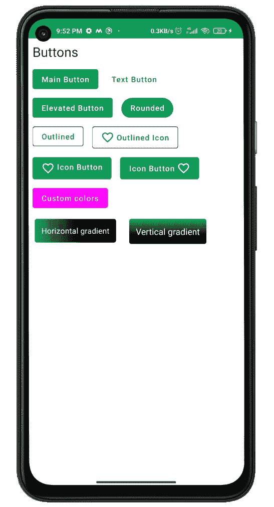

# 安卓系统中使用 Jetpack Compose 的材质设计按钮

> 原文:[https://www . geesforgeks . org/material-design-buttons-use-jet pack-compose-in-Android/](https://www.geeksforgeeks.org/material-design-buttons-using-jetpack-compose-in-android/)

[**Jetpack Compose**](https://www.geeksforgeeks.org/basics-of-jetpack-compose-in-android/) 是构建原生安卓 UI 的现代工具包。Jetpack Compose 用更少的代码、强大的工具和直观的 Kotlin APIs 简化并加速了 Android 上的 UI 开发。构建 Compose 是为了支持材料设计原则。它的许多用户界面元素实现了开箱即用的材料设计。在本文中，我们将解释如何使用 Jetpack Compose 创建材质设计按钮。下面是展示我们将要构建的内容的示例图片。


### **分步实施**

**第一步:创建新项目**

要使用 Jetpack Compose 在 Android Studio 中创建新项目，请参考[如何使用 Jetpack Compose 在 Android Studio Canary 版本中创建新项目](https://www.geeksforgeeks.org/how-to-create-a-new-project-in-android-studio-canary-version-with-jetpack-compose/)。

**第二步:使用 MainActivity.kt**

转到 **MainActivity.kt** 文件，参考以下代码。下面是 MainActivity.kt 文件的代码。代码中添加了注释，以更详细地理解代码。

## 我的锅

```
import android.os.Bundle
import androidx.activity.ComponentActivity
import androidx.activity.compose.setContent
import androidx.compose.foundation.BorderStroke
import androidx.compose.foundation.background
import androidx.compose.foundation.clickable
import androidx.compose.foundation.layout.Column
import androidx.compose.foundation.layout.Row
import androidx.compose.foundation.layout.padding
import androidx.compose.foundation.shape.RoundedCornerShape
import androidx.compose.material.*
import androidx.compose.material.MaterialTheme.typography
import androidx.compose.material.icons.Icons
import androidx.compose.material.icons.filled.FavoriteBorder
import androidx.compose.runtime.Composable
import androidx.compose.ui.Modifier
import androidx.compose.ui.draw.clip
import androidx.compose.ui.graphics.Brush
import androidx.compose.ui.graphics.Color
import androidx.compose.ui.tooling.preview.Preview
import androidx.compose.ui.unit.dp
import com.example.jetpackcomposepractice.ui.theme.JetpackComposePracticeTheme

class MainActivity : ComponentActivity() {
    override fun onCreate(savedInstanceState: Bundle?) {
        super.onCreate(savedInstanceState)
        setContent {
            JetpackComposePracticeTheme {
                // A surface container using the 'background' color from the theme
                Surface(color = Color.White) {
                    Column {
                        // call the function which contains all the buttons
                        allButtons()
                    }
                }
            }
        }
    }
}
// In order to use compose properties annotate with @Compose
@Composable
fun allButtons() {
    Text(text = "Buttons", style = typography.h5, modifier = Modifier.padding(8.dp))
    // Here we are using Row to add 
    // two buttons in single Column
    // You can change it as per your need
    Row {
        // Create a Main Button or Normal Button
        Button(onClick = {}, modifier = Modifier.padding(8.dp)) {
            Text(text = "Main Button")
        }
        // Create a Text Button
        TextButton(onClick = { /*TODO*/ }, modifier = Modifier.padding(8.dp)) {
            Text(text = "Text Button")
        }
    }
    Row {
        // Elevated Button
        Button(
            onClick = { /*TODO*/ },
            modifier = Modifier.padding(8.dp),
            elevation = ButtonDefaults.elevation()
        ) {
            Text(text = "Elevated Button")
        }

        // Rounded Button
        Button(
            onClick = { /*TODO*/ },
            modifier = Modifier.padding(8.dp),
            shape = RoundedCornerShape(20.dp)
        ) {
            Text(text = "Rounded")
        }

    }
    Row {
        // Outlined Button
        // add border field and set BorderStroke and its color
        OutlinedButton(
            onClick = { /*TODO*/ },
            border = BorderStroke(1.dp, Color.Red),
            modifier = Modifier.padding(8.dp)
        ) {
            Text(text = "Outlined")
        }

        // Outlined Button with icon
        // add border field and set BorderStroke and its color
        // add Icon field
        OutlinedButton(
            onClick = { /*TODO*/ },
            border = BorderStroke(1.dp, Color.Red),
            modifier = Modifier.padding(8.dp)
        ) {
            Icon(
                imageVector = Icons.Default.FavoriteBorder,
                contentDescription = null,
                modifier = Modifier.padding(end = 4.dp)
            )
            Text(text = "Outlined Icon")
        }

    }

    Row {
        // Icon Button
        // Icon on the left of text
        Button(onClick = {}, modifier = Modifier.padding(8.dp)) {
            Row {
                Icon(
                    imageVector = Icons.Default.FavoriteBorder,
                    contentDescription = null,
                    modifier = Modifier.padding(end = 4.dp)
                )
                Text(text = "Icon Button")
            }
        }

        // Icon Button
        // Icon on the Right of text
        Button(onClick = {}, modifier = Modifier.padding(8.dp)) {
            Text(text = "Icon Button")
            Icon(
                imageVector = Icons.Default.FavoriteBorder,
                contentDescription = null,
                modifier = Modifier.padding(start = 4.dp)
            )
        }
    }

    //custom background buttons
    // create a variable mainButtonColor and define background Color and content Color
    val mainButtonColor = ButtonDefaults.buttonColors(
        backgroundColor = Color.Magenta,
        contentColor = MaterialTheme.colors.surface
    )

    Row {
        Button(colors = mainButtonColor, onClick = {}, modifier = Modifier.padding(8.dp)) {
            Text(text = "Custom colors")
        }
    }

    Row {
        // Create variable horizontalGradient and inside color property define start and end color
        val horizontalGradient = Brush.horizontalGradient(
            colors = listOf(MaterialTheme.colors.primary, MaterialTheme.colors.primaryVariant),
            0f,
            250f
        )
        // Horizontal gradient Button
        // Create a text and set its background to horizontalGradient that we created above
        Text(
            text = "Horizontal gradient",
            style = typography.body2.copy(color = Color.White),
            modifier = Modifier
                .padding(12.dp)
                .clickable(onClick = {})
                .clip(RoundedCornerShape(4.dp))
                .background(brush = horizontalGradient)
                .padding(12.dp)
        )

        // Create variable verticalGradient and inside color property define top and bottom color
        val verticalGradient = Brush.verticalGradient(
            colors = listOf(MaterialTheme.colors.primary, MaterialTheme.colors.primaryVariant),
            startY = 0f,
            endY = 100f
        )
        // Vertical gradient Button
        // Create a text and set its background to verticalGradient that we created above
        Text(
            text = "Vertical gradient",
            style = typography.body1.copy(color = Color.White),
            modifier = Modifier
                .padding(12.dp)
                .clickable(onClick = {})
                .clip(RoundedCornerShape(4.dp))
                .background(brush = verticalGradient)
                .padding(12.dp)
        )
    }

}
// To see the preview annotate with @Preview to the function
@Preview
@Composable
fun DefaultPreview() {
    JetpackComposePracticeTheme {
        Column {
            allButtons()
        }
    }
}
```

**输出:**

