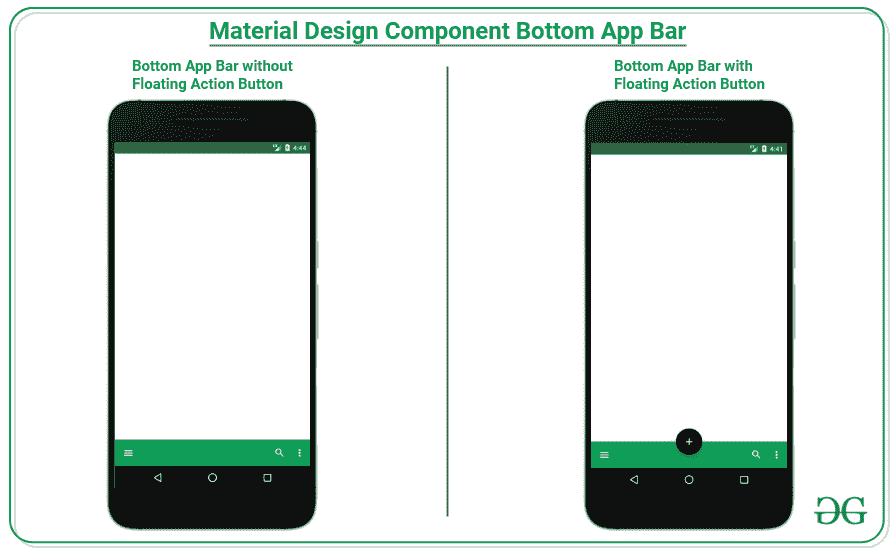
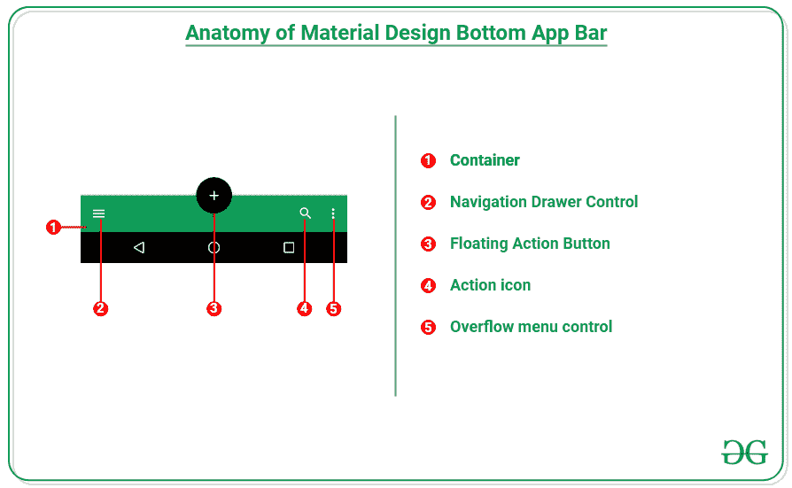
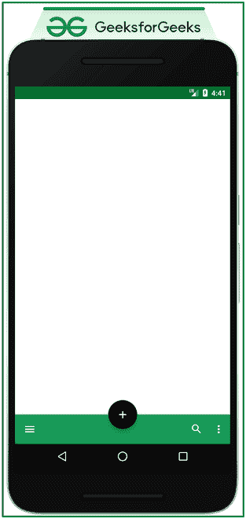
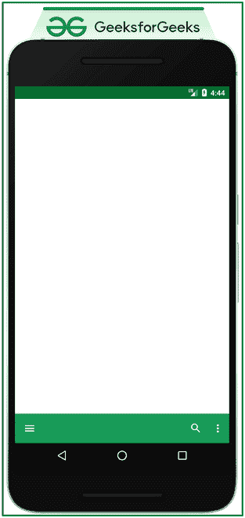

# 安卓中材质设计组件底部 App 栏

> 原文:[https://www . geesforgeks . org/material-design-component-bottom-app-bar-in-Android/](https://www.geeksforgeeks.org/material-design-component-bottom-app-bar-in-android/)

[Material Design Components(MDC Android)](https://www.geeksforgeeks.org/introduction-to-material-design-in-android/)为设计人员和开发人员提供了一种在其 Android 应用程序中实现 Material Design 的方法。这些组件由谷歌的工程师和 UX 设计师组成的核心团队开发，支持可靠的开发工作流程来构建美观实用的安卓应用程序。安卓系统中的材料设计是吸引和吸引客户使用该应用的关键特征之一。这是一种特殊类型的设计，由谷歌指导。因此，在本文中，已经演示了如何在安卓系统中使用底部应用程序栏。请看下图，了解讨论概况。



**创建一个空的活动项目**

要在安卓工作室创建新项目，请参考[如何在安卓工作室创建/启动新项目](https://www.geeksforgeeks.org/android-how-to-create-start-a-new-project-in-android-studio/)。

**添加必需的依赖关系**

在[build . grade le](https://www.geeksforgeeks.org/android-build-gradle/)文件中包含谷歌材料设计组件依赖关系。添加依赖项后，不要忘记点击右上角的**“立即同步”**按钮。请注意，导航导轨是在 1.4.0 及更高版本的材料设计组件的最新版本中引入的。

> 实现' com . Google . Android . material:material:1 . 4 . 0 '

请注意，在同步您的项目时，您需要连接到网络，并确保您正在将依赖项添加到**应用程序级渐变**文件，如下所示。

### **为什么是底部 App 栏？**

底部的应用程序栏提供了对导航抽屉和当前活动的多达四个主要动作(包括浮动动作按钮)的便捷访问。通过将该组件包含在应用程序中，为用户体验提供了巨大的响应，因为用户不必伸出手指来触摸屏幕顶部的主要操作，而通过包含该组件，用户可以轻松点击主要操作并访问导航抽屉。

### **何时使用底部 App 栏？**

*   这应该只用于移动设备。
*   用户希望更方便地使用底部的导航抽屉。
*   有两到五个主要动作的活动。

### **什么时候不用底部 App 栏？**

*   有底部导航栏的应用程序。
*   有一两个动作的活动。

### **底部应用栏的解剖图**



在上面的解剖结构中，以电子商务应用程序为例，可以看到这里的主要操作是搜索，并且购物车图标可能是当前屏幕的主要操作，因此购物车也可以包含在搜索图标旁边。

### **在应用程序中实现底部应用程序栏的步骤**

**步骤 1:为底部应用程序栏创建菜单项**

为底部应用程序栏创建一个单独的菜单，这样我们就可以确定哪些项目应该出现在栏上，哪些项目应该出现在溢出菜单控件下。要实现示例菜单，请在菜单文件夹下的 **bottom_app_bar_menu.xml** 文件中调用以下内容。

## 可扩展标记语言

```
<?xml version="1.0" encoding="utf-8"?>
<menu xmlns:android="http://schemas.android.com/apk/res/android"
    xmlns:app="http://schemas.android.com/apk/res-auto">

    <item
        android:id="@+id/search"
        android:icon="@drawable/ic_search"
        android:title="Search"
        app:showAsAction="ifRoom" />

    <item
        android:id="@+id/option_1"
        android:title="Option 1"
        app:showAsAction="never" />

    <item
        android:id="@+id/option_2"
        android:title="Option 2"
        app:showAsAction="never" />

</menu>
```

**第二步:使用 activity_main.xml 文件**

此示例的主布局包含一个浮动操作按钮，该按钮锚定到底部应用程序栏，而这两个视图都应该在坐标或布局下，否则将会出现错误。浮动动作按钮的大小应该是自动的。为了实现相同的功能，在 **activity_main.xml** 文件中调用以下代码。

## 可扩展标记语言

```
<?xml version="1.0" encoding="utf-8"?>
<androidx.coordinatorlayout.widget.CoordinatorLayout 
    xmlns:android="http://schemas.android.com/apk/res/android"
    xmlns:app="http://schemas.android.com/apk/res-auto"
    xmlns:tools="http://schemas.android.com/tools"
    android:layout_width="match_parent"
    android:layout_height="match_parent"
    tools:context=".MainActivity">

    <com.google.android.material.floatingactionbutton.FloatingActionButton
        android:layout_width="wrap_content"
        android:layout_height="wrap_content"
        android:backgroundTint="@color/black"
        android:src="@drawable/ic_add"
        android:tintMode="@color/white"
        app:fabSize="auto"
        app:layout_anchor="@id/bottom_app_bar" />

    <com.google.android.material.bottomappbar.BottomAppBar
        android:id="@+id/bottom_app_bar"
        style="@style/Widget.MaterialComponents.BottomAppBar.Colored"
        android:layout_width="match_parent"
        android:layout_height="wrap_content"
        android:layout_gravity="bottom"
        app:fabCradleMargin="0dp"
        app:fabCradleRoundedCornerRadius="0dp"
        app:layout_constraintBottom_toBottomOf="parent"
        app:layout_constraintEnd_toEndOf="parent"
        app:layout_constraintStart_toStartOf="parent"
        app:menu="@menu/bottom_app_bar_menu"
        app:navigationIcon="@drawable/ic_menu" />

</androidx.coordinatorlayout.widget.CoordinatorLayout>
```

**输出 UI:**



上图是带有浮动操作按钮的底部应用程序栏的示例。但是，“浮动”操作按钮是可选的。要实现不带浮动操作按钮的底部应用程序栏，请调用 **activity_main.xml** 文件中的以下代码。

## 可扩展标记语言

```
<?xml version="1.0" encoding="utf-8"?>
<androidx.coordinatorlayout.widget.CoordinatorLayout
    xmlns:android="http://schemas.android.com/apk/res/android"
    xmlns:app="http://schemas.android.com/apk/res-auto"
    xmlns:tools="http://schemas.android.com/tools"
    android:layout_width="match_parent"
    android:layout_height="match_parent"
    tools:context=".MainActivity">

    <com.google.android.material.bottomappbar.BottomAppBar
        android:id="@+id/bottom_app_bar"
        style="@style/Widget.MaterialComponents.BottomAppBar.Colored"
        android:layout_width="match_parent"
        android:layout_height="wrap_content"
        android:layout_gravity="bottom"
        app:fabCradleMargin="0dp"
        app:fabCradleRoundedCornerRadius="0dp"
        app:layout_constraintBottom_toBottomOf="parent"
        app:layout_constraintEnd_toEndOf="parent"
        app:layout_constraintStart_toStartOf="parent"
        app:menu="@menu/bottom_app_bar_menu"
        app:navigationIcon="@drawable/ic_menu" />

</androidx.coordinatorlayout.widget.CoordinatorLayout>
```

**输出 UI:**



**第三步:使用 MainActivity.kt 文件**

在 MainActivity.kt 文件中，需要处理按钮和汉堡图标来执行适当的操作。点击汉堡图标后，需要显示导航抽屉。要了解如何实现导航抽屉，请参考安卓中的[导航抽屉，点击搜索图标后，将出现搜索屏幕等。要实现相同的功能，请在 MainActivity.kt 文件中调用以下代码。](https://www.geeksforgeeks.org/navigation-drawer-in-android/)

## 我的锅

```
import androidx.appcompat.app.AppCompatActivity
import android.os.Bundle
import android.widget.Toast
import com.google.android.material.bottomappbar.BottomAppBar
import com.google.android.material.floatingactionbutton.FloatingActionButton

class MainActivity : AppCompatActivity() {
    override fun onCreate(savedInstanceState: Bundle?) {
        super.onCreate(savedInstanceState)
        setContentView(R.layout.activity_main)

        val fab: FloatingActionButton = findViewById(R.id.fab)
        fab.setOnClickListener {
            Toast.makeText(this, "FAB Clicked", Toast.LENGTH_SHORT).show()
        }

        val bottomAppBar: BottomAppBar = findViewById(R.id.bottom_app_bar)
        bottomAppBar.setOnMenuItemClickListener {
            when (it.itemId) {
                R.id.search -> {
                    Toast.makeText(this, "Search Clicked", Toast.LENGTH_SHORT).show()
                    true
                }
                R.id.option_1 -> {
                    Toast.makeText(this, "Option 1 Clicked", Toast.LENGTH_SHORT).show()
                    true
                }
                R.id.option_2 -> {
                    Toast.makeText(this, "Option 2 Clicked", Toast.LENGTH_SHORT).show()
                    true
                }
                else -> false
            }
        }
    }
}
```

**输出:**

<video class="wp-video-shortcode" id="video-690049-1" width="640" height="360" preload="metadata" controls=""><source type="video/mp4" src="https://media.geeksforgeeks.org/wp-content/uploads/20210925183901/Untitled.mp4?_=1">[https://media.geeksforgeeks.org/wp-content/uploads/20210925183901/Untitled.mp4](https://media.geeksforgeeks.org/wp-content/uploads/20210925183901/Untitled.mp4)</video>