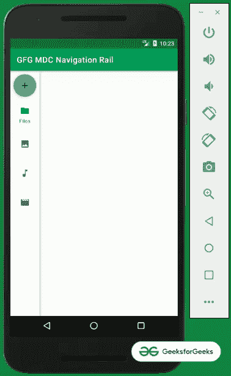
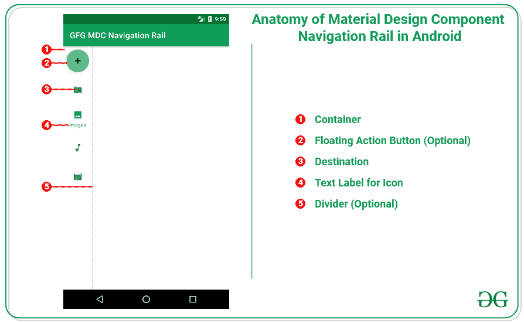
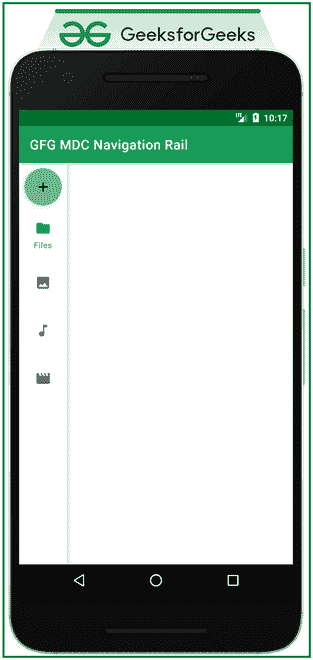

# 安卓系统中材质设计组件导航轨

> 原文:[https://www . geesforgeks . org/material-design-component-navigation-rail-in-Android/](https://www.geeksforgeeks.org/material-design-component-navigation-rail-in-android/)

[Material Design Components(MDC Android)](https://www.geeksforgeeks.org/introduction-to-material-design-in-android/)为设计人员和开发人员提供了一种在其 Android 应用程序中实现 Material Design 的方法。这些组件由谷歌的工程师和 UX 设计师组成的核心团队开发，支持可靠的开发工作流程来构建美观实用的安卓应用程序。安卓系统中的材料设计是吸引和吸引客户使用该应用的关键特征之一。这是一种特殊类型的设计，由谷歌指导。所以在本文中，已经演示了如何在 android 中使用 Navigation Rail。请看下图，了解讨论概况。



**创建一个空的活动项目**

要在安卓工作室创建新项目，请参考如何在安卓工作室创建/启动新项目。

**添加必需的依赖关系**

在[build . grade le](https://www.geeksforgeeks.org/android-build-gradle/)文件中包含谷歌材料设计组件依赖关系。添加依赖项后，不要忘记点击右上角的**“立即同步”**按钮。请注意，导航导轨是在 1.4.0 及更高版本的材料设计组件的最新版本中引入的。

> 实现' com . Google . Android . material:material:1 . 4 . 0 '

请注意，在同步您的项目时，您需要连接到网络，并确保您正在将依赖项添加到**应用程序级渐变**文件，如下所示。

### **为什么是导航轨？**

导航栏提供应用程序的主屏幕或目的地之间的移动。这基本上是一个侧面导航组件，显示最少三到最多七个目的地。每个目的地都有相关的图标和标签。导航导轨用于平板电脑和桌面屏幕等较大的屏幕。

### **何时使用导航轨？**

据说，导航轨道仅适用于较大的屏幕，当应用产品具有易于访问的顶级目的地时，这些目的地可以是主目的地或应用产品的屏幕。导航轨道不应该用于为较小尺寸屏幕实现的应用程序，并且应用程序不应该拥有一个或两个顶级目的地，它应该至少有三个目的地，最多有七个目的地。

对于从左到右(LTR)语言和从右到左(RTL)语言，导航栏位于屏幕左侧。

**导航轨道的解剖**



### **在安卓系统中实现导航轨的步骤**

**第 1 步:创建带有导航轨道图标的菜单**

导航导轨的菜单包含四个示例项目文件、图像、音乐、视频以及每个标签的相关图标。要实现相同的功能，请在菜单文件夹下的 navigation_rail_menu.xml 文件中调用以下代码。

## 可扩展标记语言

```kt
<?xml version="1.0" encoding="utf-8"?>
<menu xmlns:android="http://schemas.android.com/apk/res/android">
    <item
        android:id="@+id/files"
        android:enabled="true"
        android:icon="@drawable/ic_folder"
        android:title="Files" />
    <item
        android:id="@+id/images"
        android:enabled="true"
        android:icon="@drawable/ic_image"
        android:title="Images" />
    <item
        android:id="@+id/music"
        android:enabled="true"
        android:icon="@drawable/ic_music"
        android:title="Music" />
    <item
        android:id="@+id/videos"
        android:enabled="true"
        android:icon="@drawable/ic_movie"
        android:title="Videos" />
</menu>
```

**步骤 2:为导航轨道创建浮动动作按钮布局**

但是，这是可选的，包括导航栏的浮动操作按钮。为了包含[浮动动作按钮](https://www.geeksforgeeks.org/floating-action-button-fab-in-android-with-example/)，我们必须创建一个单独的单视图布局，它应该只包含浮动动作按钮作为根视图，并且浮动动作按钮的大小应该是自动的。要实现相同的功能，请在布局文件夹下的 navigation_rail_fab.xml 文件中调用以下代码。

## 可扩展标记语言

```kt
<?xml version="1.0" encoding="utf-8"?>
<com.google.android.material.floatingactionbutton.FloatingActionButton
    xmlns:android="http://schemas.android.com/apk/res/android"
    xmlns:app="http://schemas.android.com/apk/res-auto"
    android:layout_width="wrap_content"
    android:layout_height="wrap_content"
    android:id="@+id/nav_rail_fab"
    android:clipToPadding="false"
    app:fabSize="auto"
    app:srcCompat="@drawable/ic_add" />
```

**第三步:使用 activity_main.xml 文件**

该文件的主要且唯一的布局包含导航轨道，并将**导航轨道菜单. xml** 和**导航轨道 fab** 附加到其中。为了实现相同的功能，在 **activity_main.xm** l 文件中调用以下代码。

## 可扩展标记语言

```kt
<?xml version="1.0" encoding="utf-8"?>
<androidx.constraintlayout.widget.ConstraintLayout
    xmlns:android="http://schemas.android.com/apk/res/android"
    xmlns:app="http://schemas.android.com/apk/res-auto"
    xmlns:tools="http://schemas.android.com/tools"
    android:layout_width="match_parent"
    android:layout_height="match_parent"
    android:clipToPadding="false"
    tools:context=".MainActivity">

    <com.google.android.material.navigationrail.NavigationRailView
        android:id="@+id/navigationRail"
        android:layout_width="wrap_content"
        android:layout_height="match_parent"
        android:clipToPadding="false"
        app:headerLayout="@layout/navigation_rail_fab"
        app:layout_constraintBottom_toBottomOf="parent"
        app:layout_constraintStart_toStartOf="parent"
        app:layout_constraintTop_toTopOf="parent"
        app:menu="@menu/navigation_rail_menu" />

</androidx.constraintlayout.widget.ConstraintLayout>
```

**输出 UI:**



**第四步:使用 MainActivity.kt 文件**

在 **MainActivity.kt** 文件中，我们需要处理导航轨道容器中所有项目的点击监听器。点击这些项目后，会出现简单的祝酒信息。要实现相同的功能，请调用 **MainActivity.kt** 文件中的以下代码。

## 我的锅

```kt
import android.os.Bundle
import android.widget.Toast
import androidx.appcompat.app.AppCompatActivity
import com.google.android.material.floatingactionbutton.FloatingActionButton
import com.google.android.material.navigationrail.NavigationRailView

class MainActivity : AppCompatActivity() {
    override fun onCreate(savedInstanceState: Bundle?) {
        super.onCreate(savedInstanceState)
        setContentView(R.layout.activity_main)

        val navRailFab: FloatingActionButton = findViewById(R.id.nav_rail_fab)
        navRailFab.setOnClickListener {
            Toast.makeText(this, "FAB Clicked!", Toast.LENGTH_SHORT).show()
        }

        val navigationRail: NavigationRailView = findViewById(R.id.navigationRail)
        navigationRail.setOnItemSelectedListener { menuItem ->
            when (menuItem.itemId) {
                R.id.files -> {
                    Toast.makeText(this, "Files", Toast.LENGTH_SHORT).show()
                    true
                }
                R.id.images -> {
                    Toast.makeText(this, "Images", Toast.LENGTH_SHORT).show()
                    true
                }
                R.id.music -> {
                    Toast.makeText(this, "Music", Toast.LENGTH_SHORT).show()
                    true
                }
                R.id.videos -> {
                    Toast.makeText(this, "Videos", Toast.LENGTH_SHORT).show()
                    true
                }
                else -> false
            }
        }
    }
}
```

**输出:**

<video class="wp-video-shortcode" id="video-684792-1" width="640" height="360" preload="metadata" controls=""><source type="video/mp4" src="https://media.geeksforgeeks.org/wp-content/uploads/20210922102435/Untitled.mp4?_=1">[https://media.geeksforgeeks.org/wp-content/uploads/20210922102435/Untitled.mp4](https://media.geeksforgeeks.org/wp-content/uploads/20210922102435/Untitled.mp4)</video>