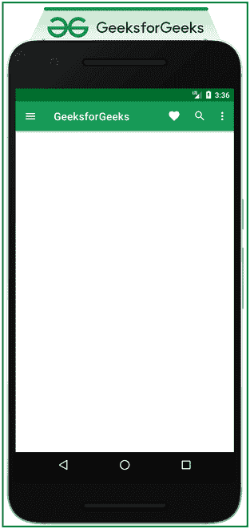

# 安卓中材质设计组件顶部 App 栏

> 原文:[https://www . geesforgeks . org/material-design-component-top-app-bar-in-Android/](https://www.geeksforgeeks.org/material-design-component-top-app-bar-in-android/)

[Material Design Components(MDC Android)](https://www.geeksforgeeks.org/introduction-to-material-design-in-android/)为设计人员和开发人员提供了一种在其 Android 应用程序中实现 Material Design 的方法。这些组件由谷歌的工程师和 UX 设计师组成的核心团队开发，支持可靠的开发工作流程来构建美观实用的安卓应用程序。安卓系统中的材料设计是吸引和吸引客户使用该应用的关键特征之一。这是一种特殊类型的设计，由谷歌指导。因此，在本文中，已经演示了如何使用材质设计组件顶部应用程序栏。请看下图，了解讨论概况。


**创建一个空的活动项目**

要在安卓工作室创建新项目，请参考[如何在安卓工作室创建/启动新项目](https://www.geeksforgeeks.org/android-how-to-create-start-a-new-project-in-android-studio/)。

**添加必需的依赖关系**

在[build . grade le](https://www.geeksforgeeks.org/android-build-gradle/)文件中包含谷歌材料设计组件依赖关系。添加依赖项后，不要忘记点击右上角的**“立即同步”**按钮。

> 实现' com . Google . Android . material:material:1 . 4 . 0 '

请注意，在同步您的项目时，您需要连接到网络，并确保您正在将依赖项添加到**应用程序级渐变**文件，如下所示。

### **为什么使用 Top App Bar？**

顶部应用程序栏出现在应用程序的每个活动的顶部，滚动时消失。顶部的应用程序栏显示活动的标题以及在特定活动或应用程序屏幕上要采取的选定主要操作。它还可以用于品牌、屏幕标题、导航和操作。

**顶部动作杆的解剖**


在上面的材料设计顶部应用程序栏解剖导航图标，标题，动作菜单，溢出菜单是可选的。

### **在安卓中实现 MDC 顶级应用吧的步骤**

**第 1 步:为顶级应用程序栏创建菜单项**

在 **res** 文件夹中创建**菜单资源文件夹**调用 **top_app_bar_menu.xml** 文件中的以下代码:

## 可扩展标记语言

```kt
<?xml version="1.0" encoding="utf-8"?>
<menu xmlns:android="http://schemas.android.com/apk/res/android"
    xmlns:app="http://schemas.android.com/apk/res-auto">

    <item
        android:id="@+id/favorite"
        android:icon="@drawable/ic_favorite"
        android:title="Favourites"
        app:showAsAction="ifRoom" />

    <item
        android:id="@+id/search"
        android:icon="@drawable/ic_search"
        android:title="Search"
        app:showAsAction="ifRoom" />

    <item
        android:id="@+id/more"
        android:icon="@drawable/ic_more"
        android:title="More Options"
        app:showAsAction="never" />

</menu>
```

**步骤 2:使用 activity_main.xml 文件**

应用程序的主布局只包含顶部栏。首先，应用程序布局需要嵌套在协调器布局中，在应用程序布局中，需要调用材质工具栏。材质工具栏的大小需要是操作栏大小。为了实现相同的功能，在 **activity_main.xml** 文件中调用以下代码。

## 可扩展标记语言

```kt
<?xml version="1.0" encoding="utf-8"?>
<androidx.coordinatorlayout.widget.CoordinatorLayout 
    xmlns:android="http://schemas.android.com/apk/res/android"
    xmlns:app="http://schemas.android.com/apk/res-auto"
    xmlns:tools="http://schemas.android.com/tools"
    android:layout_width="match_parent"
    android:layout_height="match_parent"
    tools:context=".MainActivity">

    <com.google.android.material.appbar.AppBarLayout
        android:layout_width="match_parent"
        android:layout_height="wrap_content">

        <com.google.android.material.appbar.MaterialToolbar
            style="@style/Widget.MaterialComponents.Toolbar.Primary"
            android:layout_width="match_parent"
            android:layout_height="?attr/actionBarSize"
            app:menu="@menu/top_app_bar_menu"
            app:navigationIcon="@drawable/ic_menu"
            app:title="GeeksforGeeks" />

    </com.google.android.material.appbar.AppBarLayout>

</androidx.coordinatorlayout.widget.CoordinatorLayout>
```

**输出 UI:**



**第三步:使用 MainActivity.kt 文件**

在 **MainActivity.kt** 文件中，一个简单的 on 菜单项 click listener 被分配给材质工具栏的实例。若要实现相同的，请调用以下代码。不过也可以实现工具栏的导航抽屉，参考安卓中的[导航抽屉。](https://www.geeksforgeeks.org/navigation-drawer-in-android/)

## 我的锅

```kt
import android.os.Bundle
import android.widget.Toast
import androidx.appcompat.app.AppCompatActivity
import com.google.android.material.appbar.MaterialToolbar

class MainActivity : AppCompatActivity() {
    override fun onCreate(savedInstanceState: Bundle?) {
        super.onCreate(savedInstanceState)
        setContentView(R.layout.activity_main)

        // create instance of the material toolbar
        val materialToolbar: MaterialToolbar = findViewById(R.id.material_toolbar)

        // assign the on menu item click listener
        materialToolbar.setOnMenuItemClickListener {
            when (it.itemId) {
                R.id.favorite -> {
                    Toast.makeText(this, "Favorites Clicked", Toast.LENGTH_SHORT).show()
                    true
                }
                R.id.search -> {
                    Toast.makeText(this, "Favorites Clicked", Toast.LENGTH_SHORT).show()
                    true
                }
                else -> false
            }
        }
    }
}
```

**输出:**

<video class="wp-video-shortcode" id="video-692751-1" width="640" height="360" preload="metadata" controls=""><source type="video/mp4" src="https://media.geeksforgeeks.org/wp-content/uploads/20211001193554/Untitled.mp4?_=1">[https://media.geeksforgeeks.org/wp-content/uploads/20211001193554/Untitled.mp4](https://media.geeksforgeeks.org/wp-content/uploads/20211001193554/Untitled.mp4)</video>