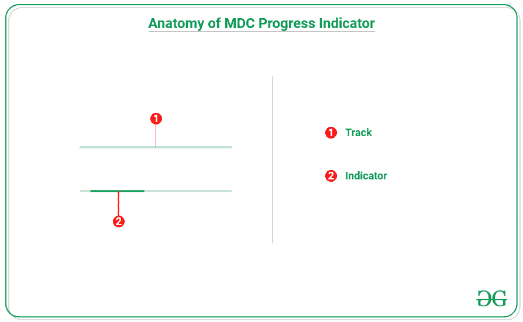

# 安卓系统中的材料设计组件进度指示器

> 原文:[https://www . geesforgeks . org/material-design-components-progress-indicator-in-Android/](https://www.geeksforgeeks.org/material-design-components-progress-indicator-in-android/)

[Material Design Components(MDC Android)](https://www.geeksforgeeks.org/introduction-to-material-design-in-android/)为设计人员和开发人员提供了一种在其 Android 应用程序中实现 Material Design 的方法。这些组件由谷歌的工程师和 UX 设计师组成的核心团队开发，支持可靠的开发工作流程来构建美观实用的安卓应用程序。安卓系统中的材料设计是吸引和吸引客户使用该应用的关键特征之一。这是一种特殊类型的设计，由谷歌指导。因此，在本文中，已经演示了如何使用进度指示器、它们的类型和解剖结构。

**创建一个空的活动项目**

要在安卓工作室创建新项目，请参考[如何在安卓工作室创建/启动新项目](https://www.geeksforgeeks.org/android-how-to-create-start-a-new-project-in-android-studio/)。

**添加必需的依赖关系**

在[build . grade le](https://www.geeksforgeeks.org/android-build-gradle/)文件中包含谷歌材料设计组件依赖关系。添加依赖项后，不要忘记点击右上角的“立即同步”按钮。

> 实现' com . Google . Android . material:material:1 . 4 . 0 '

请注意，在同步项目时，您需要连接到网络，并确保您正在将依赖项添加到应用程序级别的 Gradle 文件中，如下所示。

### **什么是进度指标？**

android 中使用进度指示器来通知用户正在进行的过程，例如，加载应用程序、网络呼叫、下载或上传文件。它们传达应用程序的状态，并告知用户是否可以离开应用程序的当前会话。

### **进度指标类型**

进度指示器主要有两种类型，一种是**线性指示器**，另一种是**圆形指示器**。请看下面的图片，找出不同之处。这些进度指标可以是确定的，也可以是不确定的。

*   **确定性指标**告知用户确定的过程，这些应该只在可以检测过程速率时使用。
*   **不确定指示器**告知用户不确定过程意味着当前过程可能需要不确定的时间才能完成。



**线性进度指示器由两个主要部分组成:**

*   **轨迹:**固定宽度的组件，它为指示器的行进设置边界。
*   **指示器:**沿轨迹动画化的组件。

### **在安卓项目中实现进度指标的步骤**

**使用 activity_main.xml 文件**

应用程序的主要布局由两个进度指示器组成。一个是线性进度指示器，另一个是循环进度指示器。请注意，它们中的不确定属性都为真，否则当应用程序在模拟器上运行时，它将不会显示动画。要实现相同的功能，请在 activity_main.xml 文件中调用以下代码。

## 可扩展标记语言

```kt
<?xml version="1.0" encoding="utf-8"?>
<androidx.constraintlayout.widget.ConstraintLayout 
    xmlns:android="http://schemas.android.com/apk/res/android"
    xmlns:app="http://schemas.android.com/apk/res-auto"
    xmlns:tools="http://schemas.android.com/tools"
    android:layout_width="match_parent"
    android:layout_height="match_parent"
    tools:context=".MainActivity">

    <com.google.android.material.progressindicator.LinearProgressIndicator
        android:id="@+id/linearProgressIndicator"
        android:layout_width="match_parent"
        android:layout_height="wrap_content"
        android:layout_margin="32dp"
        android:indeterminate="true"
        app:layout_constraintLeft_toLeftOf="parent"
        app:layout_constraintRight_toRightOf="parent"
        app:layout_constraintTop_toTopOf="parent" />

    <com.google.android.material.progressindicator.CircularProgressIndicator
        android:layout_width="wrap_content"
        android:layout_height="wrap_content"
        android:layout_marginTop="32dp"
        android:indeterminate="true"
        app:layout_constraintEnd_toEndOf="@+id/linearProgressIndicator"
        app:layout_constraintStart_toStartOf="@+id/linearProgressIndicator"
        app:layout_constraintTop_toBottomOf="@+id/linearProgressIndicator" />

</androidx.constraintlayout.widget.ConstraintLayout>
```

**输出:**

<video class="wp-video-shortcode" id="video-683302-1" width="640" height="360" preload="metadata" controls=""><source type="video/mp4" src="https://media.geeksforgeeks.org/wp-content/uploads/20210921085336/Untitled.mp4?_=1">[https://media.geeksforgeeks.org/wp-content/uploads/20210921085336/Untitled.mp4](https://media.geeksforgeeks.org/wp-content/uploads/20210921085336/Untitled.mp4)</video>

**定制线性进度指示器:**

要更改轨道厚度、轨道颜色和指示器颜色，属性如下:

> app:trackThickness="colorValue "
> 
> app：trackColor="colorValue"
> 
> app:indicator color = " color value "

下面是一个例子:

## 可扩展标记语言

```kt
<?xml version="1.0" encoding="utf-8"?>
<androidx.constraintlayout.widget.ConstraintLayout 
    xmlns:android="http://schemas.android.com/apk/res/android"
    xmlns:app="http://schemas.android.com/apk/res-auto"
    xmlns:tools="http://schemas.android.com/tools"
    android:layout_width="match_parent"
    android:layout_height="match_parent"
    tools:context=".MainActivity">

    <com.google.android.material.progressindicator.LinearProgressIndicator
        android:id="@+id/linearProgressIndicator"
        android:layout_width="match_parent"
        android:layout_height="wrap_content"
        android:layout_margin="32dp"
        android:indeterminate="true"
        app:indicatorColor="@color/green_500"
        app:layout_constraintLeft_toLeftOf="parent"
        app:layout_constraintRight_toRightOf="parent"
        app:layout_constraintTop_toTopOf="parent"
        app:trackColor="@color/purple_500"
        app:trackThickness="8dp" />

</androidx.constraintlayout.widget.ConstraintLayout>
```