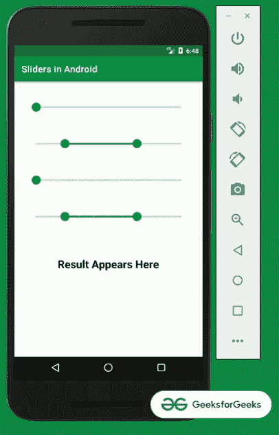
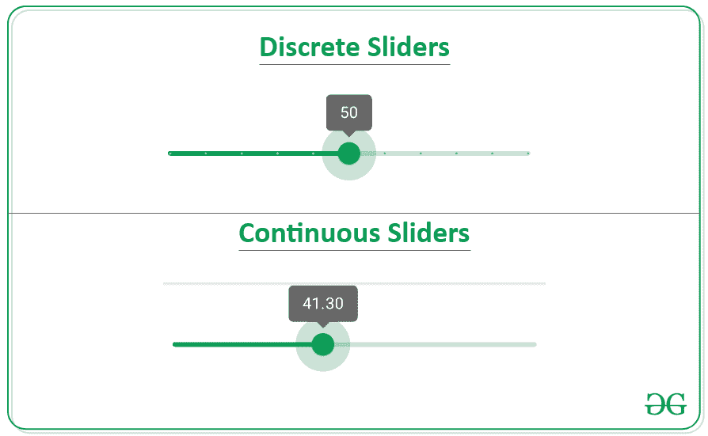
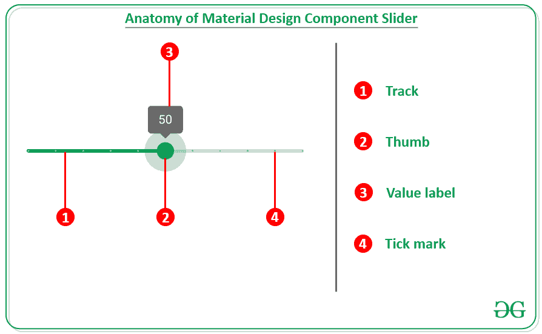
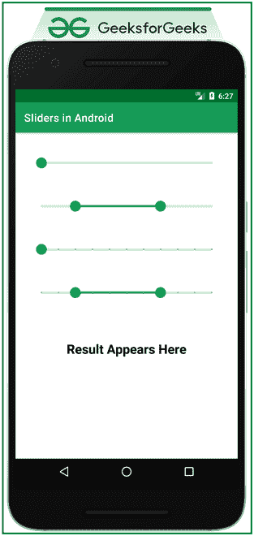

# 安卓中的材质设计组件滑块

> 原文:[https://www . geesforgeks . org/material-design-components-sliders-in-Android/](https://www.geeksforgeeks.org/material-design-components-sliders-in-android/)

[Material Design Components(MDC Android)](https://www.geeksforgeeks.org/introduction-to-material-design-in-android/)为设计人员和开发人员提供了一种在其 Android 应用程序中实现 Material Design 的方法。这些组件由谷歌的工程师和 UX 设计师组成的核心团队开发，支持可靠的开发工作流程来构建美观实用的安卓应用程序。安卓系统中的材料设计是吸引和吸引客户使用该应用的关键特征之一。这是一种特殊类型的设计，由谷歌指导。所以在本文中，已经演示了如何在 android 中使用 slider 和 Range Sliders。请看下图，了解讨论概况。



### **分步实施**

**创建一个空的活动项目**

要在安卓工作室创建新项目，请参考[如何在安卓工作室创建/启动新项目](https://www.geeksforgeeks.org/android-how-to-create-start-a-new-project-in-android-studio/)。

**添加必需的依赖关系**

在 build.gradle 文件中包含 google material design 组件依赖项。添加依赖项后，不要忘记点击右上角的**“立即同步”**按钮。

> 实现' com . Google . Android . material:material:1 . 4 . 0 '

请注意，在同步项目时，您需要连接到网络，并确保您正在将依赖项添加到应用程序级别的 Gradle 文件中，如下所示。

### **了解滑块**

**用在哪里？**

滑块用于查看和选择栏上范围内的特定值。这些理想地用于调整屏幕亮度、音量或应用图像过滤器。图标也可以在开始和结束时使用，或者可以显示选定的值，提供优雅，从而增加用户体验。

**滑块类型**

滑块主要有两种类型:



1.  **连续滑块:**这些类型的滑块允许用户选择指定范围内的值。
2.  **离散滑块:**这些类型的滑块允许用户通过参考其值指示器在指定范围内选择特定的**调整后的**值。

**滑块解剖**



滑块包含以下元素:

1.  **轨迹:**轨迹显示可供用户选择的范围。
2.  **拇指:**拇指是一个位置指示器，可以沿着轨道移动，显示其位置的选定值。
3.  **数值标签:**这是可选的，显示与拇指位置相对应的数值。
4.  **刻度线:**这是可选的，沿着轨迹的刻度线代表用户可以将滑块移动到的预定值。

### **添加材料设计组件滑块(正常)**

**第一步:使用 activity_main.xml 文件**

项目的主要布局包含 4 种类型的滑块。一个是正常的连续滑块，第二个是连续范围滑块，第三个是离散滑块，第四个是范围离散滑块。要实现相同的功能，请在 activity_main.xml 文件中调用以下代码。

## 可扩展标记语言

```
<?xml version="1.0" encoding="utf-8"?>
<androidx.constraintlayout.widget.ConstraintLayout 
    xmlns:android="http://schemas.android.com/apk/res/android"
    xmlns:app="http://schemas.android.com/apk/res-auto"
    xmlns:tools="http://schemas.android.com/tools"
    android:layout_width="match_parent"
    android:layout_height="match_parent"
    tools:context=".MainActivity">

    <com.google.android.material.slider.Slider
        android:id="@+id/normalContinuousSlider"
        android:layout_width="match_parent"
        android:layout_height="wrap_content"
        android:layout_margin="32dp"
        android:valueFrom="0.0"
        android:valueTo="100.0"
        app:layout_constraintEnd_toEndOf="parent"
        app:layout_constraintStart_toStartOf="parent"
        app:layout_constraintTop_toTopOf="parent" />

    <com.google.android.material.slider.RangeSlider
        android:id="@+id/continuousRangeSlider"
        android:layout_width="match_parent"
        android:layout_height="wrap_content"
        android:layout_margin="32dp"
        android:valueFrom="0.0"
        android:valueTo="100.0"
        app:layout_constraintEnd_toEndOf="parent"
        app:layout_constraintStart_toStartOf="parent"
        app:layout_constraintTop_toBottomOf="@+id/normalContinuousSlider"
        app:values="@array/slider_values" />

    <com.google.android.material.slider.Slider
        android:id="@+id/discreteSlider"
        android:layout_width="match_parent"
        android:layout_height="wrap_content"
        android:layout_margin="32dp"
        android:stepSize="10.0"
        android:valueFrom="0.0"
        android:valueTo="100.0"
        app:layout_constraintEnd_toEndOf="parent"
        app:layout_constraintStart_toStartOf="parent"
        app:layout_constraintTop_toBottomOf="@+id/continuousRangeSlider" />

    <com.google.android.material.slider.RangeSlider
        android:id="@+id/discreteRangeSlider"
        android:layout_width="match_parent"
        android:layout_height="wrap_content"
        android:layout_margin="32dp"
        android:stepSize="10.0"
        android:valueFrom="0.0"
        android:valueTo="100.0"
        app:layout_constraintEnd_toEndOf="parent"
        app:layout_constraintStart_toStartOf="parent"
        app:layout_constraintTop_toBottomOf="@+id/discreteSlider"
        app:values="@array/slider_values" />

</androidx.constraintlayout.widget.ConstraintLayout>
```

现在在 **arrays.xml** 文件中添加以下数组，并将数组名赋予 *slider_values。*

## 可扩展标记语言

```
<?xml version="1.0" encoding="utf-8"?>
<resources>
    <array name="slider_values">
        <item>20.0</item>
        <item>70.0</item>
    </array>
</resources>
```

**输出 UI:**



**第二步:使用 MainActivity.kt 文件**

在 **MainActivity.kt** 文件中观察滑块的变化，并将结果显示给用户。要实现相同的功能，请在 **MainActivity.kt** 文件中调用以下代码

## 我的锅

```
import android.os.Bundle
import android.widget.TextView
import androidx.appcompat.app.AppCompatActivity
import com.google.android.material.slider.RangeSlider
import com.google.android.material.slider.Slider

class MainActivity : AppCompatActivity() {
    override fun onCreate(savedInstanceState: Bundle?) {
        super.onCreate(savedInstanceState)
        setContentView(R.layout.activity_main)

        // sample text view to show the result
        val tvResult: TextView = findViewById(R.id.tvResult)

        // observe for first type of slider
        val normalContinuousSlider: Slider = findViewById(R.id.normalContinuousSlider)
        normalContinuousSlider.addOnChangeListener { slider, value, fromUser ->
            tvResult.text = value.toString()
        }

        // observe for second type of slider
        val continuousRangeSlider: RangeSlider = findViewById(R.id.continuousRangeSlider)
        continuousRangeSlider.addOnChangeListener { slider, value, fromUser ->
            tvResult.text = "${slider.values[0]} to ${slider.values[1]}"
        }

        // observe for third type of slider
        val discreteSlider: Slider = findViewById(R.id.discreteSlider)
        discreteSlider.addOnChangeListener { slider, value, fromUser ->
            tvResult.text = value.toString()
        }

        // observe for fourth type of slider
        val discreteRangeSlider: RangeSlider = findViewById(R.id.discreteRangeSlider)
        discreteRangeSlider.addOnChangeListener { slider, value, fromUser ->
            tvResult.text = "${slider.values[0]} to ${slider.values[1]}"
        }
    }
}
```

**输出:**

<video class="wp-video-shortcode" id="video-683289-1" width="640" height="360" preload="metadata" controls=""><source type="video/mp4" src="https://media.geeksforgeeks.org/wp-content/uploads/20210918185652/Untitled.mp4?_=1">[https://media.geeksforgeeks.org/wp-content/uploads/20210918185652/Untitled.mp4](https://media.geeksforgeeks.org/wp-content/uploads/20210918185652/Untitled.mp4)</video>