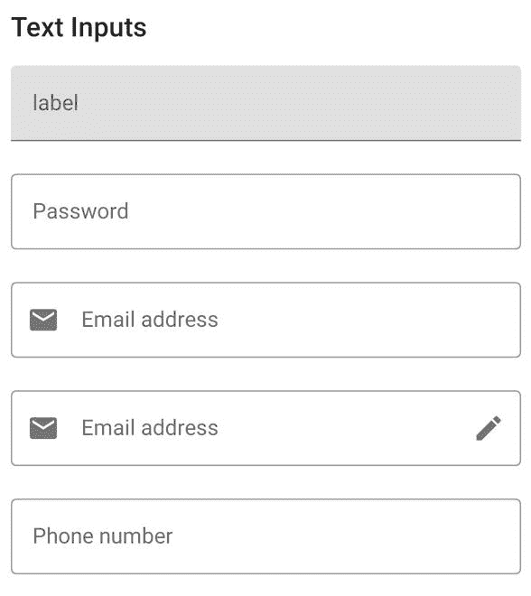

# 安卓中使用 Jetpack Compose 的素材设计文本输入字段

> 原文:[https://www . geesforgeks . org/material-design-text-input-field-use-jet pack-compose-in-Android/](https://www.geeksforgeeks.org/material-design-text-input-field-using-jetpack-compose-in-android/)

[Jetpack Compose](https://www.geeksforgeeks.org/basics-of-jetpack-compose-in-android/) 是一个构建原生安卓 UI 的现代工具包。Jetpack Compose 用更少的代码、强大的工具和直观的 Kotlin APIs 简化并加速了 Android 上的 UI 开发。构建 Compose 是为了支持材料设计原则。它的许多用户界面元素实现了开箱即用的材料设计。在本文中，我们将解释如何使用 Jetpack Compose 创建材料设计文本输入字段。下面是展示我们将要构建的内容的示例图片。



### **分步实施**

**第一步:创建新项目**

使用 Jetpack Compose 在 Android Studio 中创建新项目请参考[如何使用 Jetpack Compose 在 Android Studio Canary 版本中创建新项目。](https://www.geeksforgeeks.org/how-to-create-a-new-project-in-android-studio-canary-version-with-jetpack-compose/)

**第二步:使用 MainActivity.kt**

转到 **MainActivity.kt** 文件，参考以下代码。下面是 MainActivity.kt 文件的代码。代码中添加了注释，以更详细地理解代码。

## 我的锅

```kt
import android.os.Bundle
import androidx.activity.ComponentActivity
import androidx.activity.compose.setContent
import androidx.compose.foundation.layout.Column
import androidx.compose.foundation.layout.fillMaxWidth
import androidx.compose.foundation.layout.padding
import androidx.compose.foundation.text.KeyboardOptions
import androidx.compose.material.*
import androidx.compose.material.MaterialTheme.typography
import androidx.compose.material.icons.Icons
import androidx.compose.material.icons.filled.Edit
import androidx.compose.material.icons.filled.Email
import androidx.compose.runtime.*
import androidx.compose.ui.Modifier
import androidx.compose.ui.graphics.Color
import androidx.compose.ui.text.InternalTextApi
import androidx.compose.ui.text.input.KeyboardType
import androidx.compose.ui.text.input.PasswordVisualTransformation
import androidx.compose.ui.text.input.TextFieldValue
import androidx.compose.ui.tooling.preview.Preview
import androidx.compose.ui.unit.dp
import com.example.jetpackcomposepractice.ui.theme.JetpackComposePracticeTheme

class MainActivity : ComponentActivity() {
    override fun onCreate(savedInstanceState: Bundle?) {
        super.onCreate(savedInstanceState)
        setContent {
            JetpackComposePracticeTheme {
                // A surface container using the 'background' color from the theme
                Surface(color = Color.White) {
                    Column {
                        // call the function which contains all the input fields
                        TextInputs()
                    }
                }
            }
        }
    }
}

@Composable
fun TextInputs() {
    Column {

        Text(text = "Text Inputs", style = typography.h6, modifier = Modifier.padding(8.dp))
        var text by remember { mutableStateOf(TextFieldValue("")) }
        // for preview add same text to all the fields

        // Normal Text Input field with floating label
        // placeholder is same as hint in xml of edit text
        TextField(
            value = text,
            onValueChange = { newValue -> text = newValue },
            modifier = Modifier
                .padding(8.dp)
                .fillMaxWidth(),
            label = { Text("label") },
            placeholder = { Text("placeholder") },
        )

        // Outlined Text Input Field
        OutlinedTextField(
            value = text,
            modifier = Modifier
                .padding(8.dp)
                .fillMaxWidth(),
            label = { Text(text = "Password") },
            placeholder = { Text(text = "12334444") },
            visualTransformation = PasswordVisualTransformation(),
            onValueChange = {
                text = it
            },
            keyboardOptions = KeyboardOptions(keyboardType = KeyboardType.Password)
        )

        // Outlined Input text with icon on the left
        // inside leadingIcon property add the icon
        OutlinedTextField(
            value = text,
            leadingIcon = { Icon(imageVector = Icons.Default.Email, contentDescription = null) },
            modifier = Modifier
                .padding(8.dp)
                .fillMaxWidth(),
            keyboardOptions = KeyboardOptions(keyboardType = KeyboardType.Text),
            label = { Text(text = "Email address") },
            placeholder = { Text(text = "Your email") },
            onValueChange = {
                text = it
            }
        )

        // Outlined Input text with icon on the left and right
        // inside leadingIcon property add the left icon
        // inside trailingIcon property add right icon
        OutlinedTextField(
            value = text,
            leadingIcon = { Icon(imageVector = Icons.Default.Email, contentDescription = null) },
            trailingIcon = { Icon(imageVector = Icons.Default.Edit, contentDescription = null) },
            modifier = Modifier
                .padding(8.dp)
                .fillMaxWidth(),
            keyboardOptions = KeyboardOptions(keyboardType = KeyboardType.Text),
            label = { Text(text = "Email address") },
            placeholder = { Text(text = "Your email") },
            onValueChange = {
                text = it
            }
        )

        var numberText by remember { mutableStateOf(TextFieldValue("")) }
        // Outlined Text input field with input type number
        // It will open the number keyboard
        OutlinedTextField(value = numberText,
            modifier = Modifier
                .padding(8.dp)
                .fillMaxWidth(),
            keyboardOptions = KeyboardOptions(keyboardType = KeyboardType.Number),
            label = { Text(text = "Phone number") },
            placeholder = { Text(text = "88888888") },
            onValueChange = {
                numberText = it
            }
        )
    }
}

@InternalTextApi
@Preview
@Composable
fun PreviewInputs() {
    Column {
        TextInputs()
    }
}
```

**输出:**

<video class="wp-video-shortcode" id="video-584534-1" width="640" height="360" preload="metadata" controls=""><source type="video/mp4" src="https://media.geeksforgeeks.org/wp-content/uploads/20210327231912/material_design_text_input_gfg1.mp4?_=1">[https://media.geeksforgeeks.org/wp-content/uploads/20210327231912/material_design_text_input_gfg1.mp4](https://media.geeksforgeeks.org/wp-content/uploads/20210327231912/material_design_text_input_gfg1.mp4)</video>