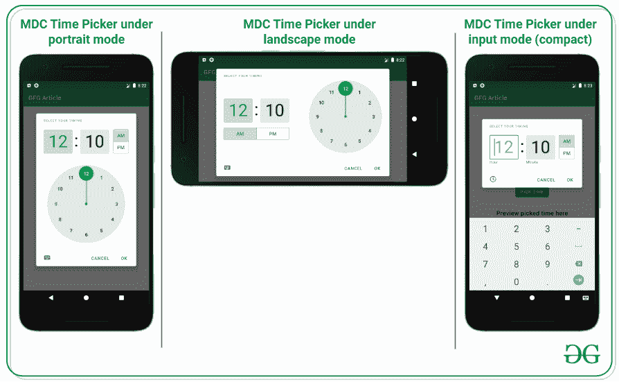
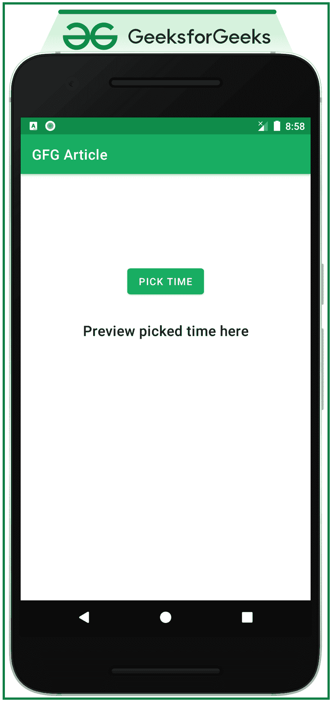
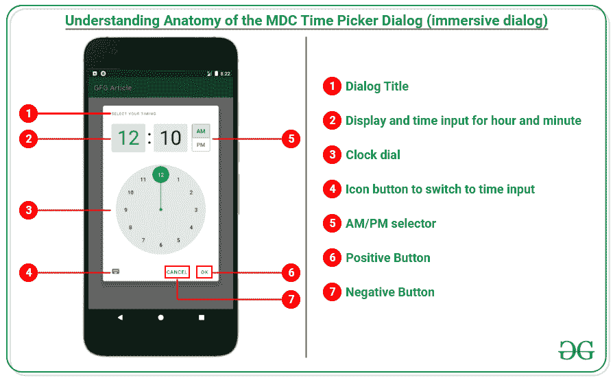
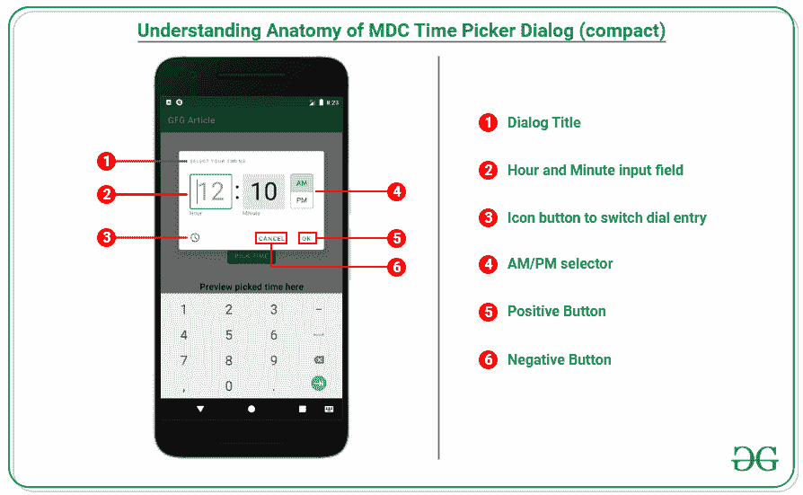

# 安卓中的材料设计时间选择器

> 原文:[https://www . geesforgeks . org/material-design-time-picker-in-Android/](https://www.geeksforgeeks.org/material-design-time-picker-in-android/)

材料设计组件(MDC Android)为设计人员和开发人员提供了一种在他们的 Android 应用程序中实现材料设计的方法。这些组件由谷歌的工程师和 UX 设计师组成的核心团队开发，支持可靠的开发工作流程来构建美观实用的安卓应用程序。如果你喜欢谷歌为安卓设计的谷歌材料设计组件的用户界面元素非常棒，那么这里有一些需要遵循的步骤来获得它们，其中之一是时间选择器。它与安卓中的常规时间选择器不同，并允许大量定制以改善用户体验。它给用户带来了巨大的体验。因此，本文讨论了如何在安卓系统中实现材质设计时间选择器。请看下图，材料设计时间选择器可以显示哪些视角。



### **实施材料设计时间选择器的步骤**

**第一步:创建一个空的活动项目**

创建一个空的活动安卓工作室项目。参考[如何在安卓工作室](https://www.geeksforgeeks.org/android-how-to-create-start-a-new-project-in-android-studio/)创建/启动新项目。

**第二步:添加所需的依赖关系**

需要材料设计相关性。向应用程序级的 Gradle 文件添加以下依赖项。

> //版本 1.3.0-alpha04 可能会有所不同
> 
> 实现' com . Google . Android . material:material:1 . 3 . 0-alpha 04 '

**第三步:使用 activity_main.xml 文件**

*   应用程序的主布局包含一个按钮和一个[文本视图](https://www.geeksforgeeks.org/textview-widget-in-android-using-java-with-examples/)。按钮打开材料设计时间选取器，文本视图预览选取的时间。
*   要实现相同的用户界面，在 **activity_main.xml** 文件中调用以下代码。

## 可扩展标记语言

```kt
<?xml version="1.0" encoding="utf-8"?>
<androidx.constraintlayout.widget.ConstraintLayout 
    xmlns:android="http://schemas.android.com/apk/res/android"
    xmlns:app="http://schemas.android.com/apk/res-auto"
    xmlns:tools="http://schemas.android.com/tools"
    android:layout_width="match_parent"
    android:layout_height="match_parent"
    tools:context=".MainActivity"
    tools:ignore="HardcodedText">

    <Button
        android:id="@+id/pick_time_button"
        android:layout_width="wrap_content"
        android:layout_height="wrap_content"
        android:layout_marginTop="128dp"
        android:text="PICK TIME"
        app:layout_constraintEnd_toEndOf="parent"
        app:layout_constraintStart_toStartOf="parent"
        app:layout_constraintTop_toTopOf="parent" />

    <TextView
        android:id="@+id/preview_picked_time_textView"
        style="@style/TextAppearance.MaterialComponents.Headline6"
        android:layout_width="wrap_content"
        android:layout_height="wrap_content"
        android:layout_marginTop="32dp"
        android:text="Preview picked time here"
        app:layout_constraintEnd_toEndOf="@+id/pick_time_button"
        app:layout_constraintStart_toStartOf="@+id/pick_time_button"
        app:layout_constraintTop_toBottomOf="@+id/pick_time_button" />

</androidx.constraintlayout.widget.ConstraintLayout>
```

**输出 UI:**



**在前往与对话框界面交互之前，了解对话框的结构很重要**

*   剖析 MDC 时间选择器(沉浸式对话框)。



*   剖析 MDC 时间选择器(紧凑型)。



**第四步:使用 MainActivity.kt 文件**

*   在 **MainActivity.kt** 文件中，处理按钮点击打开材料设计计时器选择器对话框，检查一位数的小时和分钟，并更新预览文本。
*   为了实现相同的功能，在**mainaaactivity . kt**文件中调用以下代码。

## 我的锅

```kt
import android.os.Bundle
import android.widget.Button
import android.widget.TextView
import androidx.appcompat.app.AppCompatActivity
import com.google.android.material.timepicker.MaterialTimePicker
import com.google.android.material.timepicker.TimeFormat

class MainActivity : AppCompatActivity() {
    override fun onCreate(savedInstanceState: Bundle?) {
        super.onCreate(savedInstanceState)
        setContentView(R.layout.activity_main)

        // create instance of the UI elements
        val pickTimeButton: Button = findViewById(R.id.pick_time_button)
        val previewPickedTimeTextView: TextView = findViewById(R.id.preview_picked_time_textView)

        // handle the pick time button to open
        pickTimeButton.setOnClickListener {

            // instance of MDC time picker
            val materialTimePicker: MaterialTimePicker = MaterialTimePicker.Builder()
                // set the title for the alert dialog
                .setTitleText("SELECT YOUR TIMING")
                // set the default hour for the 
                  // dialog when the dialog opens
                .setHour(12)
                // set the default minute for the
                  // dialog when the dialog opens
                .setMinute(10)
                // set the time format 
                  // according to the region
                .setTimeFormat(TimeFormat.CLOCK_12H)
                .build()

            materialTimePicker.show(supportFragmentManager, "MainActivity")

            // on clicking the positive button of the time picker 
              // dialog update the TextView accordingly
            materialTimePicker.addOnPositiveButtonClickListener {

                val pickedHour: Int = materialTimePicker.hour
                val pickedMinute: Int = materialTimePicker.minute

                // check for single digit hour hour and minute
                  // and update TextView accordingly
                val formattedTime: String = when {
                    pickedHour > 12 -> {
                        if (pickedMinute < 10) {
                            "${materialTimePicker.hour - 12}:0${materialTimePicker.minute} pm"
                        } else {
                            "${materialTimePicker.hour - 12}:${materialTimePicker.minute} pm"
                        }
                    }
                    pickedHour == 12 -> {
                        if (pickedMinute < 10) {
                            "${materialTimePicker.hour}:0${materialTimePicker.minute} pm"
                        } else {
                            "${materialTimePicker.hour}:${materialTimePicker.minute} pm"
                        }
                    }
                    pickedHour == 0 -> {
                        if (pickedMinute < 10) {
                            "${materialTimePicker.hour + 12}:0${materialTimePicker.minute} am"
                        } else {
                            "${materialTimePicker.hour + 12}:${materialTimePicker.minute} am"
                        }
                    }
                    else -> {
                        if (pickedMinute < 10) {
                            "${materialTimePicker.hour}:0${materialTimePicker.minute} am"
                        } else {
                            "${materialTimePicker.hour}:${materialTimePicker.minute} am"
                        }
                    }
                }

                // then update the preview TextView
                previewPickedTimeTextView.text = formattedTime
            }
        }
    }
}
```

**输出:**

<video class="wp-video-shortcode" id="video-610255-1" width="640" height="360" preload="metadata" controls=""><source type="video/mp4" src="https://media.geeksforgeeks.org/wp-content/uploads/20210521210606/Untitled2.mp4?_=1">[https://media.geeksforgeeks.org/wp-content/uploads/20210521210606/Untitled2.mp4](https://media.geeksforgeeks.org/wp-content/uploads/20210521210606/Untitled2.mp4)</video>