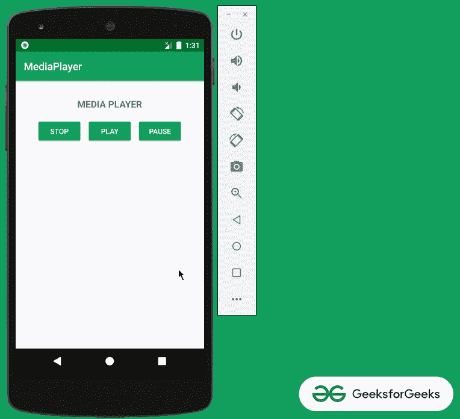
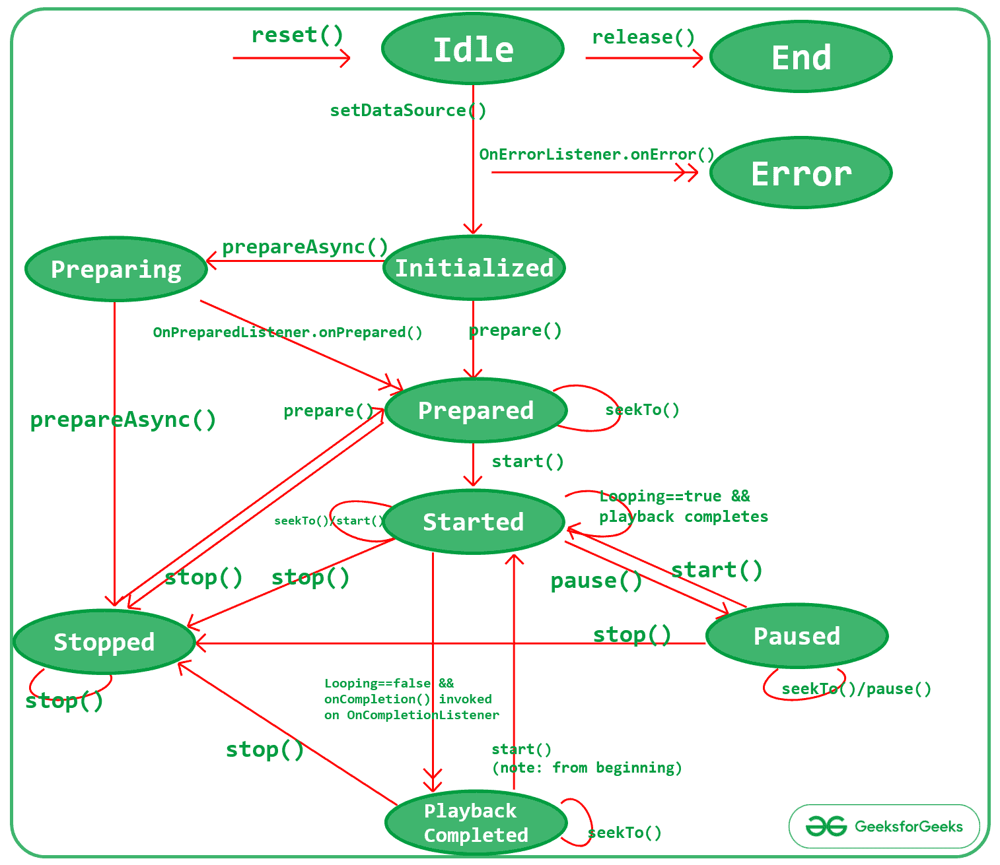
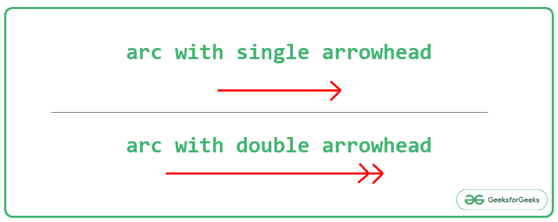
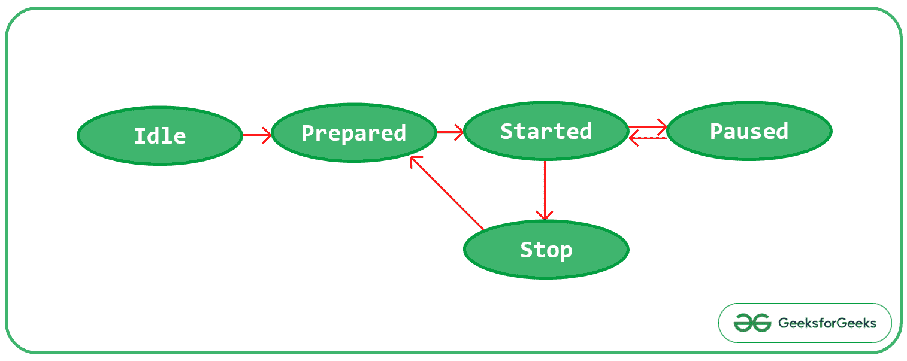
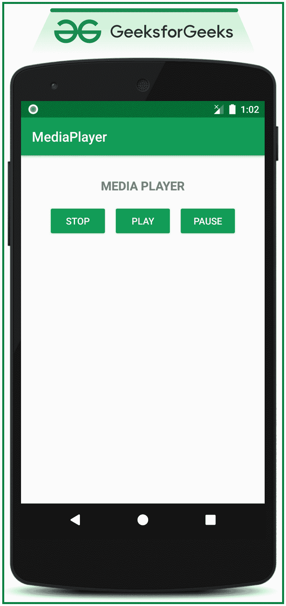

# 安卓中的 MediaPlayer 类

> 原文:[https://www.geeksforgeeks.org/mediaplayer-class-in-android/](https://www.geeksforgeeks.org/mediaplayer-class-in-android/)

**安卓中的 MediaPlayer 类**用于播放媒体文件。那些是音频和视频文件。它还可以用于通过网络播放音频或视频流。所以在这篇文章中，讨论的事情是:

*   媒体播放器状态图
*   使用 MediaPlayer 应用编程接口创建一个简单的音频播放器。请看下图。注意，我们将使用 **Kotlin** 语言来实现这个项目。



## **媒体播放器类状态图**

*   使用 MediaPlayer 播放音频或视频文件是使用状态机完成的。
*   下图是 MediaPlayer 状态图。



*   在上面的 MediaPlayer 状态图中，椭圆形代表 MediaPlayer 实例所在的状态。


*   状态图中显示了两种类型的弧。一个带单箭头的表示 MediaPlayer 实例的同步方法调用，一个带双箭头的表示异步调用。



*   发布方法是媒体播放器应用编程接口中的重要元素之一。这有助于在不再需要时释放分配给媒体播放器实例的内存资源。参考[如何在安卓中清除或释放音频资源？](https://www.geeksforgeeks.org/how-to-clear-or-release-audio-resources-in-android/)了解 Mediaplayer 分配的内存如何释放。以便相应地进行内存管理。
*   如果使用 Mediaplayer 实例调用 stop()方法，则需要为下一次播放做好准备。
*   可以使用 **seekTo()** 方法将 MediaPlayer 移动到特定时间位置，以便 MediaPlayer 实例可以从该指定位置继续播放音频或视频回放。
*   音频播放的焦点应该使用文章[中讨论的 AudioManager 服务进行相应的管理如何在 Android 中管理音频焦点？](https://www.geeksforgeeks.org/how-to-manage-audio-focus-in-android/)。
*   下图是 MediaPlayer 状态图的摘要版本。



## **在安卓中创建简单 MediaPlayer 的步骤**

**第一步:创建一个空的活动项目**

*   创建一个空的活动安卓工作室项目。并选择 **Kotlin** 作为编程语言。
*   参考[安卓|如何在安卓工作室创建/启动新项目？](https://www.geeksforgeeks.org/android-how-to-create-start-a-new-project-in-android-studio/)了解如何创建一个空的活动 Android Studio 项目。

**步骤 2:创建原始资源文件夹**

*   在 **res** 文件夹下创建一个**原始**资源文件夹，并复制一个. mp3 文件扩展名。

<video class="wp-video-shortcode" id="video-527649-1" width="640" height="360" preload="metadata" controls=""><source type="video/mp4" src="https://media.geeksforgeeks.org/wp-content/uploads/20201214145207/Untitled-Project.mp4?_=1">[https://media.geeksforgeeks.org/wp-content/uploads/20201214145207/Untitled-Project.mp4](https://media.geeksforgeeks.org/wp-content/uploads/20201214145207/Untitled-Project.mp4)</video>

**步骤 3:使用 activity_main.xml 文件**

*   应用程序的布局主要由三个按钮 PLAY、PAUSE 和 STOP 组成，用于控制 MediaPlayer 实例的状态。
*   在 **activity_main.xml** 文件中调用以下代码实现 UI。

## 可扩展标记语言

```
<?xml version="1.0" encoding="utf-8"?>
<RelativeLayout
    xmlns:android="http://schemas.android.com/apk/res/android"
    xmlns:tools="http://schemas.android.com/tools"
    android:layout_width="match_parent"
    android:layout_height="match_parent"
    tools:context=".MainActivity"
    tools:ignore="HardcodedText">

    <TextView
        android:id="@+id/headingText"
        android:layout_width="wrap_content"
        android:layout_height="wrap_content"
        android:layout_centerHorizontal="true"
        android:layout_marginTop="32dp"
        android:text="MEDIA PLAYER"
        android:textSize="18sp"
        android:textStyle="bold" />

    <LinearLayout
        android:layout_width="match_parent"
        android:layout_height="wrap_content"
        android:layout_below="@id/headingText"
        android:layout_marginTop="16dp"
        android:gravity="center_horizontal">

        <Button
            android:id="@+id/stopButton"
            android:layout_width="wrap_content"
            android:layout_height="wrap_content"
            android:layout_marginEnd="8dp"
            android:backgroundTint="@color/colorPrimary"
            android:text="STOP"
            android:textColor="@android:color/white" />

        <Button
            android:id="@+id/playButton"
            android:layout_width="wrap_content"
            android:layout_height="wrap_content"
            android:layout_marginEnd="8dp"
            android:backgroundTint="@color/colorPrimary"
            android:text="PLAY"
            android:textColor="@android:color/white" />

        <Button
            android:id="@+id/pauseButton"
            android:layout_width="wrap_content"
            android:layout_height="wrap_content"
            android:backgroundTint="@color/colorPrimary"
            android:text="PAUSE"
            android:textColor="@android:color/white" />

    </LinearLayout>

</RelativeLayout>
```

**输出 UI:**



**第 4 步:使用 MainActivity.kt 文件**

*   MediaPlayer 实例需要在播放任何音频或视频文件之前设置的属性。
*   在 **MainActivity.kt** 文件中调用以下内容。添加注释是为了更好地理解。

## 我的锅

```
import android.media.MediaPlayer
import androidx.appcompat.app.AppCompatActivity
import android.os.Bundle
import android.widget.Button

class MainActivity : AppCompatActivity() {

    override fun onCreate(savedInstanceState: Bundle?) {
        super.onCreate(savedInstanceState)
        setContentView(R.layout.activity_main)

        // create an instance of mediplayer for audio playback
        val mediaPlayer: MediaPlayer = MediaPlayer.create(applicationContext, R.raw.music)

        // register all the buttons using their appropriate IDs
        val bPlay: Button = findViewById(R.id.playButton)
        val bPause: Button = findViewById(R.id.pauseButton)
        val bStop: Button = findViewById(R.id.stopButton)

        // handle the start button to
          // start the audio playback
        bPlay.setOnClickListener {
            // start method is used to start
              // playing the audio file
            mediaPlayer.start()
        }

        // handle the pause button to put the
        // MediaPlayer instance at the Pause state
        bPause.setOnClickListener {
            // pause() method can be used to
            // pause the mediaplyer instance
            mediaPlayer.pause()
        }

        // handle the stop button to stop playing
        // and prepare the mediaplayer instance
        // for the next instance of play
        bStop.setOnClickListener {
            // stop() method is used to completely
            // stop playing the mediaplayer instance
            mediaPlayer.stop()

            // after stopping the mediaplayer instance
            // it is again need to be prepared
            // for the next instance of playback
            mediaPlayer.prepare()
        }
    }
}
```

### **输出:在仿真器上运行**

<video class="wp-video-shortcode" id="video-527649-2" width="640" height="360" preload="metadata" controls=""><source type="video/mp4" src="https://media.geeksforgeeks.org/wp-content/uploads/20201214133942/Untitled-Project.mp4?_=2">[https://media.geeksforgeeks.org/wp-content/uploads/20201214133942/Untitled-Project.mp4](https://media.geeksforgeeks.org/wp-content/uploads/20201214133942/Untitled-Project.mp4)</video>