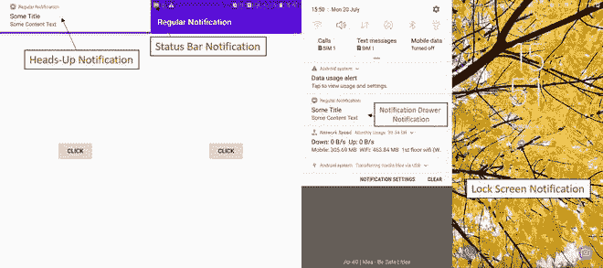

# 安卓通知，示例

> 原文:[https://www.geeksforgeeks.org/notifications-in-kotlin/](https://www.geeksforgeeks.org/notifications-in-kotlin/)

**通知**是安卓用户界面元素中可见或可用的一种消息、警报或应用程序状态(可能在后台运行)。该应用程序可能正在后台运行，但用户没有使用。通知的目的是通知用户由用户或系统在应用程序中启动的进程。这篇文章可以帮助那些努力为发展目的创建通知的人。

通知可以是各种格式和设计，这取决于开发人员。一般来说，人们一定目睹了这四种类型的通知:

1.  状态栏通知(显示在与当前时间、电池百分比相同的布局中)
2.  通知抽屉通知(出现在下拉菜单中)
3.  抬头通知(出现在覆盖屏幕上，例如:Whatsapp 通知、OTP 消息)
4.  锁屏通知(我猜你知道)



在本文中，我们将讨论如何在 **Kotlin** 中生成通知。

### 逐步实施

**第一步:创建新项目**

要在安卓工作室创建新项目，请参考[如何在安卓工作室创建/启动新项目](https://www.geeksforgeeks.org/android-how-to-create-start-a-new-project-in-android-studio/)。注意选择**科特林**作为编程语言。

**步骤 2:使用 activity_main.xml 文件**

转到 **activity_main.xml** 文件，参考以下代码。在这一步中，我们将设计布局页面。在这里，我们将使用 RelativeLayout 从 Kotlin 文件中获取滚动视图。下面是 **activity_main.xml** 文件的代码。

## 可扩展标记语言

```
<?xml version="1.0" encoding="utf-8"?>
<RelativeLayout
    xmlns:android="http://schemas.android.com/apk/res/android"
    xmlns:tools="http://schemas.android.com/tools"
    android:layout_width="match_parent"
    android:layout_height="match_parent"
    tools:context=".MainActivity">

    <Button
        android:id="@+id/btn"
        android:layout_width="wrap_content"
        android:layout_height="wrap_content"
        android:layout_centerInParent="true"
        android:text="Send Notification" />

</RelativeLayout>
```

**第三步:创建一个新的空活动**

> **参考文章:** [如何使用快捷键在 Android Studio 中创建构造函数、Getter/Setter 方法和新活动？](How to Create Constructor, Getter/Setter Methods and New Activity in Android Studio using Shortcuts?)

将活动命名为**通知后**。当有人点击通知时，此活动将在我们的应用程序中打开，即用户将被重定向到此页面。下面是**activity _ after _ notification . XML**文件的代码。

## 可扩展标记语言

```
<?xml version="1.0" encoding="utf-8"?>
<RelativeLayout
    xmlns:android="http://schemas.android.com/apk/res/android"
    xmlns:tools="http://schemas.android.com/tools"
    android:layout_width="match_parent"
    android:layout_height="match_parent"
    tools:context=".afterNotification">

    <TextView
        android:id="@+id/textView"
        android:layout_width="wrap_content"
        android:layout_height="wrap_content"
        android:layout_centerInParent="true"
        android:text="Welcome To GeeksforGeeks"
        android:textSize="15sp"
        android:textStyle="bold" />

</RelativeLayout>
```

> **注 1** ***:*** 如果不配置通知通道，就无法为安卓 API > =26 的应用构建通知。对他们来说，生成通知通道是强制性的。带 API < 26 的应用不需要通知通道，只需要通知构建器。每个通道都应该有一个特定的行为，适用于作为其一部分的所有通知。因此，每个频道都有一个频道标识，该标识基本上作为该频道的唯一标识符，如果用户想要区分特定的通知频道，这将是有用的。相比之下，通知构建器提供了一种便捷的方式来设置通知的各个字段，并使用平台的通知布局模板生成内容视图，但无法针对特定的通知渠道。

> ***注 2:*** 如果您在此之前参考过任何其他文档或任何其他博客，您可能会注意到他们呼吁实现以下依赖关系***【com . Android . support:support-compat:28 . 0 . 0】***。我个人经历的是，没有必要去执行它，没有这个事情也会走得很远很好。

**步骤 5:使用 MainActivity.kt 文件**

转到 **MainActivity.kt** 文件，参考以下代码。下面是 **MainActivity.kt** 文件的代码。代码中添加了注释，以更详细地理解代码。

## 我的锅

```
import android.app.Notification
import android.app.NotificationChannel
import android.app.NotificationManager
import android.app.PendingIntent
import android.content.Context
import android.content.Intent
import android.graphics.BitmapFactory
import android.graphics.Color
import android.os.Build
import android.os.Bundle
import android.widget.Button
import android.widget.RemoteViews
import androidx.appcompat.app.AppCompatActivity

class MainActivity : AppCompatActivity() {

    // declaring variables
    lateinit var notificationManager: NotificationManager
    lateinit var notificationChannel: NotificationChannel
    lateinit var builder: Notification.Builder
    private val channelId = "i.apps.notifications"
    private val description = "Test notification"

    override fun onCreate(savedInstanceState: Bundle?) {
        super.onCreate(savedInstanceState)
        setContentView(R.layout.activity_main)

        // accessing button
        val btn = findViewById<Button>(R.id.btn)

        // it is a class to notify the user of events that happen.
        // This is how you tell the user that something has happened in the
        // background.
        notificationManager = getSystemService(Context.NOTIFICATION_SERVICE) as NotificationManager

        // onClick listener for the button
        btn.setOnClickListener {

            // pendingIntent is an intent for future use i.e after
            // the notification is clicked, this intent will come into action
            val intent = Intent(this, afterNotification::class.java)

            // FLAG_UPDATE_CURRENT specifies that if a previous
            // PendingIntent already exists, then the current one
            // will update it with the latest intent
            // 0 is the request code, using it later with the
            // same method again will get back the same pending
            // intent for future reference
            // intent passed here is to our afterNotification class
            val pendingIntent = PendingIntent.getActivity(this, 0, intent, PendingIntent.FLAG_UPDATE_CURRENT)

            // RemoteViews are used to use the content of
            // some different layout apart from the current activity layout
            val contentView = RemoteViews(packageName, R.layout.activity_after_notification)

            // checking if android version is greater than oreo(API 26) or not
            if (Build.VERSION.SDK_INT >= Build.VERSION_CODES.O) {
                notificationChannel = NotificationChannel(channelId, description, NotificationManager.IMPORTANCE_HIGH)
                notificationChannel.enableLights(true)
                notificationChannel.lightColor = Color.GREEN
                notificationChannel.enableVibration(false)
                notificationManager.createNotificationChannel(notificationChannel)

                builder = Notification.Builder(this, channelId)
                        .setContent(contentView)
                        .setSmallIcon(R.drawable.ic_launcher_background)
                        .setLargeIcon(BitmapFactory.decodeResource(this.resources, R.drawable.ic_launcher_background))
                        .setContentIntent(pendingIntent)
            } else {

                builder = Notification.Builder(this)
                        .setContent(contentView)
                        .setSmallIcon(R.drawable.ic_launcher_background)
                        .setLargeIcon(BitmapFactory.decodeResource(this.resources, R.drawable.ic_launcher_background))
                        .setContentIntent(pendingIntent)
            }
            notificationManager.notify(1234, builder.build())
        }
    }
}
```

至此，我们已经成功地为我们的应用程序创建了一个“通知”。请注意，上面代码中列出的参数是必需的，缺少任何单个参数都可能导致应用程序崩溃或无法启动。内容标题、内容文本、小图标是可定制的参数，但也是强制性的。人们可以根据需要改变他们的价值观。

### 输出:

<video class="wp-video-shortcode" id="video-358581-1" width="640" height="360" preload="metadata" controls=""><source type="video/mp4" src="https://media.geeksforgeeks.org/wp-content/uploads/20191104235951/noti.mp4?_=1">[https://media.geeksforgeeks.org/wp-content/uploads/20191104235951/noti.mp4](https://media.geeksforgeeks.org/wp-content/uploads/20191104235951/noti.mp4)</video>