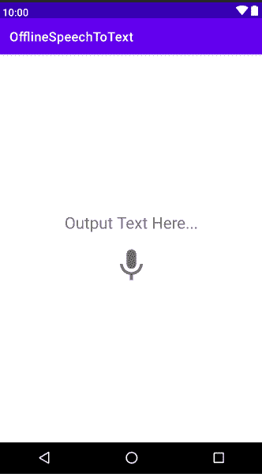

# 安卓系统下离线语音转文本无弹出对话框

> 原文:[https://www . geesforgeks . org/offline-无任何弹出对话框的语音转文本/Android/](https://www.geeksforgeeks.org/offline-speech-to-text-without-any-popup-dialog-in-android/)

在这个方法中，我们将在我们的项目中实现一个离线语音到文本的功能。它可以在线和离线工作。当没有互联网连接时，它会使用我们移动设备中预先存储的语言模型，因此它识别不太清楚，但给出了良好的结果。当它在线时，它能正确识别所有单词。注意，我们将使用 **Kotlin** 语言来实现这个项目。

> **注意:**离线方式在那些 API 版本小于 23 的设备上无法工作。

### 逐步实施

**第一步:创建新项目**

要在安卓工作室创建新项目，请参考[如何在安卓工作室创建/启动新项目](https://www.geeksforgeeks.org/android-how-to-create-start-a-new-project-in-android-studio/)。注意，选择 **科特林** 作为编程语言。

**第二步:添加权限**

要访问移动设备麦克风，我们必须在我们的 *AndroidManifest.xml* 文件中添加 **RECORD_AUDIO** 权限，如下所示:

**第三步:修改 colors.xml 文件**

在 **colors.xml** 文件中添加下面的行。

> <color name="”mic_enabled_color”">#0E87E7</color>
> 
> <color name="”mic_disabled_color”">#6D6A6A</color>

**第 4 步:使用 activity_main.xml 文件**

转到 **activity_main.xml** 文件，参考以下代码。下面是 **activity_main.xml** 文件的代码。

## 可扩展标记语言

```kt
<?xml version="1.0" encoding="utf-8"?>
<LinearLayout 
    xmlns:android="http://schemas.android.com/apk/res/android"
    xmlns:app="http://schemas.android.com/apk/res-auto"
    xmlns:tools="http://schemas.android.com/tools"
    android:layout_width="match_parent"
    android:layout_height="match_parent"
    android:gravity="center"
    android:orientation="vertical"
    tools:context=".MainActivity">

    <TextView
        android:id="@+id/speak_output_tv"
        android:layout_width="wrap_content"
        android:layout_height="wrap_content"
        android:layout_marginHorizontal="20dp"
        android:text="Output Text Here..."
        android:textAlignment="center"
        android:textSize="25sp" />

    <ImageView
        android:id="@+id/mic_speak_iv"
        android:layout_width="60dp"
        android:layout_height="60dp"
        android:layout_marginTop="20dp"
        android:src="@drawable/ic_mic"
        app:tint="@color/mic_disabled_color" />

</LinearLayout>
```

**输出 UI:**



**步骤 5:使用 MainActivity.kt 文件**

转到 **MainActivity.kt** 文件，参考以下代码。

**检查音频权限:**

首先，我们需要允许应用程序访问麦克风权限。该功能将检查应用程序是否能够访问麦克风权限。如果未授予许可，它将直接打开设置，用户可以从那里手动允许麦克风许可。对于较低的 API 版本，即低于 23，不支持这种离线语音到文本的转换，因此这里我们首先使用 **Build 检查移动 API 版本。版本. SDK_INT，**和这里的*构建。版本代码。M* 将返回 M 的常数值，即 23。用您的包名替换代码中的包名(您可以从**和**文件中找到您的包名)

## 我的锅

```kt
private fun checkAudioPermission() {
        if(Build.VERSION.SDK_INT >= Build.VERSION_CODES.M) {  // M = 23
            if(ContextCompat.checkSelfPermission(this, "android.permission.RECORD_AUDIO") != PackageManager.PERMISSION_GRANTED) {
                // this will open settings which asks for permission
                val intent = Intent(Settings.ACTION_APPLICATION_DETAILS_SETTINGS, Uri.parse("package:com.programmingtech.offlinespeechtotext"))
                startActivity(intent)
                Toast.makeText(this, "Allow Microphone Permission", Toast.LENGTH_SHORT).show()
            }
      }
}
```

**处理语音到文本的功能:**

这是我们处理语音的项目的主要功能。我们首先要创建一个当前[上下文](https://www.geeksforgeeks.org/what-is-context-in-android/)的**speechecognizer**类的对象，即 ***这个*** (如果我们在那里使用任何[片段](https://www.geeksforgeeks.org/introduction-fragments-android/)、 [AlertDialog](https://www.geeksforgeeks.org/android-alert-dialog-box-and-how-to-create-it/) 等，我们可以用 ***上下文*** 替换 ***这个*** )。然后我们必须创建一个意图并将 *EXTRA_LANGUAGE_MODEL* 和*LANGUAGE _ MODEL _ FREE _ FORM*附加到该意图上。在**set recognitionlistener()**方法中，我们必须覆盖如下所有必要的函数。为了得到语音结果，我们必须使用 **onResults()** 方法并存储从 Bundle 输出的数组列表。第一个索引处的元素将给出语音输出。我们也可以使用一些有用的函数，比如在开始监听之前先运行的**onbeginingofspeech()**和在结果之后运行的 **onEndOfSpeech()** 。

## 我的锅

```kt
private fun startSpeechToText() {
        val speechRecognizer = SpeechRecognizer.createSpeechRecognizer(this)
        val speechRecognizerIntent = Intent(RecognizerIntent.ACTION_RECOGNIZE_SPEECH)
        speechRecognizerIntent.putExtra(
            RecognizerIntent.EXTRA_LANGUAGE_MODEL,
            RecognizerIntent.LANGUAGE_MODEL_FREE_FORM
        )
        speechRecognizerIntent.putExtra(RecognizerIntent.EXTRA_LANGUAGE, Locale.getDefault())

        speechRecognizer.setRecognitionListener(object : RecognitionListener {
            override fun onReadyForSpeech(bundle: Bundle?) {}
            override fun onBeginningOfSpeech() {}
            override fun onRmsChanged(v: Float) {}
            override fun onBufferReceived(bytes: ByteArray?) {}
            override fun onEndOfSpeech() {}
            override fun onError(i: Int) {}

            override fun onResults(bundle: Bundle) {
                val result = bundle.getStringArrayList(SpeechRecognizer.RESULTS_RECOGNITION)
                if (result != null) {
                    // result[0] will give the output of speech
                }
            }            
            override fun onPartialResults(bundle: Bundle) {}
            override fun onEvent(i: Int, bundle: Bundle?) {}
        })      
        // starts listening ...
        speechRecognizer.startListening(speechRecognizerIntent) 
}
```

以下是 **MainActivity.kt** 文件的最终代码。代码中添加了注释，以更详细地理解代码。

## 我的锅

```kt
import android.content.Intent
import android.content.pm.PackageManager
import android.net.Uri
import android.os.Build
import android.os.Bundle
import android.provider.Settings
import android.speech.RecognitionListener
import android.speech.RecognizerIntent
import android.speech.SpeechRecognizer
import android.widget.ImageView
import android.widget.TextView
import android.widget.Toast
import androidx.appcompat.app.AppCompatActivity
import androidx.core.content.ContextCompat
import java.util.*

class MainActivity : AppCompatActivity() {

    private lateinit var micIV: ImageView
    private lateinit var outputTV: TextView

    override fun onCreate(savedInstanceState: Bundle?) {
        super.onCreate(savedInstanceState)
        setContentView(R.layout.activity_main)

        micIV = findViewById(R.id.mic_speak_iv)
        outputTV = findViewById(R.id.speak_output_tv)

        micIV.setOnClickListener {
            checkAudioPermission()
            // changing the color of mic icon, which 
            // indicates that it is currently listening
            micIV.setColorFilter(ContextCompat.getColor(this, R.color.mic_enabled_color)) // #FF0E87E7
            startSpeechToText()
        }
    }

    private fun startSpeechToText() {
        val speechRecognizer = SpeechRecognizer.createSpeechRecognizer(this)
        val speechRecognizerIntent = Intent(RecognizerIntent.ACTION_RECOGNIZE_SPEECH)
        speechRecognizerIntent.putExtra(
                RecognizerIntent.EXTRA_LANGUAGE_MODEL,
                RecognizerIntent.LANGUAGE_MODEL_FREE_FORM
        )
        speechRecognizerIntent.putExtra(RecognizerIntent.EXTRA_LANGUAGE, Locale.getDefault())

        speechRecognizer.setRecognitionListener(object : RecognitionListener {
            override fun onReadyForSpeech(bundle: Bundle?) {}
            override fun onBeginningOfSpeech() {}
            override fun onRmsChanged(v: Float) {}
            override fun onBufferReceived(bytes: ByteArray?) {}
            override fun onEndOfSpeech() {
                // changing the color of our mic icon to
                // gray to indicate it is not listening
                micIV.setColorFilter(ContextCompat.getColor(applicationContext, R.color.mic_disabled_color)) // #FF6D6A6A
            }

            override fun onError(i: Int) {}

            override fun onResults(bundle: Bundle) {
                val result = bundle.getStringArrayList(SpeechRecognizer.RESULTS_RECOGNITION)
                if (result != null) {
                    // attaching the output 
                    // to our textview
                    outputTV.text = result[0] 
                }
            }

            override fun onPartialResults(bundle: Bundle) {}
            override fun onEvent(i: Int, bundle: Bundle?) {}

        })
        speechRecognizer.startListening(speechRecognizerIntent)
    }

    private fun checkAudioPermission() {
        if (Build.VERSION.SDK_INT >= Build.VERSION_CODES.M) {  // M = 23
            if (ContextCompat.checkSelfPermission(this, "android.permission.RECORD_AUDIO") != PackageManager.PERMISSION_GRANTED) {
                val intent = Intent(Settings.ACTION_APPLICATION_DETAILS_SETTINGS, Uri.parse("package:com.programmingtech.offlinespeechtotext"))
                startActivity(intent)
                Toast.makeText(this, "Allow Microphone Permission", Toast.LENGTH_SHORT).show()
            }
        }
    }
}
```

### 输出:在物理设备上运行

<video class="wp-video-shortcode" id="video-534721-1" width="640" height="360" preload="metadata" controls=""><source type="video/mp4" src="https://media.geeksforgeeks.org/wp-content/uploads/20201226004943/New-video.mp4?_=1">[https://media.geeksforgeeks.org/wp-content/uploads/20201226004943/New-video.mp4](https://media.geeksforgeeks.org/wp-content/uploads/20201226004943/New-video.mp4)</video>