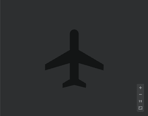
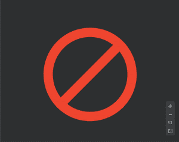
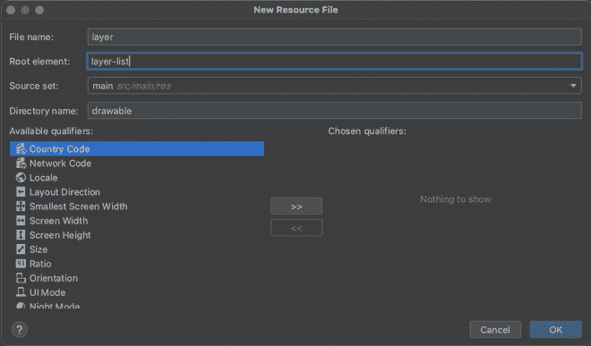

# 在安卓单个图像视图中叠加多个图像

> 原文:[https://www . geesforgeks . org/overlay-多图合一-安卓中的 imageview/](https://www.geeksforgeeks.org/overlay-multiple-images-in-a-single-imageview-in-android/)

在安卓系统中，一个图像可以显示在布局中的[图像视图](https://www.geeksforgeeks.org/imageview-in-android-with-example/)中。ImageView 一次只接受一个图像作为输入。但是，可能需要在同一个 ImageView 中显示两个或多个图像。假设，我们的应用程序显示了飞机模式的状态。当启用飞机模式时，它必须显示飞机的图像，而当禁用时，它必须用类似十字或块状符号的东西覆盖同一图像。由于 ImageView 只接受一个输入源，因此不可能将两个图像设置为源。因此，在这种情况下，我们必须创建一个由图像列表组成的资源，并将该资源设置为 ImageView 的源属性。因此，通过本文，我们将向您展示如何创建包含多个图像的资源，并在 ImageView 中设置它。

### 逐步实施

**第一步:在安卓工作室新建项目**

要在安卓工作室创建新项目，请参考[如何在安卓工作室创建/启动新项目](https://www.geeksforgeeks.org/android-how-to-create-start-a-new-project-in-android-studio/)。我们在 **Kotlin** 中演示了该应用程序，因此在创建新项目时，请确保选择 Kotlin 作为主要语言。

**第二步:在可绘制文件夹**中导入您选择的图像

我们从本地剪贴画导入了两个矢量资源。将它们存储在可绘制文件夹中。



可牵引/IC _ 飞机



可绘制/ic_block

**参考本文:** [如何在 Android Studio 中给可绘制文件夹添加图片？](https://www.geeksforgeeks.org/how-to-add-image-to-drawable-folder-in-android-studio/)

**步骤 3:创建一个以根元素为图层列表的可绘制资源文件**

在可绘制文件夹内创建一个可绘制资源文件，将根元素作为图层列表。给它起一个像图层一样的名字。生成的文件扩展名为 XML。



**第四步:将项目(导入的图像)添加到 layer.xml**

以下一个项目与前一个项目重叠的方式添加项目。

## 可扩展标记语言

```kt
<?xml version="1.0" encoding="utf-8"?>
<layer-list xmlns:android="http://schemas.android.com/apk/res/android">

    <!-- Any number of images of our choice -->
    <item android:drawable="@drawable/ic_airplane"/>
    <item android:drawable="@drawable/ic_block"/>

</layer-list>
```

**第 5 步:使用 activity_main.xml 文件**

导航到**应用程序> res >布局> activity_main.xml** 并将下面的代码添加到该文件中。下面是 **activity_main.xml** 文件的代码。在布局文件中添加 ImageView 和一个按钮。单击按钮后，ImageView 将显示图层列表。

## 可扩展标记语言

```kt
<?xml version="1.0" encoding="utf-8"?>
<RelativeLayout
    xmlns:android="http://schemas.android.com/apk/res/android"
    xmlns:app="http://schemas.android.com/apk/res-auto"
    xmlns:tools="http://schemas.android.com/tools"
    android:layout_width="match_parent"
    android:layout_height="match_parent"
    tools:context=".MainActivity">

    <!-- ImageView to display multiple images -->
    <ImageView
        android:id="@+id/imageView"
        android:layout_width="300sp"
        android:layout_height="300sp"
        android:layout_centerInParent="true"
        android:background="#0f9d58"/>

    <!-- A button to load the images in the ImageView -->
    <Button
        android:id="@+id/button"
        android:layout_below="@id/imageView"
        android:layout_width="wrap_content"
        android:layout_height="wrap_content"
        android:text="Overlay"
        android:layout_centerHorizontal="true"/>

</RelativeLayout>
```

**第 6 步:使用**T2【主活动. kt】文件

转到 **MainActivity.kt** 文件，参考以下代码。下面是 **MainActivity.kt** 文件的代码。代码中添加了注释，以更详细地理解代码。

## 我的锅

```kt
import androidx.appcompat.app.AppCompatActivity
import android.os.Bundle
import android.widget.Button
import android.widget.ImageView

class MainActivity : AppCompatActivity() {
    override fun onCreate(savedInstanceState: Bundle?) {
        super.onCreate(savedInstanceState)
        setContentView(R.layout.activity_main)

        // Declaring and Initializing
        // ImageView and Button from the layout
        val mImageView = findViewById<ImageView>(R.id.imageView)
        val mButton = findViewById<Button>(R.id.button)

        // When button is clicked
        mButton.setOnClickListener {

            // Set the drawable resource file
            // (layer-list of images) in the ImageView
            mImageView.setImageResource(R.drawable.layer)
        }
    }
}
```

**输出:**

我们可以看到，当我们点击覆盖按钮时，图像视图被设置为两个图像，一个重叠另一个。

<video class="wp-video-shortcode" id="video-659030-1" width="640" height="360" preload="metadata" controls=""><source type="video/mp4" src="https://media.geeksforgeeks.org/wp-content/uploads/20210803103356/35.mp4?_=1">[https://media.geeksforgeeks.org/wp-content/uploads/20210803103356/35.mp4](https://media.geeksforgeeks.org/wp-content/uploads/20210803103356/35.mp4)</video>