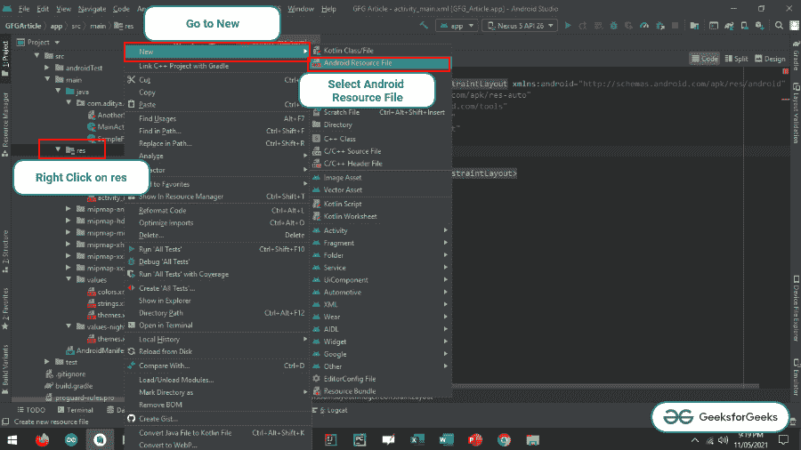

# 安卓架构组件导航概述

> 原文:[https://www . geeksforgeeks . org/Android 架构组件导航概述/](https://www.geeksforgeeks.org/overview-of-navigation-in-android-architecture-components/)

移动开发中的导航基本上是指应用程序中不同屏幕或内容片段之间的交互。安卓喷气背包的架构组件导航非常强大，提供了一致和可预测的用户体验。导航组件通过简单的按钮点击来帮助实现应用程序中活动和数据片段或数据块之间的导航。在本文中，讨论了从导航键属性到实现片段之间的示例导航。

**导航的三个关键属性是:**

1.  **导航图:**这是一个包含所有独立内容区域的 XML 文件，位于称为目的地的应用程序中。这些可能是用户通过应用程序可能采取的路径。
2.  **导航主机:**这是一个 XML 文件，它是一个空容器，在用户导航时显示目的地。这基本上包含了导航图中显示各种目的地的导航片段。
3.  **nav controller:**nav controller 是一个用 NavHost 管理目的地导航的对象。当用户通过应用程序在目的地导航时，这会控制目的地内容的交换。

**开发人员从导航组件获得的好处有:**

*   导航组件处理片段事务。
*   处理上升和后退动作，基本上是处理后退。
*   在切换导航主机的内容时，提供标准化的动画和过渡。
*   易于处理和实现深度链接。
*   导航用户界面模式的简单处理和实现，如导航抽屉或底部导航视图等。
*   安全参数，一个提供目标之间类型安全数据传输的 Gradle 插件。
*   导航组件也支持视图模型。可以将视图模型扩展到导航图，以在目的地之间共享相关的用户界面。

### **导航组件入门**

> **注意:**导航组件需要 Android Studio 或以上版本

**第一步:创建一个空的活动项目**

创建一个空的安卓工作室活动项目。并选择 **Kotlin** 作为编程语言。[安卓|如何在安卓工作室创建/启动新项目？](https://www.geeksforgeeks.org/android-how-to-create-start-a-new-project-in-android-studio/)。

**步骤 2:添加所需的依赖关系**

下面是依赖项，需要在应用程序级的 Gradle 文件中调用。

> // nav_version 可能会有所不同
> 
> def nav_version = "2.3.5 "
> 
> //导航组件
> 
> 实现“androidx . navigation:navigation-fragment-ktx:$ nav _ version”
> 
> 实现“androidx . navigation:navigation-ui-ktx:$ nav _ version”
> 
> 实现“androidx . navigation:navigation-dynamic-features-fragment:$ nav _ version”
> 
> androidTestImplementation " androidx . navigation:navigation-testing:$ nav _ version "

在应用级渐变文件中添加以下插件:

> id " andidx . navigation . safeargs . kot Lin "

下面是需要在项目级或顶级渐变文件的依赖项中调用的类路径。

> // nav_version 可能会有所不同
> 
> def nav_version = "2.3.5 "
> 
> 类路径 andidx . navigation:navigation safe args gradle 插件:$nav_version

**第三步:创建导航组件的第一个属性**

创建包含所有目的地的导航组件图。要创建导航图 XML 文件“**右键单击 res 文件夹- >转到新建- >并选择安卓资源文件”。**下图演示了该步骤。



现在将主片段的名称命名为 navigation _ graphs，并选择资源类型作为 navigation，然后单击“确定”按钮。下图演示了这一步骤。


现在通过点击编辑器中显示的+图标创建一个新的片段，选择“创建新的目的地”，然后空白片段，然后点击下一步。现在将片段名命名为 fragment_1。下面的视频演示了这一步骤

<video class="wp-video-shortcode" id="video-603747-1" width="640" height="360" preload="metadata" controls=""><source type="video/mp4" src="https://media.geeksforgeeks.org/wp-content/uploads/20210511213959/Untitled.mp4?_=1">[https://media.geeksforgeeks.org/wp-content/uploads/20210511213959/Untitled.mp4](https://media.geeksforgeeks.org/wp-content/uploads/20210511213959/Untitled.mp4)</video>

现在按照上一步创建另一个名为 fragment_2 的片段。现在将导航按钮添加到 fragment_1.xml 文件中，就像单击它时导航到 fragment_2 一样。要实现用户界面，在**片段 _1.xml** 文件中调用以下代码。

## 可扩展标记语言

```
<?xml version="1.0" encoding="utf-8"?>
<RelativeLayout 
    xmlns:android="http://schemas.android.com/apk/res/android"
    xmlns:tools="http://schemas.android.com/tools"
    android:layout_width="match_parent"
    android:layout_height="match_parent"
    tools:context=".fragment_1"
    tools:ignore="HardcodedText">

    <TextView
        style="@style/TextAppearance.MaterialComponents.Headline6"
        android:layout_width="wrap_content"
        android:layout_height="wrap_content"
        android:layout_above="@id/navigate_button"
        android:layout_centerHorizontal="true"
        android:text="This is Fragment 1" />

    <Button
        android:id="@+id/navigate_button"
        android:layout_width="wrap_content"
        android:layout_height="wrap_content"
        android:layout_centerInParent="true"
        android:text="NAVIGATE TO FRAGMENT 2" />

</RelativeLayout>
```

现在为了区分，还要在 fragment_2.xml 文件中进行 UI 更改。要实现更改，请调用**片段 _2.xml** 文件中的以下内容。

## 可扩展标记语言

```
<?xml version="1.0" encoding="utf-8"?>
<RelativeLayout 
    xmlns:android="http://schemas.android.com/apk/res/android"
    xmlns:tools="http://schemas.android.com/tools"
    android:layout_width="match_parent"
    android:layout_height="match_parent"
    tools:context=".fragment_2"
    tools:ignore="HardcodedText">

    <TextView
        style="@style/TextAppearance.MaterialComponents.Headline6"
        android:layout_width="wrap_content"
        android:layout_height="wrap_content"
        android:layout_centerInParent="true"
        android:text="This is Fragment 2" />

</RelativeLayout>
```

**第四步:添加动作从片段 1 导航到片段 2**

从设计部分下的 navigation _ graphs.xml 中，将箭头从片段 1 拖放到片段 2。然后**弹出**片段 1，因为当用户点击后退按钮时，用户需要被导航到片段 1。如果无法完成此步骤，请参考以下视频。

**弹出**如果用户按下后退按钮，将片段从后退弹出到指定的片段。

<video class="wp-video-shortcode" id="video-603747-2" width="640" height="360" preload="metadata" controls=""><source type="video/mp4" src="https://media.geeksforgeeks.org/wp-content/uploads/20210511215234/Untitled1.mp4?_=2">[https://media.geeksforgeeks.org/wp-content/uploads/20210511215234/Untitled1.mp4](https://media.geeksforgeeks.org/wp-content/uploads/20210511215234/Untitled1.mp4)</video>

**第五步:处理片段 1** 的按钮点击

处理从片段 1 点击按钮导航到片段 2。要实现相同的功能，请调用**片段 _1.kt** 文件中的以下代码。

## 我的锅

```
import android.os.Bundle
import androidx.fragment.app.Fragment
import android.view.LayoutInflater
import android.view.View
import android.view.ViewGroup
import android.widget.Button
import androidx.navigation.fragment.findNavController

class fragment_1 : Fragment() {

    override fun onCreateView(
        inflater: LayoutInflater, container: ViewGroup?,
        savedInstanceState: Bundle?
    ): View {
        // Inflate the layout for this fragment
        val view: View = inflater.inflate(R.layout.fragment_1, container, false)

        // create instance of navigate button
        val navigateButton: Button = view.findViewById(R.id.navigate_button)

        // handle the navigate button to navigate to the fragment 2
        navigateButton.setOnClickListener {

            // if fragment_1Directions is giving error then rebuild the project
            val action = fragment_1Directions.actionFragment1ToFragment22()
            findNavController().navigate(action)
        }

        return view
    }
}
```

**第 6 步:使用 activity_main.xml**

现在，在 activity_main.xml 中，需要托管开始片段，即片段 1。为了实现相同的功能，在 **activity_main.xml** 文件中调用以下代码。

## 可扩展标记语言

```
<?xml version="1.0" encoding="utf-8"?>
<androidx.constraintlayout.widget.ConstraintLayout 
    xmlns:android="http://schemas.android.com/apk/res/android"
    xmlns:app="http://schemas.android.com/apk/res-auto"
    xmlns:tools="http://schemas.android.com/tools"
    android:layout_width="match_parent"
    android:layout_height="match_parent"
    tools:context=".MainActivity"
    tools:ignore="HardcodedText">

    <fragment
        android:name="androidx.navigation.fragment.NavHostFragment"
        android:layout_width="match_parent"
        android:layout_height="match_parent"
        app:defaultNavHost="true"
        app:navGraph="@navigation/navigation_graphs" />

</androidx.constraintlayout.widget.ConstraintLayout>
```

**输出:**

<video class="wp-video-shortcode" id="video-603747-3" width="640" height="360" preload="metadata" controls=""><source type="video/mp4" src="https://media.geeksforgeeks.org/wp-content/uploads/20210511222701/Untitled.mp4?_=3">[https://media.geeksforgeeks.org/wp-content/uploads/20210511222701/Untitled.mp4](https://media.geeksforgeeks.org/wp-content/uploads/20210511222701/Untitled.mp4)</video>

输出看起来很奇怪，添加动画使它看起来很时尚。按照下面给出的视频添加动画片段过渡。

<video class="wp-video-shortcode" id="video-603747-4" width="640" height="360" preload="metadata" controls=""><source type="video/mp4" src="https://media.geeksforgeeks.org/wp-content/uploads/20210511223317/Untitled.mp4?_=4">[https://media.geeksforgeeks.org/wp-content/uploads/20210511223317/Untitled.mp4](https://media.geeksforgeeks.org/wp-content/uploads/20210511223317/Untitled.mp4)</video>