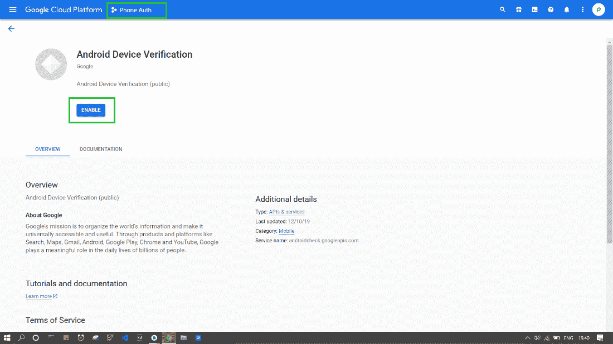
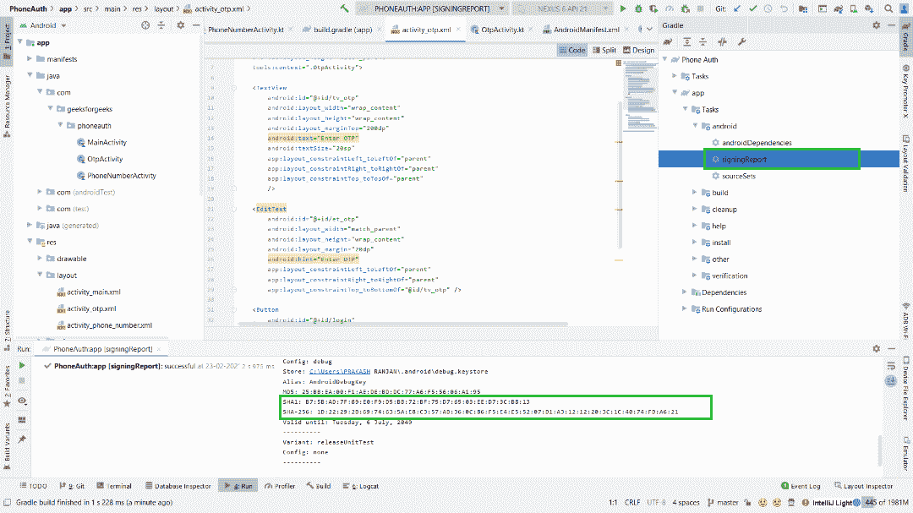
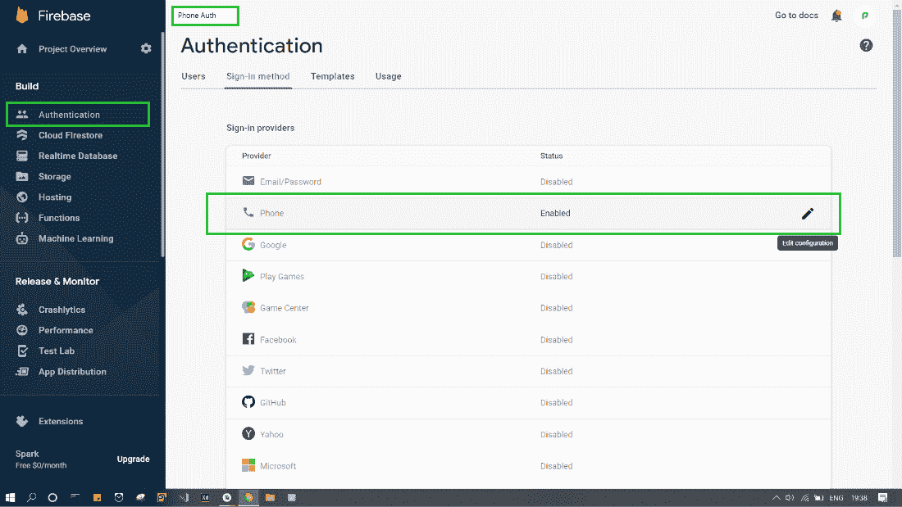

# 安卓中使用 Firebase 进行电话号码验证

> 原文:[https://www . geesforgeks . org/电话号码-验证-使用-firebase-in-android/](https://www.geeksforgeeks.org/phone-number-verification-using-firebase-in-android/)

**电话号码 Firebase 认证**用于通过向用户手机发送短信的方式登录用户。用户使用短信中包含的一次性代码登录。下面给出了一个示例视频，以了解我们将在本文中做什么。请注意，我们将使用**柯特林**语言来实现这个项目。

<video class="wp-video-shortcode" id="video-563307-1" width="640" height="360" preload="metadata" controls=""><source type="video/mp4" src="https://media.geeksforgeeks.org/wp-content/uploads/20210220231316/phone_auth_firebase_gfg.mp4?_=1">[https://media.geeksforgeeks.org/wp-content/uploads/20210220231316/phone_auth_firebase_gfg.mp4](https://media.geeksforgeeks.org/wp-content/uploads/20210220231316/phone_auth_firebase_gfg.mp4)</video>

> **注意:**要在 **Java** 语言中实现，请参考本文[安卓](https://www.geeksforgeeks.org/firebase-authentication-with-phone-number-otp-in-android/)中的带电话号码 OTP 的 Firebase 认证

### **分步实施**

**第一步:创建新项目**

要在安卓工作室创建新项目，请参考[如何在安卓工作室创建/启动新项目](https://www.geeksforgeeks.org/android-how-to-create-start-a-new-project-in-android-studio/)。注意选择**科特林**作为编程语言。

**第二步:将项目连接到 Firebase。**


**第 3 步:向 build.gradle 文件添加依赖项，然后单击“立即同步”**

> 实现平台(' com . Google . firebase:firebase-BOM:26 . 5 . 0 ')
> 
> 实现' com . Google . firebase:firebase-auth-ktx '

**第四步:创建两个新活动。**

创建两个新活动。一个 **PhoneNumberActivity.kt** 带有布局文件**activity _ phone _ number . XML**，用于输入电话号码并启动认证过程。第二个 **OtpActivity.kt** 带有布局文件 **activity_otp.xml** ，用于输入从 firebase 接收的 otp。

**第五步:使用布局**

使用**activity _ phone _ number . XML**。转到**activity _ phone _ number . XML**文件并编写以下代码。

## 可扩展标记语言

```
<?xml version="1.0" encoding="utf-8"?>
<androidx.constraintlayout.widget.ConstraintLayout
    xmlns:android="http://schemas.android.com/apk/res/android"
    xmlns:app="http://schemas.android.com/apk/res-auto"
    xmlns:tools="http://schemas.android.com/tools"
    android:layout_width="match_parent"
    android:layout_height="match_parent"
    tools:context=".PhoneNumberActivity">

    <!--This will be used to enter the phone number-->
    <EditText
        android:id="@+id/et_phone_number"
        android:layout_width="match_parent"
        android:layout_height="wrap_content"
        android:layout_marginStart="20dp"
        android:layout_marginTop="200dp"
        android:layout_marginEnd="20dp"
        android:layout_marginBottom="20dp"
        android:ems="10"
        android:hint="Enter Phone Number"
        android:inputType="phone"
        app:layout_constraintEnd_toEndOf="parent"
        app:layout_constraintStart_toStartOf="parent"
        app:layout_constraintTop_toTopOf="parent"
        tools:layout_editor_absoluteY="85dp" />

      <!--On click of this button OTP will be send to phone-->
    <Button
        android:id="@+id/button_otp"
        android:layout_width="wrap_content"
        android:layout_height="wrap_content"
        android:layout_marginTop="20dp"
        android:text="Send OTP"
        app:layout_constraintEnd_toEndOf="parent"
        app:layout_constraintStart_toStartOf="parent"
        app:layout_constraintTop_toBottomOf="@+id/et_phone_number" />

</androidx.constraintlayout.widget.ConstraintLayout>
```

使用 **activity_otp.xml.** 转到 **activity_otp.xml** 文件并编写以下代码。

## 可扩展标记语言

```
<?xml version="1.0" encoding="utf-8"?>
<androidx.constraintlayout.widget.ConstraintLayout
    xmlns:android="http://schemas.android.com/apk/res/android"
    xmlns:app="http://schemas.android.com/apk/res-auto"
    xmlns:tools="http://schemas.android.com/tools"
    android:layout_width="match_parent"
    android:layout_height="match_parent"
    tools:context=".OtpActivity">

    <TextView
        android:id="@+id/tv_otp"
        android:layout_width="wrap_content"
        android:layout_height="wrap_content"
        android:layout_marginTop="200dp"
        android:text="Enter OTP"
        android:textSize="20sp"
        app:layout_constraintLeft_toLeftOf="parent"
        app:layout_constraintRight_toRightOf="parent"
        app:layout_constraintTop_toTopOf="parent"
        />

      <!--We will use it to enter OTP after we receive OTP-->
    <EditText
        android:id="@+id/et_otp"
        android:layout_width="match_parent"
        android:layout_height="wrap_content"
        android:layout_margin="20dp"
        android:hint="Enter OTP"
        app:layout_constraintLeft_toLeftOf="parent"
        app:layout_constraintRight_toRightOf="parent"
        app:layout_constraintTop_toBottomOf="@id/tv_otp" />

    <!--On click of this button final authentication will start-->
    <Button
        android:id="@+id/login"
        android:layout_width="wrap_content"
        android:layout_height="wrap_content"
        android:text="Login"
        app:layout_constraintLeft_toLeftOf="parent"
        app:layout_constraintRight_toRightOf="parent"
        app:layout_constraintTop_toBottomOf="@id/et_otp" />

</androidx.constraintlayout.widget.ConstraintLayout>
```

使用 **activity_main.xml** 。转到 **activity_main.xml** 文件并编写以下代码。这是验证完成后我们到达的最后一个活动。

## 可扩展标记语言

```
<?xml version="1.0" encoding="utf-8"?>
<androidx.constraintlayout.widget.ConstraintLayout
    xmlns:android="http://schemas.android.com/apk/res/android"
    xmlns:app="http://schemas.android.com/apk/res-auto"
    xmlns:tools="http://schemas.android.com/tools"
    android:layout_width="match_parent"
    android:layout_height="match_parent"
    tools:context=".MainActivity">

    <TextView
        android:layout_width="wrap_content"
        android:layout_height="wrap_content"
        android:text="Welcome To GFG!!"
        android:textSize="22sp"
        android:textColor="@color/black"
        app:layout_constraintBottom_toBottomOf="parent"
        app:layout_constraintLeft_toLeftOf="parent"
        app:layout_constraintRight_toRightOf="parent"
        app:layout_constraintTop_toTopOf="parent" />

</androidx.constraintlayout.widget.ConstraintLayout>
```

**第 6 步:使用 PhoneNumberActivity.kt 文件**

转到 **PhoneNumberActivity.kt** 文件，参考以下代码。下面是 **PhoneNumberActivity.kt** 文件的代码。代码中添加了注释，以更详细地理解代码。

## 我的锅

```
import android.content.Intent
import androidx.appcompat.app.AppCompatActivity
import android.os.Bundle
import android.util.Log
import android.widget.Button
import android.widget.EditText
import android.widget.Toast
import com.google.firebase.FirebaseException
import com.google.firebase.auth.FirebaseAuth
import com.google.firebase.auth.PhoneAuthCredential
import com.google.firebase.auth.PhoneAuthOptions
import com.google.firebase.auth.PhoneAuthProvider
import java.util.concurrent.TimeUnit

class PhoneNumberActivity : AppCompatActivity() {

    // this stores the phone number of the user
    var number : String =""

    // create instance of firebase auth
    lateinit var auth: FirebaseAuth

      // we will use this to match the sent otp from firebase
    lateinit var storedVerificationId:String
    lateinit var resendToken: PhoneAuthProvider.ForceResendingToken
    private lateinit var callbacks: PhoneAuthProvider.OnVerificationStateChangedCallbacks

    override fun onCreate(savedInstanceState: Bundle?) {
        super.onCreate(savedInstanceState)
        setContentView(R.layout.activity_phone_number)

        auth=FirebaseAuth.getInstance()

        // start verification on click of the button
        findViewById<Button>(R.id.button_otp).setOnClickListener {
            login()
        }

        // Callback function for Phone Auth
        callbacks = object : PhoneAuthProvider.OnVerificationStateChangedCallbacks() {

            // This method is called when the verification is completed
            override fun onVerificationCompleted(credential: PhoneAuthCredential) {
                startActivity(Intent(applicationContext, MainActivity::class.java))
                finish()
                Log.d("GFG" , "onVerificationCompleted Success")
            }

            // Called when verification is failed add log statement to see the exception
            override fun onVerificationFailed(e: FirebaseException) {
                Log.d("GFG" , "onVerificationFailed  $e")
            }

            // On code is sent by the firebase this method is called
            // in here we start a new activity where user can enter the OTP
            override fun onCodeSent(
                verificationId: String,
                token: PhoneAuthProvider.ForceResendingToken
            ) {
                Log.d("GFG","onCodeSent: $verificationId")
                storedVerificationId = verificationId
                resendToken = token

                // Start a new activity using intent
                // also send the storedVerificationId using intent
                // we will use this id to send the otp back to firebase
                val intent = Intent(applicationContext,OtpActivity::class.java)
                intent.putExtra("storedVerificationId",storedVerificationId)
                startActivity(intent)
                finish()
            }
        }
    }

    private fun login() {
        number = findViewById<EditText>(R.id.et_phone_number).text.trim().toString()

        // get the phone number from edit text and append the country cde with it
        if (number.isNotEmpty()){
            number = "+91$number"
            sendVerificationCode(number)
        }else{
            Toast.makeText(this,"Enter mobile number", Toast.LENGTH_SHORT).show()
        }
    }

    // this method sends the verification code
      // and starts the callback of verification
    // which is implemented above in onCreate
    private fun sendVerificationCode(number: String) {
        val options = PhoneAuthOptions.newBuilder(auth)
            .setPhoneNumber(number) // Phone number to verify
            .setTimeout(60L, TimeUnit.SECONDS) // Timeout and unit
            .setActivity(this) // Activity (for callback binding)
            .setCallbacks(callbacks) // OnVerificationStateChangedCallbacks
            .build()
        PhoneAuthProvider.verifyPhoneNumber(options)
        Log.d("GFG" , "Auth started")
    }
}
```

**步骤 7:使用 OtpActivity.kt 文件**

转到 **OtpActivity.kt** 文件，参考以下代码。下面是 **OtpActivity.kt** 文件的代码。代码中添加了注释，以更详细地理解代码。

## 我的锅

```
import android.content.Intent
import androidx.appcompat.app.AppCompatActivity
import android.os.Bundle
import android.widget.Button
import android.widget.EditText
import android.widget.Toast
import com.google.firebase.auth.FirebaseAuth
import com.google.firebase.auth.FirebaseAuthInvalidCredentialsException
import com.google.firebase.auth.PhoneAuthCredential
import com.google.firebase.auth.PhoneAuthProvider

class OtpActivity : AppCompatActivity() {

    // get reference of the firebase auth
    lateinit var auth: FirebaseAuth

    override fun onCreate(savedInstanceState: Bundle?) {
        super.onCreate(savedInstanceState)
        setContentView(R.layout.activity_otp)

        auth=FirebaseAuth.getInstance()

        // get storedVerificationId from the intent
        val storedVerificationId= intent.getStringExtra("storedVerificationId")

        // fill otp and call the on click on button
        findViewById<Button>(R.id.login).setOnClickListener {
            val otp = findViewById<EditText>(R.id.et_otp).text.trim().toString()
            if(otp.isNotEmpty()){
                val credential : PhoneAuthCredential = PhoneAuthProvider.getCredential(
                    storedVerificationId.toString(), otp)
                signInWithPhoneAuthCredential(credential)
            }else{
                Toast.makeText(this,"Enter OTP", Toast.LENGTH_SHORT).show()
            }
        }
    }
    // verifies if the code matches sent by firebase
    // if success start the new activity in our case it is main Activity
    private fun signInWithPhoneAuthCredential(credential: PhoneAuthCredential) {
        auth.signInWithCredential(credential)
            .addOnCompleteListener(this) { task ->
                if (task.isSuccessful) {
                    val intent = Intent(this , MainActivity::class.java)
                    startActivity(intent)
                    finish()
                } else {
                    // Sign in failed, display a message and update the UI
                    if (task.exception is FirebaseAuthInvalidCredentialsException) {
                        // The verification code entered was invalid
                        Toast.makeText(this,"Invalid OTP", Toast.LENGTH_SHORT).show()
                    }
                }
            }
    }
}
```

**第八步:转到 AndroidManifest.xml，添加如下代码**

## 可扩展标记语言

```
<?xml version="1.0" encoding="utf-8"?>
<manifest xmlns:android="http://schemas.android.com/apk/res/android"
    package="com.geeksforgeeks.phoneauth">

    <uses-permission android:name="android.permission.INTERNET"/>

    <application
        android:allowBackup="true"
        android:icon="@mipmap/ic_launcher"
        android:label="@string/app_name"
        android:roundIcon="@mipmap/ic_launcher_round"
        android:supportsRtl="true"
        android:theme="@style/Theme.PhoneAuth">
        <activity android:name=".OtpActivity"></activity>
        <activity android:name=".PhoneNumberActivity">
            <intent-filter>
                <action android:name="android.intent.action.MAIN" />

                <category android:name="android.intent.category.LAUNCHER" />
            </intent-filter>

        </activity>
        <activity android:name=".MainActivity">

        </activity>
    </application>

</manifest>
```

**第九步:为你的项目启用安卓设备检查应用编程接口**

在谷歌云控制台中，为您的项目启用[安卓设备检查应用编程接口](https://console.cloud.google.com/apis/library/androidcheck.googleapis.com)。将使用默认的防火墙应用编程接口密钥，并且需要被允许访问设备检查应用编程接口。



**第十步:将安卓工作室的 SHA 键添加到 Firebase**

从您的项目中复制 **SHA1** 和 **SHA-256** 键，并将其粘贴到 firebase 控制台。下面是引导你的截图。

> **注:**请参考本文[如何在安卓工作室生成 SHA1、MD5、SHA-256 密钥？](https://www.geeksforgeeks.org/how-to-generate-sha1-md5-and-sha-256-keys-in-android-studio/)



在 **Firebase** 控制台转到**项目概述- >项目设置，**点击**添加指纹**按钮，添加你从 Firebase 复制的 **SHA** 键


**步骤 11:为您的 Firebase 项目启用电话号码登录**

在 [Firebase 控制台](https://console.firebase.google.com/)中选择您的项目，打开认证部分。在“登录方法”页面上，启用电话号码登录方法。



### 输出:

<video class="wp-video-shortcode" id="video-563307-2" width="640" height="360" preload="metadata" controls=""><source type="video/mp4" src="https://media.geeksforgeeks.org/wp-content/uploads/20210220231316/phone_auth_firebase_gfg.mp4?_=2">[https://media.geeksforgeeks.org/wp-content/uploads/20210220231316/phone_auth_firebase_gfg.mp4](https://media.geeksforgeeks.org/wp-content/uploads/20210220231316/phone_auth_firebase_gfg.mp4)</video>

**Github 回购** [**这里**](https://github.com/introidx/Phone-auth) **。**