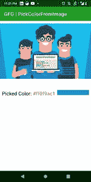

# 在安卓中通过触摸事件从图像中选择颜色

> 原文:[https://www . geesforgeks . org/pick-color-from-image-with-touch events-in-Android/](https://www.geeksforgeeks.org/pick-color-from-image-with-touchevents-in-android/)

在本文中，我们将学习如何在图像上获得触摸像素颜色。下面给出了一个截图，以了解我们将在本文中做什么。注意，我们将使用 **Kotlin** 语言来实现这个项目。



### **分步实施**

**第一步:**在安卓工作室创建新项目请参考[如何在安卓工作室创建/启动新项目](https://www.geeksforgeeks.org/android-how-to-create-start-a-new-project-in-android-studio/)。注意选择**科特林**作为编程语言。

**第二步:** **设置布局中的任意图像**

导航到**应用程序> res >布局> activity_main.xml** 并将下面的代码添加到该文件中。下面是 **activity_main.xml** 文件的代码。

## 可扩展标记语言

```kt
<?xml version="1.0" encoding="utf-8"?>
<androidx.constraintlayout.widget.ConstraintLayout 
    xmlns:android="http://schemas.android.com/apk/res/android"
    xmlns:app="http://schemas.android.com/apk/res-auto"
    android:layout_width="match_parent"
    android:layout_height="match_parent">

    <!--Image form which we will pick color-->
    <ImageView
        android:id="@+id/pickColorImage"
        android:layout_width="match_parent"
        android:layout_height="255dp"
        android:layout_marginTop="10dp"
        android:contentDescription="Image to pick color"
        android:scaleType="fitStart"
        android:src="@drawable/gfg"
        app:layout_constraintEnd_toEndOf="parent"
        app:layout_constraintStart_toStartOf="parent"
        app:layout_constraintTop_toTopOf="parent" />

    <LinearLayout
        android:layout_width="match_parent"
        android:layout_height="wrap_content"
        android:layout_margin="8dp"
        android:layout_marginTop="20dp"
        android:orientation="horizontal"
        app:layout_constraintTop_toBottomOf="@id/pickColorImage">

        <TextView
            android:layout_width="wrap_content"
            android:layout_height="wrap_content"
            android:text="Picked Color: "
            android:textColor="@color/black"
            android:textSize="20sp" />

        <!-- color name in Hexadecimal -->
        <TextView
            android:id="@+id/colorInHex"
            android:layout_width="wrap_content"
            android:layout_height="wrap_content"
            android:text="#fffffff"
            android:textSize="20sp" />

        <!-- show the picked color -->
        <View
            android:id="@+id/fillColor"
            android:layout_width="match_parent"
            android:layout_height="20dp"
            android:layout_marginStart="8dp"
            app:layout_constraintTop_toBottomOf="@id/pickColorImage" />
    </LinearLayout>

</androidx.constraintlayout.widget.ConstraintLayout>
```

**第三步:使用 MainActivity.kt 文件**

转到 **MainActivity.kt** 文件，参考以下代码。下面是 **MainActivity.kt** 文件的代码。代码中添加了注释，以更详细地理解代码。

## 我的锅

```kt
import android.annotation.SuppressLint
import android.graphics.Bitmap
import android.graphics.Color
import android.os.Bundle
import android.view.MotionEvent
import android.view.View
import android.widget.ImageView
import android.widget.TextView
import androidx.appcompat.app.AppCompatActivity

class MainActivity : AppCompatActivity() {

    lateinit var image: ImageView
    lateinit var bitmap: Bitmap
    lateinit var colorView: View
    lateinit var colorString: TextView

    @SuppressLint("ClickableViewAccessibility")
    override fun onCreate(savedInstanceState: Bundle?) {
        super.onCreate(savedInstanceState)
        setContentView(R.layout.activity_main)
        image = findViewById(R.id.pickColorImage)
        colorView = findViewById(R.id.fillColor)
        colorString = findViewById(R.id.colorInHex)

        image.isDrawingCacheEnabled = true
        image.buildDrawingCache(true)

        // on touch listener on image view
        image.setOnTouchListener { _, event ->
            if (event.action == MotionEvent.ACTION_DOWN || event.action == MotionEvent.ACTION_MOVE) {
                bitmap = image.drawingCache

                // get touched pixel
                val pixel = bitmap.getPixel(event.x.toInt(), event.y.toInt())

                // get RGB values from the touched pixel
                val r = Color.red(pixel)
                val g = Color.green(pixel)
                val b = Color.blue(pixel)

                // color name in Hexadecimal(#RRGGBB)
                colorString.text = "#${Integer.toHexString(pixel)}"

                // fill the color in the view
                colorView.setBackgroundColor(Color.rgb(r, g, b))
            }
            true
        }
    }
}
```

现在，运行应用程序

**输出:**

<video class="wp-video-shortcode" id="video-668070-1" width="640" height="360" preload="metadata" controls=""><source type="video/mp4" src="https://media.geeksforgeeks.org/wp-content/uploads/20210807234629/pickColor.mp4?_=1">[https://media.geeksforgeeks.org/wp-content/uploads/20210807234629/pickColor.mp4](https://media.geeksforgeeks.org/wp-content/uploads/20210807234629/pickColor.mp4)</video>

**源代码:** [点击此处](https://media.geeksforgeeks.org/wp-content/cdn-uploads/20210821145921/PickColorFromImage-GFGarticle-main.zip)