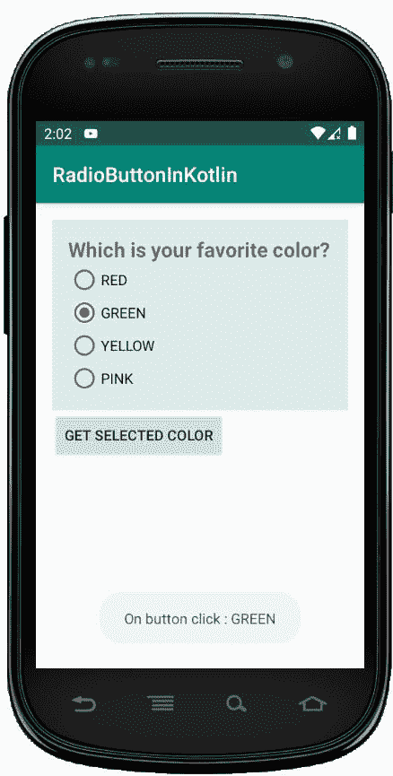

# 科特林

中的单选按钮

> 原文:[https://www.geeksforgeeks.org/radiobutton-in-kotlin/](https://www.geeksforgeeks.org/radiobutton-in-kotlin/)

安卓单选按钮是双态按钮，可以选中也可以不选中。此外，它的工作原理与 Checkbox 相同，只是单选按钮一旦被选中就不允许取消选中。

通常，我们使用单选按钮控件来允许用户从多个选项中选择一个选项。

默认情况下，单选按钮处于**关闭**(未选中)状态，但我们可以使用**安卓:选中**属性来更改单选按钮的默认状态。

创建新项目的以下步骤-

*   点击文件，然后**新建** = > **新项目**。
*   然后，勾选包含柯特林支持，点击下一步按钮。
*   选择最小的软件开发工具包，无论你需要什么。
*   选择**清空**活动，然后点击完成。

## 单选按钮小部件的不同属性

| XML 属性 | 描述 |
| --- | --- |
| android:id | 用于唯一标识控件 |
| 安卓:重力 | 用于指定如何对齐文本，如左、右、中、上等。 |
| 安卓:选中 | 用于指定单选按钮的当前状态 |
| android:onClick | 这是单击单选按钮时要调用的方法的名称。 |
| android:文本大小 | 用于设置文本的大小。 |
| android:文本颜色 | 用于设置文本的颜色。 |
| android:textStyle | 用于设置文本的样式。例如，粗体、斜体、粗斜体等。 |
| android:最大宽度 | 用于使视图最大宽度达到这么多像素。 |
| 安卓:minWidth | 用于使视图至少有这么多像素宽。 |
| 安卓:背景 | 用于设置单选按钮控件的背景。 |
| 安卓:可见性 | 用于控制可见性。 |

## 修改 strings.xml 文件

我们可以将应用程序的名称写成 **RadioButtonInKotlin** ，并编写其他可以使用的字符串。

```kt
<resources>
    <string name="app_name">RadioButtonInKotlin</string>
    <string name="checked">checked</string>
    <string name="unchecked">unchecked</string>
</resources>
```

## 在 activity_main.xml 文件中添加单选按钮

在 android 中，我们使用 RadioGroup 中的单选按钮将单选按钮组合成一个组，这将确保用户只能从按钮组中选择按钮。

```kt
<?xml version="1.0" encoding="utf-8"?>
<LinearLayout
    xmlns:android="http://schemas.android.com/apk/res/android"
    xmlns:tools="http://schemas.android.com/tools"
    android:id="@+id/root_layout"
    android:layout_width="match_parent"
    android:layout_height="match_parent"
    android:orientation="vertical"
    android:padding="16dp">
    <RadioGroup
        android:id="@+id/radio_group"
        android:layout_width="match_parent"
        android:layout_height="wrap_content"
        android:background="#dbeceb"
        android:padding="15dp">

        <TextView
            android:id="@+id/title"
            android:layout_width="match_parent"
            android:layout_height="wrap_content"
            android:text="Which is your favorite color?"
            android:textStyle="bold"
            android:textSize="20sp"/>

        <RadioButton
            android:id="@+id/red"
            android:layout_width="wrap_content"
            android:layout_height="wrap_content"
            android:text="RED"
            android:onClick="radio_button_click"/>

        <RadioButton
            android:id="@+id/green"
            android:layout_width="wrap_content"
            android:layout_height="wrap_content"
            android:text="GREEN"
            android:onClick="radio_button_click"/>

        <RadioButton
            android:id="@+id/yellow"
            android:layout_width="wrap_content"
            android:layout_height="wrap_content"
            android:text="YELLOW"
            android:onClick="radio_button_click"/>

        <RadioButton
            android:id="@+id/pink"
            android:layout_width="wrap_content"
            android:layout_height="wrap_content"
            android:text="PINK"
            android:onClick="radio_button_click"/>
    </RadioGroup>

    <Button
        android:id="@+id/button"
        android:layout_width="wrap_content"
        android:layout_height="wrap_content"
        android:text="Get Selected Color"/>
</LinearLayout>
```

在这里，我们试图实现一个场景，您需要选择您最喜欢的颜色。因此，在 activity_main.xml 文件中，我们在一个单选按钮组中添加了 4 个单选按钮。每个按钮代表一种颜色。现在，一次只能选择一个单选按钮。 *****

现在，我们将在 kotlin 文件中访问这个小部件，并在选择单选按钮时显示适当的消息。

## 现在，打开 MainActivity.kt 文件，并在其中添加下面的代码。

```kt
package com.geeksforgeeks.myfirstkotlinapp

import androidx.appcompat.app.AppCompatActivity
import android.os.Bundle
import android.view.View
import android.widget.*
import kotlinx.android.synthetic.main.activity_main.*
import android.widget.RadioGroup

class MainActivity : AppCompatActivity() {

    override fun onCreate(savedInstanceState: Bundle?) {
        super.onCreate(savedInstanceState)
        setContentView(R.layout.activity_main)

        // Get radio group selected item using on checked change listener
        radio_group.setOnCheckedChangeListener(
            RadioGroup.OnCheckedChangeListener { group, checkedId ->
                val radio: RadioButton = findViewById(checkedId)
                Toast.makeText(applicationContext," On checked change :"+
                        " ${radio.text}",
                    Toast.LENGTH_SHORT).show()
            })
        // Get radio group selected status and text using button click event
        button.setOnClickListener{
            // Get the checked radio button id from radio group
            var id: Int = radio_group.checkedRadioButtonId
            if (id!=-1){ // If any radio button checked from radio group
                // Get the instance of radio button using id
                val radio:RadioButton = findViewById(id)
                Toast.makeText(applicationContext,"On button click :" +
                        " ${radio.text}",
                    Toast.LENGTH_SHORT).show()
            }else{
                // If no radio button checked in this radio group
                Toast.makeText(applicationContext,"On button click :" +
                        " nothing selected",
                    Toast.LENGTH_SHORT).show()
            }
        }
    }
    // Get the selected radio button text using radio button on click listener
    fun radio_button_click(view: View){
        // Get the clicked radio button instance
        val radio: RadioButton = findViewById(radio_group.checkedRadioButtonId)
        Toast.makeText(applicationContext,"On click : ${radio.text}",
            Toast.LENGTH_SHORT).show()
    }
}
```

在 MainActivity.kt 文件中，我们已经访问了单选按钮组，其中我添加了四个单选按钮。然后，我们设置了一个监听器，每当单选按钮的选择发生变化时就显示 toast 消息。

由于 AndroidManifest.xml 文件在任何安卓应用程序中都非常重要，我们也将在这里提到它。

## AndroidManifest.xml 文件

```kt
<?xml version="1.0" encoding="utf-8"?>
<manifest xmlns:android="http://schemas.android.com/apk/res/android"
    package="com.geeksforgeeks.myfirstkotlinapp">

    <application
        android:allowBackup="true"
        android:icon="@mipmap/ic_launcher"
        android:label="@string/app_name"
        android:roundIcon="@mipmap/ic_launcher_round"
        android:supportsRtl="true"
        android:theme="@style/AppTheme">
        <activity android:name=".MainActivity">
            <intent-filter>
                <action android:name="android.intent.action.MAIN" />

                <category android:name="android.intent.category.LAUNCHER" />
            </intent-filter>
        </activity>
    </application>

</manifest>
```

当您运行应用程序时，您将获得如下所示的输出

## 作为模拟器运行:

