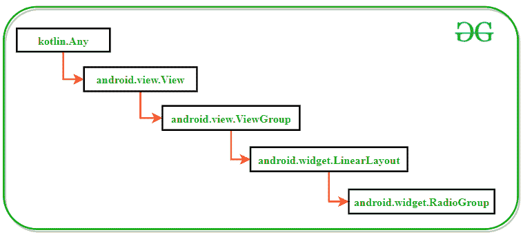
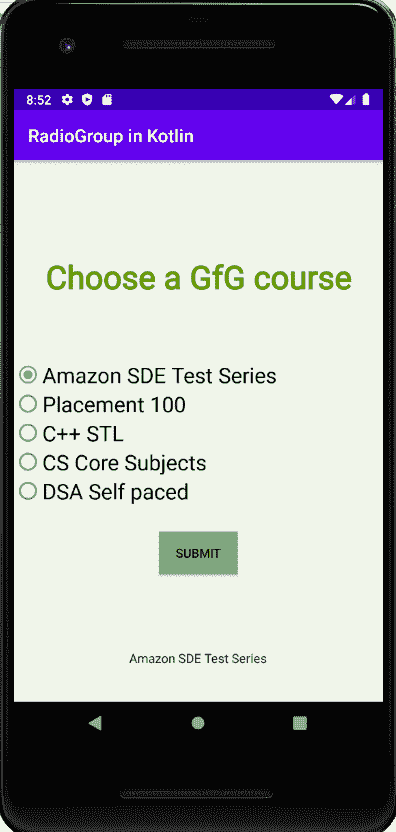
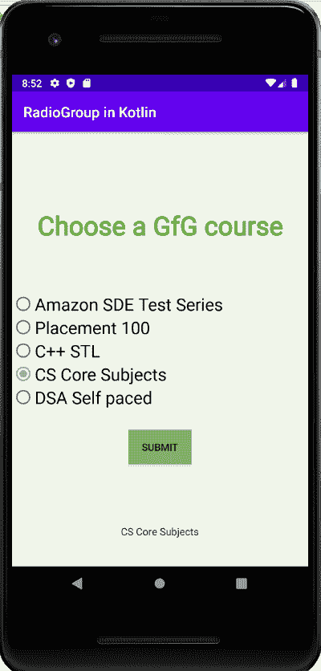

# 科特林的无线电小组

> 原文:[https://www.geeksforgeeks.org/radiogroup-in-kotlin/](https://www.geeksforgeeks.org/radiogroup-in-kotlin/)

Kotlin 编程语言的 RadioGroup 类用于创建一个容纳多个[radio button](https://www.geeksforgeeks.org/radiobutton-in-kotlin/)的容器。RadioGroup 类有利于在其中放置一组单选按钮，因为该类为单选按钮添加了**多重排除范围**功能。此功能确保用户只能检查属于一个单选按钮组类的所有单选按钮中的一个。如果用户选中另一个单选按钮，RadioGroup 类将取消选中以前选中的单选按钮。当开发人员只想选择一个答案时，例如询问用户的性别，这个特性非常重要。

### Kotlin 中 RadioGroup 类的类层次结构



### RadioGroup 小部件的 XML 属性

| XML 属性 | 描述 |
| --- | --- |
| android:id | 唯一标识无线电组 |
| 安卓:背景 | 设置背景颜色 |
| android:onClick | 单击 RadioGroup 时执行特定操作的方法 |
| android:onClick | 这是单击单选按钮时要调用的方法的名称。 |
| 安卓:可见性 | 用于控制可见性，即可见、不可见或消失 |
| 安卓:布局 _ 宽度 | 设置宽度 |
| 安卓:布局 _ 高度 | 设定高度 |
| android:contentDescription | 简要描述一下这个观点 |
| android:签出程序 | 存储默认情况下需要在此单选按钮组中检查的子单选按钮的 id |
| 安卓:定位 | 若要固定视图的方向常数 |

### 例子

在这个例子中，我们将逐步演示如何创建一个电台群，它由 5 个电台按钮组成，要求用户选择极客网提供的课程。当用户选中其中一个单选按钮并单击提交按钮时，会出现一条显示所选选项的祝酒信息。

> **注**:安卓 Studio 版本执行以下步骤

#### 创建新项目

1.  单击文件，然后单击新建= >新建项目。
2.  为项目模板选择“空活动”。
3.  选择语言作为 Kotlin。
4.  根据您的需要选择最小的软件开发工具包。

#### 打开 activity_main.xml 文件

下面是`**activity_main.xml**`文件添加一个 RadioGroup 及其 5 个 RadioButton 子代的代码。还添加了一个普通的提交按钮来接受和显示用户选择的响应。

```
<?xml version="1.0" encoding="utf-8"?>
<androidx.constraintlayout.widget.ConstraintLayout 
    xmlns:android="http://schemas.android.com/apk/res/android"
    xmlns:app="http://schemas.android.com/apk/res-auto"
    xmlns:tools="http://schemas.android.com/tools"
    android:layout_width="match_parent"
    android:layout_height="match_parent"
    android:background="#168BC34A"
    tools:context=".MainActivity">

    <TextView
        android:id="@+id/textView"
        android:layout_width="wrap_content"
        android:layout_height="wrap_content"
        android:fontFamily="@font/roboto"
        android:text="@string/Heading"
        android:textAlignment="center"
        android:textColor="@android:color/holo_green_dark"
        android:textSize="36sp"
        android:textStyle="bold"
        app:layout_constraintBottom_toBottomOf="parent"
        app:layout_constraintEnd_toEndOf="parent"
        app:layout_constraintStart_toStartOf="parent"
        app:layout_constraintTop_toTopOf="parent"
        app:layout_constraintVertical_bias="0.19" />

    <RadioGroup
        android:id="@+id/radioGroup1"
        android:layout_width="0dp"
        android:layout_height="wrap_content"
        android:background="#024CAF50"
        app:layout_constraintBottom_toBottomOf="parent"
        app:layout_constraintEnd_toEndOf="parent"
        app:layout_constraintStart_toStartOf="parent"
        app:layout_constraintTop_toBottomOf="@+id/textView"
        app:layout_constraintVertical_bias="0.24000001">

        <RadioButton
            android:id="@+id/radioButton1"
            android:layout_width="match_parent"
            android:layout_height="wrap_content"
            android:fontFamily="@font/roboto"
            android:text="@string/RadioButton1"
            android:textSize="24sp" />

        <RadioButton
            android:id="@+id/radioButton2"
            android:layout_width="match_parent"
            android:layout_height="wrap_content"
            android:fontFamily="@font/roboto"
            android:text="@string/radioButton2"
            android:textSize="24sp" />

        <RadioButton
            android:id="@+id/radioButton3"
            android:layout_width="match_parent"
            android:layout_height="wrap_content"
            android:fontFamily="@font/roboto"
            android:text="@string/radioButton3"
            android:textSize="24sp" />

        <RadioButton
            android:id="@+id/radioButton4"
            android:layout_width="match_parent"
            android:layout_height="wrap_content"
            android:fontFamily="@font/roboto"
            android:text="@string/radioButton4"
            android:textSize="24sp" />

        <RadioButton
            android:id="@+id/radioButton5"
            android:layout_width="match_parent"
            android:layout_height="wrap_content"
            android:fontFamily="@font/roboto"
            android:text="@string/radioButton5"
            android:textSize="24sp" />
    </RadioGroup>

    <Button
        android:id="@+id/submitButton"
        android:layout_width="wrap_content"
        android:layout_height="wrap_content"
        android:background="#AB4CAF50"
        android:text="@string/submit_Button"
        app:layout_constraintBottom_toBottomOf="parent"
        app:layout_constraintEnd_toEndOf="parent"
        app:layout_constraintStart_toStartOf="parent"
        app:layout_constraintTop_toBottomOf="@+id/radioGroup1"
        app:layout_constraintVertical_bias="0.17000002" />
</androidx.constraintlayout.widget.ConstraintLayout>
```

#### 打开 MainActivity.kt 文件

以下是`**MainActivity.kt**`文件的代码，用于访问 kotlin 文件中的 RadioGroup 小部件，并在用户选择单选按钮时显示适当的消息。

```
package com.example.sampleproject

import androidx.appcompat.app.AppCompatActivity
import android.os.Bundle
import android.view.View
import android.widget.Button
import android.widget.RadioButton
import android.widget.RadioGroup
import android.widget.Toast
import kotlinx.android.synthetic.main.activity_main.*

class MainActivity : AppCompatActivity() {
    var radioGroup: RadioGroup? = null
    lateinit var radioButton: RadioButton
    private lateinit var button: Button

    override fun onCreate(savedInstanceState: Bundle?) {
        super.onCreate(savedInstanceState)
        setContentView(R.layout.activity_main)

        // Display name of the Application
        title = "RadioGroup in Kotlin"

        // Assigning id of RadioGroup
        radioGroup = findViewById(R.id.radioGroup1)

        // Assigning id of Submit button
        button = findViewById(R.id.submitButton)

        // Actions to be performed 
        // when Submit button is clicked
        button.setOnClickListener {

            // Getting the checked radio button id 
            // from the radio group
            val selectedOption: Int = radioGroup!!.checkedRadioButtonId

            // Assigning id of the checked radio button
            radioButton = findViewById(selectedOption)

            // Displaying text of the checked radio button in the form of toast
            Toast.makeText(baseContext, radioButton.text, Toast.LENGTH_SHORT).show()
        }
    }
}
```

#### 修改 strings.xml 文件

活动中使用的所有字符串，从应用程序名称到各种单选按钮的选项，都列在该文件中。

```
<resources>
    <string name="app_name">RadioGroup in Kotlin</string>
    <string name="Heading">Choose a GfG course</string>
    <string name="RadioButton1">Amazon SDE Test Series</string>
    <string name="radioButton2">Placement 100</string>
    <string name="radioButton3">C++ STL</string>
    <string name="radioButton4">CS Core Subjects</string>
    <string name="radioButton5">DSA Self paced</string>
    <string name="submit_Button">Submit</string>
</resources>
```

### 输出

