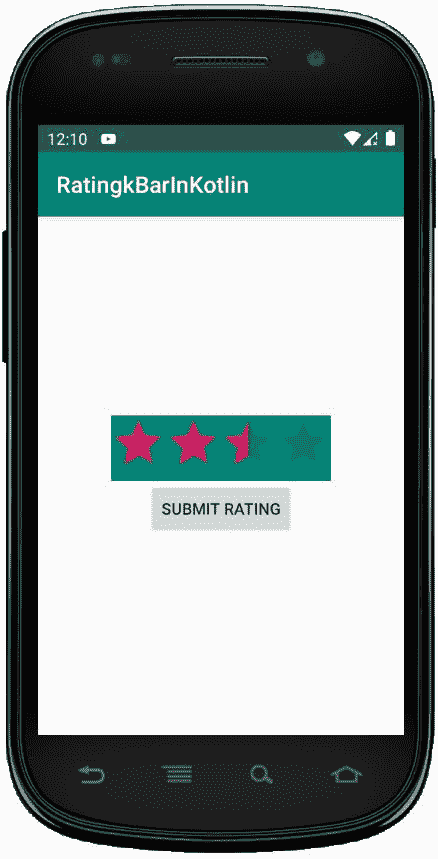
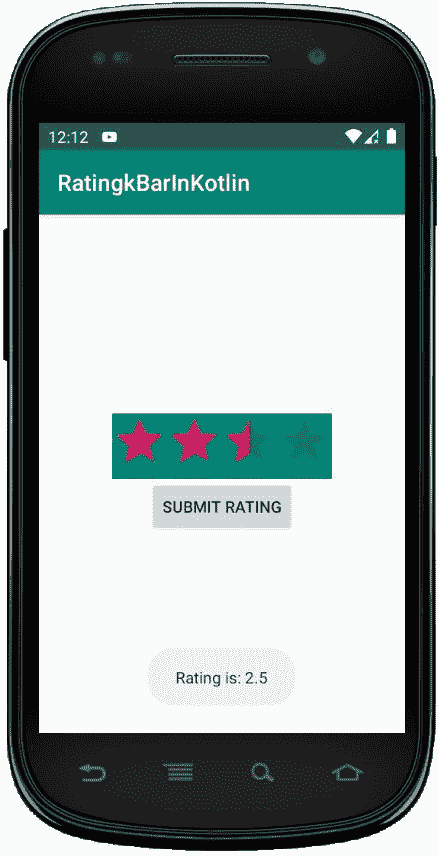

# 科特林的 rating bar

> 原文:[https://www.geeksforgeeks.org/ratingbar-in-kotlin/](https://www.geeksforgeeks.org/ratingbar-in-kotlin/)

**安卓评级栏**是一个用户界面小部件，用于获取客户或用户的评级。它是 SeekBar 和 ProgressBar 的扩展，显示星级，并允许用户通过点击星级给出评级。

在 RatingBar 中，我们可以使用 **android:stepSize** 设置步长，它总是会返回一个 1.0、2.0、2.5 等浮点数形式的评级值。通过使用，**安卓:numStars** 属性，我们可以在 RatingBar 中指定星星的数量。RatingBar 用于从用户或客户那里获得关于产品、电影或酒店体验等的评级。

RatingBar 可以手动创建，也可以通过编程创建，但是我们将讨论手动创建。

首先，我们按照以下步骤创建一个新项目:

1.  点击**文件**，然后**新建** = > **新建项目**。
2.  之后加入 Kotlin 支持，点击下一步。
3.  根据方便选择最小 SDK，点击下一步按钮。
4.  然后选择**清空**活动= > **下一个** = > **完成**。

## 评级栏小部件的不同属性

| XML 属性 | 描述 |
| --- | --- |
| android:id | 用于唯一标识控件。 |
| 安卓:评级 | 用于设置评级栏的默认评级值。 |
| android:numStars | 用于设置要显示的星星数量。 |
| 安卓:背景 | 用于设置评级栏的背景颜色。 |
| 安卓:填充 | 用于设置滚动条的左、右、上或下的填充。 |
| 安卓:步长 | 用于在评级栏上设置步长，如 0.5 或 1。 |

## 修改 activity_main.xml 文件

在这个文件中，我们在线性布局中添加了评级栏和按钮。还为两个小部件设置属性，如 id、步长、背景等。

```
<?xml version="1.0" encoding="utf-8"?>
<LinearLayout
    xmlns:android="http://schemas.android.com/apk/res/android"
    xmlns:tools="http://schemas.android.com/tools"
    android:id="@+id/container"
    android:layout_width="match_parent"
    android:layout_height="match_parent"
    tools:context=".MainActivity"
    android:orientation="vertical"
    android:gravity ="center">

    <RatingBar
        android:id="@+id/rBar"
        android:layout_width="wrap_content"
        android:layout_height="wrap_content"
        android:stepSize="0.5"
        android:theme="@style/Widget.AppCompat.RatingBar"
        android:background="@color/colorPrimary"
        android:numStars="4"/>

    <Button
        android:id="@+id/button"
        android:layout_width="wrap_content"
        android:layout_height="wrap_content"
        android:text="Submit Rating" />

</LinearLayout>
```

**应用程序的名称可以放在 *strings.xml* 文件**中

```
<resources>
    <string name="app_name">RatingkBarInKotlin</string>
</resources>
```

## 访问 MainActivity.kt 文件中的评级栏

首先，我们将声明变量 **rBar** 来使用类似的 id 访问评级

```
val rBar = findViewById<RatingBar>(R.id.rBar)
```

然后，声明另一个变量**按钮**，并使用其 id 访问该按钮。

```
val button = findViewById<Button>(R.id.button)
```

最后，为了在提交评级时显示吐司消息，我们这样编码

```
button?.setOnClickListener {
      val msg = rBar.rating.toString()
      Toast.makeText(this@MainActivity,
       "Rating is: "+msg, Toast.LENGTH_SHORT).show()

```

```
package com.geeksforgeeks.myfirstkotlinapp

import androidx.appcompat.app.AppCompatActivity
import android.os.Bundle
import android.widget.Button
import android.widget.RatingBar
import android.widget.Toast

class MainActivity : AppCompatActivity() {

    override fun onCreate(savedInstanceState: Bundle?) {
        super.onCreate(savedInstanceState)
        setContentView(R.layout.activity_main)

        val rBar = findViewById<RatingBar>(R.id.rBar)
        if (rBar != null) {
            val button = findViewById<Button>(R.id.button)
            button?.setOnClickListener {
                val msg = rBar.rating.toString()
                Toast.makeText(this@MainActivity,
                    "Rating is: "+msg, Toast.LENGTH_SHORT).show()
            }
        }
    }
}
```

## AndroidManifest.xml 文件

```
<?xml version="1.0" encoding="utf-8"?>
<manifest xmlns:android="http://schemas.android.com/apk/res/android"
package="com.geeksforgeeks.myfirstkotlinapp">

<application
    android:allowBackup="true"
    android:icon="@mipmap/ic_launcher"
    android:label="@string/app_name"
    android:roundIcon="@mipmap/ic_launcher_round"
    android:supportsRtl="true"
    android:theme="@style/AppTheme">
    <activity android:name=".MainActivity">
        <intent-filter>
            <action android:name="android.intent.action.MAIN" />

            <category android:name="android.intent.category.LAUNCHER" />
        </intent-filter>
    </activity>
</application>

</manifest>
```

## 作为模拟器运行:

