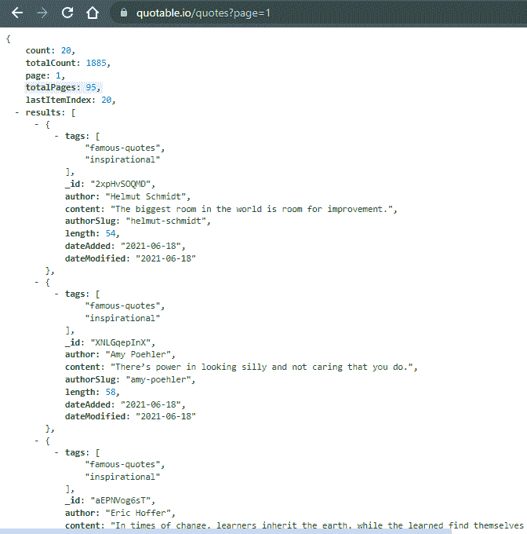
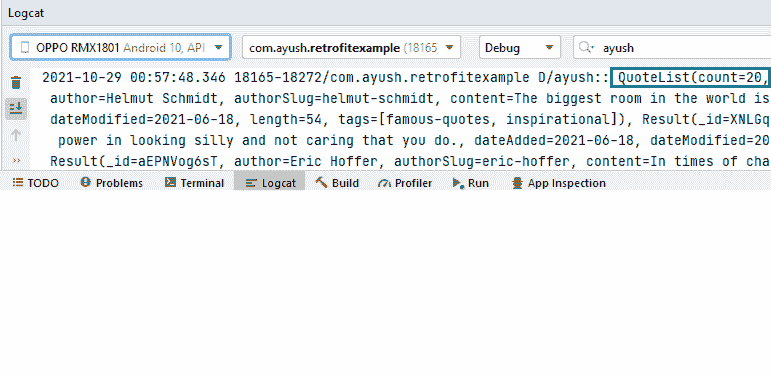

# 在安卓系统中改装 Kotlin Coroutine

> 原文:[https://www . geeksforgeeks . org/改装-带-kot Lin-coroutine-in-Android/](https://www.geeksforgeeks.org/retrofit-with-kotlin-coroutine-in-android/)

科特林团队将协同工作定义为“轻量级线程”。它们是实际线程可以执行的任务。Coroutines 在 1.3 版本中被添加到 Kotlin 中，并且是基于其他语言的既定概念。Kotlin coroutines 引入了一种新的并发风格，可以在 Android 上使用来简化异步代码。在这篇文章中，我们将学习使用 Kotlin coroutine 进行改装。因此，我们将对网络请求使用改装。改装是一个非常流行的库，用于工作 API，也非常常用。我们将通过使用应用编程接口制作一个简单的应用程序来学习它，并使用改装来获取一些数据。

### **分步实施**

**第一步:创建新项目**

要在安卓工作室创建新项目，请参考[如何在安卓工作室创建/启动新项目](https://www.geeksforgeeks.org/android-how-to-create-start-a-new-project-in-android-studio/)。

**第二步:添加依赖关系**

导航至 **Gradle 脚本> build.gradle(模块:app)** 并在依赖项部分添加以下依赖项。

> //改装
> 
> 实现“com.squareup.retrofit2:改装:2.9.0”
> 
> // GSON
> 
> 实现' com . squareup . retro fit 2:converter-gson:2 . 9 . 0 '
> 
> //科罗廷
> 
> 实现' org . jet brains . kot linx:kot linx-coroutines-Android:1 . 5 . 2 '
> 
> 实现' org . jet brains . kot linx:kot linx-coroutines-core:1 . 5 . 2 '

我们正在使用 GSON 将 JSON 转换为 kotlin(Java)对象。我们将在项目内部的 build.gradle 文件中添加这些依赖项。

**第三步:我们将使用下面的 API**

> https://quotable.io/quotes?page=1



图 01

所以我们的 JSON 响应将如图 01 所示。

**第四步**:然后我们根据 JSON 响应创建数据类

在 JSON 响应中，我们有两个 JSON 对象，所以我们将创建两个数据类

1.  **引用列表**
2.  **结果**

## 我的锅

```
// data class QuoteList 
// according to JSON response
package com.ayush.retrofitexample

data class QuoteList(
    val count: Int,
    val lastItemIndex: Int,
    val page: Int,
    val results: List<Result>,
    val totalCount: Int,
    val totalPages: Int
)
```

第二数据类

## 我的锅

```
package com.ayush.retrofitexample

data class Result(
    val _id: String,
    val author: String,
    val authorSlug: String,
    val content: String,
    val dateAdded: String,
    val dateModified: String,
    val length: Int,
    val tags: List<String>
)
```

**第 5 步**:我们将创建一个改装界面来添加 URL 的端点(在我们的例子中引号是端点)

## 我的锅

```
// Retrofit interface
package com.ayush.retrofitexample

import retrofit2.Response
import retrofit2.http.GET
import retrofit2.http.Query

interface QuotesApi {
    @GET("/quotes")
    suspend fun getQuotes() : Response<QuoteList>
}
```

**第 6 步**:我们将创建一个新文件来获取改装对象

在这个文件中，我们将有一个返回改装对象的函数。

## 我的锅

```
package com.ayush.retrofitexample

import retrofit2.Retrofit
import retrofit2.converter.gson.GsonConverterFactory

object RetrofitHelper {

    val baseUrl = "https://quotable.io/"

    fun getInstance(): Retrofit {
        return Retrofit.Builder().baseUrl(baseUrl)
            .addConverterFactory(GsonConverterFactory.create()) 
            // we need to add converter factory to 
            // convert JSON object to Java object
            .build()
    }
}
```

**第 7 步**:现在我们将在 MainActivity 中链接改装对象和改装界面文件

## 我的锅

```
package com.ayush.retrofitexample

import androidx.appcompat.app.AppCompatActivity
import android.os.Bundle
import android.util.Log
import kotlinx.coroutines.GlobalScope
import kotlinx.coroutines.launch
import retrofit2.create

class MainActivity : AppCompatActivity() {
    override fun onCreate(savedInstanceState: Bundle?) {
        super.onCreate(savedInstanceState)
        setContentView(R.layout.activity_main)

        val quotesApi = RetrofitHelper.getInstance().create(QuotesApi::class.java)
        // launching a new coroutine
        GlobalScope.launch {
          val result = quotesApi.getQuotes()
            if (result != null)
                // Checking the results
                Log.d("ayush: ", result.body().toString())
        }

    }
}
```

**第 8 步**:在清单文件中添加互联网权限

结果:我们可以查看 logcat 窗口。我们可以在绿色方框中看到结果。

**输出:**

