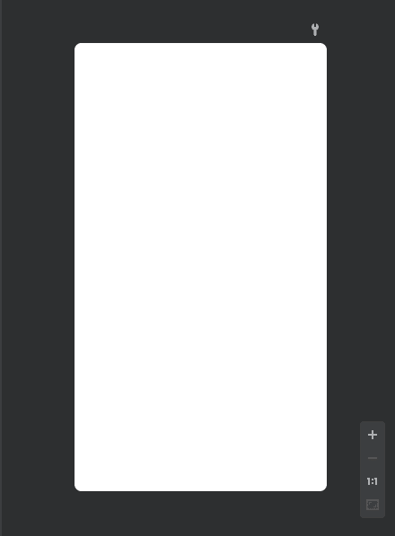
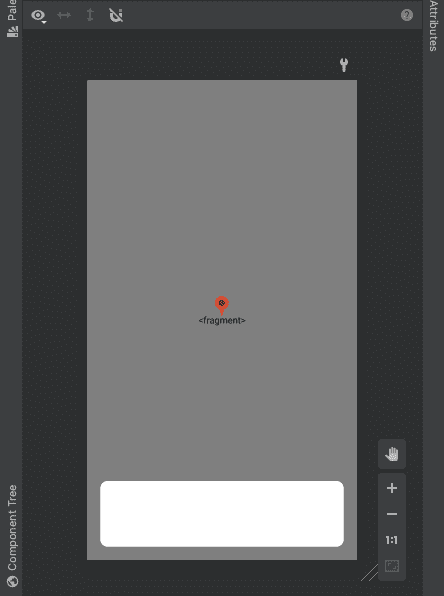

# 安卓中的反向地理编码

> 原文:[https://www.geeksforgeeks.org/reverse-geocoding-in-android/](https://www.geeksforgeeks.org/reverse-geocoding-in-android/)

反向地理编码是用于将坐标(纬度和经度)转换为人类可读地址的过程。这与地理编码并不完全相反。在地理编码中，地点与名称和固定坐标相关联。这些坐标本质上是双重的。这些坐标中可以忽略的变化可能仍然指的是同一个地方，但我们永远不会得到地名，因为它只与那些固定的坐标相关联。因此，我们肯定会在反向地理编码中获得完整的地址，但地名不能保证。通过本文，我们将向您展示一个如何在安卓中执行反向地理编码的示例。但在继续之前，请参考以下文章:

1.  [谷歌云平台-创建谷歌云控制台账户&项目](https://www.geeksforgeeks.org/google-cloud-platform-creating-google-cloud-console-account-projects/)
2.  [为使用任何谷歌应用编程接口生成应用编程接口密钥](https://www.geeksforgeeks.org/generating-api-keys-for-using-any-google-apis/)
3.  [安卓工作室如何隐藏 API 和秘钥？](https://www.geeksforgeeks.org/how-to-hide-api-and-secret-keys-in-android-studio/)
4.  [如何在安卓系统中实现谷歌的地点自动完成栏？](https://www.geeksforgeeks.org/how-to-implement-googles-places-autocompletebar-in-android/)
5.  [如何在安卓系统的谷歌地图中实现当前位置按钮功能？](https://www.geeksforgeeks.org/how-to-implement-current-location-button-feature-in-google-maps-in-android/)

### 项目结构

对于反向地理编码，我们需要双数据类型的纬度和经度。因此，我们将实现一个谷歌地图，并将其中心视为我们的主要纬度和经度。我们可以很容易地利用相机位置得到中心坐标(参考主代码)。每当拖动地图时，中心都会改变，并导致纬度和经度的变化。一旦地图闲置，即停止拖动或移动，反向地理编码算法将考虑中心坐标并对其进行处理，以获得完整的地址。这将立即发布到一个文本视图。这将确认反向地理编码在代码中运行良好。按照以下步骤创建此项目。

### **本文我们要构建什么？**

**第一步:在安卓工作室新建项目**

要在安卓工作室创建新项目，请参考[如何在安卓工作室创建/启动新项目](https://www.geeksforgeeks.org/android-how-to-create-start-a-new-project-in-android-studio/)。我们在 Kotlin 中演示了该应用程序，因此在创建新项目时，请确保选择 **Kotlin** 作为主要语言。

**第二步:获取并隐藏 API 密钥**

1.  我们的应用程序利用谷歌的地点应用编程接口，所以我们需要从谷歌获得地点应用编程接口密钥。要获取应用编程接口密钥，请参考[为使用任何谷歌应用编程接口生成应用编程接口密钥](https://www.geeksforgeeks.org/generating-api-keys-for-using-any-google-apis/)。
2.  隐藏应用编程接口密钥是必不可少的，要做到这一点，请参考[如何在安卓工作室隐藏应用编程接口和密钥？](https://www.geeksforgeeks.org/how-to-hide-api-and-secret-keys-in-android-studio/)。

**第三步:添加这些依赖关系**

反向地理编码需要这种依赖性。

## 我的锅

```kt
dependencies {
    implementation 'com.google.android.libraries.places:places:2.4.0'
}
```

**第四步:在布局(activity_main.xml)文件**中添加 Map 片段、自定义位置标记和文本视图

## 可扩展标记语言

```kt
<?xml version="1.0" encoding="utf-8"?>
<RelativeLayout
    xmlns:android="http://schemas.android.com/apk/res/android"
    xmlns:app="http://schemas.android.com/apk/res-auto"
    xmlns:tools="http://schemas.android.com/tools"
    android:layout_width="match_parent"
    android:layout_height="match_parent"
    tools:context=".MainActivity">

    <!--Map Fragment-->
    <fragment xmlns:android="http://schemas.android.com/apk/res/android"
        xmlns:tools="http://schemas.android.com/tools"
        android:layout_width="match_parent"
        android:layout_height="match_parent"
        android:id="@+id/map"
        tools:context=".MapsActivity"
        android:name="com.google.android.gms.maps.SupportMapFragment" />

    <!--This layout overlays the Map Fragment 
        which matches parent width and height-->
    <!--We want to display our TextView over 
        the Map with good asthetics-->
    <LinearLayout
        android:layout_margin="20sp"
        android:id="@+id/ll1"
        android:layout_width="match_parent"
        android:layout_height="100sp"
        android:background="@drawable/shape"
        android:layout_alignBottom="@id/map"
        android:orientation="horizontal">

          <!--TextView for displaying Lat and
             Lng along with Address-->
        <TextView
            android:id="@+id/tv"
            android:layout_width="match_parent"
            android:layout_height="match_parent"
            android:layout_margin="10sp"
            />

    </LinearLayout>

      <!--This is only for reference to the center 
        of the screen, can be any element-->
      <!--We have set fixed this element at the parent
         center, which is the actual centre of the screen-->
    <Button
        android:id="@+id/centerReferencePoint"
        android:layout_width="0sp"
        android:layout_height="0sp"
        android:layout_centerInParent="true"/>

      <!--This image is the Marker-->
    <ImageView
        android:id="@+id/marker"
        android:layout_width="30sp"
        android:layout_height="40sp"
        android:src="@drawable/marker"
        android:layout_centerInParent="true"
        android:layout_above="@id/centerReferencePoint"
        />

</RelativeLayout>
```

**标记:**

我们从网上下载了这张 PNG 格式的图片。它没有背景颜色，可以称为透明图像。下载后，您可以直接从存储它的地方复制它，打开安卓工作室，并将其粘贴到 res 文件夹中的可绘制文件夹中。在此过程中，我们将其重命名为“标记”，您可以在 **activity_main.xml** 的 ImageView 属性中找到该标记。


**Shape.xml 文件(activity_main.xml 中线性布局的背景)**

我们设置了一个白色背景和一些有价值的角半径。这是为了让布局看起来更好。

## 可扩展标记语言

```kt
<shape
    xmlns:android="http://schemas.android.com/apk/res/android"
    android:shape="rectangle"   >

    <solid
        android:color="#ffffff" >
    </solid>

    <corners
        android:radius="11dp"   >
    </corners>

</shape>
```



Shape.xml 预览

**activity _ main . XML 预览:**



activity_main.xml 预览

**步骤 5:在后端工作(MainActivity.kt)**

我们将屏幕中心的坐标转换成文本地址。一旦拖动屏幕，中心坐标和地址会分别改变。一旦屏幕空闲且不运动，就会发生变化，这就是为什么我们在 setncamera**空闲**监听器中实现了反向地理编码算法。下面的代码很容易理解。我们提供了一些评论，以帮助您更好地理解。

## 我的锅

```kt
package org.geeksforgeeks.reversegeocoding

import android.content.pm.ApplicationInfo
import android.content.pm.PackageManager
import android.location.Address
import android.location.Geocoder
import android.os.Bundle
import android.widget.TextView
import android.widget.Toast
import androidx.appcompat.app.AppCompatActivity
import com.google.android.gms.maps.CameraUpdateFactory
import com.google.android.gms.maps.GoogleMap
import com.google.android.gms.maps.GoogleMap.OnCameraIdleListener
import com.google.android.gms.maps.OnMapReadyCallback
import com.google.android.gms.maps.SupportMapFragment
import com.google.android.gms.maps.model.LatLng
import com.google.android.libraries.places.api.Places
import java.io.IOException
import java.util.*

class MainActivity : AppCompatActivity(), OnMapReadyCallback {

    private lateinit var mMap: GoogleMap

    override fun onCreate(savedInstanceState: Bundle?) {
        super.onCreate(savedInstanceState)
        setContentView(R.layout.activity_main)

        // Fetching API_KEY which we wrapped
        val ai: ApplicationInfo = applicationContext.packageManager.getApplicationInfo(applicationContext.packageName, PackageManager.GET_META_DATA)
        val value = ai.metaData["com.google.android.geo.API_KEY"]
        val apiKey = value.toString()

        // Initializing the Places API
          // with the help of our API_KEY
        if (!Places.isInitialized()) {
            Places.initialize(applicationContext, apiKey)
        }

        // Initializing map
        val mapFragment = supportFragmentManager.findFragmentById(R.id.map) as SupportMapFragment
        mapFragment.getMapAsync(this)

    }

    override fun onMapReady(p0: GoogleMap) {

        mMap = p0

          // These are GeeksforGeeks Noida Office Coordinates.
        val india = LatLng(28.5021359, 77.4054901)
        mMap.moveCamera(CameraUpdateFactory.newLatLngZoom(india,17F))

        mMap.setOnCameraIdleListener {
            val lat = mMap.cameraPosition.target.latitude
            val lng = mMap.cameraPosition.target.longitude
            val addressTV = findViewById<TextView>(R.id.tv)

            // Initializing Geocoder
            val mGeocoder = Geocoder(applicationContext, Locale.getDefault())
            var addressString= ""

              // Reverse-Geocoding starts
            try {
                val addressList: List<Address> = mGeocoder.getFromLocation(lat, lng, 1)

                // use your lat, long value here
                if (addressList != null && addressList.isNotEmpty()) {
                    val address = addressList[0]
                    val sb = StringBuilder()
                    for (i in 0 until address.maxAddressLineIndex) {
                        sb.append(address.getAddressLine(i)).append("\n")
                    }

                    // Various Parameters of an Address are appended
                      // to generate a complete Address
                    if (address.premises != null)
                        sb.append(address.premises).append(", ")

                    sb.append(address.subAdminArea).append("\n")
                    sb.append(address.locality).append(", ")
                    sb.append(address.adminArea).append(", ")
                    sb.append(address.countryName).append(", ")
                    sb.append(address.postalCode)

                    // StringBuilder sb is converted into a string
                     // and this value is assigned to the 
                    // initially declared addressString string.
                    addressString = sb.toString()
                }
            } catch (e: IOException) {
                Toast.makeText(applicationContext,"Unable connect to Geocoder",Toast.LENGTH_LONG).show()
            }

            // Finally, the address string is posted in the textView with LatLng.
            addressTV.text = "Lat: $lat \nLng: $lng \nAddress: $addressString"
        }
    }
}
```

**输出:**

注意，地址会随着后期值的变化而变化。当用户拖动屏幕时，Lat-long 值会改变，因为中心会不断变化。

<video class="wp-video-shortcode" id="video-626503-1" width="640" height="360" preload="metadata" controls=""><source type="video/mp4" src="https://media.geeksforgeeks.org/wp-content/uploads/20210617133538/2021_06_17_13_34_02_trim.mp4?_=1">[https://media.geeksforgeeks.org/wp-content/uploads/20210617133538/2021_06_17_13_34_02_trim.mp4](https://media.geeksforgeeks.org/wp-content/uploads/20210617133538/2021_06_17_13_34_02_trim.mp4)</video>