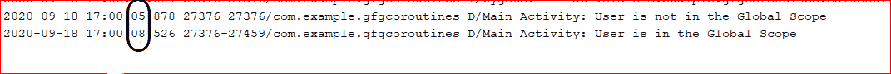
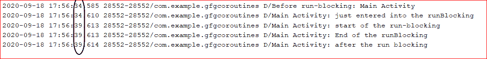
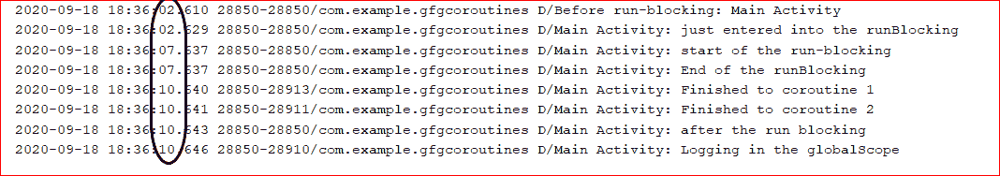

# 柯特林验尸官中的润肠阻塞，示例

> 原文:[https://www . geeksforgeeks . org/runblocking-in-kot Lin-coroutines-with-example/](https://www.geeksforgeeks.org/runblocking-in-kotlin-coroutines-with-example/)

**先决条件:**

*   [安卓上的科特林 corroutines](https://www.geeksforgeeks.org/kotlin-coroutines-on-android/)
*   [柯特林验尸官暂停功能](https://www.geeksforgeeks.org/suspend-function-in-kotlin-coroutines/)

众所周知，当用户在任何[协同](https://www.geeksforgeeks.org/kotlin-coroutines-on-android/)中调用 **delay()** 函数时，它不会阻塞正在运行的线程，而 **delay()** 函数被调用时，人们可以进行一些其他操作，如更新用户界面等。由于延迟功能是暂停功能，因此必须从协同程序或另一个[暂停功能中调用。](https://www.geeksforgeeks.org/suspend-function-in-kotlin-coroutines/)

### runBlocking()函数的定义

根据官方文件，**运行阻塞()**功能可定义为:

> runBlocking 是一个协同函数。通过不提供任何上下文，它将在主线程上运行。运行一个新的协同程序并阻塞当前线程直到它完成为止。这个函数不应该在协同程序中使用。它旨在将常规阻塞代码连接到以挂起方式编写的库，以便在主函数和测试中使用。

## 我的锅

```kt
// sample program in android studio to demonstrate coroutines
package com.example.gfgcoroutines

import androidx.appcompat.app.AppCompatActivity
import android.os.Bundle
import android.util.Log
import android.widget.Toast
import kotlinx.coroutines.GlobalScope
import kotlinx.coroutines.delay
import kotlinx.coroutines.launch

class MainActivity : AppCompatActivity() {
    val TAG:String="Main Activity"
    override fun onCreate(savedInstanceState: Bundle?) {
        super.onCreate(savedInstanceState)
        setContentView(R.layout.activity_main)
        GlobalScope.launch(Dispatchers.Main) {
            delay(3000)
            Log.d(TAG,"User is in the Global Scope ")
            Toast.makeText(applicationContext,"User is in the Global Scope ",Toast.LENGTH_SHORT).show()
        }
        Log.d(TAG,"User is not in the Global Scope ")
        Toast.makeText(applicationContext,"User is not in the Global Scope ",Toast.LENGTH_SHORT).show()
    }
}
```

**日志输出:**

日志-上述程序的输出(以秒为单位的时间戳由图像中的椭圆形圆圈显示)



从日志输出中可以看出，“用户不在全局范围内”是在“用户不在全局范围内”的日志之后打印的，这表明全局范围启动了一个不阻塞主线程的协同程序，其他操作可以在延迟时间结束时执行。但是当有人只想调用挂起函数而不需要协同行为时，可以从 runBlocking 调用挂起函数。因此，当您想要调用任何挂起函数(如 **delay()** )而不关心异步特性时，可以使用 runBlocking 函数。从 **GlobalScope.launch{ }** 调用挂起函数和从 **runBlocking{ }** 调用挂起函数(如 delay())的区别在于，runBlocking 会阻塞主线程或使用它的线程，而 **GlobalScope.launch{ }** 不会阻塞主线程，在这种情况下，可以在线程延迟的同时执行 UI 操作。

runBlocking 的另一个用例是用于 JUnit 的测试，其中需要从测试函数中访问挂起函数。有一个案例还使用 runBlocking 来深入学习协同程序，以便弄清楚它们在幕后是如何工作的。让我们从下面的例子来看看运行阻塞实际上是如何工作的:

## 我的锅

```kt
package com.example.gfgcoroutines
import androidx.appcompat.app.AppCompatActivity
import android.os.Bundle
import android.util.Log
import android.widget.Toast
import kotlinx.coroutines.GlobalScope
import kotlinx.coroutines.delay
import kotlinx.coroutines.launch

class MainActivity : AppCompatActivity() 
{
    val TAG="Main Activity"
    override fun onCreate(savedInstanceState: Bundle?) 
    {
        super.onCreate(savedInstanceState)
        setContentView(R.layout.activity_main)

        Log.d(TAG,"Before run-blocking")
            runBlocking 
              {
              Log.d(TAG,"just entered into the runBlocking ")
              delay(5000)

              Log.d(TAG,"start of the run-blocking")
              Log.d(TAG,"End of the runBlocking")
            }
        Log.d(TAG,"after the run blocking")
    }
}
```

**日志输出:**

日志-上述程序的输出(以秒为单位的时间戳由图像中的椭圆形圆圈显示)



上面日志输出中的圆形椭圆形圆圈显示了打印日志输出的时间戳。可以清楚地看到，当“刚进入运行阻塞”时，会遇到 5 秒的延迟，因此无法执行其他操作，必须等待 5 秒。运行阻塞函数之外的日志语句“运行阻塞后”，必须等待整个运行阻塞函数完成其工作。让我们再举一个例子，尝试了解 runBlocking 是如何工作的，以及如何在其中启动不同的协同程序。

## 我的锅

```kt
package com.example.gfgcoroutines
import androidx.appcompat.app.AppCompatActivity
import android.os.Bundle
import android.util.Log
import android.widget.Toast
import kotlinx.coroutines.GlobalScope
import kotlinx.coroutines.delay
import kotlinx.coroutines.launch

class MainActivity : AppCompatActivity() 
{
    val TAG="Main Activity"
    override fun onCreate(savedInstanceState: Bundle?) 
    {
        super.onCreate(savedInstanceState)
        setContentView(R.layout.activity_main)

        Log.d(TAG,"Before run-blocking")
             runBlocking 
               {
              Log.d(TAG,"just entered into the runBlocking ")
              delay(5000)
              launch(Dispatchers.IO)
             {
                delay(3000L)
                Log.d(TAG,"Finished to coroutine 1")
             }

             launch(Dispatchers.IO)
             {
                delay(3000L)
                Log.d(TAG,"Finished to coroutine 2")
             }
              Log.d(TAG,"start of the run-blocking")
              Log.d(TAG,"End of the runBlocking")
             }
         Log.d(TAG,"after the run blocking")
         GlobalScope.launch 
         {
            Log.d(TAG,"Logging in the globalScope")
         }
    }
}
```

**日志输出:**

日志-上述程序的输出(以秒为单位的时间戳由图像中的椭圆形圆圈显示)



从上面的日志输出可以看出，在运行阻塞延迟后，全局范围和启动都将执行。由于在 runBlocking 和 launch 函数中启动的两个协同程序将在同一个线程中执行，看起来两个协同程序是并行运行的，但是这是不可能的，因为两个协同程序都在同一个线程中运行，但是它们是以异步方式运行的。所以可以说，只有当用户想要做一个 JUnit 测试或者想要只调用 suspend 函数时，用户才应该使用 coroutine runBlocking。