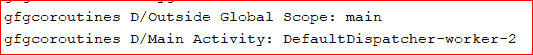
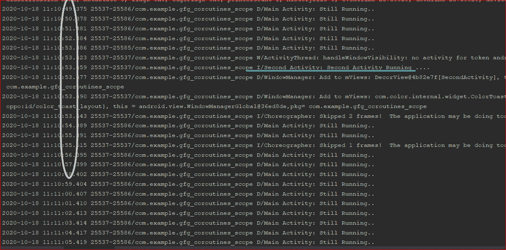
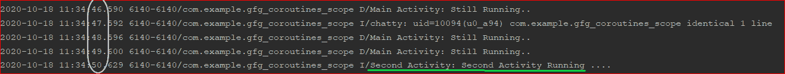

# 科特林验尸官中的瞄准镜

> 原文:[https://www.geeksforgeeks.org/scopes-in-kotlin-coroutines/](https://www.geeksforgeeks.org/scopes-in-kotlin-coroutines/)

**先决条件:**

*   [安卓上的科特林 corroutines](https://www.geeksforgeeks.org/kotlin-coroutines-on-android/)
*   [柯特林验尸官暂停功能](https://www.geeksforgeeks.org/suspend-function-in-kotlin-coroutines/)

柯特林协同程序中的范围可以定义为[柯特林协同程序](https://www.geeksforgeeks.org/kotlin-coroutines-on-android/)被执行的限制。范围有助于预测协同产品的生命周期。科特林验尸官基本上有 **3 个瞄准镜**:

1.  全球范围
2.  生命周期范围
3.  视图模型范围

### **要在 Build.gradle(应用程序级文件)中导入的依赖项**

将以下依赖项导入 [build.gradle (app)](https://www.geeksforgeeks.org/android-build-gradle/) 级文件。

> 实现' org . jet brains . kot linx:kot linx-coroutines-core:1 . 3 . 5 '
> 
> 实现' org . jet brains . kot linx:kot linx-coroutines-Android:1 . 3 . 5 '
> 
> def arch_version = '2.2.0-alpha01 '
> 
> 实现“androidx . life cycle:life cycle-view model-ktx:$ arch _ version”
> 
> 实现“androidx . life cycle:life cycle-runtime-ktx:$ arch _ version”

### 1.全球范围

全局范围是启动协同程序的方式之一。当 Coroutines 在全球范围内启动时，它们和应用程序一样长寿。如果协同程序完成了它的工作，它将被销毁，并且在应用程序死亡之前不会保持活动，但是让我们想象一种情况，当协同程序还有一些工作或指令要做，突然我们结束了应用程序，那么协同程序也将死亡，因为协同程序的最大生命周期等于应用程序的生命周期。在全球范围内推出的 Coroutines 将在单独的线程中推出。下面的例子显示了全局范围内的协同程序是在一个单独的线程中启动的。

## 我的锅

```
import android.os.Bundle
import android.util.Log
import androidx.appcompat.app.AppCompatActivity
import kotlinx.coroutines.GlobalScope
import kotlinx.coroutines.launch

class MainActivity : AppCompatActivity() {
    val TAG = "Main Activity"
    override fun onCreate(savedInstanceState: Bundle?) {
        super.onCreate(savedInstanceState)
        setContentView(R.layout.activity_main)
        GlobalScope.launch {
            Log.d(TAG, Thread.currentThread().name.toString())
        }
        Log.d("Outside Global Scope", Thread.currentThread().name.toString())
    }
}
```

以下是上述程序的日志输出:



众所周知，在全局范围内启动的协同程序只要应用程序运行，就会一直运行，但是当开发人员需要协同程序只要应用程序运行就一直运行时，这种情况是非常罕见的。在全球范围内启动的协同程序的主要问题是，当启动协同程序的活动死亡时，协同程序不会随着活动一起死亡，因为协同程序的生命周期是根据应用程序生命周期而不是活动生命周期决定的。由于协同程序正在使用启动它的活动的资源，现在由于该活动已经死亡，资源将不会被垃圾收集，因为协同程序仍然引用该资源。这个问题会导致内存泄漏。所以一直使用全局范围并不总是一个好主意。让我们尝试启动一个协同程序，运行一个延迟为 1 秒的无限循环，并通过终止第一个活动并意图执行另一个活动，在从开始延迟 5 秒后，在全局范围内启动另一个协同程序。我们可以在输出中看到，即使在第一个活动以编程方式终止之后，与第一个活动相关联的协同程序也不会死亡。让我们试着通过编程来理解上一段写的内容。下面是 **activity_main.xml** 和 **MainActivity.kt** 文件的代码。

## 可扩展标记语言

```
<?xml version="1.0" encoding="utf-8"?>
<androidx.constraintlayout.widget.ConstraintLayout
    xmlns:android="http://schemas.android.com/apk/res/android"
    xmlns:app="http://schemas.android.com/apk/res-auto"
    xmlns:tools="http://schemas.android.com/tools"
    android:layout_width="match_parent"
    android:layout_height="match_parent"
    tools:context=".MainActivity">

    <Button
        android:id="@+id/btnStartActivity"
        android:layout_width="wrap_content"
        android:layout_height="wrap_content"
        android:layout_marginStart="167dp"
        android:layout_marginTop="320dp"
        android:layout_marginEnd="156dp"
        android:layout_marginBottom="363dp"
        android:text="Start Activity"
        android:textSize="22sp"
        app:layout_constraintBottom_toBottomOf="parent"
        app:layout_constraintEnd_toEndOf="parent"
        app:layout_constraintStart_toStartOf="parent"
        app:layout_constraintTop_toTopOf="parent" />

</androidx.constraintlayout.widget.ConstraintLayout>
```

## 我的锅

```
// program for main activity which intent to another activity
// it uses global scope to launch the coroutine

import android.content.Intent
import android.os.Bundle
import android.util.Log
import androidx.appcompat.app.AppCompatActivity
import kotlinx.android.synthetic.main.activity_main.*
import kotlinx.coroutines.GlobalScope
import kotlinx.coroutines.delay
import kotlinx.coroutines.launch

const val TAG = "Main Activity"

class MainActivity : AppCompatActivity() {
    override fun onCreate(savedInstanceState: Bundle?) {
        super.onCreate(savedInstanceState)
        setContentView(R.layout.activity_main)

        btnStartActivity.setOnClickListener {
            // coroutine will launch when button got pressed
            GlobalScope.launch {
                // infinite loop
                while (true) {
                    delay(1000L)
                    Log.d(TAG, "Still Running..")
                }
            }

            GlobalScope.launch {
                delay(5000L)
                // new activity will get intended after 5 sec
                val intent = Intent(this@MainActivity, SecondActivity::class.java)
                startActivity(intent)
                // calling finish() method,so that first activity will not be alive
                // after being intended to second activity
                finish()
            }
        }
    }
}
```

转到 **app > java >第一个包名>右键单击>新建>活动>清空活动**创建一个新活动，并将其命名为**第二个活动**。下面是 **activity_second.xml** 和 **SecondActivity.kt** 文件的代码。

## 可扩展标记语言

```
<?xml version="1.0" encoding="utf-8"?>
<androidx.constraintlayout.widget.ConstraintLayout
    xmlns:android="http://schemas.android.com/apk/res/android"
    xmlns:app="http://schemas.android.com/apk/res-auto"
    xmlns:tools="http://schemas.android.com/tools"
    android:layout_width="match_parent"
    android:layout_height="match_parent"
    tools:context=".SecondActivity">

    <!--Various attributes for button-->
    <Button
        android:id="@+id/btnSecondActivity"
        android:layout_width="wrap_content"
        android:layout_height="wrap_content"
        android:layout_marginStart="166dp"
        android:layout_marginTop="331dp"
        android:layout_marginEnd="130dp"
        android:layout_marginBottom="352dp"
        android:gravity="center"
        android:text="Second Activity"
        android:textSize="22sp"
        app:layout_constraintBottom_toBottomOf="parent"
        app:layout_constraintEnd_toEndOf="parent"
        app:layout_constraintStart_toStartOf="parent"
        app:layout_constraintTop_toTopOf="parent" />

</androidx.constraintlayout.widget.ConstraintLayout>
```

## 我的锅

```
// program for second activity

import android.os.Bundle
import android.util.Log
import android.widget.Toast
import androidx.appcompat.app.AppCompatActivity

class SecondActivity : AppCompatActivity() {
    override fun onCreate(savedInstanceState: Bundle?) {
        super.onCreate(savedInstanceState)
        setContentView(R.layout.activity_second)
        Log.i("Second Activity", "Second Activity Running ....")
        Toast.makeText(this, "Second Activity", Toast.LENGTH_SHORT).show()
    }
}
```

**输出:**

<video class="wp-video-shortcode" id="video-501410-1" width="640" height="360" preload="metadata" controls=""><source type="video/mp4" src="https://media.geeksforgeeks.org/wp-content/uploads/20201018110933/Coroutine_Scope.mp4?_=1">[https://media.geeksforgeeks.org/wp-content/uploads/20201018110933/Coroutine_Scope.mp4](https://media.geeksforgeeks.org/wp-content/uploads/20201018110933/Coroutine_Scope.mp4)</video>

从下面的日志中可以看出，即使在第二个活动启动后，主活动的协同程序仍然在运行。椭圆形圆圈用于显示时间戳。



### 2.生命周期范围

生命周期范围与全局范围相同，但唯一的区别是，当我们使用生命周期范围时，活动中启动的所有协同工作也会随着活动的结束而结束。这是有益的，因为即使在我们的活动结束后，我们的花冠也不会继续运行。为了在我们的项目中实现生命周期范围，只需在生命周期范围而不是全局范围中启动 coroutine，即只需在运行无限循环的主活动中将全局范围更改为生命周期范围。除了上面提到的主要活动代码的一些变化之外，所有代码都将保持不变。

## 我的锅

```
// program to show how lifecycle scope works

import android.content.Intent
import android.os.Bundle
import android.util.Log
import androidx.appcompat.app.AppCompatActivity
import androidx.lifecycle.lifecycleScope
import kotlinx.android.synthetic.main.activity_main.*
import kotlinx.coroutines.GlobalScope
import kotlinx.coroutines.delay
import kotlinx.coroutines.launch

const val TAG = "Main Activity"

class MainActivity : AppCompatActivity() {
    override fun onCreate(savedInstanceState: Bundle?) {
        super.onCreate(savedInstanceState)
        setContentView(R.layout.activity_main)

        btnStartActivity.setOnClickListener {
            // launching the coroutine in the lifecycle scope
            lifecycleScope.launch {
                while (true) {
                    delay(1000L)
                    Log.d(TAG, "Still Running..")
                }
            }

            GlobalScope.launch {
                delay(5000L)
                val intent = Intent(this@MainActivity, SecondActivity::class.java)
                startActivity(intent)
                finish()
            }
        }
    }
}
```

**日志输出:**

椭圆形圆圈用于显示时间戳。



在上面的日志输出中可以看到，主活动在第二个活动启动后停止 get 打印。

### 3.视图模型范围

它也与生命周期范围相同，唯一的区别是，只要视图模型还活着，这个范围中的协同程序就会存在。ViewModel 是一个通过遵循 android 中[生命周期系统的原理来管理和存储 UI 相关数据的类。](https://www.geeksforgeeks.org/activity-lifecycle-in-android-with-demo-app/)如果想深入了解基本视图模型类是什么，可以参考[这个安卓官方文档的链接](https://developer.android.com/topic/libraries/architecture/viewmodel)。