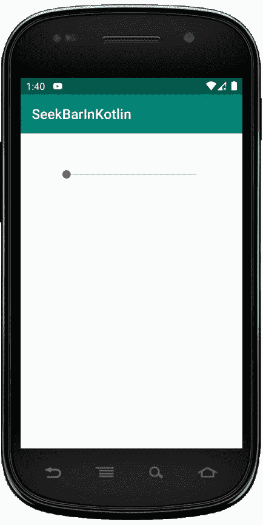
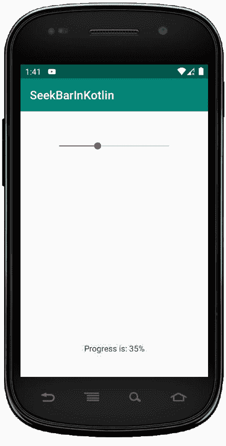

# 在科特林中看到 kbar

> 原文:[https://www.geeksforgeeks.org/seekbar-in-kotlin/](https://www.geeksforgeeks.org/seekbar-in-kotlin/)

安卓 **seekBar** 是 progressBar 的修改版，有可拖动的拇指，用户可以前后拖动拇指来设置当前进度值。我们可以在安卓设备中使用 seekbar，比如亮度控制、音量控制等。

它是重要的用户界面元素之一，提供了在定义的范围内选择整数值的选项，如 1 到 100。

通过在 SeekBar 中拖动拇指，我们可以来回滑动，在我们使用 `android:min` 和`android:max`属性定义的最小和最大整数值之间选择一个值。分别是。

首先，我们按照以下步骤创建一个新项目:

1.  点击**文件**，然后**新建** = > **新建项目**。
2.  之后加入 Kotlin 支持，点击下一步。
3.  根据方便选择最小 SDK，点击下一步按钮。
4.  然后选择**清空**活动= > **下一个** = > **完成**。

## 安卓 SeekBar 小部件的不同属性

| XML 属性 | 描述 |
| --- | --- |
| android:id | 用于唯一标识控件。 |
| 安卓:拇指 | 用于设置可拉伸的，用作可以前后移动的拇指。 |
| Android:thumbint | 用于设置应用于拇指的色调。 |
| android:min | 用于指定最小值。 |
| android:最大 | 用于指定最大值。 |
| 安卓:进步 | 用于指定 0 到 100 之间的默认进度值。 |
| 机器人：进度可绘制 | 用于指定进度的可绘制模式。 |
| 安卓:背景 | 用于设置指定视图的背景。 |
| 安卓:填充 | 用于从左、右、上、下设置填充。 |

## 修改 activity_main.xml 文件

这里，我们将在 LinearLayout 中添加 Seekbar 小部件，并设置其属性，如 id、边距等。

```
<?xml version="1.0" encoding="utf-8"?>
<LinearLayout
xmlns:android="http://schemas.android.com/apk/res/android"
xmlns:tools="http://schemas.android.com/tools"
android:id="@+id/container"
android:layout_width="match_parent"
android:layout_height="match_parent"
tools:context=".MainActivity"
android:orientation="vertical">

    <SeekBar
        android:id="@+id/seekBar"
        android:layout_width="match_parent"
        android:layout_height="wrap_content"
        android:layout_margin="50dp"
        android:max="100"
        android:min="0" />
</LinearLayout>
```

**在字符串. xml 文件中指定的应用程序名称**

```
<resources>
    <string name="app_name">SeekBarInKotlin</string>
</resources>
```

## MainActivity.kt 文件

在文件中，我们首先声明一个变量 *seek* ，并使用 id 从 xml 文件中调用 seekbar。

```
val seek = findViewById(R.id.seekBar)
```

然后，**设置点击监听器**对 seekBar 执行一些操作。

```
seek?.setOnSeekBarChangeListener
```

并使用显示祝酒词

```
Toast.makeText(this@MainActivity,
   "Progress is: " + seek.progress + "%",
    Toast.LENGTH_SHORT).show()

```

```
package com.geeksforgeeks.myfirstkotlinapp

import androidx.appcompat.app.AppCompatActivity
import android.os.Bundle
import android.widget.SeekBar
import android.widget.Toast

class MainActivity : AppCompatActivity() {

    override fun onCreate(savedInstanceState: Bundle?) {
        super.onCreate(savedInstanceState)
        setContentView(R.layout.activity_main)

        val seek = findViewById<SeekBar>(R.id.seekBar)
        seek?.setOnSeekBarChangeListener(object :
            SeekBar.OnSeekBarChangeListener {
        override fun onProgressChanged(seek: SeekBar,
              progress: Int, fromUser: Boolean) {
          // write custom code for progress is changed
        }

        override fun onStartTrackingTouch(seek: SeekBar) {
            // write custom code for progress is started
        }

         override fun onStopTrackingTouch(seek: SeekBar) {
                // write custom code for progress is stopped
          Toast.makeText(this@MainActivity,
               "Progress is: " + seek.progress + "%",
                Toast.LENGTH_SHORT).show()
            }
        })
    }
}
```

## AndroidManifest.xml 文件

```
<?xml version="1.0" encoding="utf-8"?>
<manifest xmlns:android="http://schemas.android.com/apk/res/android"
package="com.geeksforgeeks.myfirstkotlinapp">

<application
    android:allowBackup="true"
    android:icon="@mipmap/ic_launcher"
    android:label="@string/app_name"
    android:roundIcon="@mipmap/ic_launcher_round"
    android:supportsRtl="true"
    android:theme="@style/AppTheme">
    <activity android:name=".MainActivity">
        <intent-filter>
            <action android:name="android.intent.action.MAIN" />

            <category android:name="android.intent.category.LAUNCHER" />
        </intent-filter>
    </activity>
</application>

</manifest>
```

## 作为模拟器运行:

