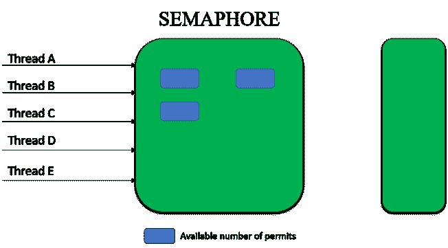

# 科特林的信号量

> 原文:[https://www.geeksforgeeks.org/semaphores-in-kotlin/](https://www.geeksforgeeks.org/semaphores-in-kotlin/)

[信号量](https://www.geeksforgeeks.org/semaphores-in-process-synchronization/)是一组许可。假设它是一个盒子，里面有参加(执行)任务的令牌(许可证)。线程可以访问信号量，但不能访问那些许可。根据许可的数量，当一个线程到达信号量时，就会给出一个许可。如果线程到达时没有可用的许可，它必须等待，直到一个许可被分配给它。只有这样才能执行任务。

基本上，信号量用于多线程或多线程应用程序。一个应用程序中可以运行多个进程。信号量的使用是为了限制或控制多个线程(进程)对任何公共资源的访问。根据定义，信号量用于从一个任务到另一个任务的信号传递。它们允许灵活的资源管理。

#### 利用信号量实现多线程进程的虚拟化

1.  到达资源信号量的线程。
    
2.  信号量向线程分配许可，如果达不到许可，则停止其余线程。将许可分配给线程的过程称为**获取**。
    T3】
3.  先前运行的线程在任务完成时释放许可。这些许可现在被分配给暂停的线程。线程发回许可的过程称为**释放**。
    T3】

下面的程序在 **Kotlin** 中，一个信号量用于在多线程进程中运行一些活动的例子:

*   信号量的允许值为 2，这意味着一次只能运行 2 个线程。
*   下面代码中声明的线程具有 10 秒(10000 毫秒)的睡眠活动，这意味着任何线程都可以获得 10 秒的许可。
*   打印功能被声明为“打印”。表示线程活动已完成，许可证已发放。
*   由于没有给任何线程分配优先级，所有线程都有一个 NORM_PRIORITY(默认优先级= 5)，并且优先选择最先到达的线程。

```kt
import java.util.concurrent.Semaphore

val s = Semaphore(2)

val t1 = Thread(Runnable 
{
    s.acquireUninterruptibly()
    print("t1")
    Thread.sleep(10000)
    print(".")
    s.release()
})

val t2 = Thread(Runnable 
{
    s.acquireUninterruptibly()
    print("t2")
    Thread.sleep(10000)
    print(".")
    s.release()
})

val t3 = Thread(Runnable 
{
    s.acquireUninterruptibly()
    print("t3")
    Thread.sleep(10000)
    print(".")
    s.release()
})

val t4 = Thread(Runnable 
{
    s.acquireUninterruptibly()
    print("t4")
    Thread.sleep(10000)
    print(".")
    s.release()
})

t1.start()
t2.start()
t3.start()
t4.start()
```

**输出:**

```kt
t1t2..t3t4..

```

这里是 2 个点，即在输出“..”中表示许可获取和许可释放之间的 10 秒等待(线程.睡眠)。

> **注**:可以设置线程优先级。在这种情况下，线程是按优先级顺序排列的，同样，许可也被分配给它们。根据进程所需的资源数量，可以声明多个信号量。