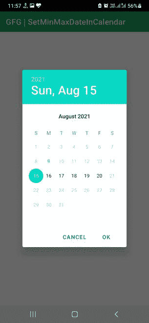

# 在安卓

的日期选择器对话框中设置最小和最大可选日期

> 原文:[https://www . geesforgeks . org/set-min-and-max-可选日期-in-date picker-in-dialog-Android/](https://www.geeksforgeeks.org/set-min-and-max-selectable-dates-in-datepicker-dialog-in-android/)

像旅游、剧院、电影、戏剧、约会、提醒等的订票应用。，要求用户选择特定的日期或时间来确认时段或预订。在大多数这类应用中，需要选择一项服务，然后用户必须选择一个插槽才能继续。此时，在选择日期时，通常会显示当前日历月或最近的可用日期。然而，并不是所有的日期都显示了该时段的可用性。有意地，过去的日期总是灰色的，这意味着一个人不能在过去的日期预订一个时段。此外，如果服务提供商在未来某一天的时段数量有限或没有时段，则这些日期将灰显。类似地，服务提供商也可以接受一系列日期的预订，他们可以相应地提供便利。因此，在本文中，我们将向您展示如何显示日历，并在其中选择一系列日期。集成开发环境启动后，请按照以下步骤操作。

### 逐步实施

**第一步:在安卓工作室新建项目**

要在安卓工作室创建新项目，请参考[如何在安卓工作室创建/启动新项目](https://www.geeksforgeeks.org/android-how-to-create-start-a-new-project-in-android-studio/)。我们在 **Kotlin** 中演示了该应用程序，因此在创建新项目时，请确保选择 Kotlin 作为主要语言。

**步骤 2:使用 activity_main.xml 文件**

导航到**应用程序> res >布局> activity_main.xml** 并将下面的代码添加到该文件中。下面是 **activity_main.xml** 文件的代码。

## 可扩展标记语言

```
<?xml version="1.0" encoding="utf-8"?>
<RelativeLayout
    xmlns:android="http://schemas.android.com/apk/res/android"
    xmlns:app="http://schemas.android.com/apk/res-auto"
    xmlns:tools="http://schemas.android.com/tools"
    android:layout_width="match_parent"
    android:layout_height="match_parent"
    tools:context=".MainActivity">
</RelativeLayout>
```

**第三步:使用**T2【主活动. kt】文件

转到 **MainActivity.kt** 文件，参考以下代码。下面是 **MainActivity.kt** 文件的代码。代码中添加了注释，以更详细地理解代码。

## 我的锅

```
import android.app.DatePickerDialog
import androidx.appcompat.app.AppCompatActivity
import android.os.Bundle
import java.util.*

class MainActivity : AppCompatActivity() {
    override fun onCreate(savedInstanceState: Bundle?) {
        super.onCreate(savedInstanceState)
        setContentView(R.layout.activity_main)

        // Get instance of calendar
        // mCalendar will be set to current/today's date
        val mCalendar = Calendar.getInstance()

        // Creating a simple calendar dialog. 
          // It was 9 Aug 2021 when this program was developed.
        val mDialog = DatePickerDialog(this, { _, mYear, mMonth, mDay ->
            mCalendar[Calendar.YEAR] = mYear
            mCalendar[Calendar.MONTH] = mMonth
            mCalendar[Calendar.DAY_OF_MONTH] = mDay
        }, mCalendar[Calendar.YEAR], mCalendar[Calendar.MONTH], mCalendar[Calendar.DAY_OF_MONTH])

        // Changing mCalendar date from current to
          // some random MIN day 15/08/2021 15 Aug 2021
        // If we want the same current day to be the MIN day,
          // then mCalendar is already set to today 
          // and the below code will be unnecessary
        val minDay = 15
        val minMonth = 8
        val minYear = 2021
        mCalendar.set(minYear, minMonth-1, minDay)
        mDialog.datePicker.minDate = mCalendar.timeInMillis

        // Changing mCalendar date from current to
          // some random MAX day 20/08/2021 20 Aug 2021
        val maxDay = 20
        val maxMonth = 8
        val maxYear = 2021
        mCalendar.set(maxYear, maxMonth-1, maxDay)
        mDialog.datePicker.maxDate = mCalendar.timeInMillis

        // Display the calendar dialog
        mDialog.show()

    }
}
```

**输出:**

您可以看到，我们只能从特定范围内选择日期。其余的是灰色的。

