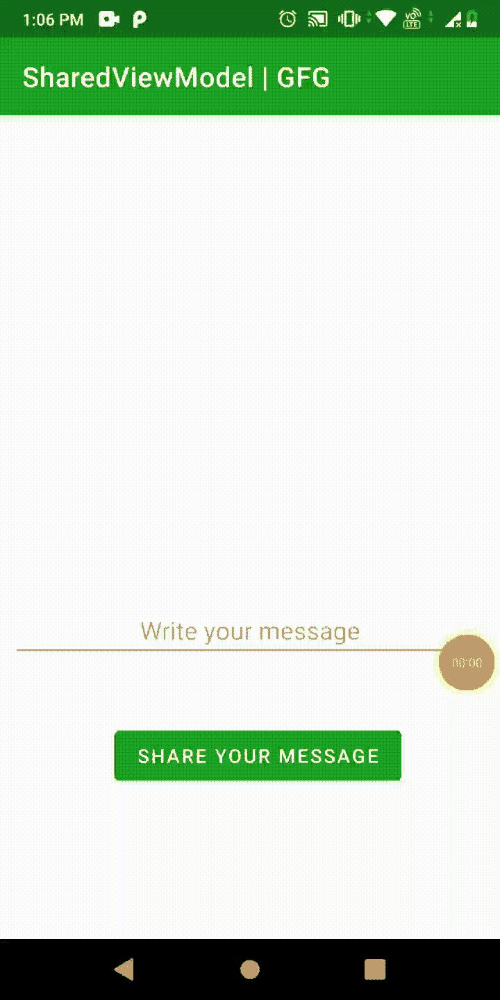

# 安卓共享视图模型

> 原文:[https://www.geeksforgeeks.org/shared-viewmodel-in-android/](https://www.geeksforgeeks.org/shared-viewmodel-in-android/)

在安卓系统中，我们可以使用[**视图模型**](https://www.geeksforgeeks.org/viewmodel-in-android-architecture-components/)**通过在所有片段之间共享相同的视图模型来在各种片段或活动之间共享数据，并且它们可以访问视图模型中定义的所有内容。这是片段或活动之间进行交流的一种方式。几乎每个应用程序在不同的活动或片段之间都有一些通信。**

### ****本文我们要构建什么？****

**在文章中，我们将学习 Android 中的 Shared ViewModel 来与其他片段进行通信。我们将开发一个包含两个片段的应用程序，其中一个片段更新视图模型中的数据，视图模型在两个片段之间共享，另一个片段观察数据的变化并在屏幕上显示更新的数据。应用程序的工作是发送->接收->显示消息。下面给出了一个示例 GIF，以了解我们将在本文中做什么。**

****

### ****分步实施****

****第一步:创建新项目****

**要在安卓工作室创建新项目，请参考[如何在安卓工作室创建/启动新项目](https://www.geeksforgeeks.org/android-how-to-create-start-a-new-project-in-android-studio/)。请注意，选择 Kotlin 作为编程语言。**

****第二步:创建类 SharedViewModel****

**转到 **SharedViewModel.kt** 文件，参考以下代码。下面是 SharedViewModel.kt 文件的代码。代码中添加了注释，以更详细地理解代码。**

## **我的锅**

```
import androidx.lifecycle.MutableLiveData
import androidx.lifecycle.ViewModel

class SharedViewModel : ViewModel() {

    // variable to contain message whenever
      // it gets changed/modified(mutable)
    val message = MutableLiveData<String>()

    // function to send message
    fun sendMessage(text: String) {
        message.value = text
    }
}
```

****步骤 3:创建两个片段，它们是–MessageSenderFragment&MessageReceiverFragment****

****消息发送接收单元**–发送将由**消息接收单元**接收的消息。它将有一个按钮，点击后发送消息。转到 **MessageSenderFragment.kt** 文件并参考以下代码。下面是 MessageSenderFragment.kt 文件的代码。代码中添加了注释，以更详细地理解代码。**

## **我的锅**

```
import android.os.Bundle
import androidx.fragment.app.Fragment
import android.view.LayoutInflater
import android.view.View
import android.view.ViewGroup
import android.widget.Button
import android.widget.EditText
import androidx.lifecycle.ViewModelProvider

class MessageSenderFragment : Fragment() {

      // to send message
    lateinit var btn: Button 

      // to write message
    lateinit var writeMSg: EditText 

    override fun onCreateView(
        inflater: LayoutInflater,
        container: ViewGroup?,
        savedInstanceState: Bundle?
    ): View? {
        return inflater.inflate(R.layout.fragment_message_sender, container, false)
    }

    override fun onViewCreated(view: View, savedInstanceState: Bundle?) {
        super.onViewCreated(view, savedInstanceState)

          // reference for button and EditText
        btn = view.findViewById(R.id.button)
        writeMSg = view.findViewById(R.id.writeMessage)

          // create object of SharedViewModel
        val model = ViewModelProvider(requireActivity()).get(SharedViewModel::class.java)

          // call function "sendMessage" defined in SharedVieModel
          // to store the value in message.
        btn.setOnClickListener { model.sendMessage(writeMSg.text.toString()) }
    }
}
```

**导航到**应用程序>RES>fragment _ message _ sender . XML**，并将下面的代码添加到该文件中。下面是**片段文件的代码。****

## **可扩展标记语言**

```
<?xml version="1.0" encoding="utf-8"?>
<androidx.constraintlayout.widget.ConstraintLayout
    xmlns:android="http://schemas.android.com/apk/res/android"
    xmlns:app="http://schemas.android.com/apk/res-auto"
    android:layout_width="match_parent"
    android:layout_height="match_parent">

    <EditText
        android:id="@+id/writeMessage"
        android:layout_width="match_parent"
        android:layout_height="wrap_content"
        android:hint="Write your message"
        android:textAlignment="center"
        app:layout_constraintBottom_toTopOf="@+id/button"
        app:layout_constraintEnd_toEndOf="parent"
        app:layout_constraintStart_toStartOf="parent"
        app:layout_constraintTop_toTopOf="parent" />

    <Button
        android:id="@+id/button"
        android:layout_width="wrap_content"
        android:layout_height="wrap_content"
        android:layout_marginBottom="100dp"
        android:text="Share Your Message"
        app:layout_constraintBottom_toBottomOf="parent"
        app:layout_constraintEnd_toEndOf="parent"
        app:layout_constraintStart_toStartOf="parent" />

</androidx.constraintlayout.widget.ConstraintLayout>
```

**MessageReceiverFragment–接收 MessageSenderFragment 发送的消息。它将有一个文本视图在屏幕上显示更新的消息。转到**messagereceiverfragment . kt**文件，参考以下代码。下面是 MessageReceiverFragment.kt 文件的代码。代码中添加了注释，以更详细地理解代码。**

## **我的锅**

```
class MessageReceiverFragment : Fragment() {
    // to contain and display shared message
    lateinit var displayMsg: TextView
    override fun onCreateView(
        inflater: LayoutInflater,
        container: ViewGroup?,
        savedInstanceState: Bundle?
    ): View? {
        // inflate the fragment layout
        return inflater.inflate(R.layout.fragment_message_receiver, container, false)
    }

    override fun onViewCreated(view: View, savedInstanceState: Bundle?) {
        super.onViewCreated(view, savedInstanceState)
        // reference for the container declared above
        displayMsg = view.findViewById(R.id.textViewReceiver)
        // create object of SharedViewModel
        val model = ViewModelProvider(requireActivity()).get(SharedViewModel::class.java)
        // observing the change in the message declared in SharedViewModel
        model.message.observe(viewLifecycleOwner, Observer {
            // updating data in displayMsg
            displayMsg.text = it
        })
    }
}
```

**导航到**应用程序>RES>fragment _ message _ receiver . XML**，并将下面的代码添加到该文件中。下面是**片段文件的代码。****

## **可扩展标记语言**

```
<?xml version="1.0" encoding="utf-8"?>
<androidx.constraintlayout.widget.ConstraintLayout
    xmlns:android="http://schemas.android.com/apk/res/android"
    xmlns:app="http://schemas.android.com/apk/res-auto"
    android:layout_width="match_parent"
    android:layout_height="match_parent">

    <TextView
        android:id="@+id/textViewReceiver"
        android:layout_width="wrap_content"
        android:layout_height="wrap_content"
        android:textSize="20sp"
        android:textColor="@color/black"
        android:textAlignment="center"
        app:layout_constraintBottom_toBottomOf="parent"
        app:layout_constraintEnd_toEndOf="parent"
        app:layout_constraintStart_toStartOf="parent"
        app:layout_constraintTop_toTopOf="parent" />

</androidx.constraintlayout.widget.ConstraintLayout>
```

**我们已经创建了**共享视图模型**的对象，该对象与我们作为所有者使用同一单个活动的对象相同。 ***这就是它被共享的原因*** **。**请注意，我们在两个片段中都使用了 [requireActivity()](https://stackoverflow.com/questions/61045573/what-is-the-difference-between-requireactivity-and-onactivitycreated#:~:text=requireActivity()%20a%20method%20that,catch%20block%20to%20avoid%20NullPointerException.) 。**

> **。。。**
> 
> **[ViewModelProvider](https://developer.android.com/reference/android/arch/lifecycle/ViewModelProviders)(require activity())。get(SharedViewModel::class . Java)**
> 
> **。。。**

****第三步:更新 activity_main.xml****

**该活动由两个片段组成，并且是这两个片段的宿主。**

## **可扩展标记语言**

```
<?xml version="1.0" encoding="utf-8"?>
<androidx.constraintlayout.widget.ConstraintLayout
    xmlns:android="http://schemas.android.com/apk/res/android"
    xmlns:app="http://schemas.android.com/apk/res-auto"
    xmlns:tools="http://schemas.android.com/tools"
    android:layout_width="match_parent"
    android:layout_height="match_parent"
    tools:context=".MainActivity">

    <fragment
        android:id="@+id/receiverFragment"
        android:name="com.gfg.article.sharedviewmodel.MessageReceiverFragment"
        android:layout_width="match_parent"
        android:layout_height="0dp"
        android:layout_marginStart="8dp"
        android:layout_marginTop="8dp"
        android:layout_marginEnd="8dp"
        android:layout_marginBottom="8dp"
        app:layout_constraintBottom_toTopOf="@+id/senderFragment"
        app:layout_constraintEnd_toEndOf="parent"
        app:layout_constraintHorizontal_bias="0.5"
        app:layout_constraintStart_toStartOf="parent"
        app:layout_constraintTop_toTopOf="parent" />

    <fragment
        android:id="@+id/senderFragment"
        android:name="com.gfg.article.sharedviewmodel.MessageSenderFragment"
        android:layout_width="match_parent"
        android:layout_height="0dp"
        android:layout_marginStart="8dp"
        android:layout_marginTop="8dp"
        android:layout_marginEnd="8dp"
        android:layout_marginBottom="8dp"
        app:layout_constraintBottom_toBottomOf="parent"
        app:layout_constraintEnd_toEndOf="parent"
        app:layout_constraintHorizontal_bias="0.5"
        app:layout_constraintStart_toStartOf="parent"
        app:layout_constraintTop_toBottomOf="@+id/receiverFragment" />

</androidx.constraintlayout.widget.ConstraintLayout>
```

****MainActivity.kt** 保持原样。**

## **我的锅**

```
mport androidx.appcompat.app.AppCompatActivity
import android.os.Bundle

class MainActivity : AppCompatActivity() {
    override fun onCreate(savedInstanceState: Bundle?) {
        super.onCreate(savedInstanceState)
        setContentView(R.layout.activity_main)
    }
}
```

**现在，运行该应用程序。**

****输出:****

**<video class="wp-video-shortcode" id="video-681557-1" width="640" height="360" preload="metadata" controls=""><source type="video/mp4" src="https://media.geeksforgeeks.org/wp-content/uploads/20210914152558/sharedViewModel.mp4?_=1">[https://media.geeksforgeeks.org/wp-content/uploads/20210914152558/sharedViewModel.mp4](https://media.geeksforgeeks.org/wp-content/uploads/20210914152558/sharedViewModel.mp4)</video>**

****源代码:** [点击此处](https://media.geeksforgeeks.org/wp-content/cdn-uploads/20210916235305/Blogathon-GFG-main.zip)**