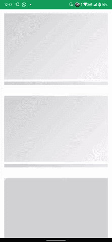

# 使用 Jetpack Compose

在安卓中闪烁动画

> 原文:[https://www . geesforgeks . org/shimmer-Android 中的动画-使用-jetpack-compose/](https://www.geeksforgeeks.org/shimmer-animation-in-android-using-jetpack-compose/)

**先决条件:**

*   [科特林](https://www.geeksforgeeks.org/kotlin-programming-language/)基础知识
*   [喷气背包合成](https://www.geeksforgeeks.org/basics-of-jetpack-compose-in-android/)基础知识

微光动画是由脸书创建的，用于在从服务器获取图像时显示加载屏幕。现在我们在很多地方都能看到闪光的动画。在本文中，我们将看看使用全新的[喷气背包合成](https://www.geeksforgeeks.org/basics-of-jetpack-compose-in-android/)实现微光动画。下面给出了一个示例 GIF，以了解我们将在本文中做什么。



### **分步实施**

**步骤 1:创建一个新项目**(或者在现有的合成项目中使用它)

要在 Android Studio Canary 版本中创建新项目，请参考文章[如何使用 Jetpack Compose 在 Android Studio Canary 版本中创建新项目。](https://www.geeksforgeeks.org/how-to-create-a-new-project-in-android-studio-canary-version-with-jetpack-compose/)

**第二步:添加颜色**

在进行动画编码之前，添加闪烁动画所需的颜色。打开 **Colors.kt** (出现在 ui/主题/Colors.kt 中)

> *val ShimmerColorShades = listOf(*
> 
> *颜色。LightGray.copy(0.9f)，*
> 
> *颜色。LightGray.copy(0.2f)，*
> 
> *颜色。LightGray.copy(0.9f)*
> 
> *)*

这是一个可堆肥的背景颜色列表，它将被动画化，注意索引 1 处的颜色，这部分将改变它的位置，给出微光效果。

**第三步:使用 MainActivity.kt 文件**

创建一个动画将要发生的可组合函数

## 我的锅

```kt
@Composable
fun ShimmerItem(
    brush: Brush
) {
   // Column composable containing spacer shaped like a rectangle,
   // set the [background]'s [brush] with the brush receiving from [ShimmerAnimation]
   // Composable which is the Animation you are gonna create.
   Column(modifier = Modifier.padding(16.dp)) {
        Spacer(
            modifier = Modifier
                .fillMaxWidth()
                .size(250.dp)
                .background(brush = brush)
        )
        Spacer(
            modifier = Modifier
                .fillMaxWidth()
                .height(30.dp)
                .padding(vertical = 8.dp)
                .background(brush = brush)
        )
    }
}
```

让我们创建动画。创建一个新的可组合函数。

## 我的锅

```kt
@Composable
fun ShimmerAnimation(
) {

    /*
     Create InfiniteTransition
     which holds child animation like [Transition]
     animations start running as soon as they enter
     the composition and do not stop unless they are removed
    */
    val transition = rememberInfiniteTransition()
    val translateAnim by transition.animateFloat(
        /*
         Specify animation positions,
         initial Values 0F means it
         starts from 0 position
        */
        initialValue = 0f,
        targetValue = 1000f,
        animationSpec = infiniteRepeatable(

            // Tween Animates between values over specified [durationMillis]
            tween(durationMillis = 1200, easing = FastOutSlowInEasing),
            RepeatMode.Reverse
        )
    )

    /*
      Create a gradient using the list of colors
      Use Linear Gradient for animating in any direction according to requirement
      start=specifies the position to start with in cartesian like system Offset(10f,10f) means x(10,0) , y(0,10)
      end = Animate the end position to give the shimmer effect using the transition created above
    */
    val brush = Brush.linearGradient(
        colors = ShimmerColorShades,
        start = Offset(10f, 10f),
        end = Offset(translateAnim, translateAnim)
    )

    ShimmerItem(brush = brush)
}
```

调用将要制作动画的微光元素，并传递画笔对象，

**第四步:将动画微光放在屏幕上**

课堂主要活动

## 我的锅

```kt
class MainActivity : ComponentActivity() {
    override fun onCreate(savedInstanceState: Bundle?) {
        super.onCreate(savedInstanceState)
        setContent {
            ShimmerAnimationTheme(darkTheme = false) {
                Surface(color = MaterialTheme.colors.background) {

                    /*
                      Lazy column as I am adding multiple items for display purpose
                      create you UI according to requirement
                    */
                    LazyColumn {

                        /*
                          Lay down the Shimmer Animated item 5 time
                          [repeat] is like a loop which executes the body
                          according to the number specified
                        */
                        repeat(5) {
                            item {
                                ShimmerAnimation()
                            }
                        }
                    }
                }
            }
        }
    }
}
```

我们结束了。这是 **MainActivity.kt** 文件的最终代码。

## 我的锅

```kt
import android.os.Bundle
import androidx.activity.ComponentActivity
import androidx.activity.compose.setContent
import androidx.compose.animation.core.*
import androidx.compose.foundation.background
import androidx.compose.foundation.layout.*
import androidx.compose.foundation.lazy.LazyColumn
import androidx.compose.material.MaterialTheme
import androidx.compose.material.Surface
import androidx.compose.material.Text
import androidx.compose.runtime.Composable
import androidx.compose.runtime.getValue
import androidx.compose.ui.Modifier
import androidx.compose.ui.geometry.Offset
import androidx.compose.ui.graphics.Brush
import androidx.compose.ui.tooling.preview.Preview
import androidx.compose.ui.unit.dp
import com.example.shimmeranimation.ui.theme.ShimmerAnimationTheme
import com.example.shimmeranimation.ui.theme.ShimmerColorShades

class MainActivity : ComponentActivity() {
    override fun onCreate(savedInstanceState: Bundle?) {
        super.onCreate(savedInstanceState)
        setContent {
            ShimmerAnimationTheme(darkTheme = false) {
                Surface(color = MaterialTheme.colors.background) {

                    /*
                      Lazy column as I am adding multiple items for display purpose
                      create you UI according to requirement
                     */
                    LazyColumn {

                        /**
                          Lay down the Shimmer Animated item 5 time
                          [repeat] is like a loop which executes the body
                          according to the number specified
                         */
                        repeat(5) {
                            item {
                                ShimmerAnimation()

                            }
                        }
                    }
                }
            }
        }
    }
}

@Composable
fun ShimmerAnimation(
) {

    /*
    Create InfiniteTransition
    which holds child animation like [Transition]
    animations start running as soon as they enter
    the composition and do not stop unless they are removed
    */
    val transition = rememberInfiniteTransition()
    val translateAnim by transition.animateFloat(
        /*
        Specify animation positions,
        initial Values 0F means it starts from 0 position
        */
        initialValue = 0f,
        targetValue = 1000f,
        animationSpec = infiniteRepeatable(

            /*
             Tween Animates between values over specified [durationMillis]
            */
            tween(durationMillis = 1200, easing = FastOutSlowInEasing),
            RepeatMode.Reverse
        )
    )

    /*
      Create a gradient using the list of colors
      Use Linear Gradient for animating in any direction according to requirement
      start=specifies the position to start with in cartesian like system Offset(10f,10f) means x(10,0) , y(0,10)
      end= Animate the end position to give the shimmer effect using the transition created above
    */
    val brush = Brush.linearGradient(
        colors = ShimmerColorShades,
        start = Offset(10f, 10f),
        end = Offset(translateAnim, translateAnim)
    )

    ShimmerItem(brush = brush)

}

@Composable
fun ShimmerItem(
    brush: Brush
) {

    /*
      Column composable shaped like a rectangle,
      set the [background]'s [brush] with the
      brush receiving from [ShimmerAnimation]
      which will get animated.
      Add few more Composable to test
    */
    Column(modifier = Modifier.padding(16.dp)) {
        Spacer(
            modifier = Modifier
                .fillMaxWidth()
                .size(250.dp)
                .background(brush = brush)
        )
        Spacer(
            modifier = Modifier
                .fillMaxWidth()
                .height(30.dp)
                .padding(vertical = 8.dp)
                .background(brush = brush)
        )
    }
}
```

**输出:**

<video class="wp-video-shortcode" id="video-607031-1" width="640" height="360" preload="metadata" controls=""><source type="video/mp4" src="https://media.geeksforgeeks.org/wp-content/uploads/20210514001534/screen-20210514-001259_2.mp4?_=1">[https://media.geeksforgeeks.org/wp-content/uploads/20210514001534/screen-20210514-001259_2.mp4](https://media.geeksforgeeks.org/wp-content/uploads/20210514001534/screen-20210514-001259_2.mp4)</video>

获得完整的[项目](https://github.com/sunny52525/GFG-articles/tree/master/Shimmer%20Animation)。