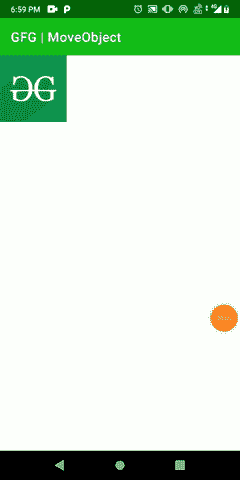

# 安卓中带有触摸事件的简单移动物体

> 原文:[https://www . geesforgeks . org/simple-move-object-with-touch events-in-Android/](https://www.geeksforgeeks.org/simple-moving-object-with-touchevents-in-android/)

在本文中，我们将制作一个应用程序，通过它，用户可以根据他/她的手指在屏幕上的移动来移动屏幕上可见的对象。触摸拖动/移动对象(如图像、按钮)在拼图游戏等游戏中非常流行。这里我们将创建一个简单的方法来触摸和拖动设备屏幕上的图像在用户完成这个动作后，图像将有一个新的位置在设备屏幕上通过使用视图 [**到图监听器**](https://developer.android.com/reference/android/view/View.OnTouchListener) 。下面给出了一个示例 GIF，以了解我们将在本文中做什么。注意，我们将使用**柯特林**语言来实现这个项目。



### **分步实施**

**第一步:创建新项目**

要在安卓工作室创建新项目，请参考[如何在安卓工作室创建/启动新项目](https://www.geeksforgeeks.org/android-how-to-create-start-a-new-project-in-android-studio/)。注意选择**科特林**作为编程语言。

**第二步:在布局中设置任意图像对象**

导航到**应用程序> res >布局> activity_main.xml** 并将下面的代码添加到该文件中。下面是 **activity_main.xml** 文件的代码。

## 可扩展标记语言

```kt
<?xml version="1.0" encoding="utf-8"?>
<androidx.constraintlayout.widget.ConstraintLayout
    xmlns:android="http://schemas.android.com/apk/res/android"
    xmlns:app="http://schemas.android.com/apk/res-auto"
    android:layout_width="match_parent"
    android:layout_height="match_parent">

    <RelativeLayout
        android:id="@+id/main"
        android:layout_width="match_parent"
        android:layout_height="match_parent"
        app:layout_constraintBottom_toBottomOf="parent"
        app:layout_constraintEnd_toEndOf="parent"
        app:layout_constraintStart_toStartOf="parent"
        app:layout_constraintTop_toTopOf="parent">

        <ImageView
            android:id="@+id/image"
            android:layout_width="100dp"
            android:layout_height="100dp"
            android:contentDescription="moving object"
            android:src="@drawable/gfg" />

    </RelativeLayout>

</androidx.constraintlayout.widget.ConstraintLayout>
```

**第三步:使用**T2【主活动. kt】文件

转到 **MainActivity.kt** 文件，参考以下代码。下面是 **MainActivity.kt** 文件的代码。代码中添加了注释，以更详细地理解代码。

## 我的锅

```kt
import android.annotation.SuppressLint
import android.os.Bundle
import android.view.MotionEvent
import android.view.View.OnTouchListener
import android.view.ViewGroup
import android.widget.ImageView
import android.widget.RelativeLayout
import android.widget.Toast
import androidx.appcompat.app.AppCompatActivity

class MainActivity : AppCompatActivity() {
    private lateinit var mainLayout: ViewGroup
    private lateinit var image: ImageView

    // default position of image
    private var xDelta = 0
    private var yDelta = 0

    override fun onCreate(savedInstanceState: Bundle?) {
        super.onCreate(savedInstanceState)
        setContentView(R.layout.activity_main)
        mainLayout = findViewById(R.id.main)
        image = findViewById(R.id.image)

        // returns True if the listener has 
        // consumed the event, otherwise False.
        image.setOnTouchListener(onTouchListener())
    }

    @SuppressLint("ClickableViewAccessibility")
    private fun onTouchListener(): OnTouchListener {
        return OnTouchListener { view, event ->
            // position information 
            // about the event by the user
            val x = event.rawX.toInt()
            val y = event.rawY.toInt()
            // detecting user actions on moving
            when (event.action and MotionEvent.ACTION_MASK) {
                MotionEvent.ACTION_DOWN -> {
                    val lParams = view.layoutParams as RelativeLayout.LayoutParams
                    xDelta = x - lParams.leftMargin
                    yDelta = y - lParams.topMargin
                }
                MotionEvent.ACTION_UP -> Toast.makeText(this,
                        "new location!", Toast.LENGTH_SHORT)
                        .show()
                MotionEvent.ACTION_MOVE -> {
                    // based on x and y coordinates (when moving image)
                    // and image is placed with it.
                    val layoutParams = view.layoutParams as RelativeLayout.LayoutParams
                    layoutParams.leftMargin = x - xDelta
                    layoutParams.topMargin = y - yDelta
                    layoutParams.rightMargin = 0
                    layoutParams.bottomMargin = 0
                    view.layoutParams = layoutParams
                }
            }
            // reflect the changes on screen
            mainLayout.invalidate() 
            true
        }
    }
}
```

现在，运行应用程序。

**输出:**

<video class="wp-video-shortcode" id="video-655908-1" width="640" height="360" preload="metadata" controls=""><source type="video/mp4" src="https://media.geeksforgeeks.org/wp-content/uploads/20210728190601/MoveObjects.mp4?_=1">[https://media.geeksforgeeks.org/wp-content/uploads/20210728190601/MoveObjects.mp4](https://media.geeksforgeeks.org/wp-content/uploads/20210728190601/MoveObjects.mp4)</video>