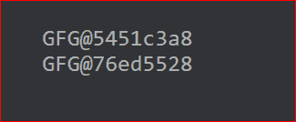
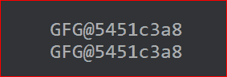
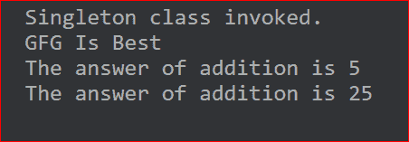

# 科特林的单例类

> 原文:[https://www.geeksforgeeks.org/singleton-class-in-kotlin/](https://www.geeksforgeeks.org/singleton-class-in-kotlin/)

[Kotlin](https://www.geeksforgeeks.org/introduction-to-kotlin/) 中的 Singleton 类也称为 Kotlin 中的 Singleton 对象。Singleton 类是这样一个类，它的定义方式是只能在任何地方创建和使用该类的一个实例。很多时候，我们创建同一个类的两个不同的对象，但是我们必须记住，创建两个不同的对象也需要为对象分配两个不同的内存。所以不如做一个单一的物体，反复使用。

## 我的锅

```
// Kotlin program
fun main(args: Array<String>) 
{
  val obj1 = GFG()
  val obj2 = GFG()
  println(obj1.toString())
  println(obj2.toString())
}

class GFG
{

}
```

**输出:**



在上面的例子中，我们可以看到两个对象有不同的地址，因此这是对内存的浪费。在下面的程序中，我们做了同样的事情，但是我们使用了 singleton 类。

## 我的锅

```
// Kotlin program
fun main(args: Array<String>)
{
  println(GFG.toString())
  println(GFG.toString())
}

// GFG is the singleton class here
object  GFG
{

}
```

**输出:**



因此，当我们使用一个对象而不是一个类时，Kotlin 实际上使用 Singelton 并分配单个内存。在 Java 中，一个 [singleton 类](https://www.geeksforgeeks.org/singleton-class-java/)是通过创建一个名为 **Singleton** 的类来实现的。但是在 Kotlin 中，我们需要使用 **object** 关键字。对象类可以有函数、属性和 init 方法。对象中不允许使用构造函数方法，因此如果需要一些初始化，并且对象可以在类中定义，我们可以使用 init 方法。我们使用类名调用单例类中的方法和成员变量，就像我们在**伴随对象**中所做的那样。

## 我的锅

```
// Kotlin program
fun main(args: Array<String>) 
{
  println(GFG.name)
  println("The answer of addition is ${GFG.add(3,2)}")
  println("The answer of addition is ${GFG.add(10,15)}")
}

object  GFG
{
   init 
  {
    println("Singleton class invoked.")
  }

  var name = "GFG Is Best"
  fun add(num1:Int,num2:Int):Int
  {
    return num1.plus(num2) 
  }
}
```

**输出:**



### **单例类的属性**

以下是典型的单例类的属性:

*   **只有一个实例**:单例类只有一个实例，这是通过在类中提供类的一个实例来实现的。
*   **全局可访问**:单例类的实例应该是全局可访问的，这样每个类都可以使用它。
*   **不允许构造函数**:我们可以使用 init 方法初始化我们的成员变量。

### 单例对象在安卓系统中的重要性

以下是解释单例对象在 android 中的重要性的一些要点，以及一些例子，其中必须使用它，以及为什么 android 开发人员应该了解单例对象的原因。

*   我们知道，当我们希望整个应用程序有一个特定对象的实例时，我们使用 Singleton。使用 singleton 时的常见用例是当您对整个应用程序中的每个请求使用[request](https://www.geeksforgeeks.org/introduction-retofit-2-android-set-1/)时，在这种情况下，您只需要 request 的单个实例，因为该 refught 实例包含一些附加的属性，如 [Gson Converter](https://www.geeksforgeeks.org/convert-java-object-to-json-string-using-gson/) (用于将 JSON 响应转换为 Java Objects)和 Moshy Converter，因此您想要重用该实例并一次又一次地创建新实例将会浪费空间和时间，因此在这种情况下，我们必须使用 singleton 对象。
*   考虑您在 [MVVM 架构](https://www.geeksforgeeks.org/introduction-to-model-view-view-model-mvvm/)中使用存储库的情况，因此在这种情况下，您应该只创建存储库的一个实例，因为存储库不会改变，创建不同的实例会导致空间增加和时间浪费。
*   假设您有一个应用程序，用户可以在进行用户身份验证后登录该应用程序，因此如果同时有两个同名同姓的用户试图登录该帐户，出于安全问题的考虑，该应用程序不应允许。所以单例对象在这里帮助我们只创建对象的一个实例，即这里的用户，这样就不可能多次登录。希望这些例子足以让读者对 Kotlin 中的 singleton 对象有更多的了解，这样他们就可以在自己的 android 项目中使用 singleton 对象。

**展示单例对象使用的安卓程序示例:**

## 我的锅

```
// sample android application program in kotlin
// showing use of singleton object
package com.example.retrofitexample
import retrofit2.Call
import retrofit2.Retrofit
import retrofit2.converter.gson.GsonConverterFactory
import retrofit2.http.GET
import retrofit2.http.Query

const val  BASE_URL = "https://newsapi.org/"
const val API_KEY = "ff30357667f94aca9793cc35b9e447c1"

interface NewsInterface
{
    @GET("v2/top-headlines?apiKey=$API_KEY")
    fun getheadlines(@Query("country")country:String,@Query("page")page:Int):Call<News>
    // function used to get the headlines of the country according to the query 
    // written by developer
}

// NewsService is the instance of retrofit made by using Singleton object
object  NewsService
{
    val newsInstance:NewsInterface
    init {
        val retrofit=Retrofit.Builder()
            .baseUrl(BASE_URL)
            .addConverterFactory(GsonConverterFactory.create())
            .build()
        newsInstance=retrofit.create(NewsInterface::class.java)
    }
}
```