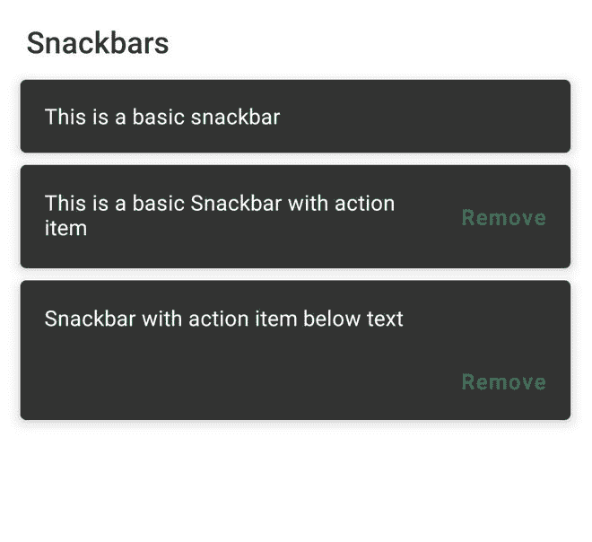
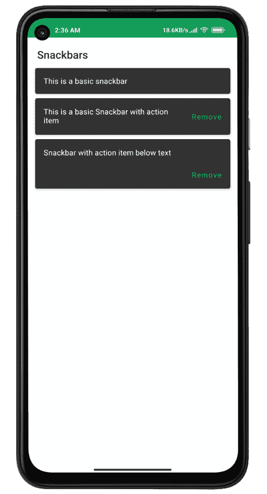

# 安卓中的 Snackbar 使用 Jetpack Compose

> 原文:[https://www . geeksforgeeks . org/snackbar-in-Android-using-jet pack-compose/](https://www.geeksforgeeks.org/snackbar-in-android-using-jetpack-compose/)

**先决条件:**

*   [安卓中的 Snackbar 材质设计组件](https://www.geeksforgeeks.org/snackbar-material-design-components-in-android/)
*   [Android 中的 Jetpack 复合](https://www.geeksforgeeks.org/basics-of-jetpack-compose-in-android/)

Snackbar 是一个轻量级的小部件，它们用于在应用程序的底部显示消息。它是与材料设计库一起引入的，作为吐司的替代。在本文中，我们将解释如何使用 Jetpack Compose 创建一个 Snackbar。下面是展示我们将要构建的内容的示例图片。



### **分步实施**

**第一步:创建新项目**

使用 Jetpack Compose 在 Android Studio 中创建新项目请参考[如何使用 Jetpack Compose 在 Android Studio Canary 版本中创建新项目。](https://www.geeksforgeeks.org/how-to-create-a-new-project-in-android-studio-canary-version-with-jetpack-compose/)

**第二步:使用 MainActivity.kt**

转到 **MainActivity.kt** 文件，参考以下代码。下面是 **MainActivity.kt** 文件的代码。代码中添加了注释，以更详细地理解代码。

## 我的锅

```kt
class MainActivity : ComponentActivity() {
    override fun onCreate(savedInstanceState: Bundle?) {
        super.onCreate(savedInstanceState)
        setContent {
            JetpackComposePracticeTheme {
                // A surface container using the 'background' color from the theme
                Surface(color = Color.White) {
                    Column(modifier = Modifier.padding(10.dp)) {
                        // call the function which contains all the snackbars
                        SnackBars()
                    }
                }
            }
        }
    }
}

// In order to use compose properties annotate with @Compose
@Preview
@Composable
fun SnackBars() {
    Text(text = "Snackbars", style = typography.h6, modifier = Modifier.padding(8.dp))
    // Normal Snackbar
    Snackbar(modifier = Modifier.padding(4.dp)) {
        Text(text = "This is a basic snackbar")
    }
    // Snackbar with action item
    Snackbar(
        modifier = Modifier.padding(4.dp),
        action = {
            TextButton(onClick = {}) {
                Text(text = "Remove")
            }
        }
    ) {
        Text(text = "This is a basic Snackbar with action item")
    }

   // Snackbar with action item below text
    Snackbar(
        modifier = Modifier.padding(4.dp),
        actionOnNewLine = true,
        action = {
            TextButton(onClick = {}) {
                Text(text = "Remove")
            }
        }
    ) {
        Text(text = "Snackbar with action item below text")
    }
}
```

**输出:**

