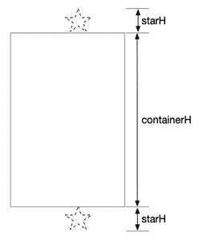

# 使用安卓属性动画的安卓星斗

> 原文:[https://www . geeksforgeeks . org/star-在 android 中淋浴-使用-Android-property-animation/](https://www.geeksforgeeks.org/star-shower-in-android-using-android-property-animation/)

在本文中，我们将使用安卓属性动画创建一个明星淋浴。我们将创建一个稍微复杂一点的动画，在多个对象上制作多个属性的动画。为了达到这种效果，单击一个按钮会创建一个随机大小的星形，它将被添加到背景容器中，刚好在该容器顶部的视野之外。这颗恒星将会随着它的移动加速而下降到屏幕的底部。恒星落下时也会旋转。下面给出了一个示例 GIF，以了解我们将在本文中做什么。注意，我们将使用 **Kotlin** 语言来实现这个项目。


### **分步实施**

**第一步:创建新项目**

要在安卓工作室创建新项目，请参考[如何在安卓工作室创建/启动新项目](https://www.geeksforgeeks.org/android-how-to-create-start-a-new-project-in-android-studio/)。注意选择**科特林**作为编程语言。

**第二步:我们需要一些局部变量来保持状态。**

*   对星域视图组的引用，它只是当前星域视图的父视图。
*   用于计算落星最终平移值的容器的宽度和高度。
*   恒星的默认宽度和高度，稍后将使用比例因子进行更改，以获得不同大小的恒星。

> val 容器= star.parent 作为视图组
> 
> val containerW =容器.宽度
> 
> val 容器高度=容器高度
> 
> var starw:float = star . width . tofloat()

创建一个新的视图来保存星形，因为它是一个可矢量绘制的资产，使用[appcompatiimageview](https://developer.android.com/reference/androidx/appcompat/widget/AppCompatImageView)，它有能力托管这种资源。创建星形并将其添加到背景容器中。

> val newstar = appcompatimview(this)
> 
> newstar . setimageresource(r . draw able . IC _ star)
> 
> newStar.layoutParams = FrameLayout.LayoutParams（FrameLayout.LayoutParams.WRAP_CONTENT，
> 
> FrameLayout.LayoutParams.WRAP_CONTENT）

**第三步:星**的尺寸和定位

我们还没有定义图像在容器中的位置，所以默认情况下它位于(0，0)。我们将在这一步修复它。

**(i)** 设置恒星的大小。将星形修改为随机大小，从默认大小的. 1x 到 1.6x。使用此比例因子更改缓存的宽度/高度值。

> newStar.scaleX = Math.random()。toFloat() * 1.5f + .1f
> 
> newStar.scaleY = newStar.scaleX
> 
> starW *= newStar.scaleX
> 
> starH * = newStar.scaleY

您现在已经缓存了存储在“星”和“星”中的星像素高/低:


**(ii)** 现在定位新星。它应该水平地随机出现在左边缘到右边缘之间的某个地方。下面的代码使用星形的宽度将其从左侧屏幕的中间位置(-starW / 2)定位到右侧屏幕的中间位置(星形位于(containerW–starW/2)。

> newstar . translation x = math . random()。toFloat() *容器 w–starw/2


**第四步:为恒星旋转和下落创建动画**

是时候制作动画了。这颗恒星应该在下落时旋转。我们可以一起制作两个属性的动画。旋转将使用平滑的线性运动(在整个旋转动画中以恒定的速率移动)，而下落动画将使用加速运动(模拟重力以恒定的更快速率将恒星向下拉动)。因此，您将创建两个动画师，并为每个动画师添加一个插值器。

**(i)** 首先，创建两个动画师，以及他们的插值器:

> val mover = ObjectAnimator.ofFloat(新闻星，视图。TRANSLATION_Y，-starhh，container h+starhh)
> 
> mover .插值器=加速插值器(1f) //产生平缓的加速运动
> 
> 值旋转器。旋转，
> 
> (Math.random() * 1080)。toFloat()) // star 在 0 到 1080 度之间随机旋转一个角度
> 
> rotator . interpreter = linear interpreter()//当恒星落下时，旋转将以恒定的速率进行

**动子动画**负责让恒星“坠落”它激活了 TRANSLATION_Y 属性，但导致垂直运动而不是水平运动。该代码将从-starhh 动画化为(container h+starhh)，这有效地将它放置在顶部的容器之外，并将其移动到底部的容器之外，如下所示:



**第五步:与动画师集**并行运行动画

现在是时候把这两个动画师组合成一个单一的[动画师集](https://developer.android.com/reference/android/animation/AnimatorSet)了。它基本上是一组动画，以及何时运行这些动画的说明。它可以并行播放动画。

**(i)** 创建动画制作者集，并将子动画制作者添加到其中。默认的 300 毫秒动画时间对于流星来说太快了，所以将持续时间设置为 500 到 2000 毫秒之间的随机数，这样星星就可以以不同的速度下落。

> val set = AnimatorSet()
> 
> set.playTogether(移动器、旋转器)
> 
> set . duration =(math . random()* 1500+500)。托隆()

**(ii)** 一旦 newStar 从屏幕底部脱落，应将其从容器中取出。设置一个简单的监听器来等待动画的结束并移除它。然后开始动画。

> set.addListener（object ： AnimatorListenerAdapter（） {
> 
> override fun sonomanid(动画:Animator？)& gt
> 
> 容器。removeView(newStar)
> 
> }
> 
> })
> 
> set.start()

导航到 **app > res >布局> activity_main.xml** 并将下面的代码添加到该文件中。下面是**activity _ main . XML**文件的完整代码。

## 可扩展标记语言

```kt
<?xml version="1.0" encoding="utf-8"?>
<androidx.constraintlayout.widget.ConstraintLayout 
    xmlns:android="http://schemas.android.com/apk/res/android"
    xmlns:app="http://schemas.android.com/apk/res-auto"
    xmlns:tools="http://schemas.android.com/tools"
    android:layout_width="match_parent"
    android:layout_height="match_parent"
    tools:context=".MainActivity">

    <Button
        android:id="@+id/showerButton"
        android:layout_width="match_parent"
        android:layout_height="wrap_content"
        android:text="star shower"
        app:layout_constraintBottom_toTopOf="@+id/frameLayout"
        app:layout_constraintEnd_toEndOf="parent"
        app:layout_constraintStart_toStartOf="parent"
        app:layout_constraintTop_toTopOf="parent" />

    <FrameLayout
        android:id="@+id/frameLayout"
        android:layout_width="match_parent"
        android:layout_height="0dp"
        android:background="@color/black"
        app:layout_constraintBottom_toBottomOf="parent"
        app:layout_constraintEnd_toEndOf="parent"
        app:layout_constraintStart_toStartOf="parent"
        app:layout_constraintTop_toBottomOf="@+id/showerButton"
        app:layout_constraintVertical_bias="0.0">

        <ImageView
            android:id="@+id/star"
            android:layout_width="wrap_content"
            android:layout_height="wrap_content"
            android:layout_gravity="center"
            android:contentDescription="star image"
            android:visibility="invisible"
            app:srcCompat="@drawable/ic_star"
            tools:ignore="VectorDrawableCompat" />

    </FrameLayout>

</androidx.constraintlayout.widget.ConstraintLayout>
```

转到 **MainActivity.kt** 文件，参考以下代码。以下是 **MainActivity.kt** 文件的完整代码。代码中添加了注释，以更详细地理解代码。

## 我的锅

```kt
import android.animation.Animator
import android.animation.AnimatorListenerAdapter
import android.animation.AnimatorSet
import android.animation.ObjectAnimator
import android.os.Bundle
import android.view.View
import android.view.ViewGroup
import android.view.animation.AccelerateInterpolator
import android.view.animation.LinearInterpolator
import android.widget.Button
import android.widget.FrameLayout
import android.widget.ImageView
import androidx.appcompat.app.AppCompatActivity
import androidx.appcompat.widget.AppCompatImageView

class MainActivity : AppCompatActivity() {

    lateinit var showerButton: Button
    lateinit var star: ImageView

    override fun onCreate(savedInstanceState: Bundle?) {
        super.onCreate(savedInstanceState)
        setContentView(R.layout.activity_main)
        showerButton = findViewById<Button>(R.id.showerButton)
        star = findViewById(R.id.star)

        showerButton.setOnClickListener {
            shower()
        }
    }

    private fun shower() {
        // Create a new star view in a random X position above the container.
        // Make it rotateButton about its center as it falls to the bottom.

        // Local variables
        val container = star.parent as ViewGroup
        val containerW = container.width
        val containerH = container.height
        var starW: Float = star.width.toFloat()
        var starH: Float = star.height.toFloat()

        // Create the new star (an ImageView in layout holding drawable star image) 
        // and add it to the container
        val newStar = AppCompatImageView(this)
        newStar.setImageResource(R.drawable.ic_star)
        newStar.layoutParams = FrameLayout.LayoutParams(
            FrameLayout.LayoutParams.WRAP_CONTENT,
            FrameLayout.LayoutParams.WRAP_CONTENT
        )
        container.addView(newStar)

        // Scale the view randomly between 10-160% of its default size
        newStar.scaleX = Math.random().toFloat() * 1.5f + .1f
        newStar.scaleY = newStar.scaleX
        starW *= newStar.scaleX
        starH *= newStar.scaleY

        // Position the view at a random place between 
        // the left and right edges of the container
        newStar.translationX = Math.random().toFloat() * containerW - starW / 2

        // Create an animator that moves the view from a starting position right about the container
        // to an ending position right below the container. Set an accelerate interpolator to give
        // it a gravity/falling feel
        val mover = ObjectAnimator.ofFloat(newStar, View.TRANSLATION_Y, -starH, containerH + starH)
        mover.interpolator = AccelerateInterpolator(1f)

        // Create an animator to rotateButton the 
        // view around its center up to three times
        val rotator = ObjectAnimator.ofFloat(
            newStar, View.ROTATION,
            (Math.random() * 1080).toFloat()
        )
        rotator.interpolator = LinearInterpolator()

        // Use an AnimatorSet to play the falling and 
        // rotating animators in parallel for a duration
        // of a half-second to two seconds
        val set = AnimatorSet()
        set.playTogether(mover, rotator)
        set.duration = (Math.random() * 1500 + 500).toLong()

        // When the animation is done, remove the 
        // created view from the container
        set.addListener(object : AnimatorListenerAdapter() {
            override fun onAnimationEnd(animation: Animator?) {
                container.removeView(newStar)
            }
        })

        // Start the animation
        set.start()
    }

    private fun ObjectAnimator.disableViewDuringAnimation(view: View) {

        // This extension method listens for start/end 
        // events on an animation and disables
        // the given view for the entirety of that animation.
        addListener(object : AnimatorListenerAdapter() {
            override fun onAnimationStart(animation: Animator?) {
                view.isEnabled = false
            }

            override fun onAnimationEnd(animation: Animator?) {
                view.isEnabled = true
            }
        })
    }
}
```

现在，运行您的应用程序。您可以多次点击“ **STAR 淋浴**”按钮，每次创建一个新的明星和新的动画。

**输出:**

<video class="wp-video-shortcode" id="video-655819-1" width="640" height="360" preload="metadata" controls=""><source type="video/mp4" src="https://media.geeksforgeeks.org/wp-content/uploads/20210728133928/StarShower.mp4?_=1">[https://media.geeksforgeeks.org/wp-content/uploads/20210728133928/StarShower.mp4](https://media.geeksforgeeks.org/wp-content/uploads/20210728133928/StarShower.mp4)</video>

**源代码:** [点击此处](https://github.com/Anju1415/StarShower-GfgArcticle)