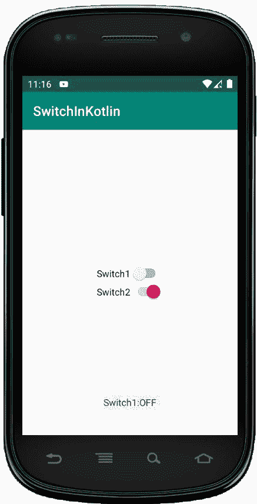
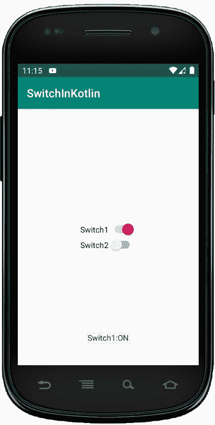

# 切换到科特林

> 原文:[https://www.geeksforgeeks.org/switch-in-kotlin/](https://www.geeksforgeeks.org/switch-in-kotlin/)

安卓开关也是一个双态用户界面元素，用来作为按钮在开和关之间切换。通过触摸按钮，我们可以来回拖动来打开或关闭它。

当活动只需要两种状态选择开或关时，开关元件很有用。我们可以通过使用 Switch 对象将 Switch 添加到我们的应用程序布局中。默认情况下，安卓开关的状态是关闭状态。我们还可以通过在我们的 XML 布局文件中设置 android:checked = "true "来将 Switch 的状态更改为 ON。

在 android 中，我们可以通过两种方式创建 Switch 控件，要么在 XML 布局文件中使用 Switch，要么在 Kotlin 文件中动态创建。

首先，我们按照以下步骤创建一个新项目:

1.  点击文件，然后**新建** = > **新项目**。
2.  之后加入 Kotlin 支持，点击下一步。
3.  根据方便选择最小 SDK，点击下一步按钮。
4.  然后选择**清空**活动= > **下一个** = > **完成**。

## 开关小部件的不同属性

| XML 属性 | 描述 |
| --- | --- |
| android:id | 用于唯一标识控件。 |
| 安卓:重力 | 用于指定如何对齐文本，如左、右、中、上等。 |
| 安卓:选中 | 用于指定开关控制的当前状态。 |
| 安卓:拇指 | 用于设置可拉伸的，用作可以前后移动的拇指。 |
| Android:thumbint | 用于设置应用于拇指的色调。 |
| android:文本 | 用于设置开关的文本。 |
| Android:textin | 用于在切换按钮处于打开(选中)状态时设置文本。 |
| Android:text ff | 用于在切换按钮处于关闭(未选中)状态时设置文本。 |
| android:textStyle | 用于设置文本的样式。例如，粗体、斜体、粗斜体等。 |
| android:文本颜色 | 用于设置文本的颜色。 |
| android:文本大小 | 用于设置文本的大小。 |
| 安卓:背景 | 用于设置切换按钮的背景色。 |
| android:drawableBottom | 用于将可绘制设置为文本的底部。 |
| 安卓:可画左 | 用于设置文本左侧的可绘制。 |
| 安卓:drawableRight | 用于将可绘制设置在文本的右侧。 |
| 安卓:填充 | 用于从左、右、上、下设置填充。 |

## 在活动主文件中添加开关代码

在这个文件中，我们将使用线性布局和其中的两个开关。设置每个开关的属性，如开关 id、文本等。

```kt
<?xml version="1.0" encoding="utf-8"?>
<LinearLayout
    xmlns:android="http://schemas.android.com/apk/res/android"
    android:layout_width="match_parent"
    android:layout_height="match_parent"
    android:gravity="center"
    android:orientation="vertical">

    <Switch
        android:id="@+id/switch1"
        android:layout_width="wrap_content"
        android:layout_height="wrap_content"
        android:text="Switch1"/>
    <Switch
        android:id="@+id/switch2"
        android:layout_width="wrap_content"
        android:layout_height="wrap_content"
        android:text="Switch2"/>
</LinearLayout>
```

**在 *strings.xml* 中添加应用名称。**

```kt
<resources>
    <string name="app_name">SwitchInKotlin</string>
</resources>
```

## 访问 MainActivity.kt 文件中的开关小部件

在这里，我们将通过使用开关各自的 id 来访问开关，并且如果开关处于选中(开)状态，则设置点击监听器和土司消息。
首先，声明一个变量，用它的 id 得到开关。

```kt
val sw1 = findViewById(R.id.switch1)
```

然后，将**设置为 on 点击开关上的**监听器，并使用 if 条件检查按钮的状态。

```kt

sw1?.setOnCheckedChangeListener({ _ , isChecked ->
            val message = if (isChecked) "Switch1:ON" else "Switch1:OFF"
            Toast.makeText(this@MainActivity, message,
                Toast.LENGTH_SHORT).show()
        })

```

对 kotlin 文件中的另一个开关重复该过程。

```kt
package com.geeksforgeeks.myfirstkotlinapp
import android.os.Bundle
import android.widget.Switch
import android.widget.Toast
import androidx.appcompat.app.AppCompatActivity

class MainActivity : AppCompatActivity() {

    override fun onCreate(savedInstanceState: Bundle?) {
        super.onCreate(savedInstanceState)
        setContentView(R.layout.activity_main)

        val sw1 = findViewById<Switch>(R.id.switch1)
        sw1?.setOnCheckedChangeListener({ _ , isChecked ->
            val message = if (isChecked) "Switch1:ON" else "Switch1:OFF"
            Toast.makeText(this@MainActivity, message,
                Toast.LENGTH_SHORT).show()
        })

        val sw2 = findViewById<Switch>(R.id.switch2)
        sw2?.setOnCheckedChangeListener({ _ , isChecked ->
            val message = if (isChecked) "Switch2:ON" else "Switch2:OFF"
            Toast.makeText(this@MainActivity, message,
                Toast.LENGTH_SHORT).show()
        })
    }
}
```

## AndroidManifest.xml 文件

```kt
<?xml version="1.0" encoding="utf-8"?>
<manifest xmlns:android="http://schemas.android.com/apk/res/android"
package="com.geeksforgeeks.myfirstkotlinapp">

<application
    android:allowBackup="true"
    android:icon="@mipmap/ic_launcher"
    android:label="@string/app_name"
    android:roundIcon="@mipmap/ic_launcher_round"
    android:supportsRtl="true"
    android:theme="@style/AppTheme">
    <activity android:name=".MainActivity">
        <intent-filter>
            <action android:name="android.intent.action.MAIN" />

            <category android:name="android.intent.category.LAUNCHER" />
        </intent-filter>
    </activity>
</application>

</manifest>
```

## 作为输出模拟器运行:

这里，当我们运行上面的代码时，仿真器中显示了两个开关。我们可以独立改变开关的状态。

