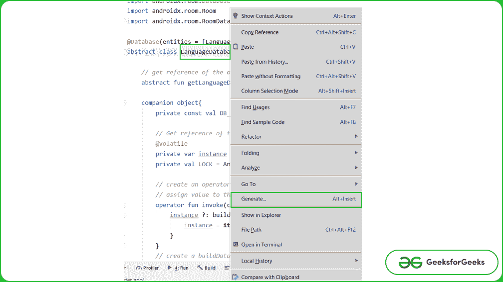
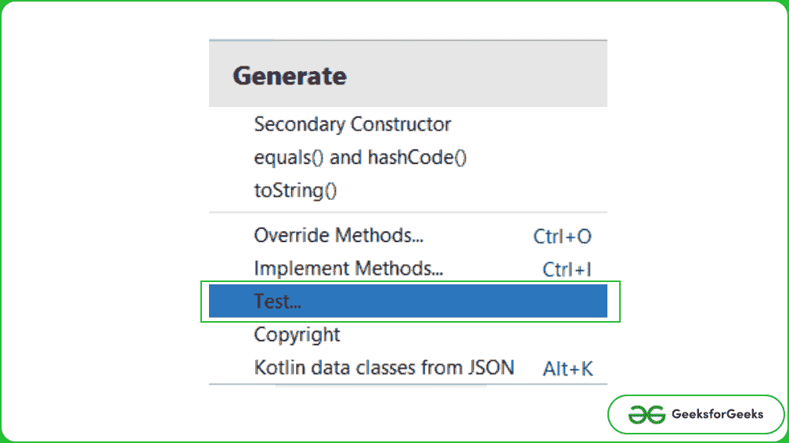
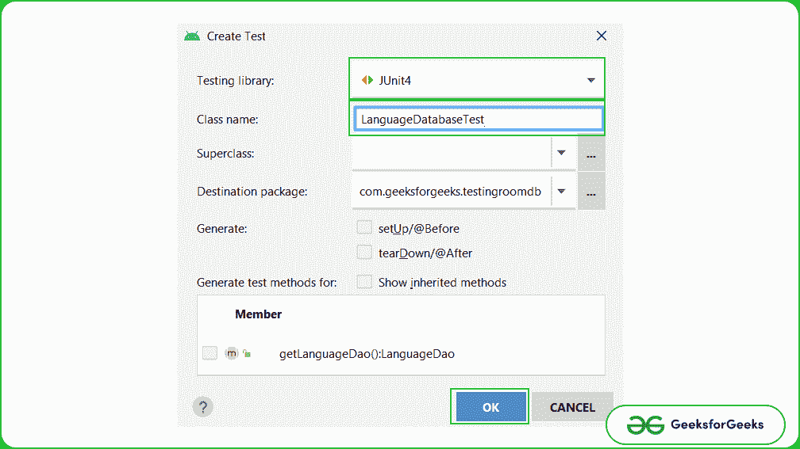
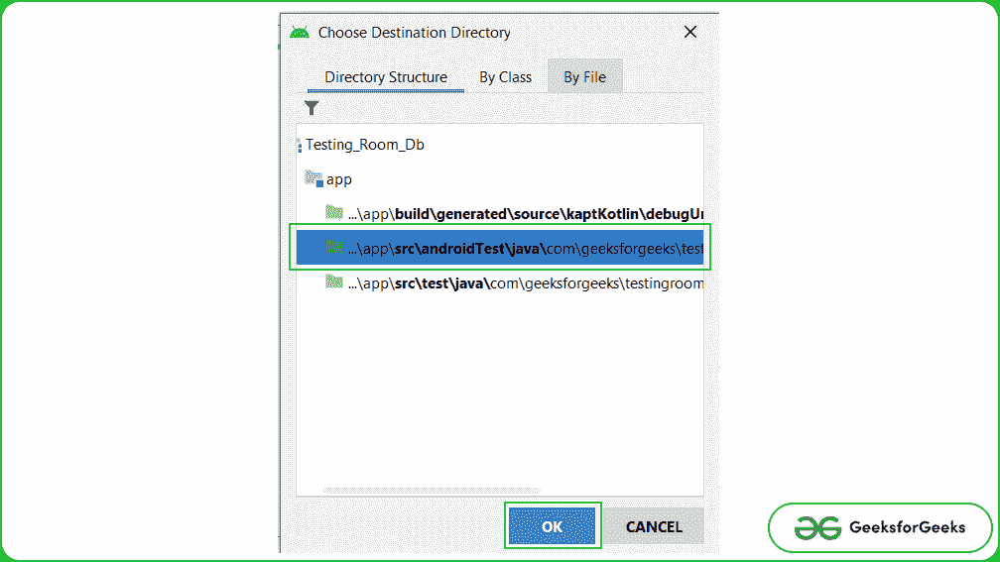
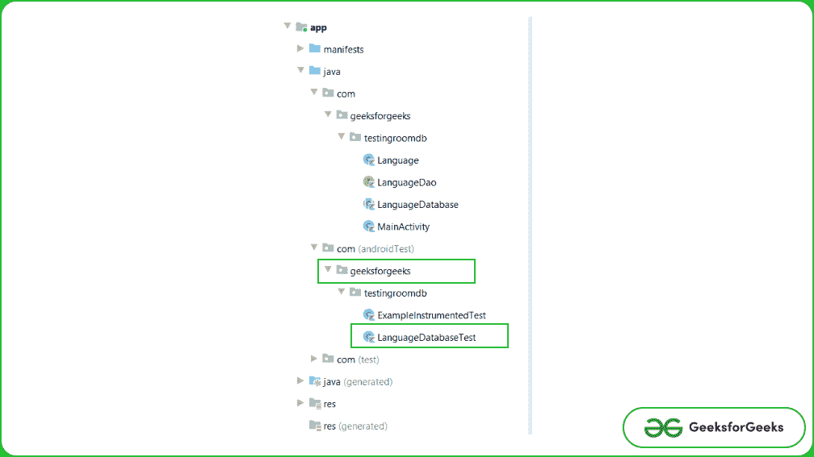
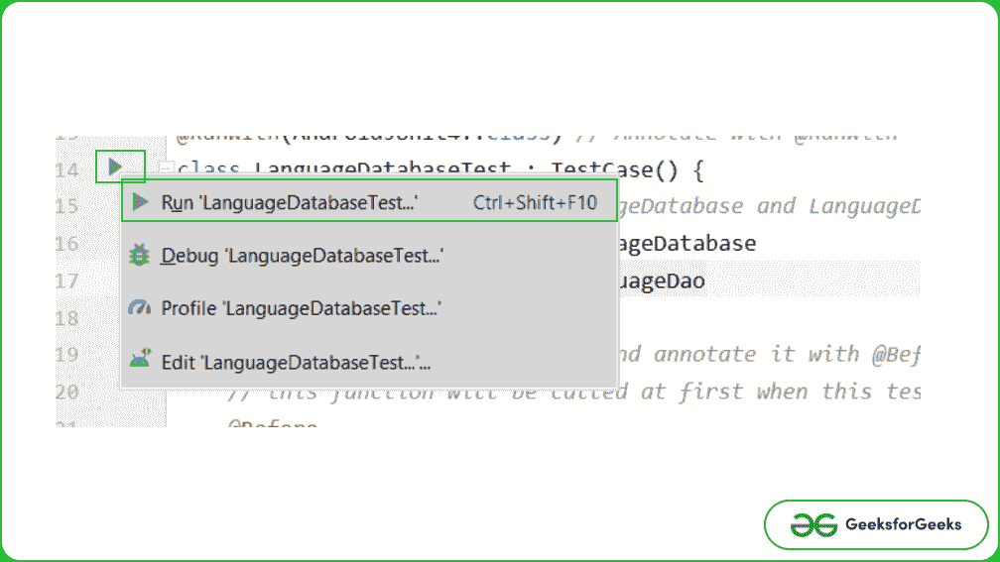
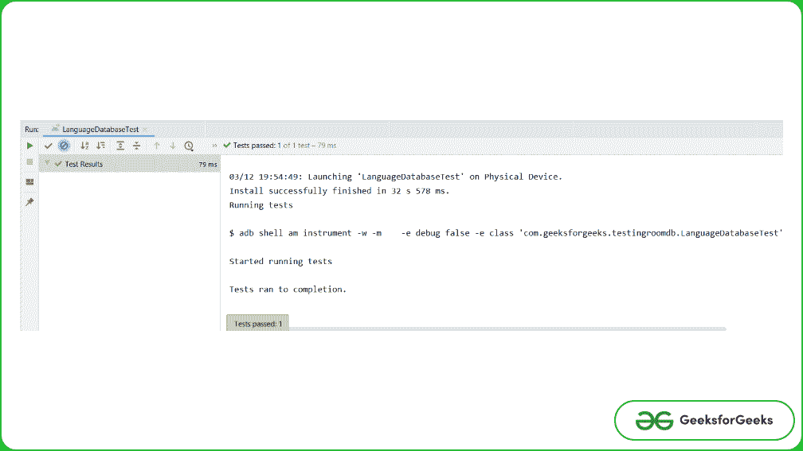

# 使用 JUnit 的安卓测试室数据库

> 原文:[https://www . geesforgeks . org/testing-room-database-in-Android-use-JUnit/](https://www.geeksforgeeks.org/testing-room-database-in-android-using-junit/)

在本文中，我们将在 android 中测试[房间数据库](https://www.geeksforgeeks.org/how-to-perform-crud-operations-in-room-database-in-android/)。这里我们使用 [**JUnit**](https://www.geeksforgeeks.org/unit-testing-in-android-using-junit/) 来测试我们的代码。JUnit 是 Java 应用程序的“单元测试”框架，默认情况下已经包含在 android studio 中。它是单元测试和用户界面测试的自动化框架。包含 **@Test** 、 **@Before** 、 **@After** 等注解。这里我们将只使用 **@Test** 注释来保持文章的通俗易懂。注意，我们将使用 **Kotlin** 语言来实现这个项目。

### **分步实施**

**第一步:创建新项目**

要在安卓工作室创建新项目，请参考[如何在安卓工作室创建/启动新项目](https://www.geeksforgeeks.org/android-how-to-create-start-a-new-project-in-android-studio/)。注意选择**科特林**作为编程语言。

**第二步:添加依赖关系**

在 **build.gradle(项目)**中，在 dependencies 下添加以下代码。它包含房间数据库、[科罗廷](https://www.geeksforgeeks.org/kotlin-coroutines-on-android/)、JUnit、真理和其他的依赖关系。

> 实现" org . jet brains . kot linx:kot linx-coroutines-Android:1 . 4 . 1 "
> 
> 实现“androidx . room:room-runtime:2 . 2 . 6”
> 
> 实现“androidx . legacy:legacy-support-v4:1 . 0 . 0”
> 
> kapt " androidx . room:room-编译器:2.2.6 "
> 
> 实现“androidx.room:room-ktx:2.2.6”
> 
> 测试实现“androidx . arch . core:core-testing:2 . 1 . 0”
> 
> 测试实施“androidx . room:room-testing:2 . 2 . 6”
> 
> testimplementation“JUnit:JUnit:4 . 13 . 2”
> 
> testImplementation " com . Google . truth:truth:1 . 1 . 2 "
> 
> 测试实施" org . jetbrains . kot linx:kot linx-corroutes-test:1 . 3 . 4 "
> 
> testImplementation ' org . robo electric:robo electric:4 . 5 . 1 '
> 
> andidstimulation " andidx . test . ext:JUnit-ktx:1 . 1 . 2 "
> 
> androidTestImplementation“androidx . test . espresso:espresso-core:3 . 3 . 0”
> 
> androidTestImplementation " com . Google . truth:truth:1 . 1 . 2 "
> 
> androidTestImplementation " androidx . arch . core:core-testing:2 . 1 . 0 "
> 
> androidTestImplementation " androidx . test:规则:1.3.0 "
> 
> androidTestImplementation " androidx . test:runner:1 . 3 . 0 "
> 
> andiddstruction " andidx . test:core-ktx:1 . 3 . 0 "

**在编写我们的测试之前，让我们首先创建房间数据库**

**第三步:新建模型类“language . kt”**

新建一个类“ **Language.kt** ”，用 **@Entity** 标注，传递表名。

## 我的锅

```kt
import androidx.room.Entity
import androidx.room.PrimaryKey

@Entity(tableName = "language")
data class Language(
    val languageName : String="",
    val experience : String=""
) {
    @PrimaryKey(autoGenerate = true)
    var id : Long=0
}
```

**第四步:创建 dao 界面**

新建一个类“ **LanguageDao.kt** ”，用 **@Dao** 标注。添加注释是为了更好地理解代码。

## 我的锅

```kt
import androidx.room.Dao
import androidx.room.Insert
import androidx.room.Query

@Dao
interface LanguageDao {
    // Write two functions one for adding language to the database 
    // and another for retrieving all the items present in room db.
    @Insert
    suspend fun addLanguage(language: Language)

    @Query("SELECT * FROM language ORDER BY languageName DESC")
    suspend fun getAllLanguages(): List<Language>
}
```

**步骤 5:创建数据库类**

创建一个新的抽象类“ **LanguageDatabase.kt** ”，并用 **@Database** 进行标注。下面是 **LanguageDatabase.kt** 的代码，为了更好的理解，增加了类注释。

## 我的锅

```kt
import android.content.Context
import androidx.room.Database
import androidx.room.Room
import androidx.room.RoomDatabase

@Database(entities = [Language::class] , version = 1)
abstract class LanguageDatabase : RoomDatabase() {

    // get reference of the dao interface that we just created
    abstract fun getLanguageDao() : LanguageDao

    companion object{
        private const val DB_NAME = "Language-Database.db"

        // Get reference of the LanguageDatabase and assign it null value
        @Volatile
        private var instance : LanguageDatabase? = null
        private val LOCK = Any()

        // create an operator fun which has context as a parameter
        // assign value to the instance variable
        operator fun invoke(context: Context) = instance ?: synchronized(LOCK){
            instance ?: buildDatabase(context).also{
                instance = it
            }
        }
        // create a buildDatabase function assign the required values
        private fun buildDatabase(context: Context) = Room.databaseBuilder(
            context.applicationContext,
            LanguageDatabase::class.java,
            DB_NAME
        ).fallbackToDestructiveMigration().build()
    }
}
```

**第 6 步:创建测试类**

要创建**语言数据库的测试类，请右键单击**语言数据库**，然后单击生成，然后选择测试。将打开一个对话框，从对话框中选择测试库为 **JUnit4** 并保留类名为默认的**语言数据库测试**，点击**确定**。之后，会打开另一个对话框选择目标目录，选择有**的目录..app\src\AndoidTest\。**因为我们的测试类需要来自应用程序的上下文。下面是指导你创建测试类的截图。**

    

**第 7 步:使用语言数据库 Test.kt 类**

转到**语言数据库 Test.kt** 文件，编写以下代码。代码中添加了注释，以更详细地理解代码。

## 我的锅

```kt
import android.content.Context
import androidx.room.Room
import androidx.test.core.app.ApplicationProvider
import androidx.test.ext.junit.runners.AndroidJUnit4
import com.google.common.truth.Truth.assertThat
import junit.framework.TestCase
import kotlinx.coroutines.runBlocking
import org.junit.*
import org.junit.runner.RunWith

@RunWith(AndroidJUnit4::class) // Annotate with @RunWith
class LanguageDatabaseTest : TestCase() {
    // get reference to the LanguageDatabase and LanguageDao class
    private lateinit var db: LanguageDatabase
    private lateinit var dao: LanguageDao

    // Override function setUp() and annotate it with @Before
    // this function will be called at first when this test class is called
    @Before
    public override fun setUp() {
        // get context -- since this is an instrumental test it requires
        // context from the running application
        val context = ApplicationProvider.getApplicationContext<Context>()
        // initialize the db and dao variable 
        db = Room.inMemoryDatabaseBuilder(context, LanguageDatabase::class.java).build()
        dao = db.getLanguageDao()
    }

    // Override function closeDb() and annotate it with @After
    // this function will be called at last when this test class is called
    @After
    fun closeDb() {
        db.close()
    }

    // create a test function and annotate it with @Test 
    // here we are first adding an item to the db and then checking if that item 
    // is present in the db -- if the item is present then our test cases pass
    @Test
    fun writeAndReadLanguage() = runBlocking {
        val language = Language("Java", "2 Years")
        dao.addLanguage(language)
        val languages = dao.getAllLanguages()
        assertThat(languages.contains(language)).isTrue()
    }
}
```

**第 8 步:运行测试**

要运行测试用例，点击类名附近的小运行图标，然后选择运行**语言数据库测试。**如果所有的测试用例都通过了，你会在运行控制台得到一个绿色的勾号。就我们而言，所有测试都通过了。

 

**Github 回购** [**这里**](https://github.com/introidx/Testing-Room-Db) 。