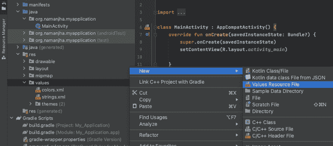
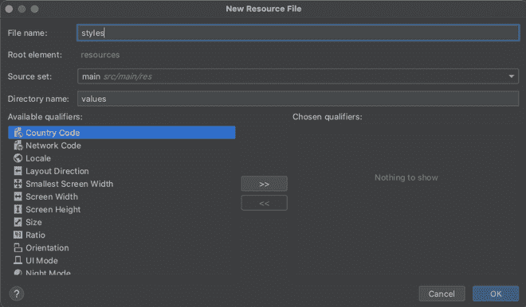
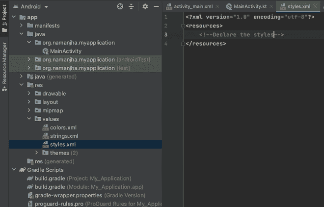

# 安卓中的文本样式

> 原文:[https://www.geeksforgeeks.org/text-styles-in-android/](https://www.geeksforgeeks.org/text-styles-in-android/)

[文本视图](https://www.geeksforgeeks.org/textview-widget-in-android-using-java-with-examples/)以标准方式显示声明的文本，除非开发人员指定特定属性以使文本看起来更好。这些属性可以直接声明到文本视图标签中。然而，为了维护一个可伸缩和干净的代码，工业实践建议将所有这样的属性集合在一起。也就是说，应用程序中不同的用户界面元素可以有相同或不同的样式，所有这些元素都需要组合到一个文件中，只要需要就可以调用。通过这篇文章，我们想向您展示如何创建样式并将其应用于文本视图。在我们的演示中，我们通过点击来动态改变文本视图的样式。

### 逐步实施

**第一步:在安卓工作室新建项目**

要在安卓工作室创建新项目，请参考[如何在安卓工作室创建/启动新项目](https://www.geeksforgeeks.org/android-how-to-create-start-a-new-project-in-android-studio/)。我们在 **Kotlin** 中演示了该应用程序，因此在创建新项目时，请确保选择 Kotlin 作为主要语言。

**步骤 2:在 res >值文件夹**中创建 styles.xml

要创建样式文件，请右键单击 res 文件夹中的值文件夹，将光标移动到“新建”，然后单击“值资源文件”。



现在给它命名为“样式”，然后点击确定。你可以使用你选择的任何名字。记住检查目录名是否是值，因为我们的文件应该包含属性值。生成的文件将是一个 XML 文件。



文件生成后，应该是这样的。现在，我们可以将样式添加到这个文件中。转到下一步，了解如何创建样式。



**第三步:在 styles.xml 文件**中添加样式

请参考下面的代码。我们已经为您申报了几种款式。有必要给每种风格命名。与文本相关的属性被声明为样式开始标记和结束标记之间的项目。

## 可扩展标记语言

```kt
<?xml version="1.0" encoding="utf-8"?>
<resources>
    <style name="whiteText">
        <item name="android:textStyle">italic</item>
        <item name="android:textColor">#ffffff</item>
    </style>

    <style name="gfgGreenText">
        <item name="android:textStyle">bold</item>
        <item name="android:textColor">#0f9d58</item>
    </style>

</resources>
```

**第四步:在 colors.xml 文件中添加颜色来改变 TextView 的背景(可选)**

这一步是可选的。我们声明了我们感兴趣的两种颜色，只是为了改变文本视图的背景。

## 可扩展标记语言

```kt
<?xml version="1.0" encoding="utf-8"?>
<resources>

    <!--There could be a list of colors declared here-->
    <!--Additionally, we are adding the below two colors-->
    <color name="gfg_green">#0f9d58</color>
    <color name="white">#FFFFFFFF</color>

</resources>
```

**第五步:在布局文件(activity_main.xml)中添加一个 TextView**

## 可扩展标记语言

```kt
<?xml version="1.0" encoding="utf-8"?>
<RelativeLayout 
    xmlns:android="http://schemas.android.com/apk/res/android"
    xmlns:tools="http://schemas.android.com/tools"
    android:layout_width="match_parent"
    android:layout_height="match_parent"
    tools:context=".MainActivity">

      <!--TextView-->
    <TextView
        android:id="@+id/textView1"
        android:layout_width="wrap_content"
        android:layout_height="wrap_content"
        android:layout_centerInParent="true"
        android:text="GeeksforGeeks"
        android:textSize="36sp"
        android:textStyle="bold" />

</RelativeLayout>
```

**第六步:编写一个程序，在主代码(MainActivity.kt)** 中的 TextView 点击上切换样式

## 我的锅

```kt
import android.os.Build
import androidx.appcompat.app.AppCompatActivity
import android.os.Bundle
import android.widget.TextView
import androidx.annotation.RequiresApi
import org.w3c.dom.Text

class MainActivity : AppCompatActivity() {

    @RequiresApi(Build.VERSION_CODES.M)
    override fun onCreate(savedInstanceState: Bundle?) {
        super.onCreate(savedInstanceState)
        setContentView(R.layout.activity_main)

        // Declaring TextView from the layout
        val tv1 = findViewById<TextView>(R.id.textView1)

        // A simple toggle variable that keeps
        // changing on TextView click/tap
        var toggle = true

        // What happens when the 
        // TextView in clicked/tapped
        tv1.setOnClickListener {

            // If toggle is true, then text will become 
            // white and background will become green
            // Else text is green and background is white
            if(toggle){
                tv1.setTextAppearance(R.style.whiteText)
                tv1.setBackgroundResource(R.color.gfg_green)
            } else {
                tv1.setTextAppearance(R.style.gfgGreenText)
                tv1.setBackgroundResource(R.color.white)
            }

            // Logically inversing the toggle, i.e. if toggle
            // is true then it shall become false
            // And vice-versa to keep the styles
            // keep changing on every click/tap
            toggle = !toggle
        }
    }
}
```

**输入:**

继续点击文本视图观察变化。

**输出:**

我们可以看到文本样式改变为粗体，然后是斜体以及背景颜色的改变。这个循环在每一次均匀的点击/敲击中不断重复。

<video class="wp-video-shortcode" id="video-650612-1" width="640" height="360" preload="metadata" controls=""><source type="video/mp4" src="https://media.geeksforgeeks.org/wp-content/uploads/20210720191429/11.mp4?_=1">[https://media.geeksforgeeks.org/wp-content/uploads/20210720191429/11.mp4](https://media.geeksforgeeks.org/wp-content/uploads/20210720191429/11.mp4)</video>