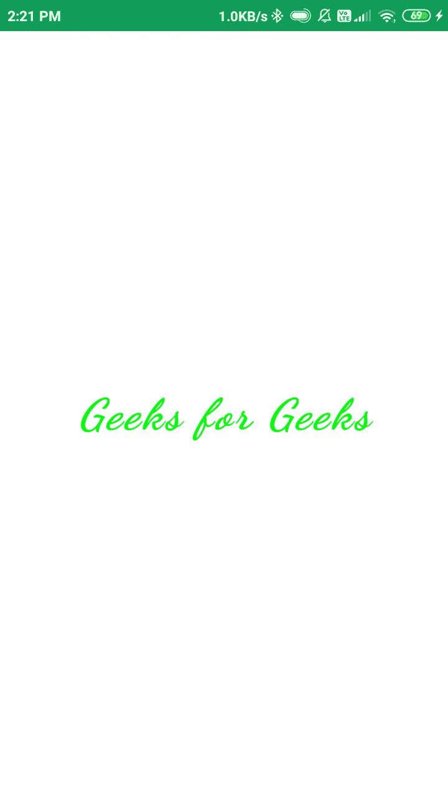

# 使用 Jetpack Compose 在安卓中查看文本

> 原文:[https://www . geesforgeks . org/text view-in-Android-using-jet pack-compose/](https://www.geeksforgeeks.org/textview-in-android-using-jetpack-compose/)

[**【喷气背包作曲】**](https://www.geeksforgeeks.org/basics-of-jetpack-compose-in-android/) 是谷歌提供的全新工具包。这对于设计漂亮的用户界面设计非常有用。安卓[文本视图](https://www.geeksforgeeks.org/textview-in-kotlin/)是安卓中的一个简单视图，用于在我们的应用程序中显示文本。在本文中，我们将看一下使用 Jetpack Compose 在 Android 中实现 TextView。

### 文本视图小部件的属性

<figure class="table">

| 

属性

 | 

描述

 |
| --- | --- |
| 文本 | 来设置我们必须在文本视图中显示的文本。 |
| 风格 | 来改变安卓系统中 TextView 的风格。 |
| 颜色 | 更改文本视图的颜色。 |
| 字体大小 | 来改变文本的字体大小。 |
| 字体粗细 | 设定字体 ie 的权重。特别大胆，黑暗，还有更多 |
| 字体样式 | 将字体样式设置为斜体。 |
| 字体系列 | 更改文本的字体系列。 |
| 字母间距 | 设置文本视图中字母之间的间距。 |
| 背景 | 为我们的文本视图设置背景色。 |
| 阴影 | 为我们的文本视图添加阴影。 |
| 文字型态 | 更改文本视图的对齐方式。 |
| 修饰语 | 修改器被用来给我们的文本视图添加填充。 |

</figure>

### 逐步实施

**第一步:创建新项目**

要在安卓工作室金丝雀版本中创建新项目，请参考[如何使用 Jetpack Compose 在安卓工作室金丝雀版本中创建新项目。](https://www.geeksforgeeks.org/how-to-create-a-new-project-in-android-studio-canary-version-with-jetpack-compose/)

**第二步:在 MainActivity.kt 文件**中添加 TextView

导航到**应用程序> java >你的应用程序的包名，打开 MainActivity.kt 文件**。在该文件中添加下面的代码。代码中添加了注释，以更详细地理解代码。

## 我的锅

```kt
package com.example.edittext

import android.os.Bundle
import androidx.appcompat.app.AppCompatActivity
import androidx.compose.foundation.layout.*
import androidx.compose.material.MaterialTheme
import androidx.compose.material.Surface
import androidx.compose.runtime.Composable
import androidx.compose.ui.Alignment
import androidx.compose.ui.Modifier
import androidx.compose.ui.graphics.Color
import androidx.compose.ui.graphics.Shadow
import androidx.compose.ui.platform.setContent
import androidx.compose.ui.text.TextStyle
import androidx.compose.ui.text.font.FontFamily
import androidx.compose.ui.text.font.FontStyle
import androidx.compose.ui.text.font.FontWeight
import androidx.compose.ui.text.style.TextAlign
import androidx.compose.ui.tooling.preview.Preview
import androidx.compose.ui.unit.Dp
import androidx.compose.ui.unit.TextUnit

import com.example.edittext.ui.EditTextTheme

class MainActivity : AppCompatActivity() {
    override fun onCreate(savedInstanceState: Bundle?) {
        super.onCreate(savedInstanceState)
        setContent {
            EditTextTheme {
                // A surface container using the
                // 'background' color from the theme
                Surface(
                        // to add background color for our screen.
                        color = MaterialTheme.colors.background,
                ) {
                    // here we are calling our Composable
                    // function inside setContent method.
                    TextView()
                }
            }
        }
    }
}

// below is the Composable function
// which we have created for our TextView.
@Composable
fun TextView() {
    Column(
            // we are using column to align
            // our textview to center of the screen.
            modifier = Modifier.fillMaxWidth().fillMaxHeight(),

            // below line is used for specifying
            // vertical arrangement.
            verticalArrangement = Arrangement.Center,

            // below line is used for specifying
            // horizontal arrangement.
            horizontalAlignment = Alignment.CenterHorizontally,
    ) {
        // TextView widget.
        androidx.compose.foundation.Text(

                // below line is for displaying
                // text in our text view.
                text = "Geeks for Geeks",

                // below line is used to add
                // style to our text view.
                style = TextStyle(
                        // color is used to provide green
                        // color to our text view.
                        color = Color.Green,

                        // font size to change the
                        // size of our text view.
                        fontSize = TextUnit.Sp(30),

                        // font weight to bold such as light bold,
                        // extra bold to our text view.
                        fontWeight = FontWeight.Black,

                        // font style is i=use to change style
                        // of our text view to italic and normal.
                        fontStyle = FontStyle.Italic,

                        // font family is use to change
                        // our font family to cursive.
                        fontFamily = FontFamily.Cursive,

                        // letter spacing i use to
                        // provide between letters.
                        letterSpacing = TextUnit.Companion.Sp(2),

                        // background is use to specify background
                        // color to our text view.
                        background = Color.White,

                        // shadow to make our
                        // text view elevated.
                        shadow = Shadow(color = Color.Gray),

                        // textALign to align our text view
                        // to center position.
                        textAlign = TextAlign.Center,
                        ),
                // modifier is use to give
                // padding to our text view.
                modifier = Modifier.padding(all = Dp(20.0F))
        )
    }
}

// @Preview function is use to see preview
// for our composable function in preview section.
@Preview
@Composable
fun DefaultPreview() {
    MaterialTheme {
        // we are passing our composable
        // function to display its preview.
        TextView()
    }
}
```

### 输出:

