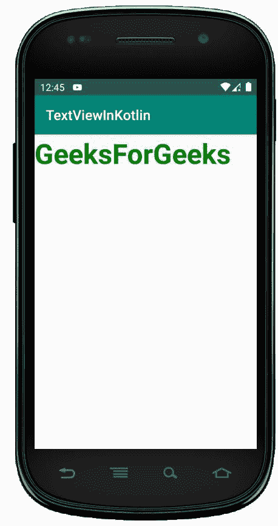
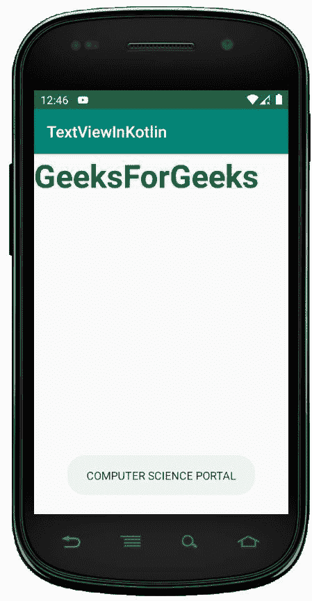

# 科特林文本视图

> 原文:[https://www.geeksforgeeks.org/textview-in-kotlin/](https://www.geeksforgeeks.org/textview-in-kotlin/)

安卓文本视图只是一个视图，用于向用户显示文本，并可选地允许我们修改或编辑它。首先，在 Android Studio 中打开 Kotlin 项目。
以下步骤用于在柯特林创建**文本视图**:

1.  在 LinearLayout 内部的 **activity_main.xml** 文件中添加一个 TextView。
2.  在 activity_main.xml 文件中添加文本、文本颜色、文本大小、文本样式等属性。
3.  打开 MainActivity.kt 文件，并为文本视图设置 **OnClickListener** 以显示吐司消息。

## 文本视图小部件的不同属性–

| 属性 | 描述 |
| android:文本 | 设置文本视图的文本 |
| android:id | 给文本视图一个唯一的标识 |
| android:游标可见 | 使用此属性使光标可见或不可见。默认值可见。 |
| android:drawableBottom | 将图像或其他图形资源设置在文本视图的下方。 |
| Android:draw end | 将图像或其他图形资源设置到文本视图的末尾。 |
| 安卓:可画左 | 将图像或其他图形资源设置在文本视图的左侧。 |
| Android:draw padding | 为文本视图中的可绘制内容(图像或其他图形资源)设置填充。 | android:自动链接 | 此属性用于自动检测 url 或电子邮件，并将其显示为可点击的链接。 |
| android:自动图文集 | 自动纠正文本视图文本中的拼写错误。 |
| 安卓:大写 | 无论用户在文本视图中键入什么，它都会自动大写。 |
| 安卓:drawableRight | 在文本视图中将可绘制对象设置在文本的右侧。 |
| android:drawableStart | 在文本视图中将可绘制内容设置为文本的开头。 |
| android:drawableTop | 在“文本视图”中将可绘图项设置在文本的顶部。 |
| android:椭球体 | 如果文本长度超过文本视图宽度，当您希望文本被椭圆化时，请使用此属性。 |
| 安德里亚斯姆 | 设置 ems 中 Textview 的宽度。 |
| 安卓:重力 | 我们可以垂直或水平对齐文本视图的文本，或者两者都对齐。 |
| 安卓:身高 | 用于设置文本视图的高度。 |
| 安卓:提示 | 用于在没有文本时显示提示。 |
| android:inputType | 用于设置文本视图的输入类型。可以是号码、密码、电话等。 |
| 安卓:线条 | 用于根据行数设置文本视图的高度。 |
| android:maxHeight | 设置文本视图的最大高度。 |
| android:minHeight | 设置文本视图的最小高度。 |
| android:maxLength | 设置文本视图的最大字符长度。 |
| android:maxLines | 设置文本视图可以拥有的最大行数。 |
| android:minLines | 设置文本视图可以拥有的最少行数。 |
| android:最大宽度 | 设置文本视图可以具有的最大宽度。 |
| 安卓:minWidth | 设置文本视图可以拥有的最少行数。 |
| Android:text llcaps | 用大写字母显示文本视图的所有文本。 |
| android:文本颜色 | 设置文本的颜色。 |
| android:文本大小 | 设置文本的字体大小。 |
| android:textStyle | 设置文本的样式。例如，粗体、斜体、粗斜体。 |
| 安卓:字体 | 设置文本的字体。例如，普通、无衬线、衬线等 |
| 安卓:宽度 | 设置文本视图的宽度。 |

## 修改 strings.xml 文件

我们可以在 strings.xml 文件中添加字符串，并通过用它们的名称调用它们来轻松地在其他文件中使用它们。

```kt
<resources>
    <string name="app_name">TextViewInKotlin</string>
    <string name="text_view">GeeksForGeeks</string>
    <string name="text_on_click">COMPUTER SCIENCE PORTAL</string>
</resources>
```

## activity_main.xml 文件

打开 activity_main.xml 文件，使用 id textView 创建一个 TextView。

```kt
<?xml version="1.0" encoding="utf-8"?>
<LinearLayout
    xmlns:android="http://schemas.android.com/apk/res/android"
    xmlns:tools="http://schemas.android.com/tools"
    android:orientation="vertical"
    android:layout_width="match_parent"
    android:layout_height="match_parent"
    tools:context=".MainActivity">

    <!--EditText with id editText-->

    <TextView
        android:id="@+id/text_view_id"
        android:layout_height="wrap_content"
        android:layout_width="wrap_content"
        android:text="@string/text_view"
        android:textColor="#008000"
        android:textSize="40dp"
        android:textStyle="bold"/>
</LinearLayout>
```

打开 MainActivity.kt 文件，获取布局文件中定义的 TextView 的引用。

```kt

// finding the textView
 val textView = findViewById(R.id.text_view_id) as TextView 
```

将点击监听器设置为按钮

```kt
textView?.setOnClickListener{ Toast.makeText(this@MainActivity,
                "COMPUTER SCIENCE PORTAL", Toast.LENGTH_LONG).show() }

```

## MainActivity.kt 文件

打开 app/src/main/Java/**your package name**/main activity . kt 获取 TextView 的引用。

```kt
package com.geeksforgeeks.myfirstkotlinapp

import androidx.appcompat.app.AppCompatActivity
import android.os.Bundle
import android.widget.TextView
import android.widget.Toast

class MainActivity : AppCompatActivity() {

        override fun onCreate(savedInstanceState: Bundle?) {
            super.onCreate(savedInstanceState)
            setContentView(R.layout.activity_main)

            //accessing our textview from layout
            val textView = findViewById<TextView>(R.id.text_view_id) as TextView
            textView?.setOnClickListener{ Toast.makeText(this@MainActivity,
                R.string.text_on_click, Toast.LENGTH_LONG).show() }
        }

}
```

## AndroidManifest.xml 文件

我们还将看到 main/AndroidManifest.xml 文件中的代码。

```kt
<?xml version="1.0" encoding="utf-8"?>
<manifest xmlns:android="http://schemas.android.com/apk/res/android"
    package="com.geeksforgeeks.myfirstkotlinapp">

    <application
        android:allowBackup="true"
        android:icon="@mipmap/ic_launcher"
        android:label="@string/app_name"
        android:roundIcon="@mipmap/ic_launcher_round"
        android:supportsRtl="true"
        android:theme="@style/AppTheme">
        <activity android:name=".MainActivity">
            <intent-filter>
                <action android:name="android.intent.action.MAIN" />

                <category android:name="android.intent.category.LAUNCHER" />
            </intent-filter>
        </activity>
    </application>

</manifest>
```

## 作为输出模拟器运行:

