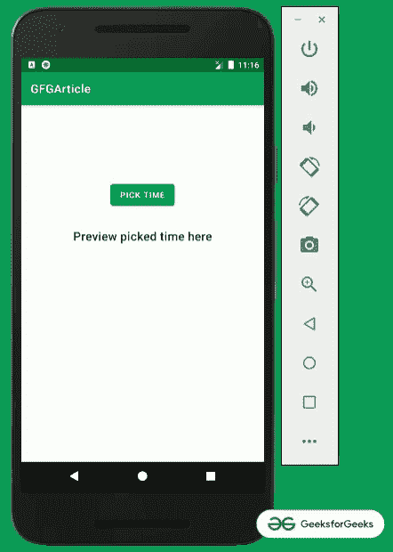
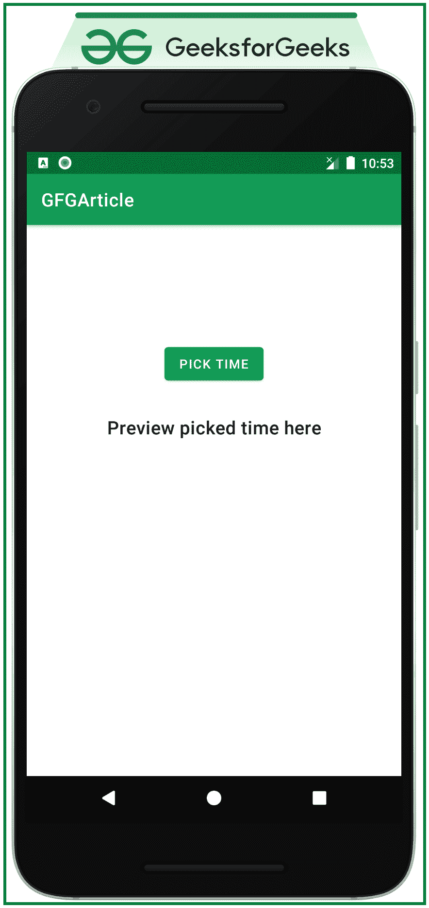
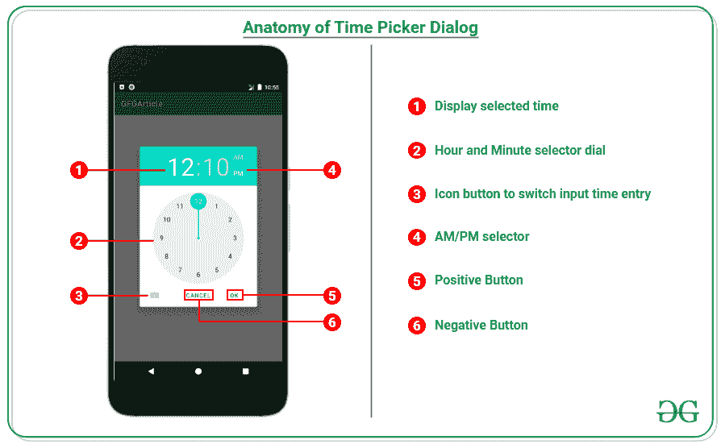

# 安卓中的时间选择器对话框

> 原文:[https://www . geesforgeks . org/time-picker-dialog-in-Android/](https://www.geeksforgeeks.org/time-picker-dialog-in-android/)

安卓**时间选择器**是一个用户界面控件，用于选择 24 小时格式或上午/下午模式的时间。它用于确保用户在我们的应用程序中选择当天的有效时间。时间选择器界面基本上以两种模式存在，一种是在 XML 布局下，另一种是对话框。在这次讨论中，已经演示了如何在 android 中实现 TimePicker Dialog。关于 XML 布局中的时间选择器，请参考科特林中的[时间选择器。请看下图，了解讨论概况。](https://www.geeksforgeeks.org/timepicker-in-kotlin/)



**在安卓应用中实现时间选择器对话框的步骤**

**第一步:创建一个空的活动项目**

创建一个空的活动 Android Studio 项目，选择 **Kotlin** 作为编程语言。[安卓|如何在安卓工作室创建/启动新项目？](https://www.geeksforgeeks.org/android-how-to-create-start-a-new-project-in-android-studio/)

**步骤 2:使用 activity_main.xml 文件**

应用程序的主布局包含一个按钮和文本视图来预览选择的时间。要实现相同的布局，在 **activity_main.xml** 文件中调用以下代码。

## 可扩展标记语言

```
<?xml version="1.0" encoding="utf-8"?>
<androidx.constraintlayout.widget.ConstraintLayout 
    xmlns:android="http://schemas.android.com/apk/res/android"
    xmlns:app="http://schemas.android.com/apk/res-auto"
    xmlns:tools="http://schemas.android.com/tools"
    android:layout_width="match_parent"
    android:layout_height="match_parent"
    tools:context=".MainActivity"
    tools:ignore="HardcodedText">

    <Button
        android:id="@+id/pick_time_button"
        android:layout_width="wrap_content"
        android:layout_height="wrap_content"
        android:layout_marginTop="128dp"
        android:text="PICK TIME"
        app:layout_constraintEnd_toEndOf="parent"
        app:layout_constraintStart_toStartOf="parent"
        app:layout_constraintTop_toTopOf="parent" />

    <TextView
        android:id="@+id/preview_picked_time_textView"
        style="@style/TextAppearance.MaterialComponents.Headline6"
        android:layout_width="wrap_content"
        android:layout_height="wrap_content"
        android:layout_marginTop="32dp"
        android:text="Preview picked time here"
        app:layout_constraintEnd_toEndOf="@+id/pick_time_button"
        app:layout_constraintStart_toStartOf="@+id/pick_time_button"
        app:layout_constraintTop_toBottomOf="@+id/pick_time_button" />

</androidx.constraintlayout.widget.ConstraintLayout>
```

**输出 UI:**



**在执行时间选择器对话框之前，了解对话框的结构很重要**



**第三步:使用 MainActivity.kt 文件**

在 MainActivity.kt 文件中，TimePickerDialog 的实例采用了 5 个参数。

> timepick dialog(context，timepickerdialoglistener，defaulthourfdialog(int)，defaultminutes fddialog(int)，is24HourView(boolean))

要实现时间选择器对话框，请调用以下代码。

## 我的锅

```
import android.app.TimePickerDialog
import androidx.appcompat.app.AppCompatActivity
import android.os.Bundle
import android.widget.Button
import android.widget.TextView
import android.widget.TimePicker

class MainActivity : AppCompatActivity() {

    lateinit var previewSelectedTimeTextView: TextView

    // listener which is triggered when the
      // time is picked from the time picker dialog
    private val timePickerDialogListener: TimePickerDialog.OnTimeSetListener =
        object : TimePickerDialog.OnTimeSetListener {
            override fun onTimeSet(view: TimePicker?, hourOfDay: Int, minute: Int) {

                // logic to properly handle 
                  // the picked timings by user
                val formattedTime: String = when {
                    hourOfDay == 0 -> {
                        if (minute < 10) {
                            "${hourOfDay + 12}:0${minute} am"
                        } else {
                            "${hourOfDay + 12}:${minute} am"
                        }
                    }
                    hourOfDay > 12 -> {
                        if (minute < 10) {
                            "${hourOfDay - 12}:0${minute} pm"
                        } else {
                            "${hourOfDay - 12}:${minute} pm"
                        }
                    }
                    hourOfDay == 12 -> {
                        if (minute < 10) {
                            "${hourOfDay}:0${minute} pm"
                        } else {
                            "${hourOfDay}:${minute} pm"
                        }
                    }
                    else -> {
                        if (minute < 10) {
                            "${hourOfDay}:${minute} am"
                        } else {
                            "${hourOfDay}:${minute} am"
                        }
                    }
                }

                previewSelectedTimeTextView.text = formattedTime
            }
        }

    override fun onCreate(savedInstanceState: Bundle?) {
        super.onCreate(savedInstanceState)
        setContentView(R.layout.activity_main)

        // instance of the UI elements
        val buttonPickTime: Button = findViewById<Button>(R.id.pick_time_button)
        previewSelectedTimeTextView = findViewById<TextView>(R.id.preview_picked_time_textView)

        // handle the pick time button to
          // open the TimePickerDialog
        buttonPickTime.setOnClickListener {
            val timePicker: TimePickerDialog = TimePickerDialog(
                // pass the Context
                this,
                // listener to perform task
                  // when time is picked
                timePickerDialogListener,
                // default hour when the time picker
                  // dialog is opened
                12,
                // default minute when the time picker
                  // dialog is opened
                10,
                // 24 hours time picker is 
                  // false (varies according to the region)
                false
            )

            // then after building the timepicker 
              // dialog show the dialog to user
            timePicker.show()
        }
    }
}
```

**输出:**

<video class="wp-video-shortcode" id="video-610261-1" width="640" height="360" preload="metadata" controls=""><source type="video/mp4" src="https://media.geeksforgeeks.org/wp-content/uploads/20210522111920/Untitled.mp4?_=1">[https://media.geeksforgeeks.org/wp-content/uploads/20210522111920/Untitled.mp4](https://media.geeksforgeeks.org/wp-content/uploads/20210522111920/Untitled.mp4)</video>