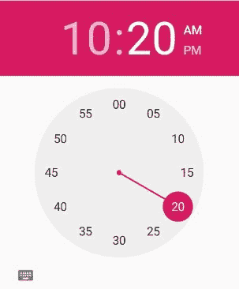

# 科特林时间选择器

> 原文:[https://www.geeksforgeeks.org/timepicker-in-kotlin/](https://www.geeksforgeeks.org/timepicker-in-kotlin/)

安卓**时间选择器**是一个用户界面控件，用于选择 24 小时格式或上午/下午模式的时间。它用于确保用户在我们的应用程序中选择当天的有效时间。

在安卓系统中，TimePicker 有两种模式，第一种是时钟模式，另一种是微调模式。

我们可以在 XML 布局中手动使用 TimePicker，也可以在 Kotlin 文件中以编程方式创建它。在本文中，我们应该在 XML 布局中使用时间选择器小部件。

首先，我们按照以下步骤创建一个**新项目**:

1.  点击文件，然后**新建** = > **新项目**。
2.  之后加入 Kotlin 支持，点击下一步。
3.  根据方便选择最小 SDK，点击下一步按钮。
4.  然后选择**清空**活动= > **下一个** = > **完成**。

## 带时钟模式的安卓计时器

我们可以使用**安卓:timePickerMode** 只显示时钟视图。在下面的例子中，我们在时钟模式下使用时间选择器。

```kt
<TimePicker
        android:id="@+id/timePicker1"
        android:layout_width="wrap_content"
        android:layout_height="wrap_content"
        android:layout_centerHorizontal="true"
        android:layout_marginTop="20dp"
        android:timePickerMode="clock"/>
```

上面的 TimePicker 的代码可以这样在安卓应用中看到


## 带微调模式的安卓时间选择器

我们也可以通过使用 **android:timePickerMode** 属性来使用微调器格式的 TimePicker。

```kt
<TimePicker
        android:id="@+id/timePicker1"
        android:layout_width="wrap_content"
        android:layout_height="wrap_content"
        android:layout_centerHorizontal="true"
        android:layout_marginTop="20dp"
        android:timePickerMode="spinner"/>
```

上面的 TimePicker 的代码可以这样在安卓应用中看到


## 时间选择器控件的不同属性–

| XML 属性 | 描述 |
| --- | --- |
| android:id | 用于唯一标识控件。 |
| Android:time pick mode(时间选择模式) | 用于指定时间选择器(微调器或时钟)的模式 |
| 安卓:背景 | 用于设置文本视图的背景颜色。 |
| 安卓:填充 | 用于从左、右、上、下设置填充。 |
| 安卓:可见性 | 用于指定视图的可见性。 |

## 在 activity_main.xml 中使用时钟时间选择器

在这个文件中，我们将添加时间选择器和文本视图小部件，并设置它们的属性，以便可以在 kotlin 文件中访问它们。

```kt
<?xml version="1.0" encoding="utf-8"?>
<RelativeLayout xmlns:android="http://schemas.android.com/apk/res/android"
    android:layout_width="match_parent"
    android:layout_height="match_parent">

    <TimePicker
        android:id="@+id/timePicker"
        android:layout_width="wrap_content"
        android:layout_height="wrap_content"
        android:layout_centerHorizontal="true"
        android:layout_margin="@dimen/padding"
        android:timePickerMode="clock"/>

    <TextView
        android:id="@+id/textView"
        android:layout_width="wrap_content"
        android:layout_height="wrap_content"
        android:layout_alignBottom="@+id/timePicker"
        android:textSize="18dp"
        android:paddingLeft="80dp" />

</RelativeLayout>
```

## 要在 activity_main.xml 中使用 Spinner TimePicker

在这个文件中，我们将添加时间选择器和文本视图小部件，并设置它们的属性，以便可以在 kotlin 文件中访问它们。

```kt
<?xml version="1.0" encoding="utf-8"?>
<RelativeLayout xmlns:android="http://schemas.android.com/apk/res/android"
    android:layout_width="match_parent"
    android:layout_height="match_parent">

    <TimePicker
        android:id="@+id/timePicker"
        android:layout_width="wrap_content"
        android:layout_height="wrap_content"
        android:layout_centerHorizontal="true"
        android:layout_margin="@dimen/padding"
        android:timePickerMode="spinner"/>

    <TextView
        android:id="@+id/textView"
        android:layout_width="wrap_content"
        android:layout_height="wrap_content"
        android:layout_alignBottom="@+id/timePicker"
        android:textSize="18dp"
        android:paddingLeft="80dp" />

</RelativeLayout>
```

## 修改 strings.xml 文件以添加字符串数组

在这里，我们将指定活动的名称。

```kt
<resources>
    <string name="app_name">TimePickerInKotlin</string>
</resources>
```

## 访问 MainActivity.kt 文件中的时间选择器

首先我们定义一个函数 *OnClickTime()* ，从 MainActivity 调用。

```kt
private fun OnClickTime()
```

然后，我们声明两个变量 *textView* 和 *timePicker* 来使用它们的 id 从 XML 布局中访问小部件。

```kt
val textView = findViewById(R.id.textView)
val timePicker = findViewById<timepicker>(R.id.timePicker)</timepicker> 
```

```kt
package com.geeksforgeeks.myfirstkotlinapp

import androidx.appcompat.app.AppCompatActivity
import android.os.Bundle
import android.view.ViewGroup
import android.widget.*

class MainActivity : AppCompatActivity() {

    override fun onCreate(savedInstanceState: Bundle?) {
        super.onCreate(savedInstanceState)
        setContentView(R.layout.activity_main)
        OnClickTime()
    }

    private fun OnClickTime() {
        val textView = findViewById<TextView>(R.id.textView)
        val timePicker = findViewById<TimePicker>(R.id.timePicker)
        timePicker.setOnTimeChangedListener { _, hour, minute -> var hour = hour
            var am_pm = ""
            // AM_PM decider logic
            when {hour == 0 -> { hour += 12
                am_pm = "AM"
            }
                hour == 12 -> am_pm = "PM"
                hour > 12 -> { hour -= 12
                    am_pm = "PM"
                }
                else -> am_pm = "AM"
            }
            if (textView != null) {
                val hour = if (hour < 10) "0" + hour else hour
                val min = if (minute < 10) "0" + minute else minute
                // display format of time
                val msg = "Time is: $hour : $min $am_pm"
                textView.text = msg
                textView.visibility = ViewGroup.VISIBLE
            }
        }
    }
}
```

## AndroidManifest.xml 文件

```kt
<?xml version="1.0" encoding="utf-8"?>
<manifest xmlns:android="http://schemas.android.com/apk/res/android"
package="com.geeksforgeeks.myfirstkotlinapp">

<application
    android:allowBackup="true"
    android:icon="@mipmap/ic_launcher"
    android:label="@string/app_name"
    android:roundIcon="@mipmap/ic_launcher_round"
    android:supportsRtl="true"
    android:theme="@style/AppTheme">
    <activity android:name=".MainActivity">
        <intent-filter>
            <action android:name="android.intent.action.MAIN" />

            <category android:name="android.intent.category.LAUNCHER" />
        </intent-filter>
    </activity>
</application>

</manifest>
```

## 作为模拟器运行:

