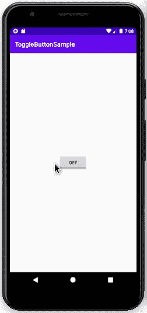

# 科特林的 toggle button

> 原文:[https://www.geeksforgeeks.org/togglebutton-in-kotlin/](https://www.geeksforgeeks.org/togglebutton-in-kotlin/)

在[安卓](https://www.geeksforgeeks.org/introduction-to-android-development/)中， **ToggleButton** 就像一个包含两种状态的开关，或者 **ON** 或者 **OFF** ，分别用布尔值 true 和 false 来表示。ToggleButton 与 switch 不同，它没有滑动界面，也就是说我们不能滑动来改变状态。它就像一个按钮。在本文中，我们将讨论如何在 Kotlin 中创建 ToggleButton。

#### 安卓 ToggleButton XML 属性

> **注意:** ToggleButton 继承了安卓的[按钮类。因此，按钮的所有属性也适用于此。](https://www.geeksforgeeks.org/button-in-kotlin/)

以下是一些附加的重要属性

<figure class="table">

| 属性 | 描述 |
| --- | --- |
| android:id | 分配给切换按钮的 id |
| Android:text ff | 未选中时按钮上显示的文本 |
| Android:textin | 选中按钮时按钮上显示的文本 |
| android:disabledAlpha | 禁用时应用于的 alpha(不透明度)。 |

</figure>

#### 在安卓工作室创建一个新项目

要在 Android Studio 中创建新项目，请按照以下步骤操作:

1.  单击文件，然后单击新建，然后单击新建项目，并给出您喜欢的名称。
2.  为项目模板选择“空活动”。
3.  然后，选择 Kotlin 语言支持，并单击下一步按钮。
4.  选择最小 SDK，无论您需要什么

#### 修改 activity_main.xml

## 可扩展标记语言

```kt
<?xml version="1.0" encoding="utf-8"?>
<androidx.constraintlayout.widget.ConstraintLayout
    xmlns:android="http://schemas.android.com/apk/res/android"
    xmlns:app="http://schemas.android.com/apk/res-auto"
    xmlns:tools="http://schemas.android.com/tools"
    android:layout_width="match_parent"
    android:layout_height="match_parent"
    tools:context=".MainActivity">

    <ToggleButton
        android:id="@+id/toggleButton"
        android:layout_width="wrap_content"
        android:layout_height="wrap_content"
        app:layout_constraintBottom_toBottomOf="parent"
        app:layout_constraintEnd_toEndOf="parent"
        app:layout_constraintStart_toStartOf="parent"
        app:layout_constraintTop_toTopOf="parent" />
</androidx.constraintlayout.widget.ConstraintLayout>
```

#### 访问切换按钮

布局中的切换按钮可以使用**findwiewbyid()**功能访问。

```kt
val toggle: ToggleButton = findViewById(R.id.toggleButton)
```

访问后，使用**setncheckedchangelistener()**方法设置一个监听器根据切换状态执行操作。

```kt
toggle.setOnCheckedChangeListener { _, isChecked -> **Perform Any Action Here**}
```

#### 修改 MainActivity.kt 文件

## Java 语言(一种计算机语言，尤用于创建网站)

```kt
package com.example.togglebuttonsample
import androidx.appcompat.app.AppCompatActivity
import android.os.Bundle
import android.widget.Toast
import android.widget.ToggleButton

class MainActivity : AppCompatActivity() {

    override fun onCreate(savedInstanceState: Bundle?) {
        super.onCreate(savedInstanceState)
        setContentView(R.layout.activity_main)

        val toggle: ToggleButton = findViewById(R.id.toggleButton)
        toggle.setOnCheckedChangeListener { _, isChecked ->
            Toast.makeText(this, if(isChecked) "Geek Mode ON" else "Geek Mode OFF", Toast.LENGTH_SHORT).show()
        }
    }
}
```

#### 在模拟器上运行

