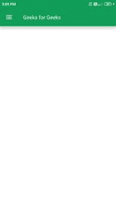

# 使用 jetppack Compose

在安卓中打开 ppBar

> 原文:[https://www . geesforgeks . org/topappbar-in-Android-using-jet pack-compose/](https://www.geeksforgeeks.org/topappbar-in-android-using-jetpack-compose/)

**TopAppBar** 类似于安卓中的[动作栏](https://www.geeksforgeeks.org/what-are-the-different-types-of-bars-available-in-android/)小部件。这是安卓系统中最多的 UI 组件之一。动作栏用于表示安卓中的应用名称和动作项。在本文中，我们将看一下在安卓系统中使用[jetppack compose](https://www.geeksforgeeks.org/basics-of-jetpack-compose-in-android/)实现 TopAppBar。

### **顶部应用程序栏小部件的属性**

<figure class="table">

| 

属性

 | 

描述

 |
| --- | --- |
| 标题 | 这用于表示动作栏的标题。 |
| 导航图标 | 这被用作用于打开导航抽屉引导图标。 |
| 背景颜色 | 这用于表示我们顶部应用程序栏的 backgroundColor。 |
| contentColor | 这种颜色用于给我们动作栏的内容着色。 |
| 海拔 | 这用于提升我们顶部应用程序栏。 |

</figure>

### **分步实施**

**第一步:创建新项目**

要在安卓工作室加那利版本中创建新项目，请参考[如何使用 Jetpack Compose](https://www.geeksforgeeks.org/how-to-create-a-new-project-in-android-studio-canary-version-with-jetpack-compose/) 在安卓工作室加那利版本中创建新项目。

**步骤 2:使用 MainActivity.kt 文件**

添加此图片后，导航至**app>Java>main activity . kt**并添加以下代码。在代码中添加注释，以更详细地理解代码。

## 我的锅

```
import android.graphics.drawable.shapes.Shape
import android.media.Image
import android.os.Bundle
import android.widget.Toast
import androidx.appcompat.app.AppCompatActivity
import androidx.compose.foundation.BorderStroke
import androidx.compose.foundation.Image
import androidx.compose.foundation.InteractionState
import androidx.compose.foundation.Text
import androidx.compose.foundation.layout.*
import androidx.compose.foundation.shape.CircleShape
import androidx.compose.foundation.shape.RoundedCornerShape
import androidx.compose.foundation.text.KeyboardOptions
import androidx.compose.material.*
import androidx.compose.material.icons.Icons
import androidx.compose.material.icons.filled.AccountCircle
import androidx.compose.material.icons.filled.Info
import androidx.compose.material.icons.filled.Menu
import androidx.compose.material.icons.filled.Phone
import androidx.compose.runtime.*
import androidx.compose.runtime.savedinstancestate.savedInstanceState
import androidx.compose.ui.Alignment
import androidx.compose.ui.layout.ContentScale
import androidx.compose.ui.platform.setContent
import androidx.compose.ui.res.imageResource
import androidx.compose.ui.tooling.preview.Preview
import androidx.compose.ui.unit.dp
import com.example.gfgapp.ui.GFGAppTheme
import androidx.compose.ui.Modifier
import androidx.compose.ui.draw.clip
import androidx.compose.ui.graphics.Color
import androidx.compose.ui.graphics.SolidColor
import androidx.compose.ui.platform.ContextAmbient
import androidx.compose.ui.platform.testTag
import androidx.compose.ui.res.colorResource
import androidx.compose.ui.text.TextStyle
import androidx.compose.ui.text.font.FontFamily
import androidx.compose.ui.text.input.*
import androidx.compose.ui.unit.Dp
import androidx.compose.ui.unit.TextUnit

class MainActivity : AppCompatActivity() {
    override fun onCreate(savedInstanceState: Bundle?) {
        super.onCreate(savedInstanceState)
        setContent {
            GFGAppTheme {
                // A surface container using the 'background' color from the theme
                Surface(color = MaterialTheme.colors.background) {
                    // at below line we are calling
                      // our function for toolbar.
                    ToolbarWidget();
                }
            }
        }
    }
}

// @Preview function is use to see preview
// for our composable function in preview section.
@Preview(showBackground = true)
@Composable
fun DefaultPreview() {
    GFGAppTheme {
          // we are passing our composable
        // function to display its preview.
        ToolbarWidget();
    }
}

@Composable
fun ToolbarWidget() {
    // theme for our app.
    Scaffold(
        // below line we are 
        // creating a top bar.
        topBar = {
            TopAppBar(
                // in below line we are 
                // adding title to our top bar.
                title = {
                    // inside title we are 
                    // adding text to our toolbar.
                    Text(
                        text = "Geeks for Geeks",
                        // below line is use 
                        // to give text color.
                        color = Color.White
                    )
                },
                navigationIcon = {
                    // navigation icon is use
                    // for drawer icon.
                    IconButton(onClick = { }) {
                        // below line is use to
                        // specify navigation icon.
                        Icon(Icons.Filled.Menu)
                    }
                },
                // below line is use to give background color
                backgroundColor = colorResource(id = R.color.purple_200),

                // content color is use to give
                // color to our content in our toolbar.
                contentColor = Color.White,

                // below line is use to give
                // elevation to our toolbar.
                elevation = 12.dp
            )
        }, bodyContent = {
            // bodyContent()
        })
}
```

现在运行您的应用程序，并查看应用程序的输出。

### **输出:**

