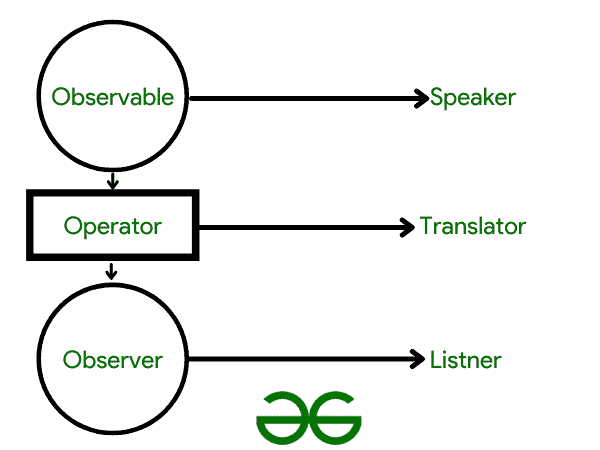

# RxJava 中可观察的类型

> 原文:[https://www . geesforgeks . org/type-of-observables-in-rxjava/](https://www.geeksforgeeks.org/types-of-observables-in-rxjava/)

在模型-视图范例中，这个类代表一个可观察的对象，或者“数据”它可以被子类化，以便表示应用程序希望观察的对象。问题是你正在创建一个软件，这个软件可以在两个维度上呈现描述三维场景的数据。应用程序必须是模块化的，并允许同一场景的大量并发视图。

一个或多个观察者可以被分配给一个可观察的对象。观察者可以是实现观察者界面的任何对象。当可观察的实例发生变化时，调用可观察的 **notifyObservers()** 方法的应用程序通过调用其更新方法将变化通知给所有的观察者。



图一。RxJava 中的可观察性解释。

简单来说，

*   **可观察的**类似于广播该值的扬声器。它执行各种任务并生成一些值。
*   **运算符**类似于翻译器，它将数据从一种形式转换/修改为另一种形式。
*   **观察者**获取值。

### RxJava 中的可观察类型

RxJava 中的许多类型的 Observables 如下:

*   可观察量
*   易流动的
*   单一的
*   可能
*   可完成

让我们开始在 RxJava 中创建一些 Observables 来更好地理解这一点，

**类型#1:创建基本可观察的**

**用例:**假设你正在下载一个文件，需要推送下载的当前状态。在这种情况下，您必须发出多个值。

## 我的锅

```kt
fun downloadObserervable(): Observable<Int> {
    return Observable.create { gfgshooter ->
        // Declaring an emitter in name of gfgshooter.
        // Beginning the task (in this case a simple download)
        // Your code...
        if (!gfgshooter.isDisposed) {

            // emit the progress
            gfgshooter.onNext(20)
        }
        // Still Downloading
        if (!gfgshooter.isDisposed) {

            // send progress
            gfgshooter.onNext(80)
        }
        // Progress 100, Download Over
        if (!gfgshooter.isDisposed) {

            // send progress
            gfgshooter.onNext(100)

            // send onComplete
            gfgshooter.onComplete()
        }
    }
}
```

**类型#2:使用可观察的**创建一个复杂的 Obersever

## 我的锅

```kt
fun getObserver(): Observer<Int> {
    return object : Observer<Int> {
        override fun onStart(d: Disposable) {

            // Observation Started
            // A sample editText
            editText.setText("onStart")
        }
        override fun onNext(progress: Int) {
            // Progress Updated
            editText.setText("onNext : $progress")
        }

        override fun onError(e: Throwable) {
            // Error Thrown
            editText.setText("onError : ${e.message}")
        }

        override fun onComplete() {
            // Observation Complete
            editText.setText("onComplete")
        }
    }
}
```

**观察者<T3】易流动**

当“可观察”发出大量观察者无法吸收的值时，“可流动”开始发挥作用。在这种情况下，可观察对象必须根据策略跳过一些数据，否则，它将抛出异常。可流动观察点使用一种策略来处理异常。**背压策略**为策略，**missing 背压异常**为异常。

> ***极客提示:**就像类型#1 一样，你可以使用 Flowable.create()类似地创建 flow。*

**孤<T3】单观察者**

当可观测值必须只发出一个值时，例如对网络请求的响应，则使用 Single。

**类型#3:创建单个可观察**

## 我的锅

```kt
fun singleObservable(): Single<String> {
    return Single.create { emitter ->
        // any code which has a task
        if (!gfgEmitter.isDisposed) {
            gfgEmitter.onSuccess("Spandan's Code Ran!")
        }
    }
}
```

然后以下列方式将其用于单个可观测值:

## 我的锅

```kt
fun singleObservable(): SingleObserver<String> {
    return object : SingleObserver<String> {
        override fun onSubscribe(d: Disposable) {
            edittext.setText("onStart")
        }

        override fun onSuccess(data: String) {
            // Successfully Executed
            editText.setText("onSuccess : $data")
        }

        override fun onError(e: Throwable) {
            // Error or Exception thrown.
           editText.setText("onError : ${e.message}")
        }
    }
}
```

T1【也许】T3>观察者

当可观测值必须发出一个值或没有值时，可能使用。

**类型#4:创建一个可能的观察者**

## 我的锅

```kt
fun maybeObservable(): Maybe<String> {
    return Maybe.create { gfgemitter ->
        // your code goes here
        if (!gfgemitter.isDisposed) {
            gfgemitter.onSuccess("Spandan's Code!")
        }
    }
}
```