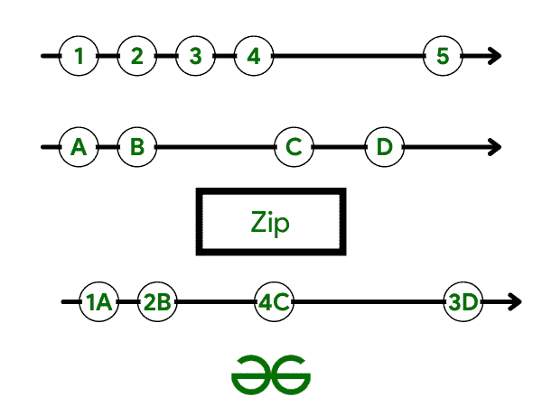

# 通过示例理解 RxJava Zip 运算符

> 原文:[https://www . geesforgeks . org/understanding-rxjava-zip-operator-with-example/](https://www.geeksforgeeks.org/understanding-rxjava-zip-operator-with-example/)

根据官方 RxJava 文档，“Zip 使用一个给定的函数组合了多个 Observables 的发射，并基于每个组合的该函数的结果发射单个项目”。zip 操作符使我们能够同时从多个观察点获得结果。



图一。了解拉链结构。

假设我们有以下两个网络观察点:GfGCoursesData–一个网络观察点，它产生了极客为极客提供的课程列表。GfGDSA–返回极客数据结构课程极客列表的网络观察

**GfFCourses 注意到以下几点:**

## 我的锅

```kt
fun getGfGCoursesData(): Observable<List<User>> {
    return networkService.getGfGCoursesData()
}
```