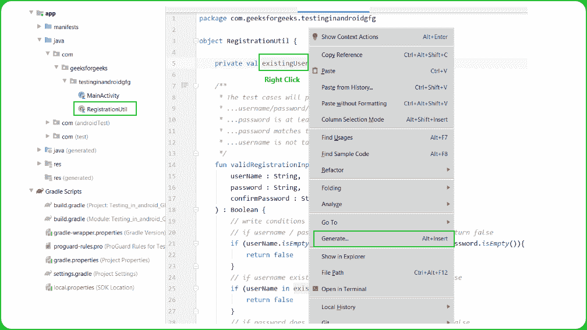
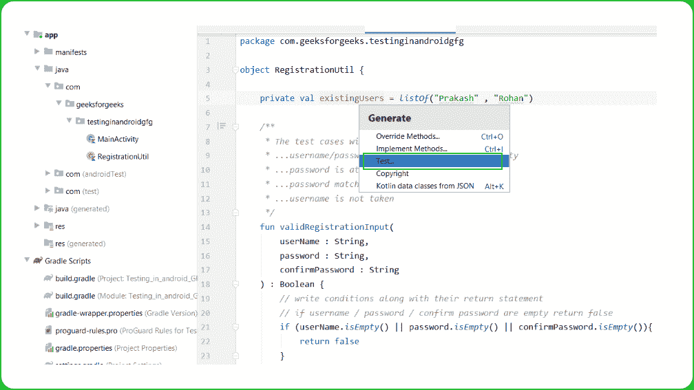
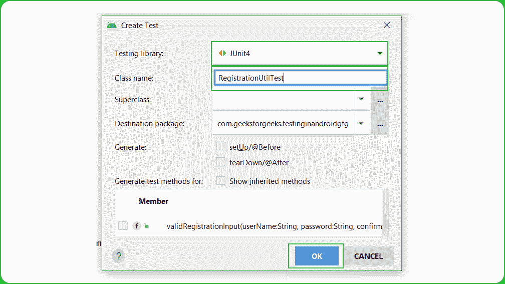
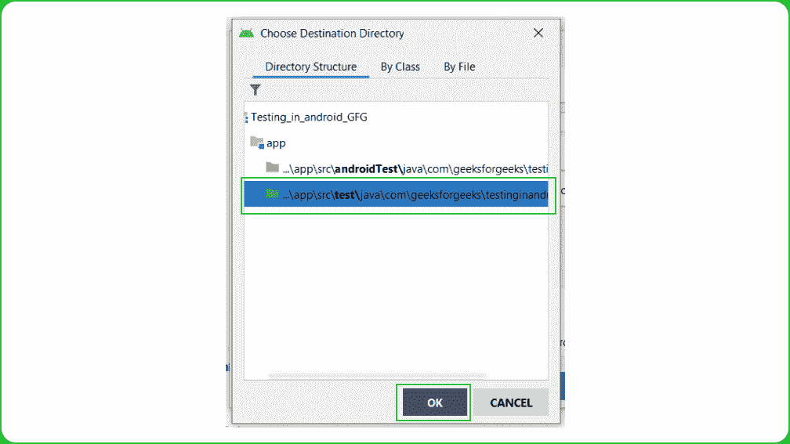
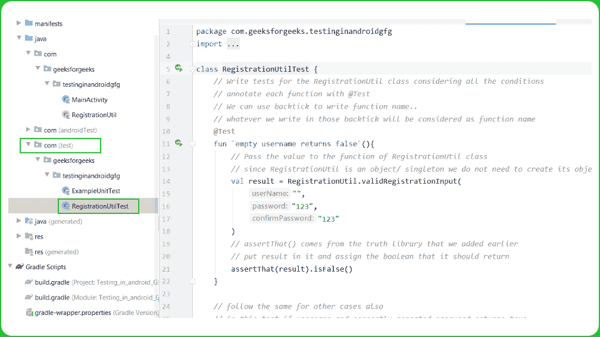
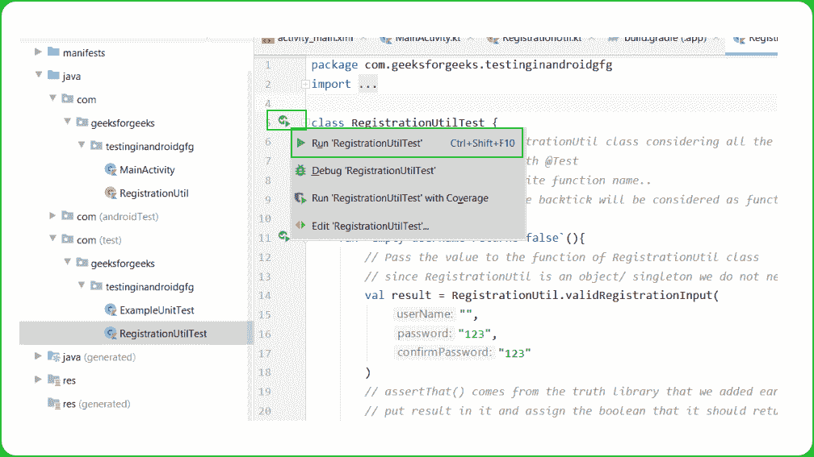
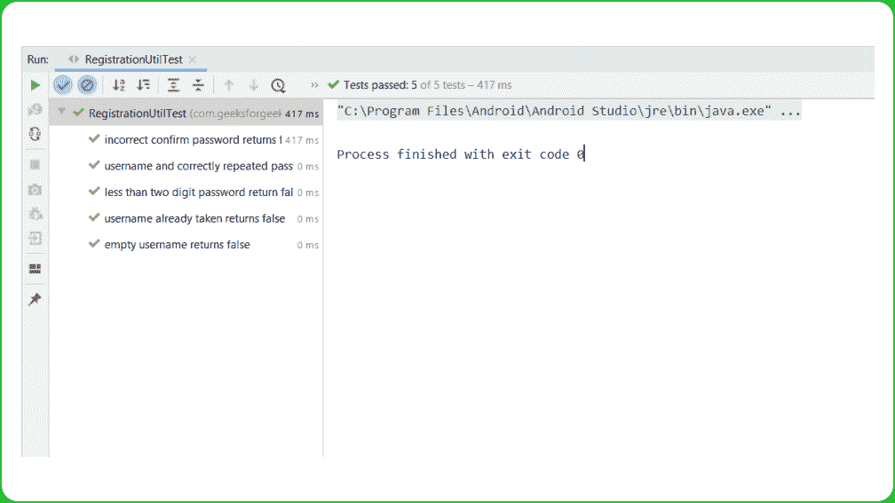

# 使用 JUnit 在安卓系统中进行单元测试

> 原文:[https://www . geesforgeks . org/unit-testing-in-Android-use-JUnit/](https://www.geeksforgeeks.org/unit-testing-in-android-using-junit/)

**做单元测试**是为了保证开发人员写出高质量、无错误的代码。建议在编写实际的应用程序之前编写单元测试，您将事先编写测试，并且实际的代码将必须遵守测试制定的设计指南。在本文中，我们使用 **JUnit** 来测试我们的代码。 **JUnit** 是一个用于 Java 应用的“**单元测试**”框架，默认情况下已经包含在 android studio 中。它是单元测试和用户界面测试的自动化框架。包含**@测试、**@ T10】@在之前、**@在**之后等注释。这里我们将只使用 **@Test** 注释来保持文章的通俗易懂。注意，我们将使用 **Kotlin** 语言来实现这个项目。

### **分步实施**

**第一步:创建新项目**

要在安卓工作室创建新项目，请参考[如何在安卓工作室创建/启动新项目。](https://www.geeksforgeeks.org/android-how-to-create-start-a-new-project-in-android-studio/)注意选择**科特林**作为编程语言。

**第 2 步:向 build.gradle 文件添加依赖项，然后单击“立即同步”**

> testImplementation " com . Google . truth:truth:1 . 0 . 1 "
> 
> androidTestImplementation " com . Google . truth:truth:1 . 0 . 1 "

**第三步:使用注册实用工具文件**

创建一个新的 Kotlin 文件 **RegistrationUtil** 并选择其类型作为对象。由于这是单例，我们不需要在其他类中使用它时创建它的对象。它有一个名为**验证注册输入**的函数，需要三个参数**用户名**、**密码**和**确认密码。**我们将使用以下测试用例，用不同的输入集测试这个函数。

*   用户名、密码、确认密码不应为空。
*   密码必须至少包含两位数字。
*   密码与确认的密码匹配。
*   不得使用用户名。

## 我的锅

```
object RegistrationUtil {

    private val existingUsers = listOf("Rahul" , "Rohan")

    /**
     * The test cases will pass if..
     * ...username/password/confirmPassword is not empty
     * ...password is at least 2 digits
     * ...password matches the confirm Password
     * ...username is not taken
     */
    fun validRegistrationInput(
        userName : String,
        password : String,
        confirmPassword : String
    ) : Boolean {
        // write conditions along with their return statement
        // if username / password / confirm password are empty return false
        if (userName.isEmpty() || password.isEmpty() || confirmPassword.isEmpty()){
            return false
        }
        // if username exists in the existingUser list return false
        if (userName in existingUsers){
            return false
        }
        // if password does not matches confirm password return false
        if (password != confirmPassword){
            return false
        }
        // if digit count of the password is less than 2 return false
        if (password.count { it.isDigit() } < 2){
            return false
        }
        return true
    }
}
```

**第四步:创建测试类**

要创建**注册工具**的测试类，右键单击注册工具上的**，然后单击生成，然后选择测试。将会打开一个对话框，从对话框中选择测试库为 JUnit4，并将类名保留为默认名称，即**registration utilitest**，然后单击确定。之后，会打开另一个对话框选择目的目录，选择有**的目录..app\src\test\。**因为我们的测试类不要求来自应用的任何上下文。下面是指导你创建测试类的截图。**

    

**第五步:使用 RegistrationUtilTest.kt 文件**

转到**registration utilitest . kt**文件，并编写以下代码。代码中添加了注释，以更详细地理解代码。

## 我的锅

```
import com.google.common.truth.Truth.assertThat
import org.junit.Test

class RegistrationUtilTest {
    // Write tests for the RegistrationUtil class considering all the conditions
    // annotate each function with @Test
    // We can use backtick to write function name..
    // whatever we write in those backtick will be considered as function name
    @Test
    fun `empty username returns false`(){
        // Pass the value to the function of RegistrationUtil class
        // since RegistrationUtil is an object/ singleton we do not need to create its object
        val result = RegistrationUtil.validRegistrationInput(
            "",
            "123",
            "123"
        )
        // assertThat() comes from the truth library that we added earlier
        // put result in it and assign the boolean that it should return
        assertThat(result).isFalse()
    }

    // follow the same for other cases also
    // in this test if username and correctly repeated password returns true
    @Test
    fun `username and correctly repeated password returns true`() {
        val result = RegistrationUtil.validRegistrationInput(
            "Rahul",
            "123",
            "123"
        )
        assertThat(result).isTrue()
    }

    // in this test userName already taken returns false
    @Test
    fun `username already taken returns false`() {
        val result = RegistrationUtil.validRegistrationInput(
            "Rohan",
            "123",
            "123"
        )
        assertThat(result).isFalse()
    }

    // if confirm password does nt matches the password return false
    @Test
    fun `incorrect confirm password returns false`() {
        val result = RegistrationUtil.validRegistrationInput(
            "Rahul",
            "123",
            "1234"
        )
        assertThat(result).isFalse()
    }

    // in this test if password has less than two digits than return false
    @Test
    fun `less than two digit password return false`() {
        val result = RegistrationUtil.validRegistrationInput(
            "Rahul",
            "abcd1",
            "abcd1"
        )
        assertThat(result).isFalse()
    }
}
```

**步骤 6:运行测试用例**

要运行测试用例，点击类名附近的小运行图标，然后选择运行**注册应用测试**。如果所有的测试用例都通过了，你将会在运行控制台得到一个绿色的勾号。就我们而言，所有测试都通过了。

 

**Github 回购** [**这里**](https://github.com/introidx/Testing-in-android-GFG) **。**