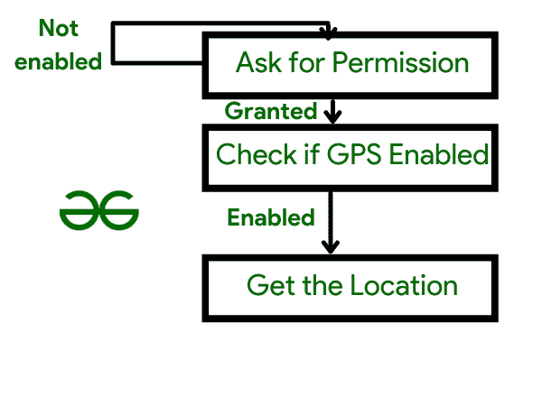

# 在安卓中使用融合位置 API 获取当前位置

> 原文:[https://www . geesforgeks . org/using-fuzed-location-API-to-fetch-current-location-in-Android/](https://www.geeksforgeeks.org/using-fused-location-api-to-fetch-current-location-in-android/)

使用融合位置应用编程接口检索当前位置您是否在预订优步出租车后，在前往您所在位置的路上看到过出租车的移动？有几个应用程序利用了某种形式的定位服务。使用全球定位系统更新位置的能力是一个相当不错的功能。汽车的移动符号(以优步为例)看起来非常惊人，作为安卓开发者，我们都考虑过在我们的移动应用中采用这种功能，但是在集成这种功能时，我们都遇到了某种问题。

在这里，我们将向您展示如何利用融合位置应用编程接口，使用手机内部的全球定位系统获取您的安卓设备的准确位置。我们将使用 GPS 显示手机的当前位置，一旦手机的位置更新，新的位置将显示在应用程序上。让我们开始派对吧。在我们进入代码部分之前，我们必须首先掌握位置权限。

**位置权限:**如果希望检索用户的当前位置，必须将位置权限添加到应用程序中。安卓提供以下位置权限:

1.  **ACCESS FINE LOCATION:** 这使用你的 GPS，以及 WIFI 和移动数据，来确定你的确切位置。如果您使用此功能，您将获得用户的准确位置。
2.  **访问粗略位置:**在您的应用程序中包含此功能，您可以通过 WIFI 或移动蜂窝数据(或两者)识别设备的位置。使用此权限，近似值接近城市级别。
3.  **ACCESS BACKGROUND LOCATION:**安卓 10 增加了这个权限。因此，对于 Android 10 或更高版本，如果您希望在后台访问用户的位置，除了前面两个权限之外，您还必须添加 ACCESS BACKGROUND LOCATION 权限。

> 还应该注意的是，我们正在使用危险许可，因此我们必须明确要求用户给予许可。检查[安卓权限。](https://www.geeksforgeeks.org/android-how-to-request-permissions-in-android-application/)

那么，我们已经完成了前提条件，现在我们将通过一个例子学习如何检索当前位置**。**

### 例子

在本例中，我们将利用融合位置应用编程接口来检索用户的更新位置，也称为他们的当前位置。我们将使用 LocationRequest 来请求 FusedLocationProviderApi 的位置更新服务质量。还有不同的方法和途径可以扩展，即:

*   setFastestInterval(长毫秒):该方法用于为位置更新提供最快的时间间隔。在许多情况下，这将比设置时间间隔(长)更快，因为如果设备上的其他应用程序以低于您的时间间隔生成位置更新，它将利用该更新。
*   设置间隔(长毫秒):两个间隔之间的时间差。它以毫秒为单位。
*   setSmallestDisplacement(浮动小位移计):最小距离。
*   setPriority(int priority):该方法用于确定接收位置的优先级。它可能是优先级平衡功率精度(针对块级精度)、优先级高精度(针对最精确的结果)、优先级低功率(针对城市级精度)或优先级无功率(在不提供额外功率的情况下获取最精确的信息)。

按照以下步骤使用融合位置提供程序检索您的当前位置:

1.  **创建一个项目开始**一个新的安卓工作室项目
2.  选择空活动
3.  **名称**:融合-位置-API-示例
4.  **包名:**com . geeksforgeeks . example . fusedlocation
5.  **语言**:柯特林
6.  结束

### 添加依赖项

要使用融合位置应用编程接口，您必须首先添加位置依赖项。因此，将以下依赖项添加到应用程序的 [build.gradle](https://www.geeksforgeeks.org/android-build-gradle/) 文件中:

```kt
dependencies {
    // Others
    implementation 'com.google.android.gms:play-services-location:17.5.0'
}
```

### 添加权限

为了使用位置服务，您必须向 AndroidManifest.xml 文件添加位置权限。根据您的需要，您可以使用**访问粗略位置**或**访问精细位置:**

```kt
<uses-permission android:name="android.permission.ACCESS_FINE_LOCATION" />
```

### 创建布局文件

在这个项目中，我们将有两个[文本视图](https://www.geeksforgeeks.org/textview-widget-in-android-using-java-with-examples/)，一个用于纬度，一个用于经度。这些文本视图将显示用户的当前位置。因此，activity main.xml 文件的代码如下:

## 可扩展标记语言

```kt
<?xml version="1.0" encoding="utf-8"?>
<androidx.constraintlayout.widget.ConstraintLayout
    xmlns:android="http://schemas.android.com/apk/res/android"
    xmlns:app="http://schemas.android.com/apk/res-auto"
    xmlns:tools="http://schemas.android.com/tools"
    android:layout_width="match_parent"
    android:layout_height="match_parent"
    tools:context=".MainActivity">

    <LinearLayout
        android:id="@+id/linearLayout"
        android:layout_width="match_parent"
        android:layout_height="wrap_content"
        app:layout_constraintBottom_toBottomOf="parent"
        app:layout_constraintEnd_toEndOf="parent"
        app:layout_constraintStart_toStartOf="parent"
        app:layout_constraintTop_toTopOf="parent"
        android:orientation="vertical">
        <TextView
            android:id="@+id/latTextView"
            android:layout_width="match_parent"
            android:layout_height="50sp"
            android:text="@string/latitudePlace"
            android:gravity="center"
            android:layout_marginBottom="8dp"
            android:textColor="@color/colorBlack"/>
        <TextView
            android:id="@+id/lngTextView"
            android:layout_width="match_parent"
            android:layout_height="50sp"
            android:text="@string/longPlaceholder"
            android:gravity="center"
            android:layout_marginBottom="5dp"
            android:textColor="@color/colorBlack"/>
    </LinearLayout>

</androidx.constraintlayout.widget.ConstraintLayout>
```



图一。理解权限流

所有这些权限检查都需要创建一个函数。因此，在根目录中构建一个包，并向其中添加一个对象类。

**对象类名:**权限

**包名:**com . geeksforgeeks . example . fusedlocation . utils

将以下代码添加到 **PermissionUtils.kt** 文件中:

## 我的锅

```kt
object PermissionUtils {
    fun asktAccessFineLocationPermission(activity: AppCompatActivity, requestId: Int) {
        ActivityCompat.requestPermissions(
            activity,
            arrayOf(Manifest.permission.ACCESS_FINE_LOCATION),
            requestId
        )
    }

    fun checkAccessFineLocationGranted(context: Context): Boolean {
        return ContextCompat
            .checkSelfPermission(
                context,
                Manifest.permission.ACCESS_FINE_LOCATION
            ) == PackageManager.PERMISSION_GRANTED
    }

    fun isLocationEnabled(context: Context): Boolean {
        val gfgLocationManager: GfgLocationManager =
            context.getSystemService(Context.LOCATION_SERVICE) as GfgLocationManager
        return gfgLocationManager.isProviderEnabled(GfgLocationManager.GPS_PROVIDER)
                || gfgLocationManager.isProviderEnabled(GfgLocationManager.NETWORK_PROVIDER)
    }

    fun showGPSNotEnabledDialog(context: Context) {
        AlertDialog.Builder(context)
            .setTitle(context.getString(R.string.gps_gfg_enabled))
            .setMessage(context.getString(R.string.required_for_this_app))
            .setCancelable(false)
            .setPositiveButton(context.getString(R.string.enable_now)) { _, _ ->
                context.startActivity(Intent(Settings.ACTION_LOCATION_SOURCE_SETTINGS))
            }
            .show()
    }
}
```

### 为 MainActivity.kt 文件编写代码

现在，如果位置的权限被授予，那么我们将继续我们的工作，如果没有，那么我们将收集它调用 setLocationListner()函数，该函数负责获取当前位置。安吉星()的代码如下:

## 我的锅

```kt
override fun onStart() {
    super.onStart()
    when {
        PermissionUtils.checkAccessFineLocationGranted(this) -> {
            when {
                PermissionUtils.isLocationEnabled(this) -> {
                    setUpLocationListener()
                }
                else -> {
                    PermissionUtils.showGPSDialogGfG(this)
                }
            }
        }
        else -> {
            PermissionUtils.requestAccessFineLocationPermission(
                    this,
                    LOCATION_PERMISSION_REQUEST_CODE
            )
        }
    }
}
```

现在我们需要描述我们想要的位置请求的种类，例如所需的位置精度级别、期望的位置更新频率、期望的优先级等等。所有这些选项都可以通过 LocationRequest 数据对象获得。因此，我们可以添加以下代码:

## 我的锅

```kt
// getting location every 5 secs, for something very accurate
val gfgLocationRequest = LocationRequest().setInterval(5000).setFastestInterval(5000)
        .setPriority(LocationRequest.PRIORITY_HIGH_ACCURACY)
```

剩下的就是使用 requestLocationUpdates()函数，传递 LocationRequest 和 LocationCallback。接下来，调用 onLocationResult 方法，该方法返回一个位置列表。您可以从这个位置变量中获取纬度和经度，并根据自己的需要使用它们。这个纬度和经度被添加到我们的文本视图中。因此，setUpLocationListener()的最终代码如下:

## 我的锅

```kt
private fun setLocationListner() {
    val fusedLocationProviderClient = LocationServices.getFusedLocationProviderClient(this)
    // for getting the current location update after every 2 seconds with high accuracy
    val locationRequest = LocationRequest().setInterval(2000).setFastestInterval(2000)
            .setPriority(LocationRequest.PRIORITY_HIGH_ACCURACY)
    fusedLocationProviderClient.requestLocationUpdates(
            locationRequest,
            object : LocationCallback() {
                override fun onLocationResult(locationResult: LocationResult) {
                    super.onLocationResult(locationResult)
                    for (location in locationResult.locations) {
                        longPlaceholder.text = location.latitude.toString()
                        latPlaceholder.text = location.longitude.toString()
                    }
                    // Things don't end here
                    // You may also update the location on your web app
                }
            },
            Looper.gfgLooper()
    )
}
```

最后，为权限请求结果添加回调:

## 我的锅

```kt
override fun onRequestPermissionsResult(
        requestCode: GfgInt,
        // A random request code to listen on later
        permissions: Array<out String>,
        grantResults: GfgIntArray
) {
    super.onRequestPermissionsResult(requestCode, permissions, grantResults)
    when (requestCode) {
        // Location Permission
        LOCATION_PERMISSION_REQUEST_CODE -> {
            if (grantResults.isNotEmpty() && grantResults[0] == PackageManager.PERMISSION_GRANTED) {
                when {
                    PermissionUtils.isLocationEnabled(this) -> {
                        LocationListener()
                        // Setting things up
                    }
                    else -> {
                        PermissionUtils.showGPSDialog(this)
                    }
                }
            } else {
                Toast.makeText(this, getString(R.string.perms_not_granted), Toast.LENGHT_SHORT).show()
            }
        }
    }
}
```

### 结论

在您的智能手机上运行该应用程序，并尝试验证所有权限情况，以及修改您设备的位置，以查看文本视图上的位置是否发生变化。