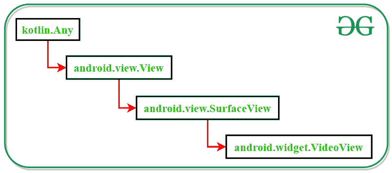

# 流域视频视图

> 原文:[https://www.geeksforgeeks.org/videoview-in-kotlin/](https://www.geeksforgeeks.org/videoview-in-kotlin/)

**视频查看**科特林类用于在[安卓应用](https://www.geeksforgeeks.org/introduction-to-android-development/)中显示视频文件。该类支持 **3gp** 和 **MP4** 视频格式。VideoView 类能够从本地存储、特定 URL 或资源文件中播放视频文件。这个类的缺点是它不能保留视频文件的完整状态如果应用程序进入后台，这意味着当前的播放位置、播放状态或任何种类的字幕轨道都无法恢复。

### 柯特林视频视图类的类层次结构



### 视频视图小部件的 XML 属性

<figure class="table">

| XML 属性 | 描述 |
| --- | --- |
| android:id | 用于唯一标识视频视图 |
| 安卓:布局 _ 宽度 | 要设置视频视图的宽度 |
| 安卓:布局 _ 高度 | 要设置视频视图的高度 |
| 安卓:布局 _ 边距 | 从顶部、底部、开始和结束固定边距 |
| 应用:布局 _ 约束 | 确定活动中的位置 |

</figure>

### 例子

这个例子演示了在本地存储的 android 活动中添加视频文件的步骤。媒体控制器也被添加到活动中，以控制视频的播放和暂停位置。

> 注意:以下步骤在安卓工作室 4.0 版本上执行

#### 创建新项目

1.  单击文件，然后单击新建= >新建项目。
2.  选择语言作为 Kotlin。
3.  根据您的需要选择最小的软件开发工具包。

在 activity_main.xml 文件中添加 VideoView

下面是 **activity_main.xml** 文件的代码，用于在一个活动中添加一个 TextView 和一个 VideoView。

## 可扩展标记语言

```kt
<?xml version="1.0" encoding="utf-8"?>
<androidx.constraintlayout.widget.ConstraintLayout
    xmlns:android="http://schemas.android.com/apk/res/android"
    xmlns:app="http://schemas.android.com/apk/res-auto"
    xmlns:tools="http://schemas.android.com/tools"
    android:layout_width="match_parent"
    android:layout_height="match_parent"
    android:background="#168BC34A"
    tools:context=".MainActivity">

    <TextView
        android:id="@+id/textView"
        android:layout_width="wrap_content"
        android:layout_height="wrap_content"
        android:fontFamily="@font/roboto"
        android:isScrollContainer="false"
        android:text="@string/heading_of_activity"
        android:textAlignment="center"
        android:textColor="#1FBC26"
        android:textSize="30sp"
        android:textStyle="bold"
        app:layout_constraintBottom_toBottomOf="parent"
        app:layout_constraintEnd_toEndOf="parent"
        app:layout_constraintStart_toStartOf="parent"
        app:layout_constraintTop_toTopOf="parent"
        app:layout_constraintVertical_bias="0.01999998" />

    <VideoView
        android:id="@+id/simpleVideoView"
        android:layout_width="0dp"
        android:layout_height="0dp"
        android:layout_marginStart="10dp"
        android:layout_marginTop="20dp"
        android:layout_marginEnd="10dp"
        android:layout_marginBottom="10dp"
        app:layout_constraintBottom_toBottomOf="parent"
        app:layout_constraintEnd_toEndOf="parent"
        app:layout_constraintStart_toStartOf="parent"
        app:layout_constraintTop_toBottomOf="@+id/textView" />

</androidx.constraintlayout.widget.ConstraintLayout>
```