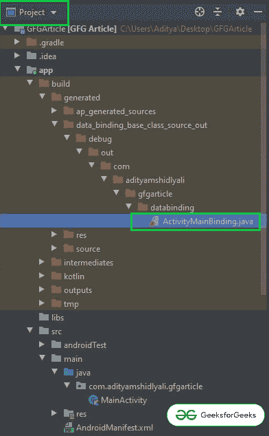
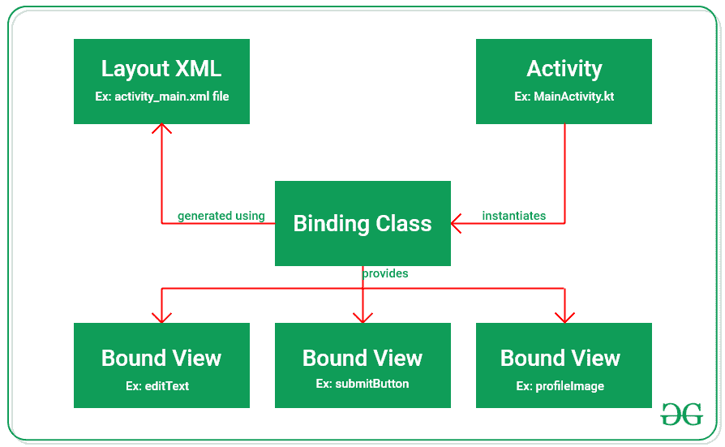
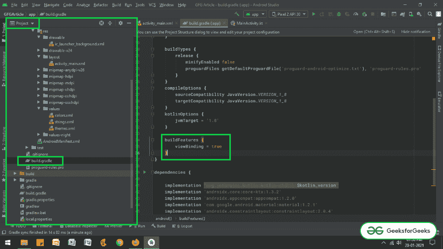

# 在安卓 Jetpack 中查看绑定

> 原文:[https://www . geesforgeks . org/view-binding-in-Android-jet pack/](https://www.geeksforgeeks.org/view-binding-in-android-jetpack/)

**视图绑定**是提供视图与正在进行的活动绑定的最佳特性之一。替换**findwiewbyid()**方法，从而减少样板代码，生成当前布局视图的实例。视图绑定最重要的特性是它总是空安全的。在本文中，详细介绍了视图绑定的详细方法。

### **在安卓中查看绑定功能**

*   视图绑定总是空安全和类型安全的，它支持 Java 和 Kotlin。
*   ViewBinding 是在 gradle 3.6 版及以上版本中引入的(随 Android Studio 4.0 推出，只有 Gradle 3.6)。
*   视图绑定还有助于减少样板代码，从而减少代码冗余。
*   使用视图绑定时，需要遵循适当的命名约定，因为它使用相同布局文件的名称在内部创建绑定类。在蛇的情况下命名布局文件是首选。例如，视图绑定创建 **activity_main.xml** (蛇的情况)文件作为 **ActivityMainBinding** (帕斯卡的情况)，它包含该布局中包含的所有视图的所有属性和实例。
*   此外，无论所有元素的标识是在布局 XML 文件中创建的，视图绑定都会将它们转换为 camel case。例如:**安卓:id = " button _ submit "->button submit。**这在代码可读性方面非常有用。
*   与传统的**findwiewbyid()**方法相比，使用视图绑定编译代码要快一点。
*   **ActivityMainBinding** 类在项目层次结构下的以下路径中生成，可以查看。



*   下面是如何从布局中生成属性对象的流程。



*   但是，如果绑定视图时必须忽略布局，可以通过向根布局添加以下属性来完成。

> **工具:viewpindingignore = " true "**

### **分步实施**

**第一步:创建一个空的活动项目**

*   这里使用的是安卓工作室，参考[安卓|如何在安卓工作室](https://www.geeksforgeeks.org/android-how-to-create-start-a-new-project-in-android-studio/)创建/启动新项目，了解如何创建一个空的活动安卓工作室项目。

**步骤 2:启用视图绑定功能**

*   需要在安卓工作室 4.0 及更高版本的应用级构建渐变文件中启用视图绑定功能。
*   在 gradle 文件的 **android{}** 主体中调用下面的代码片段。

> **构建功能{**
> 
> **视图绑定=真**
> 
> **}**

*   如果无法找到应用程序级渐变文件并调用项目视图层次结构下的功能，请参考下图。



**步骤 3:使用 activity_main.xml 文件**

*   文件的主布局包含一个编辑文本和一个按钮。要实现相同的用户界面，在**activ ity _ main . XML**文件中调用以下代码。

## 可扩展标记语言

```kt
<?xml version="1.0" encoding="utf-8"?>
<androidx.constraintlayout.widget.ConstraintLayout
    xmlns:android="http://schemas.android.com/apk/res/android"
    xmlns:app="http://schemas.android.com/apk/res-auto"
    xmlns:tools="http://schemas.android.com/tools"
    android:layout_width="match_parent"
    android:layout_height="match_parent"
    tools:context=".MainActivity"
    tools:ignore="HardcodedText">

    <EditText
        android:id="@+id/editText"
        android:layout_width="match_parent"
        android:layout_height="wrap_content"
        android:layout_marginStart="16dp"
        android:layout_marginTop="128dp"
        android:layout_marginEnd="16dp"
        android:hint="Enter Something"
        app:layout_constraintEnd_toEndOf="parent"
        app:layout_constraintStart_toStartOf="parent"
        app:layout_constraintTop_toTopOf="parent" />

    <Button
        android:id="@+id/button"
        android:layout_width="wrap_content"
        android:layout_height="wrap_content"
        android:layout_marginTop="16dp"
        android:text="Button"
        app:layout_constraintEnd_toEndOf="@+id/editText"
        app:layout_constraintTop_toBottomOf="@+id/editText" />

</androidx.constraintlayout.widget.ConstraintLayout>
```