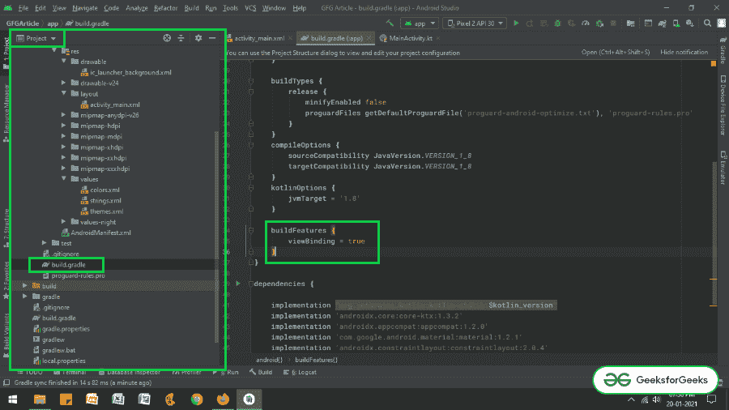
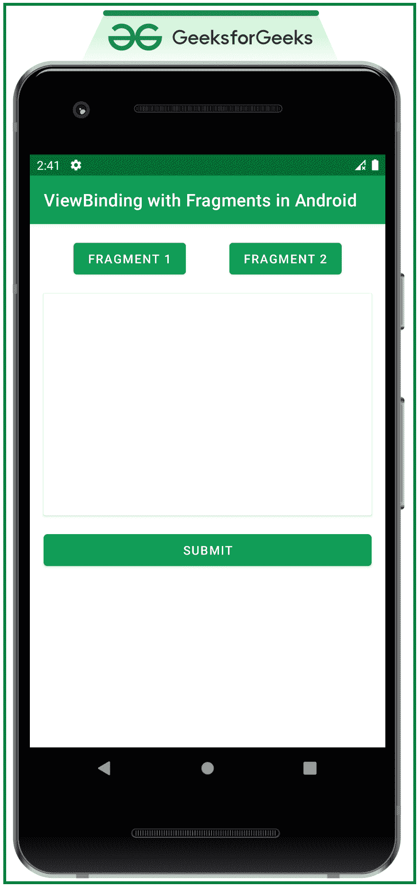

# 查看安卓 Jetpack 中与碎片的绑定

> 原文:[https://www . geesforgeks . org/view-binding-with-fragments-in-Android-jet pack/](https://www.geeksforgeeks.org/view-binding-with-fragments-in-android-jetpack/)

在之前的文章[安卓 Jetpack 中的视图绑定](https://www.geeksforgeeks.org/view-binding-in-android-jetpack/)中，已经讨论了为什么在安卓项目中获取视图绑定特性会带来很多好处。但是当涉及到片段的视图绑定时，情况就变了。因为片段的[生命周期是不同的，活动的生命周期也是不同的，这里的事情也和上面文章中讨论的一样，片段布局的命名约定被更改为帕斯卡格，片段布局的属性被更改为骆驼格。例如，**fragment 1 . XML->fragment 1 binding**和 **edit_text** (id)在片段的布局下更改为 **eEditText** (camel case)所以在本文中视图绑定是使用 fragment 来讨论的。下面给出了一个示例视频，以了解我们将在本文中做什么。注意，我们将使用 **Kotlin** 语言来实现这个项目。](https://www.geeksforgeeks.org/fragment-lifecycle-in-android/)

<video class="wp-video-shortcode" id="video-547021-1" width="640" height="360" preload="metadata" controls=""><source type="video/mp4" src="https://media.geeksforgeeks.org/wp-content/uploads/20210121173103/Untitled-Project.mp4?_=1">[https://media.geeksforgeeks.org/wp-content/uploads/20210121173103/Untitled-Project.mp4](https://media.geeksforgeeks.org/wp-content/uploads/20210121173103/Untitled-Project.mp4)</video>

### 逐步实施

**第一步:新建一个空的活动项目**

*   使用安卓工作室创建一个空的活动安卓工作室项目。参考[安卓|如何在安卓工作室创建/启动新项目？](https://www.geeksforgeeks.org/android-how-to-create-start-a-new-project-in-android-studio/)。

**步骤 2:启用视图绑定功能**

*   通过调用应用级 build.gradle 文件中的以下代码片段来启用视图绑定功能，并单击右上角的**“立即同步”**按钮。

> **构建功能{**
> 
> **视图绑定=真**
> 
> **}**

*   如果找不到应用程序级构建，请参考下面的图片。



**步骤 3:使用 activity_main.xml 文件**

*   活动的主布局包含两个按钮，用于切换片段 1 和片段 2，以及一个框架布局，用于保存[卡片视图](https://www.geeksforgeeks.org/cardview-in-android-with-example/)中的片段。和一个提交按钮，用于检查按下时谁的片段数据被提交。
*   为了实现相同的功能，在 **activity_main.xml** 文件中调用以下代码。

## 可扩展标记语言

```kt
<?xml version="1.0" encoding="utf-8"?>
<androidx.constraintlayout.widget.ConstraintLayout 
    xmlns:android="http://schemas.android.com/apk/res/android"
    xmlns:app="http://schemas.android.com/apk/res-auto"
    xmlns:tools="http://schemas.android.com/tools"
    android:layout_width="match_parent"
    android:layout_height="match_parent"
    tools:context=".MainActivity"
    tools:ignore="HardcodedText"
    tools:viewBindingIgnore="true">

    <Button
        android:id="@+id/fragment_1B"
        android:layout_width="wrap_content"
        android:layout_height="wrap_content"
        android:layout_marginTop="16dp"
        android:text="FRAGMENT 1"
        app:layout_constraintEnd_toStartOf="@+id/fragment_2B"
        app:layout_constraintHorizontal_bias="0.5"
        app:layout_constraintStart_toStartOf="parent"
        app:layout_constraintTop_toTopOf="parent" />

    <Button
        android:id="@+id/fragment_2B"
        android:layout_width="wrap_content"
        android:layout_height="wrap_content"
        android:layout_marginTop="16dp"
        android:text="FRAGMENT 2"
        app:layout_constraintEnd_toEndOf="parent"
        app:layout_constraintHorizontal_bias="0.5"
        app:layout_constraintStart_toEndOf="@+id/fragment_1B"
        app:layout_constraintTop_toTopOf="parent" />

    <androidx.cardview.widget.CardView
        android:id="@+id/card_view"
        android:layout_width="match_parent"
        android:layout_height="256dp"
        android:layout_marginStart="16dp"
        android:layout_marginTop="16dp"
        android:layout_marginEnd="16dp"
        app:layout_constraintEnd_toEndOf="parent"
        app:layout_constraintStart_toStartOf="parent"
        app:layout_constraintTop_toBottomOf="@+id/fragment_1B">

        <FrameLayout
            android:id="@+id/fragment_holder"
            android:layout_width="match_parent"
            android:layout_height="wrap_content"
            android:layout_marginStart="8dp"
            android:layout_marginEnd="8dp" />

    </androidx.cardview.widget.CardView>

    <Button
        android:layout_width="match_parent"
        android:layout_height="wrap_content"
        android:layout_marginStart="16dp"
        android:layout_marginTop="16dp"
        android:layout_marginEnd="16dp"
        android:text="SUBMIT"
        app:layout_constraintEnd_toEndOf="parent"
        app:layout_constraintStart_toStartOf="parent"
        app:layout_constraintTop_toBottomOf="@+id/card_view" />

</androidx.constraintlayout.widget.ConstraintLayout>
```

**输出 UI:**



**第四步:创建两个片段**

*   创建两个片段，其中包括文本视图来表示片段号编辑文本和一个按钮。要实现每个片段的用户界面，您可以参考以下代码。
*   **片段 1:**

## 可扩展标记语言

```kt
<?xml version="1.0" encoding="utf-8"?>
<!--fragment 1-->
<LinearLayout 
    xmlns:android="http://schemas.android.com/apk/res/android"
    xmlns:tools="http://schemas.android.com/tools"
    android:layout_width="match_parent"
    android:layout_height="match_parent"
    android:orientation="vertical"
    tools:context=".ExampleFragment1"
    tools:ignore="HardcodedText">

    <TextView
        android:layout_width="wrap_content"
        android:layout_height="wrap_content"
        android:layout_marginStart="16dp"
        android:layout_marginTop="16dp"
        android:text="Fragment 1"
        android:textSize="18sp" />

    <EditText
        android:id="@+id/edit_text1"
        android:layout_width="match_parent"
        android:layout_height="wrap_content"
        android:layout_marginStart="16dp"
        android:layout_marginTop="16dp"
        android:layout_marginEnd="16dp"
        android:hint="Enter Something" />

    <Button
        android:id="@+id/done_button1"
        android:layout_width="wrap_content"
        android:layout_height="wrap_content"
        android:layout_gravity="end"
        android:layout_marginTop="8dp"
        android:layout_marginEnd="16dp"
        android:text="DONE" />

</LinearLayout>
```

*   **片段 2:**

## 可扩展标记语言

```kt
<?xml version="1.0" encoding="utf-8"?>
<!--fragment 2-->
<LinearLayout 
    xmlns:android="http://schemas.android.com/apk/res/android"
    xmlns:tools="http://schemas.android.com/tools"
    android:layout_width="match_parent"
    android:layout_height="match_parent"
    android:orientation="vertical"
    tools:context=".ExampleFragment2"
    tools:ignore="HardcodedText">

    <TextView
        android:layout_width="wrap_content"
        android:layout_height="wrap_content"
        android:layout_marginStart="16dp"
        android:layout_marginTop="16dp"
        android:text="Fragment 2"
        android:textSize="18sp" />

    <EditText
        android:id="@+id/edit_text2"
        android:layout_width="match_parent"
        android:layout_height="wrap_content"
        android:layout_marginStart="16dp"
        android:layout_marginTop="16dp"
        android:layout_marginEnd="16dp"
        android:hint="Enter Something" />

    <Button
        android:id="@+id/done_button2"
        android:layout_width="wrap_content"
        android:layout_height="wrap_content"
        android:layout_gravity="end"
        android:layout_marginTop="8dp"
        android:layout_marginEnd="16dp"
        android:text="DONE" />

</LinearLayout>
```

**第 5 步:使用碎片文件**

*   首先，可空的绑定变量最初被赋值为空，并且当片段的视图被破坏时，它必须再次被设置为空(在这种情况下为 **_binding** )。
*   为了避免可空绑定对象的空检查，通过使用 kotlin 的 backing 属性，我们制作了绑定变量的另一个副本(在本例中是**绑定**)。
*   但是，如果片段想要从宿主活动中访问视图，可以使用**findwiewbyid()**方法来完成。
*   在每个片段的内部调用以下代码。kt 文件。添加注释是为了更好地理解。
*   **片段 1:**

## 我的锅

```kt
import android.os.Bundle
import android.view.LayoutInflater
import android.view.View
import android.view.ViewGroup
import android.widget.Button
import android.widget.Toast
import androidx.fragment.app.Fragment

// Enter your package name here
import com.adityamshidlyali.gfgarticle.databinding.Fragment1Binding

class ExampleFragment1 : Fragment() {

    // assign the _binding variable initially to null and
    // also when the view is destroyed again it has to be set to null
    private var _binding: Fragment1Binding? = null

    // with the backing property of the kotlin we extract
    // the non null value of the _binding
    private val binding get() = _binding!!

    override fun onCreateView(
            inflater: LayoutInflater, container: ViewGroup?,
            savedInstanceState: Bundle?
    ): View {

        // inflate the layout and bind to the _binding
        _binding = Fragment1Binding.inflate(inflater, container, false)

        // retrieve the entered data by the user
        binding.doneButton1.setOnClickListener {
            val str: String = binding.editText1.text.toString()
            if (str.isNotEmpty()) {
                Toast.makeText(activity, str, Toast.LENGTH_SHORT).show()
            } else {
                Toast.makeText(activity, "Please Enter Data", Toast.LENGTH_SHORT).show()
            }
        }

        // handle the button from the host activity using findViewById method
        val submitButton: Button = activity!!.findViewById(R.id.submit_button)
        submitButton.setOnClickListener {
            Toast.makeText(activity, "Host Activity Element Clicked from Fragment 1", Toast.LENGTH_SHORT).show()
        }

        // Inflate the layout for this fragment
        return binding.root
    }

    override fun onDestroyView() {
        super.onDestroyView()
        _binding = null
    }
}
```

*   **片段 2:**

## 我的锅

```kt
import android.os.Bundle
import android.view.LayoutInflater
import android.view.View
import android.view.ViewGroup
import android.widget.Button
import android.widget.Toast
import androidx.fragment.app.Fragment

// Enter your package name here
import com.adityamshidlyali.gfgarticle.databinding.Fragment2Binding

class ExampleFragment2 : Fragment() {

    // assign the _binding variable initially to null and
    // also when the view is destroyed again it has to be 
    // set to null
    private var _binding: Fragment2Binding? = null

    // with the backing property of the kotlin
    // we extract
    // the non null value of the _binding
    private val binding get() = _binding!!

    override fun onCreateView(
            inflater: LayoutInflater, container: ViewGroup?,
            savedInstanceState: Bundle?
    ): View {

        // inflate the layout and bind to the _binding
        _binding = Fragment2Binding.inflate(inflater, container, false)

        // retrieve the entered data by the user
        binding.doneButton2.setOnClickListener {
            val str: String = binding.editText2.text.toString()
            if (str.isNotEmpty()) {
                Toast.makeText(activity, str, Toast.LENGTH_SHORT).show()
            } else {
                Toast.makeText(activity, "Please Enter Data", Toast.LENGTH_SHORT).show()
            }
        }

        // handle the button from the host activity using findViewById method
        val submitButton: Button = activity!!.findViewById(R.id.submit_button)
        submitButton.setOnClickListener {
            Toast.makeText(activity, "Host Activity Element Clicked from Fragment 2", Toast.LENGTH_SHORT).show()
        }

        // Inflate the layout for this fragment
        return binding.root
    }

    override fun onDestroyView() {
        super.onDestroyView()
        _binding = null
    }
}
```

**第 6 步:使用 MainActivity.kt 文件**

*   在 **MainActivity.kt** 文件中，只实现了片段的事务功能。为了更好地理解，请参考下面的代码及其输出。

## 我的锅

```kt
import androidx.appcompat.app.AppCompatActivity
import android.os.Bundle
import androidx.fragment.app.Fragment
import com.adityamshidlyali.gfgarticle.databinding.ActivityMainBinding

class MainActivity : AppCompatActivity() {

    // create binding instance for the activity_main.xml
    private lateinit var binding: ActivityMainBinding

    override fun onCreate(savedInstanceState: Bundle?) {
        super.onCreate(savedInstanceState)
        binding = ActivityMainBinding.inflate(layoutInflater)
        setContentView(binding.root)

        // when app is initially opened the Fragment 1 should be visible
        supportFragmentManager.beginTransaction().apply {
            replace(binding.fragmentHolder.id, ExampleFragment1())
            addToBackStack(null)
            commit()
        }

        // handle the fragment 2 button to toggle the fragment 2
        binding.fragment1B.setOnClickListener {
            changeFragment(ExampleFragment1())
        }

        // handle the fragment 2 button to toggle the fragment 2
        binding.fragment2B.setOnClickListener {
            changeFragment(ExampleFragment1())
        }
    }

    // function to change the fragment which is used to reduce the lines of code
    private fun changeFragment(fragmentToChange: Fragment): Unit {
        supportFragmentManager.beginTransaction().apply {
            replace(binding.fragmentHolder.id, fragmentToChange)
            addToBackStack(null)
            commit()
        }
    }
}
```

### **输出:**

<video class="wp-video-shortcode" id="video-547021-2" width="640" height="360" preload="metadata" controls=""><source type="video/mp4" src="https://media.geeksforgeeks.org/wp-content/uploads/20210121173103/Untitled-Project.mp4?_=2">[https://media.geeksforgeeks.org/wp-content/uploads/20210121173103/Untitled-Project.mp4](https://media.geeksforgeeks.org/wp-content/uploads/20210121173103/Untitled-Project.mp4)</video>