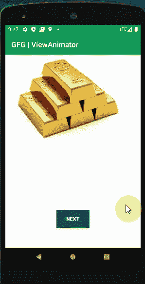

# 安卓中的视图动画师示例

> 原文:[https://www . geeksforgeeks . org/带示例的安卓视图动画师/](https://www.geeksforgeeks.org/viewanimator-in-android-with-example/)

**ViewAnimator** 是一个非常迷人和有用的功能，因为它可以在两个或多个视图之间平滑切换，主要用于屏幕上视图的动画功能。它是[](https://www.geeksforgeeks.org/how-to-add-viewflipper-in-android/)****和**视图切换器的父类，主要区别是它还可以在 2 个以上的视图之间切换。它是[框架布局](https://www.geeksforgeeks.org/android-framelayout-in-kotlin/)容器的子类。以下是定义视图动画器的方法:**

## **可扩展标记语言**

```
<ViewAnimator

    android:id="@+id/simpleViewAnimator1"
    android:layout_width="match_parent"
    android:layout_height="wrap_content">

    <!--   You need to add views here  -->

</ViewAnimator>
```

 **动画意味着显然一个时刻只有一个视图是活动的，因此有许多重要的方法可以使流程流畅。**

### **重要方法**

<figure class="table">

| 

方法

 | 

描述

 |
| --- | --- |
| showNext() | 方法的名称不言自明。这是用来显示视图动画器的下一个视图。目前只能有一个视图处于活动状态。 |
| 显示上一个() | 方法的名称不言自明。这是用来显示ViewAnimator 的前一个视图。目前只能有一个视图处于活动状态。 |
| 添加视图(视图子视图) | 在运行时，如果我们想添加一个视图，我们可以使用这个。在运行时在视图动画器中添加子视图。 |
| setInimation(in) | 设置对象在屏幕上的外观动画 |
| 扇形动画(out) | 与 setInAnimation()相反。使用移除前一个

使用 setOutAnimation()方法设置的动画，然后使用 setInAnimation()方法设置的动画放置新的动画。 |
| getCurrentView() | 当前显示的视图动画器子视图。 |
| getDisplayedChild() | ViewAnimator 当前显示的子视图的索引。 |
| getInAnimation() | 用于激活进入屏幕的视图的当前动画可以通过这种方法得到。此方法返回动画我们用 setInAnimation()方法设置的。 |
| getOutAnimation() | 用于动画显示退出屏幕的视图的当前动画可以通过这种方法得到。这个方法返回我们使用 setoutAnimation()方法设置的输出动画。 |
| removeAllViews() | 从视图组中删除所有子视图。 |
| removeView（View View） | 移除视图动画器的子视图。我们可以绕过我们要移除的子视图。 |
| removeViewAt(内部索引) | 如果有需要，比如删除指定位置的视图

在小组里，我们可以用这个。 |
| setdisplayed child(int which child) | 设置视图动画器当前显示的子视图的索引 |
| setanimatefirstview(布尔动画) | 当前视图应该在视图动画制作器中第一次制作动画可以显示为真值或假值。 |
| getAnimateFirstView() | 如果我们将当前视图动画设置为真/假。 |

</figure>

### ****视图动画器的属性****

<figure class="table">

| 

属性

 | 

描述

 |
| --- | --- |
| 身份证明（identification） | 唯一标识视图动画制作者。 |
| 动画视图 | 如果我们想将当前视图设置为动画，我们可以有这个属性 |
| 不活泼 | 显示视图时要使用的动画标识符 |
| 输出动画 | 隐藏视图时要使用的动画的标识符 |
| 填料 | 从视图动画师的左侧、右侧、顶部或底部设置填充。 |

</figure>

### **例子**

**下面给出了一个 GIF 示例，来了解一下在这篇文章中要做什么。请注意，我们将使用 **Kotlin** 语言来实现该项目。** 

****

### **逐步实施**

****第一步:创建新项目****

**要在安卓工作室创建新项目，请参考[如何在安卓工作室创建/启动新项目](https://www.geeksforgeeks.org/android-how-to-create-start-a-new-project-in-android-studio/)。注意选择**科特林**作为编程语言。**

****步骤 2:使用 activity_main.xml 文件****

**转到 **activity_main.xml** 文件，参考以下代码。下面是 **activity_main.xml** 文件的代码。**

## **可扩展标记语言**

```
<LinearLayout 
    xmlns:android="http://schemas.android.com/apk/res/android"
    android:layout_width="match_parent"
    android:layout_height="match_parent"
    android:background="#fff"
    android:orientation="vertical">

    <ViewAnimator
        android:id="@+id/simpleViewAnimator1"
        android:layout_width="match_parent"
        android:layout_height="wrap_content">
    </ViewAnimator>

    <Button
        android:id="@+id/btnNext"
        android:layout_width="wrap_content"
        android:layout_height="wrap_content"
        android:layout_gravity="center"
        android:layout_marginTop="100dp"
        android:background="#055"
        android:text="NEXT"
        android:textColor="#fff"
        android:textStyle="bold" />

</LinearLayout>
```

 ****第三步:使用 MainActivity.kt 文件****

**转到 **MainActivity.kt** 文件，参考以下代码。下面是 **MainActivity.kt** 文件的代码。代码中添加了注释，以更详细地理解代码。**

## **我的锅**

```
import android.os.Bundle
import android.view.View
import android.view.animation.AnimationUtils
import android.widget.Button
import android.widget.ImageView
import android.widget.ViewAnimator
import androidx.appcompat.app.AppCompatActivity

class MainActivity : AppCompatActivity() {

    private var simpleViewAnimator1: ViewAnimator? = null
    var buttonNext: Button? = null

    // array of images, here taking metal images
    var availableImages = intArrayOf(R.drawable.gold, R.drawable.silver, R.drawable.platinum,
            R.drawable.copper, R.drawable.aluminium)

    override fun onCreate(savedInstanceState: Bundle?) {
        super.onCreate(savedInstanceState)
        setContentView(R.layout.activity_main)

        // get The references of Button and ViewAnimator
        buttonNext = findViewById<View>(R.id.btnNext) as Button

        // get the reference of ViewAnimator
        simpleViewAnimator1 = findViewById<View>(R.id.simpleViewAnimator1) as ViewAnimator

        for (i in availableImages.indices) {
            // create a new object  for ImageView by this way
            val imgView = ImageView(applicationContext)

            // Let us set image resource for ImageView
            imgView.setImageResource(availableImages[i])

            // Then add the child view in ViewAnimator
            simpleViewAnimator1!!.addView(imgView)
        }

        // Declare in and out animations and load them using AnimationUtils class
        val animationIn = AnimationUtils.loadAnimation(this, android.R.anim.slide_in_left)
        val animationOut = AnimationUtils.loadAnimation(this, android.R.anim.slide_out_right)

        // set the animation type to ViewAnimator
        simpleViewAnimator1!!.inAnimation = animationIn
        simpleViewAnimator1!!.outAnimation = animationOut

        // set false value for setAnimateFirstView, but this is ultimately your choice
        simpleViewAnimator1!!.animateFirstView = false

        // Let us write ClickListener for NEXT button
        // The current view will go out and next view will come in with
        // specified animation
        buttonNext!!.setOnClickListener {
            // TODO Auto-generated method stub
            // show the next view of ViewAnimator `     `
            simpleViewAnimator1!!.showNext()
        }
    }
}
```

### **输出**

**为上面的小演示代码附上一个短视频。这里有 5 种不同的金属可供选择，在每种视图中，我们可以看到一个又一个视图。你也可以通过在你的安卓应用中使用这个功能来获得乐趣。**

**<video class="wp-video-shortcode" id="video-504549-1" width="640" height="360" preload="metadata" controls=""><source type="video/mp4" src="https://media.geeksforgeeks.org/wp-content/uploads/20201019183329/ViewAnimatorExamplevideo.mp4?_=1">[https://media.geeksforgeeks.org/wp-content/uploads/20201019183329/ViewAnimatorExamplevideo.mp4](https://media.geeksforgeeks.org/wp-content/uploads/20201019183329/ViewAnimatorExamplevideo.mp4)</video>**