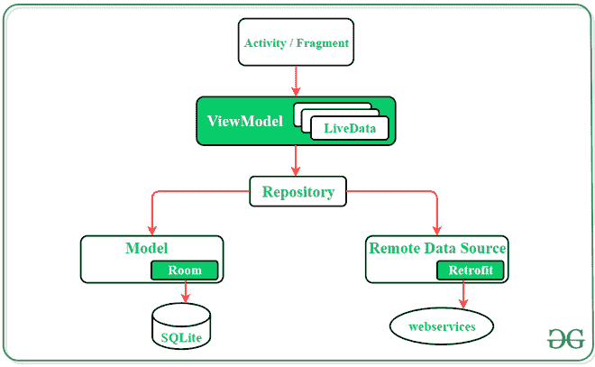
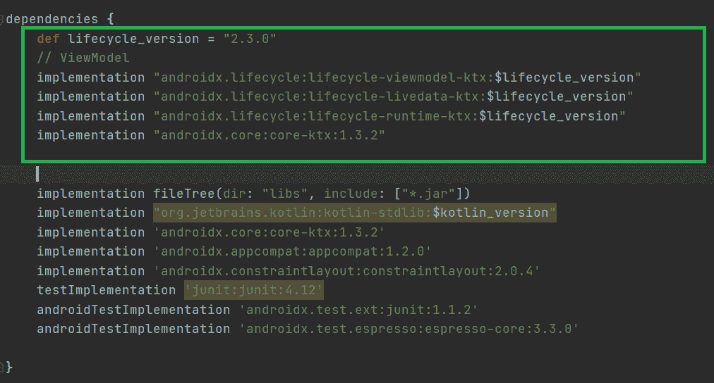
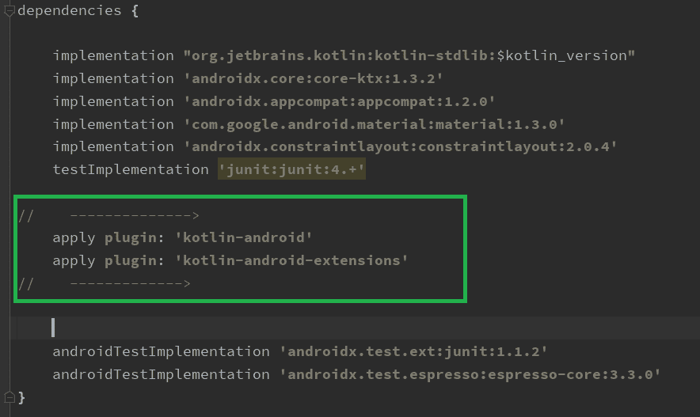
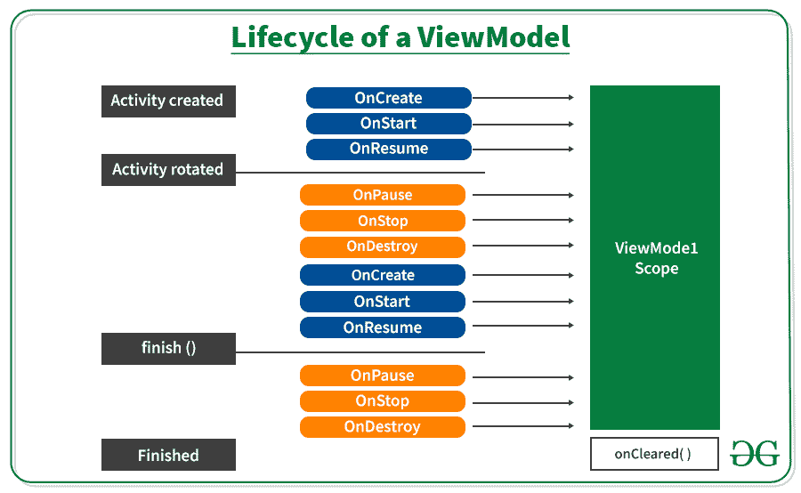

# 安卓架构组件中的视图模型

> 原文:[https://www . geesforgeks . org/view model-in-Android-architecture-components/](https://www.geeksforgeeks.org/viewmodel-in-android-architecture-components/)

ViewModel 是[安卓架构组件](https://www.geeksforgeeks.org/jetpack-architecture-components-in-android/)的一部分。安卓架构组件是用于构建健壮、干净和可扩展的应用程序的组件。安卓架构组件包含一些类来管理用户界面组件和数据持久性。视图模型类旨在以生命周期感知的方式存储和管理用户界面相关数据。ViewModel 类用于存储数据，即使是像旋转屏幕这样的配置变化。视图模型是支持用户界面组件数据的安卓喷气背包架构组件中最关键的一类。其目的是保存和管理用户界面相关的数据。此外，它的主要功能是保持完整性，并允许数据在配置更改(如屏幕旋转)期间提供服务。安卓设备中的任何配置变化都倾向于重新创建应用程序的整个活动。这意味着如果没有从被破坏的活动中正确保存和恢复数据，数据将会丢失。为了避免这些问题，建议将所有用户界面数据存储在视图模型中，而不是活动中。



**活动必须扩展视图模型类来创建视图模型:**

> *类 main activity view model:view model(){*
> 
> *……*
> 
> *……..*
> 
> *}*

### **在安卓应用中实现视图模型**

安卓架构组件为负责为用户界面准备数据的用户界面控制器提供视图模型助手类。在配置更改期间，视图模型对象会自动保留，我们将在下面的示例中看到这一点。现在让我们进入代码，

**步骤 1:** 在 [build.gradle](https://www.geeksforgeeks.org/android-build-gradle/) 文件中添加这些依赖项

> def lifecycle_version = "2.3.0 "
> 
> // ViewModel
> 
> 实现“androidx . life cycle:life cycle-view model-ktx:$ life cycle _ version”
> 
> 实现“androidx . life cycle:life cycle-live data-ktx:$ life cycle _ version”
> 
> 实现“androidx . life cycle:life cycle-runtime-ktx:$ life cycle _ version”
> 
> 实现“androidx.core:core-ktx:1.3.2”



另外，在 **build.gradle(Module:app)** 文件中添加以下依赖项。我们添加这两个依赖项是因为为了避免在我们的 **MainActivity.kt** 文件中使用**findwiewbyid()**。试试这个，否则使用正常方式，如**findwiewbyid()**。

> *应用插件:【kot Lin-Android】*
> 
> *应用插件:【kot Lin Android 扩展】*



### **以下代码不使用视图模型**

**步骤 2:使用 activity_main.xml 文件**

导航到**应用程序> res >布局> activity_main.xml** 并将下面的代码添加到该文件中。下面是 **activity_main.xml** 文件的代码。

## 可扩展标记语言

```
<?xml version="1.0" encoding="utf-8"?>
<androidx.constraintlayout.widget.ConstraintLayout 
    xmlns:android="http://schemas.android.com/apk/res/android"
    xmlns:app="http://schemas.android.com/apk/res-auto"
    xmlns:tools="http://schemas.android.com/tools"
    android:layout_width="match_parent"
    android:layout_height="match_parent"
    tools:context=".MainActivity">

    <TextView
        android:id="@+id/textView"
        android:layout_width="wrap_content"
        android:layout_height="wrap_content"
        android:text="0"
        app:layout_constraintBottom_toBottomOf="parent"
        app:layout_constraintEnd_toEndOf="parent"
        app:layout_constraintStart_toStartOf="parent"
        app:layout_constraintTop_toTopOf="parent"
        app:layout_constraintVertical_bias="0.369" />

    <Button
        android:id="@+id/button"
        android:layout_width="wrap_content"
        android:layout_height="wrap_content"
        android:layout_marginTop="100dp"
        android:text="Click"
        app:layout_constraintBottom_toBottomOf="parent"
        app:layout_constraintEnd_toEndOf="parent"
        app:layout_constraintHorizontal_bias="0.498"
        app:layout_constraintStart_toStartOf="parent"
        app:layout_constraintTop_toBottomOf="@+id/textView"
        app:layout_constraintVertical_bias="0.0" />

</androidx.constraintlayout.widget.ConstraintLayout>
```

**第三步:使用**T2【主活动. kt】文件

转到 **MainActivity.kt** 文件，参考以下代码。下面是 **MainActivity.kt** 文件的代码。

## 我的锅

```
import android.os.Bundle
import androidx.appcompat.app.AppCompatActivity
import kotlinx.android.synthetic.main.activity_main.*

class MainActivity : AppCompatActivity() {

    override fun onCreate(savedInstanceState: Bundle?) {
        super.onCreate(savedInstanceState)
        setContentView(R.layout.activity_main)

        var number = 0

        textView.text = number.toString()

        button.setOnClickListener {
            number++
            textView.text = number.toString()
        }

    }
}
```

**输出:**

现在只要点击按钮 3 到 4 次，你就会在屏幕上看到增加的数字。现在试着旋转你的模拟器或设备。

<video class="wp-video-shortcode" id="video-576908-1" width="640" height="360" preload="metadata" controls=""><source type="video/mp4" src="https://media.geeksforgeeks.org/wp-content/uploads/20210320123738/sequence.mp4?_=1">[https://media.geeksforgeeks.org/wp-content/uploads/20210320123738/sequence.mp4](https://media.geeksforgeeks.org/wp-content/uploads/20210320123738/sequence.mp4)</video>

你会看到数字变成 0，问题是为什么？它如何通过旋转屏幕擦除数值。为了得到答案，我们必须了解视图模型的**生命周期。**



在上图中，当我们创建活动时，系统调用 onCreate()，然后 onStart()然后 onResume()，但是当我们旋转屏幕时，我们的活动被破坏，再次旋转后，系统一个接一个地调用 onCreate()和其他函数。由于我们的活动被破坏，我们的活动数据也消失了。

为了克服这个问题，我们使用视图模型，即使在配置发生变化(如屏幕旋转)后，视图模型也能保存数据。上图显示了视图模型范围，即使有任何配置更改，数据也是持久的。当系统调用活动对象的 onCreate()方法时，您通常会第一次请求一个视图模型。在整个活动过程中，系统可能会多次调用 onCreate()，例如旋转设备屏幕时。视图模型存在于您第一次请求视图模型时，直到活动完成并被销毁。

### 带有视图模型的示例

**步骤 1:** 创建一个 Kotlin 类文件**MainActivity view model . kt .**我们的 MainActivity 类文件扩展了 **ViewModel** 类。

> **参考本文:** [如何在 Android Studio 中创建类？](https://www.geeksforgeeks.org/how-to-create-classes-in-android-studio/)

## 我的锅

```
import androidx.lifecycle.ViewModel

class MainActivityViewModel : ViewModel() {

    var number = 0

    fun addOne() {
        number++
    }
}
```

**步骤 2:使用**T2【主活动. kt】文件

转到 **MainActivity.kt** 文件，更新以下代码。下面是 **MainActivity.kt** 文件的代码。代码中添加了注释，以更详细地理解代码。

## 我的锅

```
import android.os.Bundle
import androidx.appcompat.app.AppCompatActivity
import androidx.lifecycle.ViewModelProvider
import kotlinx.android.synthetic.main.activity_main.*

class MainActivity : AppCompatActivity() {

    override fun onCreate(savedInstanceState: Bundle?) {
        super.onCreate(savedInstanceState)
        setContentView(R.layout.activity_main)

        // view model instance
        var viewModel: MainActivityViewModel = ViewModelProvider(this).get(MainActivityViewModel::class.java)

        // setting text view
        textView.text = viewModel.number.toString()

        //handling button click event
        button.setOnClickListener {
            viewModel.addOne()
            textView.text = viewModel.number.toString()
        }
    }
}
```

**输出:**

<video class="wp-video-shortcode" id="video-576908-2" width="640" height="360" preload="metadata" controls=""><source type="video/mp4" src="https://media.geeksforgeeks.org/wp-content/uploads/20210320121918/sequence-first.mp4?_=2">[https://media.geeksforgeeks.org/wp-content/uploads/20210320121918/sequence-first.mp4](https://media.geeksforgeeks.org/wp-content/uploads/20210320121918/sequence-first.mp4)</video>

即使在旋转我们的屏幕后，我们也会得到相同的值。就这样，这是视图模型的基础，还有很多视图模型的其他高级东西，我们将在后面介绍。

### **视图模型组件的优势**

*   有助于配置更改期间的数据管理
*   减少用户界面错误和崩溃
*   软件设计的最佳实践