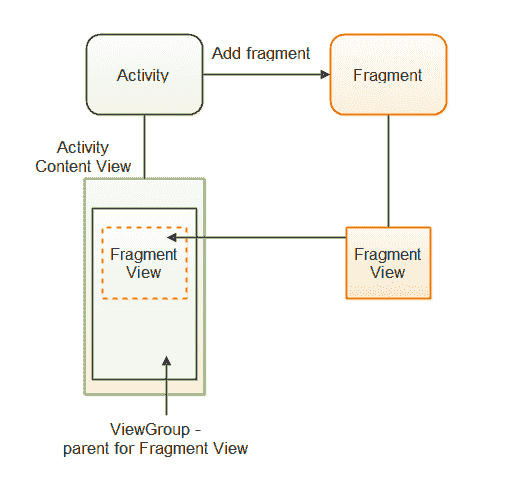

# 安卓保存状态的视图模型

> 原文:[https://www . geeksforgeeks . org/view model-with-saved state-in-Android/](https://www.geeksforgeeks.org/viewmodel-with-savedstate-in-android/)

谷歌在谷歌 I/O 2018 上推出了 Android Jetpack，这是一个用于创建优秀 Android 应用的组件、工具和指南的捆绑包。它包括实时数据、视图模型、房间数据库、工作管理器和其他组件。ViewModel 将在本博客中讨论。在活动生命周期中，视图模型维护用户界面相关的数据。它使应用程序能够承受配置变化(如屏幕旋转)。

**视图模型主要用于，**

1.  为用户界面层准备数据。
2.  处理应用程序循环配置。



图 1，查看模型生命周期。

### 如何添加视图模型

## 我的锅

```
class gfgViewModel : ViewModel() {
    val courses = MutableLiveData<List<courses>>()
    fun getCourses(): LiveData<List<courses>> {
        return courses
    }
    private fun loadCourses() {
        courses.value = // courses provided by gfg
    }
}
```

**然后将数据导入视图，**

## 我的锅

```
class GeeksActivity : AppCompatActivity() {
    override fun onCreate(savedInstanceState: Bundle?) {
        // Starting the model
        val gfgSampleModel = ViewModelProviders.of(this).get(MainViewModel::class.java)
        gfgSampleModel.getCourses().observe(this, Observer<List<courses>>{ courses ->
            // do something like UI update
        })
    }
}
```

**我们必须使用**初始化视图(活动/片段)中的视图模型

## 我的锅

```
val gfgSamplemodel = ViewModelProviders.of(this).get(GeeksModel::class.java)
```

#### 现在我们可以在用户界面中看到数据:

## 我的锅

```
gfgModel.getCourses().observe(this, Observer<List<Courses>>{ courses ->
            // Do something here
}
```

这就是视图模型在我们的视图中的使用方式。关于视图模型的更多信息可以在这里找到。现在我们可以改变，但这是受限制的。为了管理它，我们可以使用 onSaveInstanceState()返回到以前的状态。

每个安卓应用都在自己的 Linux 进程中运行，这被描述为系统启动进程死亡。当程序的部分代码必须被执行时，这个过程由程序启动，它将继续运行，直到不再需要它，并且系统需要恢复其内存以供其他应用程序使用。

> **GeekTip:** 如果你的程序不在前列，系统可以随时停止，释放系统 ram 给其他进程使用。

1.  配置和系统启动的进程死亡都可以由 onSaveInstanceState()包处理。
2.  然而，它只能保存有限的数据，并且高度依赖于速度和存储，因为**序列化需要大量的内存来存储数据。**
3.  序列化发生在主线程上，因此当配置发生变化时，用户界面屏幕可能会被阻止，应用程序也可能会冻结，产生 [( **ANRs)，即应用程序不响应。**T3】](https://www.geeksforgeeks.org/what-is-anr-and-how-it-can-be-prevented-in-android/)
4.  **onsavesentate()**只能保存少量数据。

### 视图模型的保存状态

因为用户界面数据总是从架构组件的视图模型中引用，而不是从视图(活动/片段)中引用，所以视图模型的保存状态可以被视为 onsavesentate()的替代。所以我们必须执行一些**代码来利用 onSaveInstanceState()。**

所以，作为 Jetpack 的一部分，谷歌推出了保存状态，它允许我们在数据被系统启动的进程死亡杀死后，从保存的状态中保留和恢复数据。

> **极客提示#2** :需要注意的是，状态必须是基础且轻量级的。本地持久性应该用于复杂或大数据集。

将以下代码添加到您的生成中，以集成项目中的保存状态。

```
implementation 'androidx.lifecycle:lifecycle-viewmodel-savedstate:1.0.0-alpha01'
```

### 如何使用已保存的状态？

替换视图(活动/片段)的 onCreate()函数中的以下代码片段。

```
val model = GeeksViewModel.of(this, savedVMState(this)).get(MainGfGViewModel::class.java)
```

**代替:**

```
val gfgModel= GeeksViewModel.of(this).get(MainGfGViewModel::class.java)
```

**此外，在视图模型中:**

```
class GeeksViewModel(private val state: SavedStateHandle) : ViewModel() { ... }
```

如您所见，我们为视图模型的主函数 Object()提供了 savedstathandle {[本机代码] }。为了获得保存的数据句柄，我们使用保存的数据工厂()作为我们的视图模型提供程序中的工厂。

> **极客提示#3** :工厂是指导视图模型如何构建视图模型的接口。

请注意，它只是一个键值对。即使程序由于系统启动的进程死亡而死亡，数据仍然会被保存。

如您所见，我们为视图模型的主函数 Object()提供了 savedstathandle {[本机代码] }。为了获得保存状态句柄，我们使用保存状态()作为我们的 GeeksViewModel.of 中的工厂

工厂是指导视图模型如何构建视图模型的接口。

1.  即使程序由于系统启动的进程死亡而死亡，数据仍然会被保存。
2.  保存数据句柄类似于安卓系统中的共享引用，因为它对键值对进行操作。
3.  让我们看一个例子:我们将创建一个具有三个用户界面组件(编辑文本、按钮和文本视图)的应用程序。
4.  当用户在编辑文本中输入用户名并点击按钮时，用户名应该显示在文本视图中

#### 主视图模型现在应该是这样的，

## 我的锅

```
class GeeksVM(private val savedStateHandle: SavedStateHandle) : ViewModel(), BaseViewModel {
    override fun getCoursename(): LiveData<String> {
        return savedStateHandle.getLiveData(Constants.COURSE)
    }
    override fun saveCourse(username: String) {
        savedStateHandle.set(Constant.COURSE, course)
    }
}
```

在这里，

1.  数据是使用 savedStateHandle.set(“键”、“值”)存储的。
2.  获取实时数据(“密钥”)方法用于检索字符串数据类型的实时数据。

MainViewModel 类实现了 BaseViewModel，如下所示。

## 我的锅

```
interface gfgViewModel {
    fun getCoursename(): LiveData<String>
    fun saveCourse(username: String)
}
```

### 验证

**执行步骤–# 1，您将不会在控制台中看到您的应用程序的软件包名称。**

当您重新打开程序时，您应该会看到输出被保存并显示在屏幕的文本视图中。

**重要提示:**

如果您希望保留数据，请使用保存数据。

```
savedStateHandle.set("key_name","value")
```

如果希望从保存的数据中检索数据，请使用以下语法:

```
savedStateHandle.get("key_name")
```

如果您希望获取 LiveData 作为返回类型，请使用。

```
savedStateHandle.getLiveData("key_name")
```

如果您想查看 savedState 中是否存在某个键，请使用以下代码。

```
savedState.contains("key_name")
```

如果您想找到保存状态中的所有键，请使用以下命令获取它们的列表。

```
savedState.keys()
```

您也可以通过键访问它来移除任何单个值。要执行以下操作:

```
savedState.remove("key_name")
```